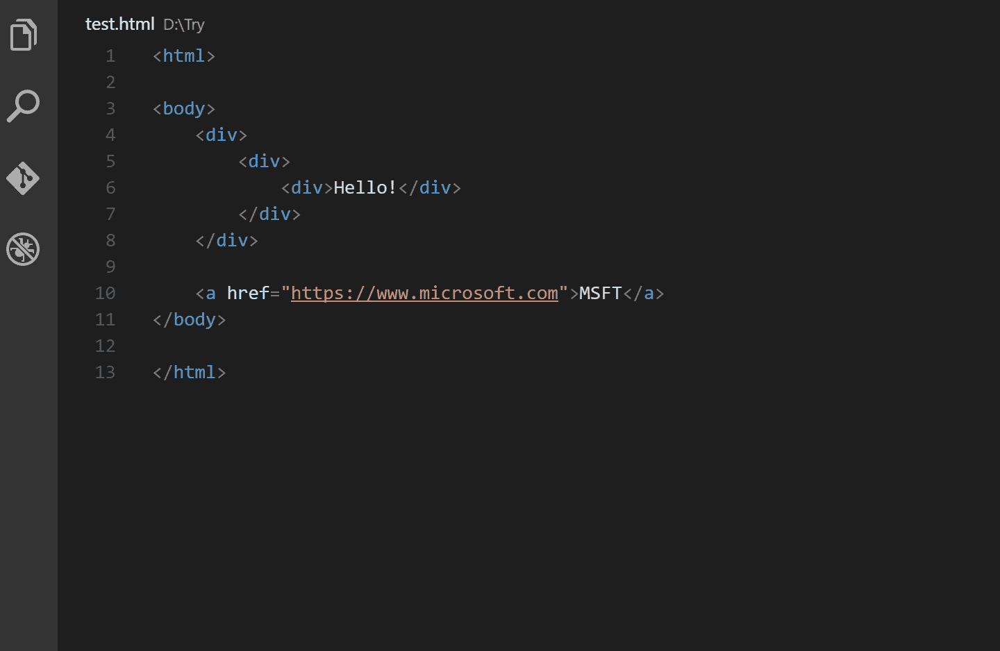

# 7 VS 代码扩展，让你想永远保持编码

> 原文：<https://levelup.gitconnected.com/7-vs-code-extensions-that-make-you-want-to-keep-coding-forever-f205e597ae34>

克里斯托夫·高尔在 [Unsplash](https://unsplash.com?utm_source=medium&utm_medium=referral) 上拍摄的照片

## 为 web 开发人员编写代码从未如此轻松

伟大的开发人员和优秀的开发人员的区别在于使用的工具。拥有合适的工具可以让你的开发工作变得更加容易。

这对于您正在使用的 IDE 来说没有什么不同。许多开发人员使用 Visual Studio 代码作为他们的 IDE 选择，这允许您安装扩展。当涉及到各种扩展时，没有限制。

由于 Visual Studio Marketplace 上有太多的扩展可供您使用，我们将介绍 7 个扩展，它们将使编写代码看起来毫不费力。

> 即使是最简单的工具也能让人们做伟大的事情——比兹·斯通

*注意，所有这些插件都可以在*[*Visual Studio market place*](https://marketplace.visualstudio.com/)*上免费获得。*

# 1.REST 客户端

REST 客户端扩展允许您发送 HTTP 请求，并直接在 Visual Studio 代码中查看响应。告别外部应用程序，否则您将使用它们向服务器发送 HTTP 请求。

这是一个非常受欢迎的扩展，有超过一百万的安装，被许多开发人员使用。我自己使用这个插件已经有一段时间了，我觉得它很棒。

发送请求从未如此简单。语法非常简洁，并且有大量选项可以满足您的需求。一个简单的 GET 请求所需要的只是一行代码，它包含 GET 关键字，后跟 URL。

真的，您应该尝试一下 REST 客户端扩展。

# 2.CSS Peek

如果你是一个网页开发者，CSS Peek 是绝对必须的。这个扩展允许你查看应用于 HTML 中某个元素的 CSS 规则，只需将鼠标悬停在元素的类名或 ID 上。

看看下面的图片，它将向您展示这个扩展到底做了什么。

但是这个扩展不仅仅允许你看一看样式。该扩展还有一个“Go to”特性，允许您立即跳转到应用于该元素的 CSS 规则。这为你节省了很多寻找合适的选择器的时间。

# 3.美化

如果你喜欢干净的代码，那么你一定会喜欢美化。这个扩展帮助你得到你的代码。美化支持 JavaScript、HTML、CSS、Sass 和 JSON。

这个扩展最好的部分是所有的选项都是完全可定制的——比如缩进大小和文件是否应该以新行结束。如果你用几种编程语言编写代码，美化已经覆盖了你。可以定制每种编程语言的选项。

这个扩展有超过 500 万的下载量，是安装最多的扩展的前 20 名。

# 4.自动重命名标签

自动重命名标签扩展做的事情很简单，但是非常好。这个扩展自动重命名成对的 HTML 标签。如果您正在重命名开始标记，它将更改相应的结束标记。反之亦然。

如果你想在输入开始标签的结束括号时自动添加结束标签，你应该看看[自动结束标签扩展](http://marketplace.visualstudio.com/items?itemName=formulahendry.auto-close-tag)。安装这两个扩展是非常强大的，它将帮助你以一种更加有效和一致的方式编写 HTML。

# 5.Quokka.js

Quokka.js 是编辑器中的原型游乐场，可以访问项目文件、内联报告等等。代码中的值会在运行时更新，并在您键入时显示在 IDE 中的代码旁边。

简直牛逼！

# 6.夜猫子

没有惊艳的主题，优化 VS 代码还有什么价值？不多，对吧？！既然你花了这么多时间在 VS 代码上，你最好通过安装一个主题让它看起来更好。

许多开发人员使用的一个漂亮的主题是夜猫子主题。根据这个主题的描述，它是为我们这些喜欢深夜编码的人而微调的。

如果你不喜欢夜猫子主题，不要担心。我写了一篇文章，回顾了 VS 代码中最漂亮的主题。

 [## 在这些主题中为 Visual Studio 代码编写漂亮的代码

### 10 个令人敬畏的主题来优化你的编码体验

levelup.gitconnected.com](/code-pretty-in-these-themes-for-visual-studio-4162aa35aee1) 

# 7.JavaScript (ES6)代码片段

列表中最后一个扩展是 JavaScript (ES6)代码片段扩展。这个扩展有十几个代码片段，您可以使用它们为您生成 ES6 代码片段。

例如，键入`clg`然后按回车键会产生一个 *console.log* 。可能需要一段时间来熟悉所有可能的片段，但一旦你掌握了它，你就能非常快地键入 ES6。