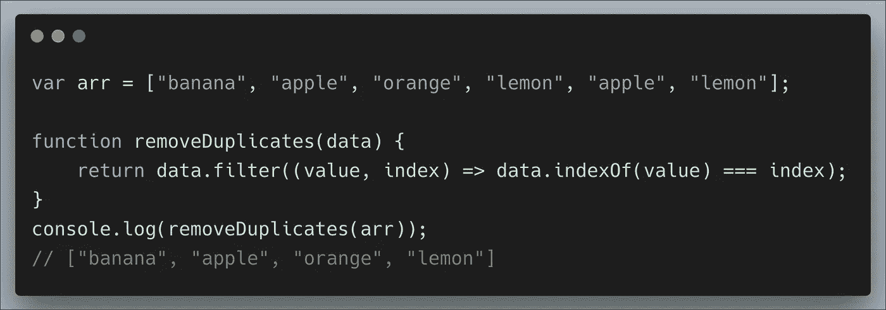
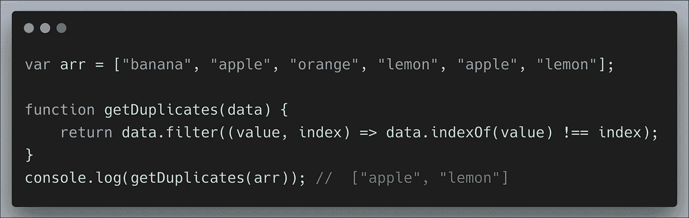
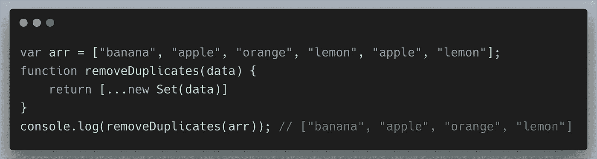
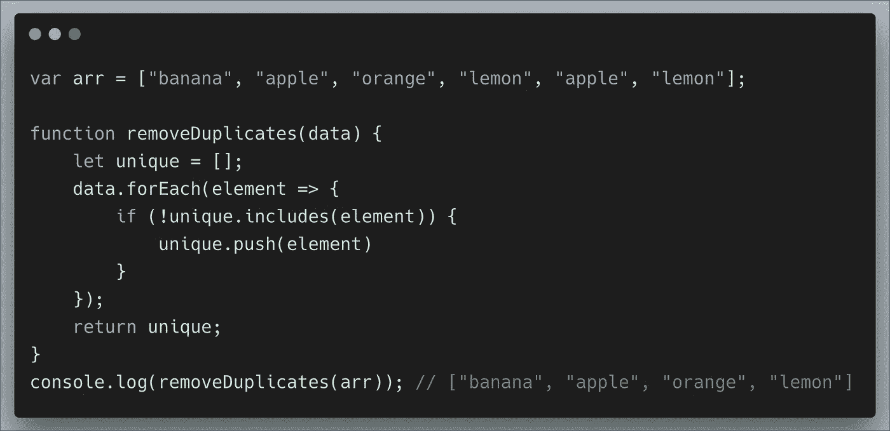
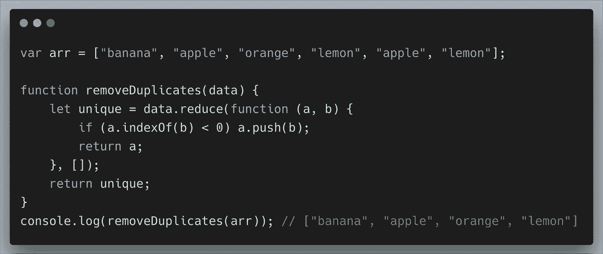
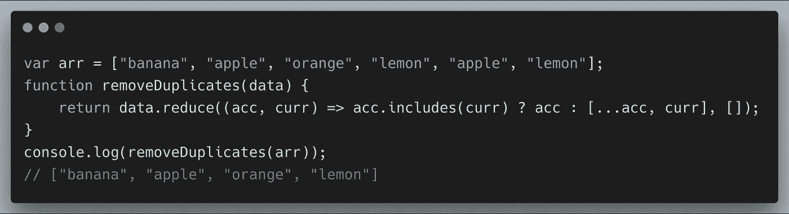
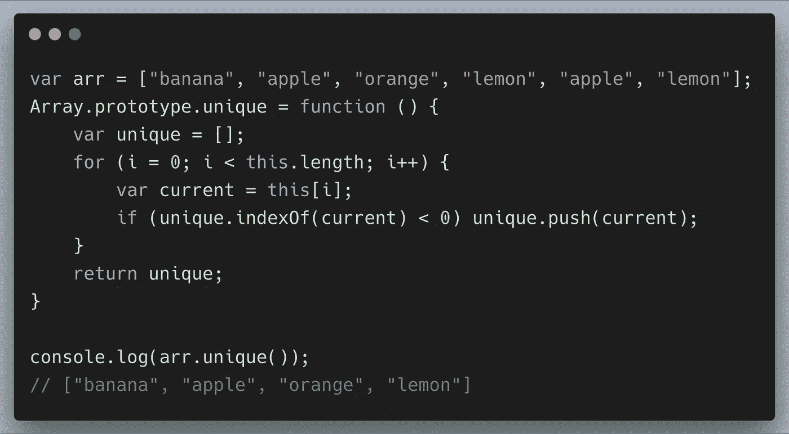
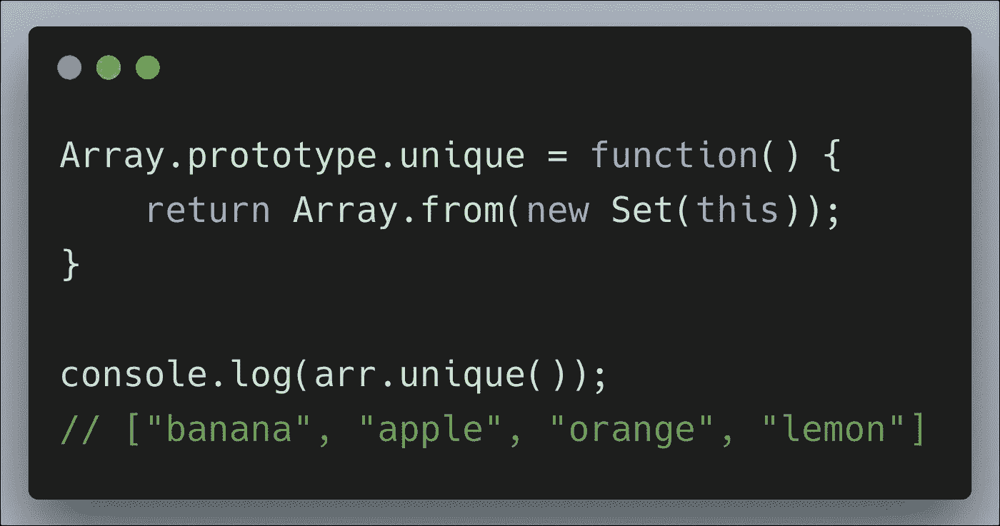
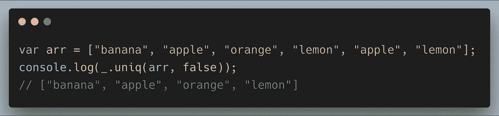
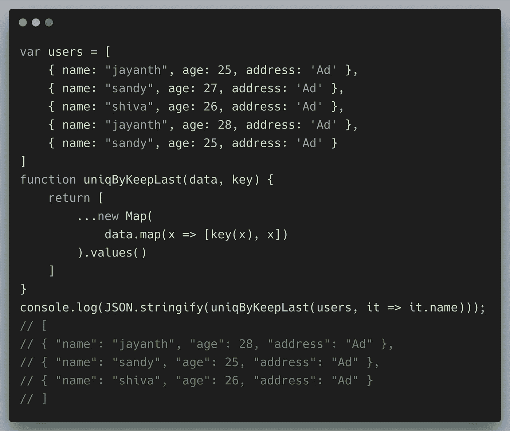

# 在 JavaScript 中从数组中删除重复项的 7 种方法

> 原文：<https://levelup.gitconnected.com/7-ways-to-remove-duplicates-from-array-in-javascript-cea4144caf31>

由[斯凯工作室](https://unsplash.com/@skyestudios?utm_source=medium&utm_medium=referral)在 [Unsplash](https://unsplash.com?utm_source=medium&utm_medium=referral) 拍摄的照片

在许多项目中，需要在 JavaScript 中从数组中删除重复项是一个常见的用例。对于面试来说，这是每个人都要练习的常见编码挑战。

这里有七种方法可以过滤掉数组中的重复值，只返回唯一的值。

 [## 编写面试问题

### 一个完整的平台，在这里我会教你找到下一份工作所需的一切，以及…

技术开发](https://skilled.dev) 

## 使用过滤方法

`filter`方法创建一个新的元素数组，通过我们提供的条件。而任何失败或返回`false`的元素，都不会在过滤后的数组中。

在 JavaScript 中删除数组中的重复元素

我们还可以使用 filter 方法从数组中检索重复值，只需调整我们的条件

## 通过使用一组

`Sets`是 ES6 (ES2015)的新对象类型，允许您创建唯一值的集合。

## 使用 forEach 方法

通过使用`forEach`，我们可以迭代数组中的元素，如果它不在数组中，我们将推入新的数组。

## **通过使用 reduce 方法**

`Reduce`总是有点难以理解。`reduce`方法用于减少数组的元素，并根据您传递的一些 reducer 函数将它们组合成一个最终的数组。

相同的 reduce 方法使用不同的方法

## **向数组原型添加唯一的方法**

在 Javascript 中，数组原型构造函数允许您向**数组**对象添加新的属性和方法。

与普通方法相比，将工作得更快。

## 通过使用下划线 JS

`_.uniq`方法产生了一个无重复版本的**数组**，，我们也可以通过传递第二个参数 true 来对此数组进行排序。

## 从给定数组中移除重复对象

有时需要根据属性名从对象数组中删除重复的对象。我们可以通过以下方式实现这一目标:

仅此而已！我希望这篇文章能对删除数组中的重复项有所帮助。

感谢阅读:)

# 分级编码

感谢您成为我们社区的一员！升级正在改变技术招聘。 [**在最好的公司**找到你最理想的工作](https://jobs.levelup.dev/talent) **。**

 [## 提升——改变招聘流程

### 🔥让软件工程师找到他们热爱的完美角色🧠寻找人才是最痛苦的部分…

作业. levelup.dev](https://jobs.levelup.dev/talent)