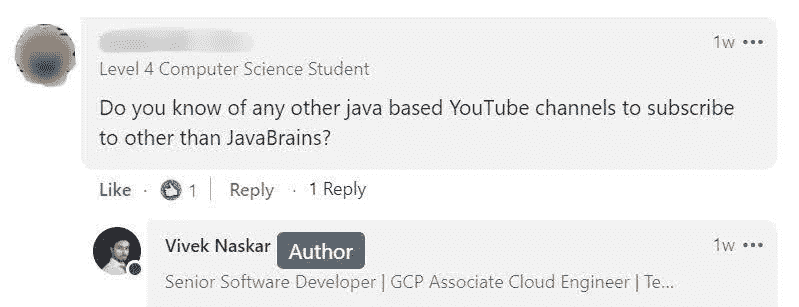

# 如果你是 Java 开发人员，你必须订阅的 7 个 YouTube 频道

> 原文：<https://levelup.gitconnected.com/7-youtube-channels-that-you-must-subscribe-to-if-you-are-a-java-developer-97a0f6ac576e>

## 如果您想了解关于 Java、它的框架和它的生态系统的一切，强烈推荐这些渠道。

穆罕默德·拉赫马尼在 [Unsplash](https://unsplash.com/s/photos/developer?utm_source=unsplash&utm_medium=referral&utm_content=creditCopyText) 上的照片

我已经从事软件开发工作 6 年多了。我研究过几种构建企业应用程序的技术。但是，我注意到，对于开发企业应用程序来说，Java 仍然是应用程序开发的首选编程语言之一。

Java 的武库包括强大的功能，如卓越的性能、健壮的内存管理和高安全性。它还拥有世界上最成熟的开发者社区之一。事实上，截至本文撰写之时， [*Java 是目前 StackOverflow 上第三受欢迎的标签，仅次于 JavaScript 和 Python*](https://stackoverflow.com/tags) *。*

了解 Java 的最好平台之一是 YouTube，它在全世界拥有超过 23 亿用户。该平台已成为世界上最大的视频搜索引擎，根据 Alexa 的数据，该平台在全球互联网流量和参与度方面排名第二。

前几天，当有人问我关于 Java 的最佳 YouTube 频道时，我在一个群中与 [*我的 LinkedIn connections*](https://www.linkedin.com/in/viveknaskar/) 分享了一篇文章，我回答了，但它也激励我写下这篇文章并与他人分享。

作者截图自 LinkedIn

因此，我分享了一些最好的 YouTube 频道，在我看来，每个 Java 开发人员都必须遵循。请注意，这些 YouTube 频道的排名不分先后，但它们肯定会帮助你获得大量的想法和知识，从而在 Java 生态系统中脱颖而出。

# Java 大脑

*频道链接:**[***https://www.youtube.com/c/JavaBrainsChannel***](https://www.youtube.com/c/JavaBrainsChannel)*订阅者:* ***531k****

*LinkedIn 的员工工程师 Koushik Kothagal 创建了这个频道，他在这里上传关于 Java 开发人员在软件行业工作时需要了解的一切的视频。Koushik 的解释和推理非常清晰，任何人都可以轻松理解。*在我看来，Java Brains* 绝对是 YouTube 上最好的 Java 频道之一。*

*Koushik 还发布了一系列有趣的视频，如“*用 Spring Boot 和 Java 构建一个冠状病毒跟踪器应用程序*、“*OAuth 到底是什么*、“*编码面试准备的 5 个常见错误*、“*API gateway 到底是什么*”等等。*

# *28 分钟后*

**频道链接:*[***https://www.youtube.com/user/rithustutorials***](https://www.youtube.com/user/rithustutorials)*订阅者:* ***126k****

*Ranga Karanam 创办这个频道的唯一目的是通过实际的、真实世界的应用示例，使用基于问题解决方案的逐步实践方法来教授人们编程。他也有几门 Udemy 课程，但他的 YouTube 频道同样吸引人。*

*Ranga 认为，要学习任何东西，开发人员必须持之以恒，因此他将他的频道命名为*28 分钟，*一个有抱负的开发人员必须每天至少学习、编码和练习 28 分钟。他还有很多 DevOps 和云相关的课程，以及几个 Java 及其相关框架。*

# *自由代码营*

**频道链接:***[***https://www.youtube.com/c/Freecodecamp***](https://www.youtube.com/c/Freecodecamp)*订阅者:* ***4.62M******

***每当有人问我关于一个可以有效学习编程课程的平台时，我经常推荐 [*freeCodeCamp*](https://freecodecamp.org/) ，这是一个致力于让每个人都可以免费使用 web 开发的非营利组织。他们还有一个频道，里面有令人惊叹的播放列表，其中一些是基于 Java 的，你肯定会从他们那里学到很多东西。***

***由于该频道是开源的，许多客座教师来到平台上免费授课。这个频道也没有任何广告，因此我经常称它为一个“免费的”替代品。***

# ***新波斯顿***

****频道链接:**[***https://www.youtube.com/user/thenewboston***](https://www.youtube.com/user/thenewboston)*订阅用户:* ***2.59M*******

****当我在 2011 年开始学习编程时，YouTube 上没有多少免费教授编程的频道或资源。然而，有一个人， *Bucky Roberts* ，开始用微妙的幽默和古怪的变量名(*我绝对喜欢*)免费教授 Java。****

****如果你是 Java 初学者，那么你绝对会喜欢这个频道。该频道还有几位客座教师，他们也教授其他课程。巴基频道是最好的节目频道之一。****

# ****朋友代码****

*****频道链接:*[***https://www.youtube.com/c/amigoscode***](https://www.youtube.com/c/amigoscode)*订阅者:* ***268K*******

*****Amigocodes* 是另一个令人难以置信的频道，由于其独特的视频种类，该频道在 2019 年开始获得巨大的吸引力。来自英国伦敦的软件开发人员 Nelson 创建了这个频道，其中包括 Java 和 Spring Boot 的教程。****

# ****Java 技术人员****

*****频道链接:*[***https://www.youtube.com/c/JavaTechie***](https://www.youtube.com/c/JavaTechie)*订阅者:* ***63.3K*******

****如果您已经是或者已经开始作为 Java 开发人员工作，那么您知道要开发一个应用程序，您需要添加身份验证和授权，设置 CI/CD 管道以自动化部署，并创建一个用于部署的本地或云环境。Java 技术人员就是这样一个渠道，教授组织中的 Java 开发人员应该知道的一切。****

****虽然我对创造者一无所知，但我相信他是在印度的班加卢鲁工作。如果你查看该频道的视频和播放列表，你会惊奇地发现一些你希望早点知道的独特视频。这个渠道被低估了，我确信它是任何 Java 开发者的金矿。****

# ****泰卢斯科****

*****频道链接:***订阅用户:* ***1.55M********

****纳文·雷迪是一名全职技术教育工作者和自由软件开发者，目前在印度孟买工作。他的频道 *Telusko，*是 Java 上观看率最高的频道之一，因为它有各种各样基于 Java 的视频。他的视频非常吸引人，他独特的表达方式吸引了追随者(他称之为“*外星人*”)，让他们一直粘着他的视频直到最后。****

****为了解释一个概念，纳文用相关的现实生活中的例子将其简化为最简单的形式。如果您想了解与 Java 相关的最新信息，这个频道可能会对您有所帮助。****

****如果我说 YouTube 是免费学习编程的最佳平台，我可能是在重复自己的话。老实说，我只是喜欢做这个汇编，因为我一直在关注并向我的同事推荐这些渠道，我的 LinkedIn**关系网*，甚至我的 Instagram 页面 。*****

****没有提到其他一些不可思议的渠道，编译是不完整的-[**Mosh 编程**](https://www.youtube.com/user/programmingwithmosh)[**德里克巴纳斯**](https://www.youtube.com/c/derekbanas)[**爱德华卡**](https://www.youtube.com/c/edurekaIN)**[**代码解码**](https://www.youtube.com/c/CodeDecode)[**Java 指南**](https://www.youtube.com/c/JavaGuides)**和我希望这个汇编对你有用，并帮助你在你的开发生涯中成长。********

*******注意:YouTube 频道没有任何特定的顺序，当你阅读这篇文章时，订阅人数可能会改变。*******

*******如果你喜欢读这篇文章，你可能也会发现下面的文章值得你花时间去读。*******

****** [## 在工作场所寻求帮助会让你在职业生涯中变得更好

### 每当有疑问时，就寻求帮助。

levelup.gitconnected.com](/asking-for-help-in-your-workplace-makes-you-better-in-your-career-3c4b2cae2711)  [## 我的第一份科技创业工作不到一年就失败了，我是如何挺过来的

### 在那里工作 4 个月是一场噩梦。我像疯子一样工作，学到了重要的人生经验。

levelup.gitconnected.com](/how-i-survived-my-first-tech-startup-job-that-failed-within-a-year-667a6a3f97ea) 

*如果你喜欢阅读那些有助于你更好地学习、生活和工作的故事，可以考虑* [*成为订阅者*](https://viveknaskar.medium.com/subscribe) *。成为会员后，你可以无限制地阅读 10000 篇故事、文章和作家。每月只要 5 美元。* [*如果你使用我的链接*](https://viveknaskar.medium.com/membership) *注册，我将获得一点佣金，帮助我写更多的文章。*******