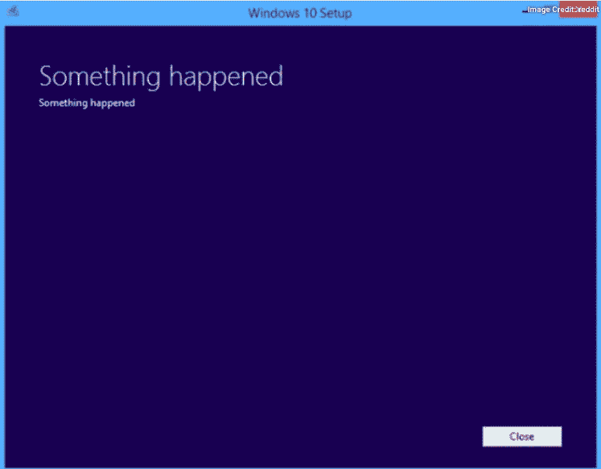

# 能让任何程序员发疯的 8 件烦人的事

> 原文：<https://levelup.gitconnected.com/8-annoying-things-that-can-make-any-programmer-go-crazy-6fc5c366807c>

## 并且可以测试它们的抗性和耐受水平

瑞安·斯纳特在 [Unsplash](https://unsplash.com/s/photos/hair-pull?utm_source=unsplash&utm_medium=referral&utm_content=creditCopyText) 上的照片

程序员一般都是和平的生物。他们不是你通常会联想到愤怒的人。大多数时候，程序员只是忙着写代码，确保代码运行。

但有时，有些事情可以测试他们的抵抗力和承受力，可以让一个普通的随和的程序员变得疯狂。他们可能是沉默的，但从内部来看，可能有一座休眠火山等待爆发。如果你靠近他们，你可能会被烧伤。

所以，这里有一些最能让程序员发疯的事情。

# 空白或缺失的自述文件

几年前，当管理一个项目的几名工程师突然休假时，一名高级工程师被要求查看代码中的一个紧迫问题。在会议期间，他遵循自述文件中的步骤，甚至无法启动代码。他皱起双眉，皱起额头，张开鼻孔说:

> “不要给我一个连自述文件都没有的项目。我无法承担这项工作”。

他迅速从椅子上站起来，离开了会场。

任何在生产环境中运行的东西都应该有一个精心制作的自述文件，描述代码做什么，如何部署或停止它，等等。好吧，你可以看看代码，自己弄清楚，但是它省去了很多不必要的循环，去发现一些甚至不需要被发现的东西。

# 堆栈溢出无解

这是一个彻底的失败。

[https://tenor . com/view/shocked-shock-Mr-bean-bean-shock-kulfy-gif-18507108](https://tenor.com/view/shocked-shock-mr-bean-bean-shock-kulfy-gif-18507108)

想象一下，在开发过程中遇到一个问题，您想快速查看堆栈溢出社区对此有何评论。您研究了自己的错误，却发现没有人遇到过这个问题。虽然你可以为自己击中了前所未见的东西而自豪，但这肯定会让你的大脑怒火中烧。

软件工程师依赖堆栈溢出，就像汽车依赖汽油一样。这是所有与编程相关的解决方案的首选。所以，当你发现某个特定的问题不存在时，它必然会让你心跳加速。

# 会议

让我把这一点说清楚——工程师讨厌开会。至少大部分是这样。

有些人可能会觉得奇怪，但是会议被程序员认为是“不必要的”*。好吧，大多数事情打破了他们的焦点。*

*程序员是非常一维的。他们只想坐在机器前写代码。或者至少看看代码。从程序员的角度来看，这完全是浪费时间，会降低生产率，破坏他们的线性工作流程。*

# *无用的错误消息*

*想象一下，你正在检查的某个代码失败了，并显示以下错误消息。没有堆栈跟踪，没有正确的消息传递。*

**

*它一定会让任何一个工程师发疯。*

*如果你想要更多的乐趣，这里有一些[可笑的 windows 错误信息](https://www.makeuseof.com/tag/ridiculous-windows-errors-all-time/)。*

# *零测试案例*

*时不时地，你会遇到一个没有任何测试用例的项目在生产中运行。这一切都很好，直到一个小的代码更改导致整个代码崩溃。*

*而如果你是那段代码目前不幸的拥有者，那一定会让你泪流满面。*

**

*由 [Arwan Sutanto](https://unsplash.com/@arwanod?utm_source=unsplash&utm_medium=referral&utm_content=creditCopyText) 在 [Unsplash](https://unsplash.com/s/photos/tears?utm_source=unsplash&utm_medium=referral&utm_content=creditCopyText) 上拍摄的照片*

> *我应该先修复错误吗？*
> 
> *我应该只为那些代码写测试用例吗？*
> 
> *我应该为所有代码编写测试用例吗？*

*他们的问题现在就是你的问题。*

*我现在可以理解为什么 IT 人员会有心理健康问题。*

# *在项目开发过程中不断改变需求*

*你在竭尽全力让当前的需求发挥作用。你心中有一个可行的设计。当你的经理走进你的房间时，你完全处于“流动”状态。*

> *我们能做到吗？*
> 
> *我们把这朵花拿到外面怎么样？*
> 
> *我们能不能也加入这个功能？*

*我不知道你怎么想，但这肯定会让我发疯的。我讨厌在开发阶段中途改变设计，因为已经有很多思维周期被消耗在把你的想法放在一个方向上了。*

# *硬编码值*

*在任何软件开发 101 课程中，这是最先教授的内容之一。但仍有人怀念这一切。为什么？因为有时硬编码一个值更容易。*

*如果硬编码的变量不尽快修复，保留该变量的目的可能远远超出一个单独的类文件——它的使用可能会像癌症一样扩散。*

*对于试图对项目进行代码修改的人来说，这将是一场噩梦——足以让人发疯。*

# *每隔几个小时切换一次上下文*

> *你能做这个小小的改变吗？*
> 
> *你能参加这个会议吗？*
> 
> *你能快速起草这封电子邮件吗？*
> 
> *你能介绍一下你正在做的事情吗？*

*开发人员在处理项目/任务时需要非常专注。而且大部分都不擅长上下文切换。即使是最小的干扰也会改变成功完成任务所需的注意力和集中力。*

*再问他们一个问题，他们可能会像气球一样爆炸。*

*作为一名超过 15 年的工程师，这些是有时让我发疯的最重要的事情。如果我错过了什么，请随时分享。*