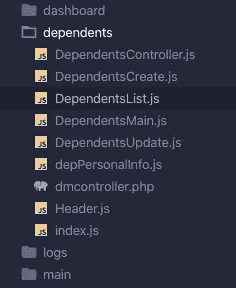
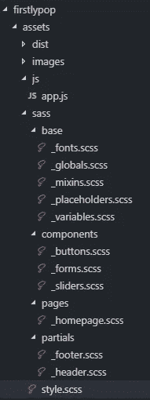

# 每个开发人员都需要实践的 8 个基本编码惯例

> 原文：<https://levelup.gitconnected.com/8-basic-coding-conventions-every-developer-needs-to-practice-5846252146ec>

## 对于每个开发人员来说，约定就像一种通用语言。


图片来源:Unsplash 的 Jex Timms

我再怎么强调拥有代码质量标准的重要性也不为过。它不仅仅是为了编码。从更广的角度来看，它不仅关系到输出的一致性和质量，还关系到应用程序背后的代码。

我的意思是，你不只是建立网站或应用程序，因为对不对？你想长期拥有它？这意味着将来会有一些维护，一些增强，更新，更多的功能，更多的特性。尽可能地，你会希望通过简单地以正确的方式编码来拯救你自己或者拯救未来的开发人员。

此外，当您需要将项目移交或传递给下一个开发人员时，您会希望向他展示您的杰作，为您的辛勤工作感到自豪，所以让它变得伟大。

# 空格与制表符

这已经争论了 20 多年了。

你看过硅谷吗？在这一集里，Richard 和他的公司招聘了新员工，在这一集里，他遇到了一个在脸书工作的女孩，他试图有所行动。然而，在理查德发现了一些他没有预料到的事情后，形势发生了逆转。

[*“猜猜看？”理查德生气地回答道，“这是不可能的了。因为我不可能和一个用空格而不是制表符的人在一起。”——*(理查德·硅谷)](https://amp.businessinsider.com/tabs-vs-spaces-from-silicon-valley-2016-5)

辩论就是辩论，我可能会在这里得到一些嘘声，但是，我不明白为什么有人选择两个空格而不是一个标签？我是指生产力方面。根据长度和使用目的，我有时会使用 2 个或更多的制表符，所以这意味着 4 个空格？或者更多？

无论您使用什么语言，缩进都是很重要的，空白为您的代码提供了一个可读的适当结构，但是无论您选择什么，整个团队都应该使用相同的结构。当一个人使用空格，而另一个人使用制表符，这看起来很可笑。

最后一点，更多的空格意味着更多的字符，意味着更多的存储空间，这不是一个好的做法。

# 不要把支架拉掉

缩进不仅会使你的代码可读，而且会看起来优雅和经典。但问题是，有时开发人员倾向于过度使用一些东西。我建议把重点放在基础上。永远保持简单，对任何事情保持简单是最难的事情，但是通过实践适当的惯例，只要坚持基本原则，你就会走上正轨。

看看下面的代码。我强烈推荐第一个。如果你不同意，我会理解，因为我们都有自己选择的理由，但我相信保持事情简单，让它干净，尽可能不要过度。复杂意味着灾难。再次强调，保持简单，你的同事会因此而喜欢你。

```
class HelloWorld {
 //do something here
}ORclass HelloWorld 
{
//do something here
}
```

# 命名规格

当选择文件名时，它应该是自我解释，自我描述的内容，当其他开发人员可以看到时，它会自动帮助他们理解文件的目的。像目录一样使用小写是一个很好的习惯。

**需要遵循的一些好规则**

*   避免字符空格
*   命名文件时不要使用特殊字符。尽量只使用字母、数字、句点或下划线
*   确保您附加了正确的后缀，例如 html。css，。js，。scss
*   一定要保持简短，直奔主题。

# 你刚才是用逗号结尾的吗？谁会这么做？

```
class OMG {
   const1: please
  ,const2: dont
  ,const: do
  ,this: forTheLoveOfGod
}AND Do this insteadclass GoodDeveloper {
  const1: I,
  const2: am,
  const: aGood,
  this: developer
}Thank you!
```

# 骆驼套蛇 _ 案例

最佳做法是，尽量避免使用特殊字符，这样更容易记忆。

```
helloWorld vs hello_world
firstName vs first_name
lastName vs last_name**letsDoThis vs and_not_this**
```

# 练习使用注释

注释就像一个人类可读的描述，包含了给其他开发人员或任何需要阅读或检查您的代码的同事的信息。这是一个很好的实践，用正确的方法去做将会使调试、维护甚至添加特性更加高效和快速。

然而，不要添加过多的注释，因为你不想让你的代码看起来杂乱无章。再次，保持简短，简单，易懂，这就是全部。

*好的代码是自文档化的。*

```
var x = 5; // Declare x//for loop
for (let i = 0; i == 10; i++) {
    // do something here
}
```

# 练习正确的目录结构

在这件事上我经历了很多情绪。我一直在和不同的同事一起工作，我们一直在努力，不是因为我们没有谈论它。因为我们看待事物的方式不同。

我们都有自己的偏好，只是要确保与你的团队适当合作是最好的方式。

**不要想太多，不要花一个小时选择文件结构。**

**避免过多的嵌套，**一旦您的项目增长，并且将来会有如此多的功能，您将很难导入控制器或方法，或者当几个开发人员将与项目一起工作时。他们很难发现和理解事物。尝试从根文件夹开始最大化 4 层，除非你有一个有效的理由这样做。

在使用 React/React native 之后，我发现了两个好方法，第一个是按照**特性或路线对它们进行分组。**



按功能分组的示例

第二种方法是通过文件类型。这是一个包含所有 sass 文件的 sass 文件夹的例子。



照片来源于 [Satoripop](https://www.google.com/url?sa=i&url=https%3A%2F%2Fblog.satoripop.com%2Fall-you-need-to-know-to-start-integrating-your-website-using-sass-and-bootstrap-b1a36959565&psig=AOvVaw3o0DDrRqR_LCrQRttklEpl&ust=1586889230027000&source=images&cd=vfe&ved=0CAIQjRxqFwoTCOiuvJ-F5ugCFQAAAAAdAAAAABAN)

# 自变量和参数上的空格

再次，练习简单。不要做得太多，这不仅会让你的代码看起来很丑，还会质疑你编写正确代码的能力。

```
Example of a functionfunction correct(arg1, arg2){
  //do something here
}VSfunction wrong( arg1, arg2 ) {
   //do something here
}
```

一个建议。当你写代码的时候，要写得好像明天有人会读一样，要写得让别人也能理解，不要为自己写。

感谢您的阅读！