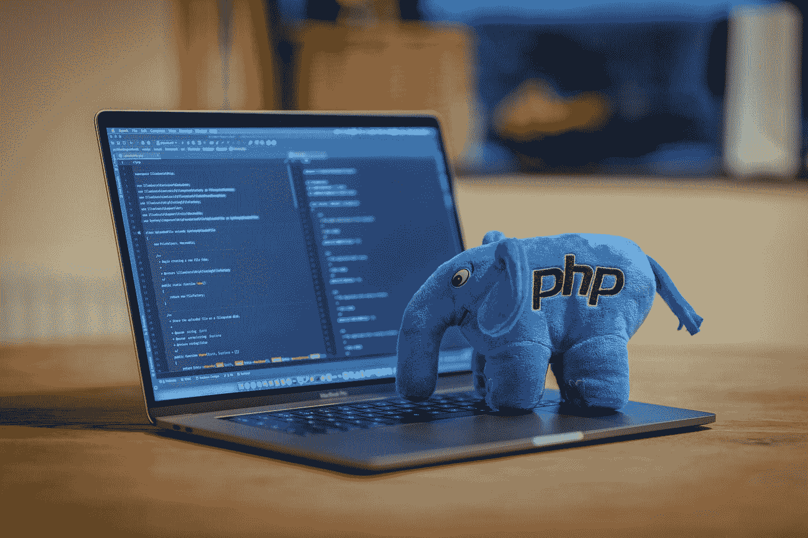

# Web 开发人员的 8 个最佳 PHP 框架

> 原文：<https://levelup.gitconnected.com/8-best-php-frameworks-for-web-developers-cf8ef7308617>

由于其简单易用，PHP 已经成为最流行的 web 脚本语言之一。它也是全世界数百万开发人员使用的语言，因此找到适合您开发需求的框架是至关重要的。

在本文中，我们将讨论 web 开发的最佳 PHP 框架。让我们看看这些工具都提供了什么，以及它们与竞争对手相比如何。

本·格里菲斯在 [Unsplash](https://unsplash.com?utm_source=medium&utm_medium=referral) 上拍摄的照片

# 为什么应该使用 PHP 框架

PHP 框架对开发人员非常有用，因为它们有助于将代码组织成模块，这使得创建应用程序更加容易。它们还提供了一个标准的函数库，使得创建可以在不同项目之间共享的可重用组件变得容易。除了这些好处，框架允许你写更少的代码。

由于大多数 web 程序员在选择 PHP 作为他们的首选之前都使用过某种类型的编程语言，PHP 使得开发 web 应用程序变得快速而高效。大多数 PHP 开发框架都有许多共同的特征，比如易安装性、安全性和可伸缩性。最重要的是，每个开发人员都确切地知道每个功能做什么以及如何工作。此外，所有的 PHP 框架都是相互兼容的，这意味着在它们之间切换时，你的站点看起来不会奇怪。

PHP 框架最好的一点是，它们通过提供现成的类或模板简化了应用程序的创建，节省了定制编码的时间和精力。WordPress 主题就是一个很好的例子。所有主要的 PHP 框架都包含模板引擎，使设计者无需了解任何代码编写知识就能定制基本的 HTML 元素。这些工具为用户提供了完整的功能，而不需要 HTML、CSS、JavaScript 等高级知识。

对于想要从头开始学习的开发人员来说，PHP 框架提供了几个优势。首先，学习一个框架比学习多个框架需要更长的时间。其次，构建一个完整的应用程序所需的资源量要低得多。第三，一旦项目完成，在系统之间转移数据变得极其方便。最后，大多数 PHP 框架都有确保产品质量的内置测试机制。

总之，PHP 开发框架是快速高效开发高质量软件的好工具。一旦你掌握了一门，你就再也回不去了！

# 8 个最好的 PHP 平台列表:

## 1)拉勒维尔

穆罕默德·拉赫马尼在 [Unsplash](https://unsplash.com?utm_source=medium&utm_medium=referral) 上的照片

Laravel 创建于 2009 年，是一个开源项目，但直到 2012 年 Twitter 宣布将使用 Laravel 而不是 Cakephp，它才开始流行。

从那以后，Laravel 与可口可乐、雅虎等大公司的合作势头越来越大。、耐克、Hulu 等。，选择 Laravel 而非其他替代产品。今天，数以千计的网站建立在 Laravel 之上。

## 2) Symfony:一个强大的 MVC 框架

照片由[拍摄于](https://unsplash.com/@ffstop?utm_source=medium&utm_medium=referral) [Unsplash](https://unsplash.com?utm_source=medium&utm_medium=referral) 上的

Symfony 是另一个非常流行的 PHP 框架，它允许您快速构建健壮的应用程序。Symfony 受欢迎的一个主要原因是因为它的灵活性。

您可以从多个组件中进行选择，如 Doctrine ORM、HttpFoundation、Twig 模板引擎，甚至 Zend Server。如你所知，许多项目开始时规模很小，但后来发展成了大项目。

这意味着如果你打算创造一些大的东西，Symfony 可能不符合你的需求。实际上，Symfony 只是为大规模软件开发而设计的。

## 3)Codeigniter 3:Laravel 的简单替代品

[助步车](https://unsplash.com/@walkator?utm_source=medium&utm_medium=referral)在 [Unsplash](https://unsplash.com?utm_source=medium&utm_medium=referral) 上拍照

CodeIgniter 是另一个著名的 PHP 应用程序平台，它使得创建强大的 web 应用程序变得容易。它简单的设计和直观的结构使它非常适合那些不想花时间学习复杂概念就想开始构建网站的初学者。

此外，CodeIgniter 附带了大量第三方库，允许您扩展默认功能之外的功能。这样，你就不必每次需要额外的功能时都重新发明轮子。

## 4)Fuel CMS——基于 AngularJS 和 Bootstrap 4 构建的开源内容管理系统

[西格蒙德](https://unsplash.com/@sigmund?utm_source=medium&utm_medium=referral)在 [Unsplash](https://unsplash.com?utm_source=medium&utm_medium=referral) 上拍照

Fuel CMS 非常适合那些寻求在单一仪表板中提供所有必要功能的内容管理系统的人。

Fuel 整合了一个屋檐下的一切，包括博客平台、论坛、画廊、活动、组合网站、电子商务解决方案、会员网站等等。

Fuel 还支持 RESTful APIs，允许您轻松地将 fuel 与任何外部系统集成。

## 5)Yii:PHP 应用平台的另一个伟大选择

马库斯·斯皮斯克在 [Unsplash](https://unsplash.com?utm_source=medium&utm_medium=referral) 上的照片

Yii 类似于 CodeIgnitor，因为两者都提供了大量的控制面板，用户可以通过它们管理整个网站。然而，Yii 比 CodeIgnitor 简单得多，因为它的接口更简单。

Yii 包括活动记录、网格视图、表单验证、安全特性、图像处理工具、缓存支持、数据访问层和数据库抽象层等特性。

Yii 也是高度可定制的，使得在以后的阶段增加新的特性成为可能。

## 6)超薄框架:轻量级快速 HTTP API，支持快速输入

照片由 [AltumCode](https://unsplash.com/@altumcode?utm_source=medium&utm_medium=referral) 在 [Unsplash](https://unsplash.com?utm_source=medium&utm_medium=referral) 上拍摄

与其他 PHP 框架相比，Slim Framework 是相当轻量级的。不仅如此，Slim Framework 也很快。

它的速度如此之快，以至于网上没有任何基准测试，但我们已经看到它的性能比传统框架快了 10 倍。如果速度对你很重要，Slim 框架绝对应该被考虑。

## 7) Cakephp:使用这个免费软件建立你自己的社交网站，比如脸书或推特

由[奥斯汀·迪斯特尔](https://unsplash.com/@austindistel?utm_source=medium&utm_medium=referral)在 [Unsplash](https://unsplash.com?utm_source=medium&utm_medium=referral) 上拍摄的照片

Cakephp 是使用 MVC 架构开发的，可以免费下载和使用。由于 CakePHP 遵循模型-视图-控制器模式，它可以帮助您在快速添加特性的同时清晰地组织代码。

CakePHP 有两个版本；第一版于 2006 年发布，第二版于 2011 年问世。两个版本都支持 MySQL 数据库连接。因此，如果你已经拥有一个 MySql 服务器，那么你将不会发现安装 CakePHP 的问题。

## 8) Phalcon:一个快速的 PHP 框架

丹尼尔·伊德里在 [Unsplash](https://unsplash.com?utm_source=medium&utm_medium=referral) 上的照片

它是轻量级的，使用 MVC 架构。用户可以只安装他们想要的模块和库。这有助于保持网站开发过程的整洁和简单。

虽然 Phalcon 不是很受欢迎，但与其他流行的 PHP 框架(如 Laravel)相比，它的文档是全面的。

# 结束语

PHP 平台是运行在服务器上的基于网络的应用程序，它们帮助你为小企业、教育机构和个人创建交互式网站或在线服务。

这些平台易于使用，不需要编程知识。你得到一个应用程序，它包含了你建立网站所需要的一切。