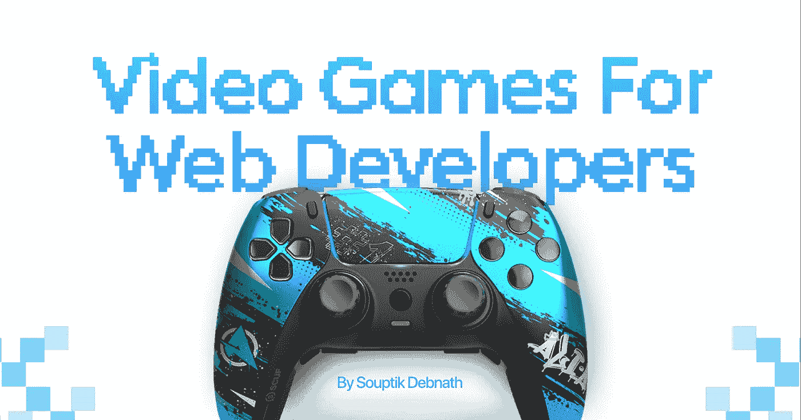
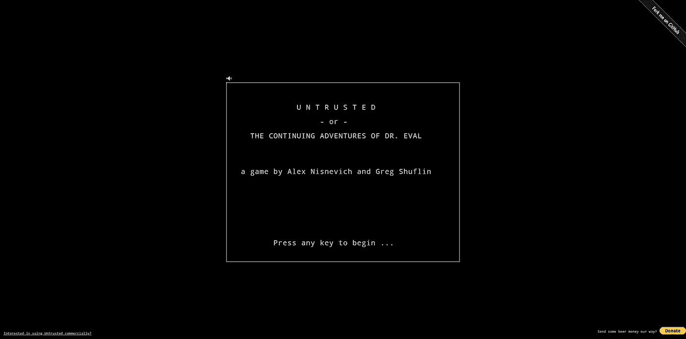
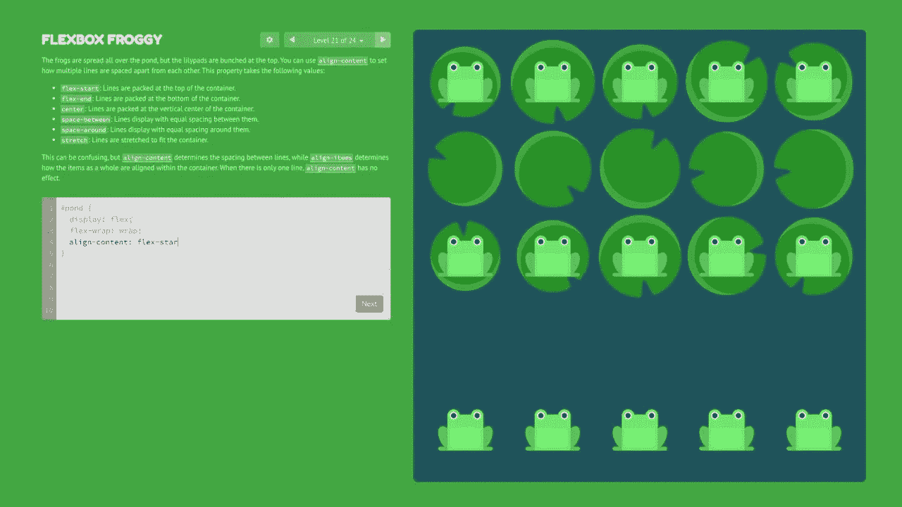
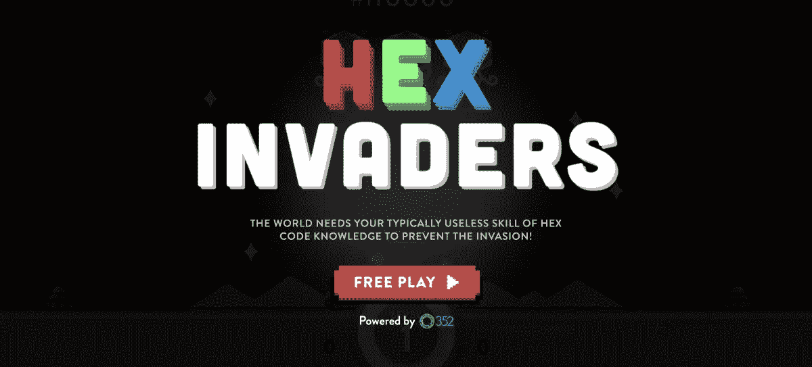
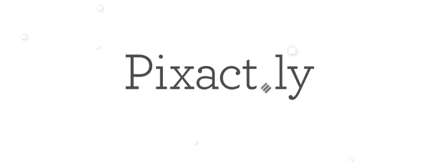
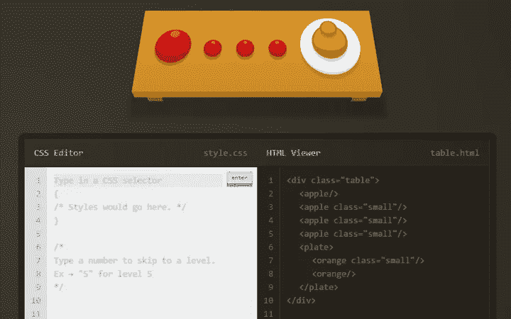
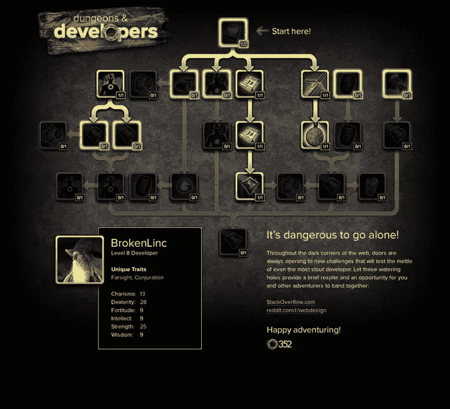
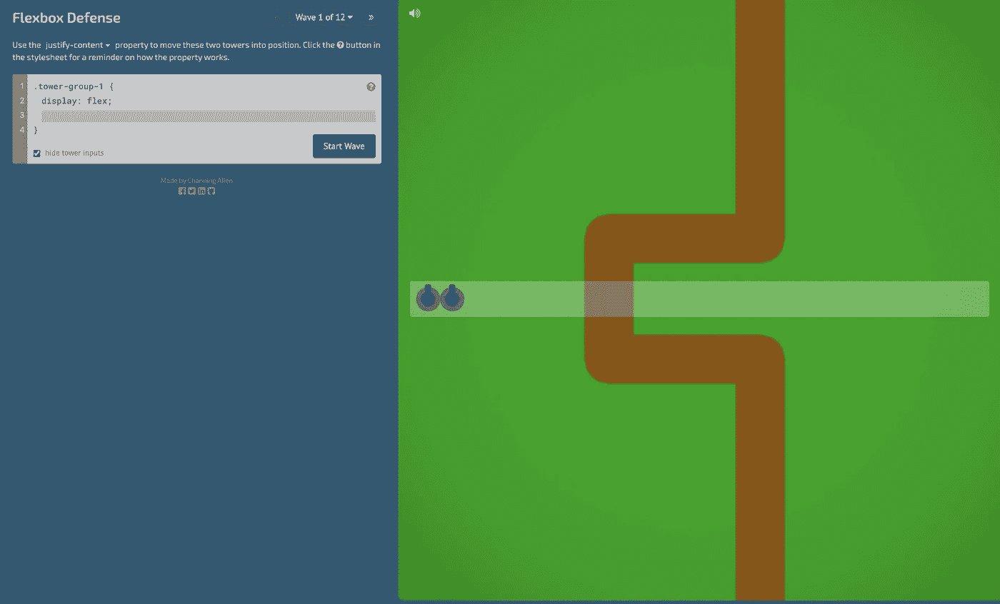
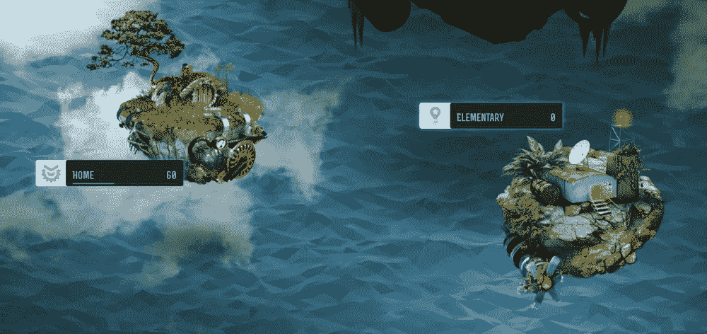
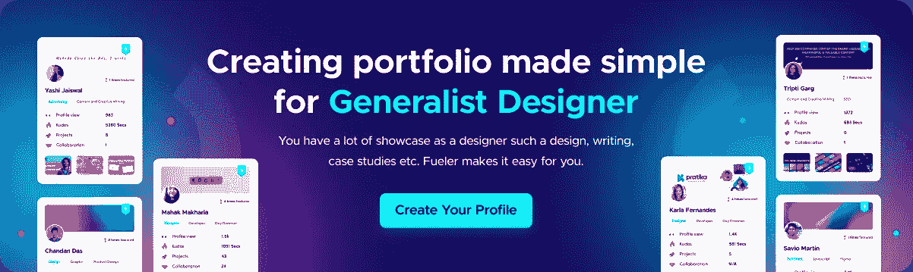

# 8 款最适合网络开发者的视频游戏💻

> 原文：<https://levelup.gitconnected.com/8-best-video-games-for-web-developers-89c478c48c5a>

在这篇文章中，我将与你分享 8 个视频游戏，它们可以帮助你成为更好的网页开发者。从解决问题和逻辑到设计，玩这些游戏将帮助你发展各种基本技能🧐

所以拿起你的控制器，让我们开始吧！

## 1.[不可信](https://alexnisnevich.github.io/untrusted)

不可信是一个元 JavaScript 冒险游戏，测试你的 JavaScript 技能解决问题。这个免费的 JavaScript 游戏让你练习更复杂的技能。

## 2. [Flexbox Froggy](http://flexboxfroggy.com/)

通过一个简单的界面，您将学习 CSS Flexbox 对齐的基础知识，同时帮助 Froggy 和他的朋友-在成为 CSS Flexbox 专家的同时拯救 Froggy。

## 3.[妖术入侵者](http://www.hexinvaders.com/)

在这个版本的经典街机游戏中，有三个外星人攻击世界，每个都有不同的颜色。当玩家击落入侵者时，他必须迅速将 RGB 十六进制值转换为人类颜色。

## 4.[像素地](http://pixact.ly/)

在 Pixactly 中，给你两个随机像素值，一个是矩形的宽度，另一个是矩形的高度。然后玩家必须画一个尽可能接近给定尺寸的盒子。

## 5. [CSS 食客](https://flukeout.github.io/)

这个游戏帮助你学习 CSS 选择器。它有一个 HTML 形式的动画菜肴表，以及一个或多个从表中选择的项目。

它涵盖了 web 开发人员需要了解的关于选择器的一切，从最基础的到最高级的。

## 6.[地下城&开发者](http://www.dungeonsanddevelopers.com/)

这个天赋树是由 CSS、HTML 和 JavaScript 魔法驱动的。为你已经掌握的技能加分，看看你离成为真正的 Web 开发大师有多近。

## 7. [Flexbox 防御](http://www.flexboxdefense.com/)

在这款基于 CSS 的塔防游戏中，游戏中的炮塔和陷阱使用灵活的盒子布局进行定位。有 12 个级别的敌人试图到达你的基地。

如果你想完成它们，你必须在每个方面应用你的 Flexbox 属性的知识。

## 8. [Checkio](https://checkio.org/)

为初学者和专业人士带来有趣和引人入胜的游戏，将编码带入生活。

**结论**

感谢阅读，如果你喜欢这篇文章，请分享🤞💜

查看我的[Twitter](https://twitter.com/souptikdn)&[LinkedIn](https://www.linkedin.com/in/souptikdn/)获取更多精彩内容。

立即创建您的 [Fueler](https://fueler.io/register) 个人资料！

