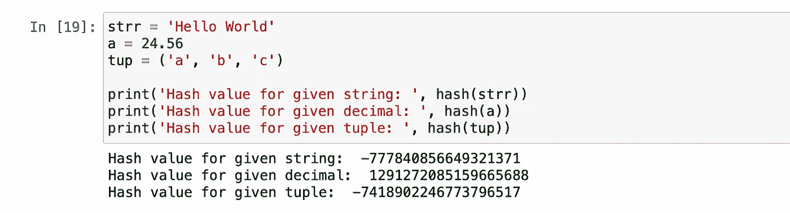
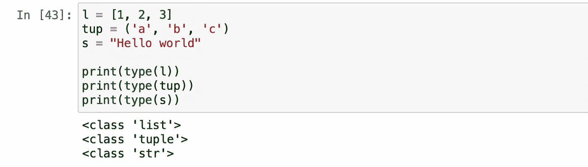

# 每个 Python 程序员都应该知道的 8 个内置函数

> 原文：<https://levelup.gitconnected.com/8-built-in-functions-every-python-programmer-should-know-80f4e0bc1366>

## 有用的 Python 内置函数


照片由 [Lidya Nada](https://unsplash.com/@lidyanada?utm_source=medium&utm_medium=referral) 在 [Unsplash](https://unsplash.com?utm_source=medium&utm_medium=referral) 上拍摄

Python 有几个随时可用的函数和方法，这些函数被称为内置函数。这些内置函数非常方便易用。

这些内置函数不仅方便快捷，还能帮助我们避免编写不必要的代码行。使用这些函数，我们可以更清晰地编写代码，并将复杂的问题分解成更简单的代码。

在本文中，我根据自己的 python 编程经验，提出了一些 Python 最有用的内置函数。我们开始吧！

## 1.ascii()

Python 中的`ascii()`函数返回一个字符串，其中包含一个对象的可打印表示。该函数还用转义字符替换所有非 ascii 字符。

> 语法:ascii(对象)

这里有一个同样的例子:


## 2.哈希()

这个`hash()`函数返回一个对象的哈希值，如果它有一个的话。这些哈希值对于在字典查找过程中快速比较字典键非常有用。

该函数将一个不可变的对象作为输入，然后返回该对象的哈希值作为输出。

> 语法:hash(object)

示例:



这样我们可以找到任何对象的哈希值。

## 3.bin()

这个`bin()`函数用于找到一个整数的二进制等效值。该函数将一个整数作为输入，然后返回该整数的二进制等价字符串，前缀为“**0b”**。

> 语法:bin(整数)

示例:


## 4.输入()

在 Python 中，`input()`函数用于接受用户的输入。无论我们提供什么值作为这个函数的输入，默认情况下都会转换为字符串类型。

> 语法:输入(提示)

示例:


即使我们提供了整数值，这个`input()`函数也会将其转换为字符串类型。


## 5.地图()

在 Python 中，这个`map()`函数允许我们将一个指定的函数应用于 iterable 中的每一项，并将其作为输入(函数和 iterable)。

> 语法:map(function，iterable)

示例:


在上面的例子中，使用 map 函数，我们将 **int** 函数应用于 iterable 的每个元素。

## 6.目录()

这是 Python 中一个强大的内置函数，它返回指定对象的属性和方法列表，如函数、模块、列表等。

> 语法:dir(object)

示例:


输出:

```
['__class__', '__delattr__', '__dict__', '__dir__', '__doc__', '__eq__', '__format__', '__ge__', '__getattribute__', '__gt__', '__hash__', '__init__', '__init_subclass__', '__le__', '__lt__', '__module__', '__ne__', '__new__', '__reduce__', '__reduce_ex__', '__repr__', '__setattr__', '__sizeof__', '__str__', '__subclasshook__', '__weakref__', **'age', 'country', 'name'**]
```

## 7.类型()

这个`type()`函数返回指定对象的类类型。

> 语法:类型(对象)



答对了。简单又有帮助，不是吗？

## 8.zip()

在 Python 中，`zip()`函数用于映射多个迭代器的相似索引，以便它们可以作为单个实体使用。

这个函数将多个迭代器作为输入，然后返回一个迭代器对象，该对象具有来自所有指定输入迭代器的映射值。

> 语法:zip(*迭代器)


## 结论

这就是这篇文章的全部内容。本文介绍了一些非常有用的 python 内置函数。实践所有这些功能，使它们使用起来得心应手。

感谢阅读！

> *在你走之前……*

如果你喜欢这篇文章，并希望**继续关注更多**精彩**文章的**——请考虑使用我的推荐链接:[**https://pralabhsaxena.medium.com/membership**](https://pralabhsaxena.medium.com/membership)成为中等会员。

另外，你可以在这里免费订阅我的时事通讯: [Pralabh 的时事通讯](https://pralabhsaxena.medium.com/subscribe)。