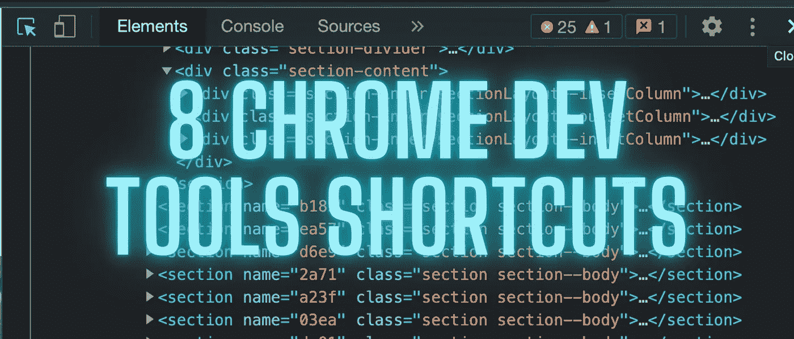
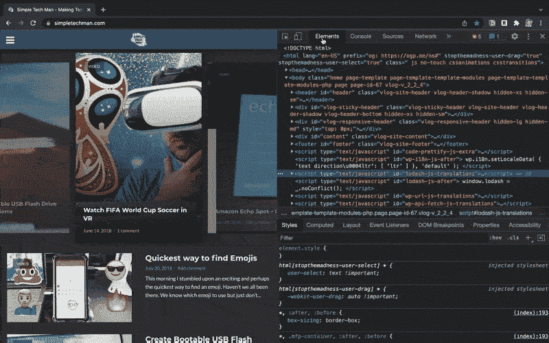
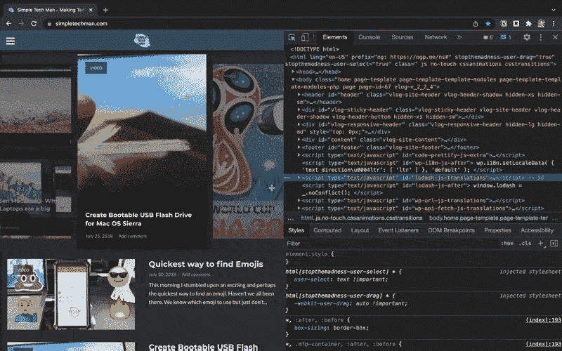
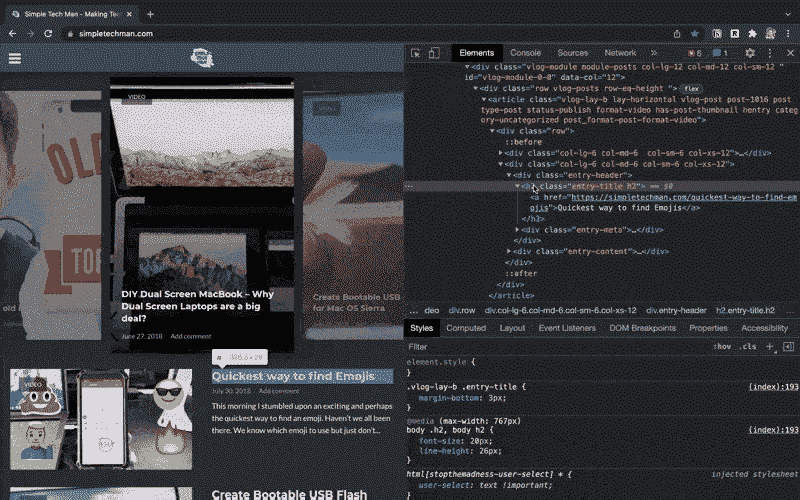
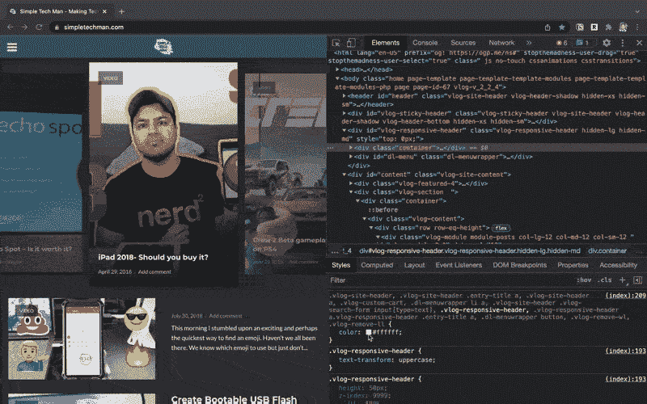
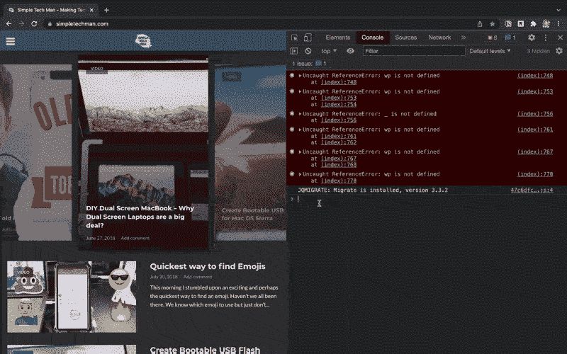

# 面向高效开发人员的 8 个 Chrome 开发工具快捷方式

> 原文：<https://levelup.gitconnected.com/8-chrome-dev-tools-shortcuts-for-the-productive-developer-ef408283e7fe>



面向高效开发人员的 8 个 Chrome 开发工具快捷方式

你有没有发现自己浪费时间在 chrome 开发者工具中寻找东西？

开发人员花费大量时间使用 web 浏览器。这就是为什么学习如何充分利用浏览器很重要。在这篇文章中，我将向你展示 8 个有用的 Chrome 开发工具快捷方式。

我将介绍我在日常开发工作流程中使用的一些我最喜欢的键盘快捷键。这些快捷方式节省了我大量的时间，让我可以专注于编码而不是搜寻信息。

## **打开控制台面板**

键盘快捷键

```
Mac — Command+Option+J
Windows - Control+Shift+J
```


打开控制台面板

## **打开元素面板**

键盘快捷键

```
Mac — Command+Shift+C or Command+Option+C
Windows - Control+Shift+C
```


打开元素面板

## **打开上次打开的面板**

键盘快捷键

```
Mac — Command+Option+I
Windows - F12 or Control+Shift+I
```


打开上次打开的面板

## **移动到下一个和上一个面板**

键盘快捷键

```
Mac — Command+] / Command+[
Windows - Control+] / Control+[
```



移动到下一个和上一个面板

## 打开命令菜单

键盘快捷键

```
Mac — Command+Shift+P
Windows - Control+Shift+P
```



打开命令菜单

## **隐藏当前选中的元素**

键盘快捷键

```
Mac — h
Windows - h
```



隐藏当前选定的元素

## **循环显示 RBGA、HSLA 和十六进制颜色值**

键盘快捷键

```
Mac — Hold Shift then click the Color Preview box next to the color value
Windows - Hold Shift then click the Color Preview box next to the    color value
```



在 RBGA、HSLA 和十六进制颜色值之间循环

## **清除控制台**

键盘快捷键

```
Mac — Command+K or Option+L
Windows - Control+L
```



清空控制台