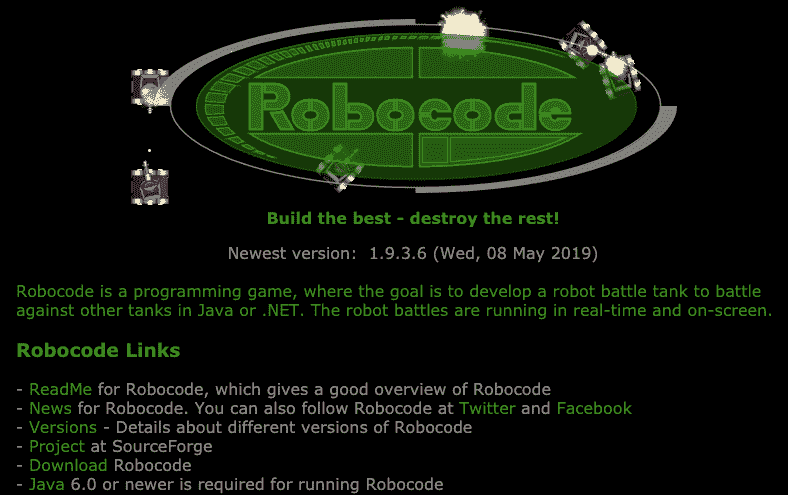
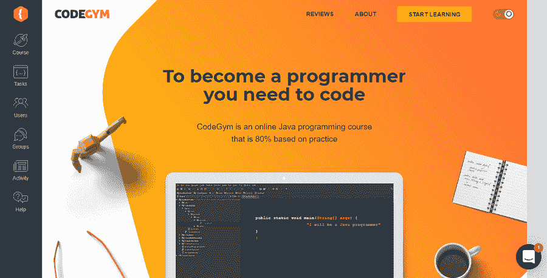
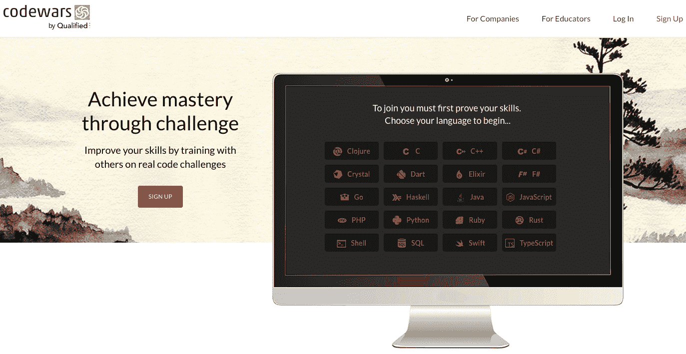
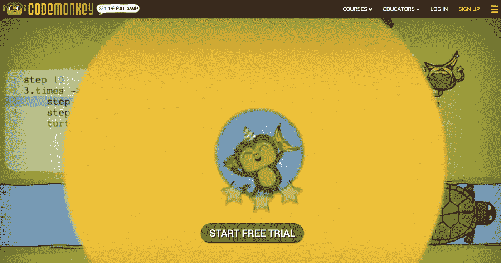
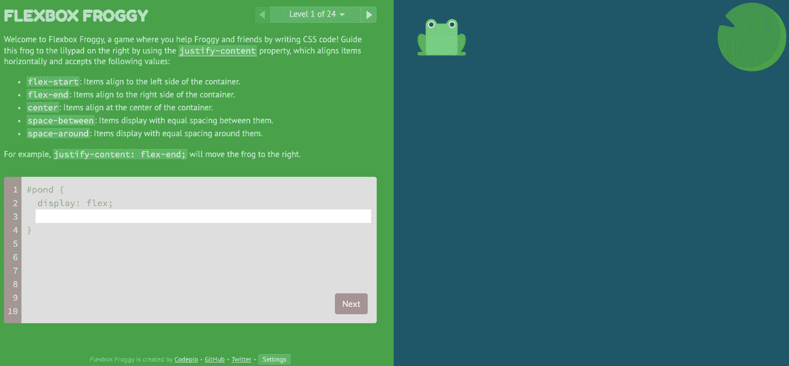
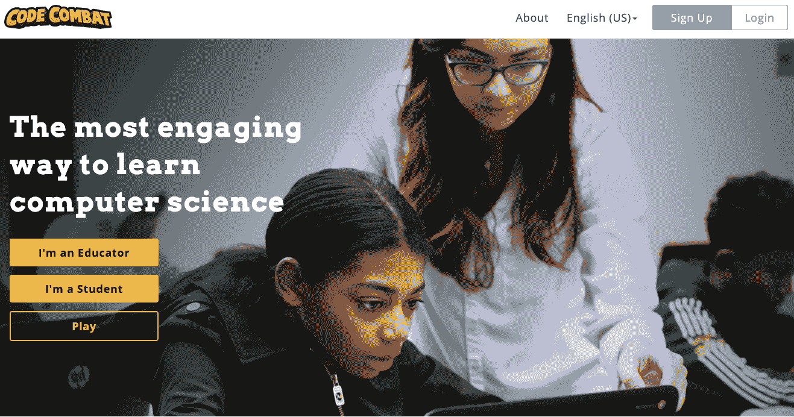

# 8 编写游戏代码来提高你的编程技能

> 原文：<https://levelup.gitconnected.com/8-coding-games-to-improve-and-level-up-your-programming-skills-52397201441a>

编程是全球雇主要求最高的职业之一。这个世界就是找不到足够多的合格开发人员，我们每天都看到新技术和创业公司不断涌现。这个职业要求很高，竞争激烈，即使你已经是专业开发人员，也需要不断学习和扩展知识。

当然，学习如何编程有很多方法，有数百种教科书、视频课程和指南。练习是帮助你学习一门新的编程语言或库的最好方法。这也是很多人经常遇到的障碍:有大量的学习资料，但严重缺乏运用理论的个人经验。

计算机理论的另一个障碍——你会和你的动机一起被它淹没。没有实践，你不会在你的学习曲线上看到结果。

这些问题有一个解决方案，适用于学习一般的编码方法或提高你对特定语言的知识。是编码游戏！今天我们将列出现有的最佳编码游戏。

# #1.[机器代码](https://robocode.sourceforge.io/)

*爪哇。网*

在 Robocode 中，你通过控制一辆坦克与其他坦克战斗来学习编程，并在此过程中练习编写代码。

# 赞成的意见

*   **简单易学。Robocode 是一款老游戏(于 2000 年推出),有非常详细的教程向你解释游戏的各个方面。它的机制非常简单，所以它不会花时间来开始玩它。**
*   这个游戏很有趣，甚至会让人上瘾。
    机器人坦克作战总是很有趣。由于其引人入胜和平衡的游戏过程，Robocode 拥有相当庞大的粉丝群。想一想，这款早在 2000 年就推出的游戏，如今仍由粉丝定期更新和维护。
*   **它让你写出真正的代码。在 Robocode 中，你必须使用一堆流行的编程语言为你的机器人坦克编写 AI，包括 Java 和 C#。因此，每次玩游戏时，您都可以练习真正的、适用的编码技能。**
*   **这是一款开源游戏。Robocode 是一个完全开源的项目，这意味着你可以重用它来做任何你想做的事情。多年来，粉丝们一直在为 Robocode 创建各种模式和插件。**
*   **玩的时候可以用不同的编程语言。在 Robocode 中，你可以提高技能并学习一大堆不同的编程语言，而不是某一种。**

# 骗局

*   **简单化的设计。**
    如前所述，Robocode 是一款古老的游戏。它有非常基本的图形、设计和界面。这里没什么特别的。
*   **难以卸载。**
    如果你想把 Robocode 从你的电脑上移除，可能没那么容易做到。Robocode 没有卸载文件。相反，你必须手动找到游戏的目录(这可能很棘手)并删除其中的所有文件。

# #2. [CodeGym](https://codegym.cc)

*Java*

# Java 语言(一种计算机语言，尤用于创建网站)

CodeGym 是一门游戏化的编程课程，专为用户学习和练习 Java 编程而设计。

# 赞成的意见

*   **可以从零开始学习 Java 编程。**
    玩家不需要了解任何 Java 的编码就可以开始游戏，适合新手。
*   **该平台提供大量示例和解释，以简化学习过程。**
    如果你想不出如何完成其中一项任务，CodeGym 提供了各种例子来帮你找到解决方法。
*   **CodeGym 教你针对不同的目的和平台使用 Java。**
    它的课程里有 1200 多个谜题。他们教你如何为不同的任务编写解决方案，为不同的需求和其他应用程序修改或改编现有的代码。
*   **不仅仅是游戏化的学习课程。CodeGym 是一款激动人心的网络游戏，有真实的科幻情节、有趣的角色和大量的幽默。所有这些都使得学习 Java 成为一个有趣且吸引人的过程。**
*   **虚拟导师。**

你的解决方案由虚拟老师验证，你即刻得到结果。虚拟老师会对你的解决方案提出建议，帮助你改正错误，还会给你一个关于你需要做什么的明确要求列表。

*   **CodeGym 免费使用。**

# 骗局

*   为了理解 Java 的某些方面，你可能需要额外的学习材料。有时候，谜题给你的还不够，你可能需要开始寻找额外的信息和教程。好消息是，你不需要找太远。网上和平台上有大量关于 Java 的资料。
*   **这款游戏并没有完全针对移动平台进行优化。CodeGym 确实需要一些调整来更好地适应移动平台。**

# #3.[代码大战](https://www.codewars.com/)

*Clojure、C、C++、C#、Crystal、Dart、Elixir、F#、Go、Haskell、Java、JavaScript、PHP、Python、Ruby、Rust、Shell、SQL、Swift、TypeScript*

Codewars 是一个游戏化的在线平台，提供编码挑战，用户可以在这里解谜并比较他们的解决方案。

# 赞成的意见

*   你可以和其他玩家比较你的解决方案。
    Codewars 允许你和其他用户比较你的解谜方法。这有助于快速找到代码中的错误，也有助于从完全不同的角度了解如何解决相同的问题。
*   **你通过完成挑战来练习编码。**
    解决不同的谜题和算法挑战是快速学习编程语言最有效的方法之一。
*   Codewars 可以免费使用。

# 骗局

*   **需要一些基本的编码知识才能开始。Codewars 不像 CodeGym 那样对新手友好。在开始使用它之前，您需要学习一些编码基础知识。**
*   **挑战主题有限。使用 Codewars 一段时间后，你会发现这个平台没有那么多种类的谜题可以提供。**

# #4.[深圳输入输出](http://www.zachtronics.com/shenzhen-io/)

深圳 I/O 是一个益智游戏，教未来的工程师如何根据提供的要求构建电路和编写汇编代码。

# 赞成的意见

*   **深圳 I/O 模式它的工作原理一般。这个游戏不像以前的游戏那样专注于编程语言，但是你用它训练的技能将适用于这个领域的许多不同的工作和目的。**
*   对于那些对老式编程感兴趣的人来说，这是一个完美的选择。过去，没有花哨的 ide 和框架，代码必须更加详细。这就是这个游戏允许你练习的。

# 骗局

*   **深圳 I/O 相当难。这个游戏没有完整的用户手册，而且它的谜题一般都很难，所以很多人可能会觉得它太难了。**
*   它有一个陡峭的学习曲线。
    深圳 I/O 比较难学。它从几个相当简单的任务开始，但谜题会突然变得复杂得多。游戏没有给你太多调整的时间。

# # 5.[维姆历险记](https://vim-adventures.com/)

*Vim*

Vim Adventurers 是一个游戏，用于学习或提高您对流行的 Unix 文本编辑器 Vim 的知识。

# 赞成的意见

*   这是学习所有主要 Vim 概念的简单方法。玩这个游戏你会很快学会 Vim 的所有快捷键、主要概念和功能。
*   **对学习编程逻辑有用。虽然严格来说，Vim 不是一种编码语言，但知道如何使用它会对你这个程序员有很大帮助。**
*   Vim Adventurers 是一款简单有趣的游戏。

# 骗局

*   一些用户可能会很容易感到厌烦。
    Vim adventures 过于简单，可能会让游戏过程很快变得无聊。

# #6. [CodeMonkey](https://www.playcodemonkey.com/)

*CoffeeScript*

Code monkey 是一款在线编码游戏，主要面向对编码了解非常有限或为零的中小学生，这使得它成为初学者的一个不错的选择。

# 赞成的意见

*   **适合对编码零知识的学生。CodeMonkey 是教儿童和青少年如何编码的一个很好的开始。如果对他们有好处，对任何年龄都有好处。**
*   **提高逻辑和解决问题的能力。**
    你在玩这个游戏时训练的技能，像逻辑和解题，几乎可以应用在生活的任何地方，而不仅仅是编码。它使得 CodeMonkey 对那些有兴趣提高这些技能的人很有帮助，同时也学习如何编码。
*   **其编码语言类似于 JavaScript。**
    在 CodeMonkey 中使用这种语言，在玩完游戏后更容易学习 JavaScript。

# 骗局

*   这个游戏不太适合在家学习的学生。
    这往往需要技术支持和帮助。CodeMonkey 更适合作为课堂互动活动。

# #7. [Flexbox Froggy](http://flexboxfroggy.com)

*CSS*

Flexbox Froggy 是一个简单的游戏，旨在帮助用户学习 CSS 代码。玩家必须通过掌握一个布局模块 CSS flexbox 来将 Froggy 带回家。

# 赞成的意见

*   **为没有任何 CSS 知识的用户制作。**
    专为 CSS flexbox 初学者打造，让你可以用 Froggy 学习 CSS 的基础知识。

# 骗局

*   这个游戏很简单，只适合初学者。
    简洁也是 Flexbox Froggy 最大的缺点。它更适合完全的初学者，并没有为要求更高的用户提供太多的学习空间。

# #8. [CodeCombat](https://codecombat.com/)

*JS，Python，HTML，CSS，jQuery*

CodeCombat 是一款在线游戏，由玩家需要通过编写 JavaScript 代码来解决的谜题和挑战组成。

# 赞成的意见

*   **为初学者介绍 JavaScript 语法和逻辑。**
    可以从非常简单的拼图开始，慢慢进步，一步一步的学习 JS 语法。
*   这很有趣，也很吸引人。CodeCombat 为玩家提供了相当广泛的谜题和挑战，这使得它非常有趣。玩这个游戏你一时半会不会觉得无聊。

# 骗局

*   仅教授基本的 JavaScript 概念。
    CodeCombat 只涵盖了 JavaScript 最基本的概念，如果你已经掌握了这些概念，要进一步学习，你需要找到另一个工具。

# 包裹

边玩边学并不是一个新概念，游戏是一种久经考验的学习或提高技能的方法。编码也不例外。有很多很棒的编码游戏适合所有类型的玩家。无论你正在学习哪种语言，或者你目前的水平如何，你都可以找到游戏来提升你的编码技能，同时享受乐趣。

 [## 了解如何编码-查找编码教程| gitconnected

### 使用我们完整的编码资源列表学习任何编程语言或框架。我们分享、汇总和排名…

gitconnected.com](https://gitconnected.com/learn)