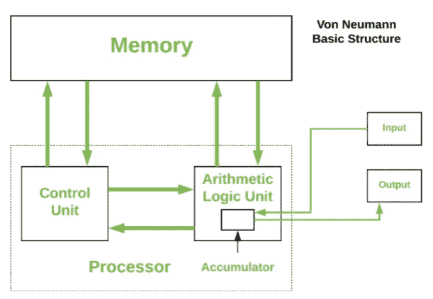

# 你需要了解的 8 位计算机科学家

> 原文：<https://levelup.gitconnected.com/8-computer-scientists-you-need-to-know-a7a995321eca>

## 我钦佩的有趣的、鼓舞人心的过去和现在的计算机科学家

瓦伦丁·b·克雷默在 [Unsplash](https://unsplash.com?utm_source=medium&utm_medium=referral) 上的照片

我喜欢阅读关于多年来为计算机科学做出贡献的科学家和工程师的文章。这激励我去了解他们惊人的工作——有些人没有受过正规教育，大多数人接触研究的机会比我们现在少。这不是一个最好的列表，只是我最喜欢的一些。

## **约翰·冯·诺依曼**

如果约翰尼(他的朋友们这样称呼他)没有在图灵奖时代之前去世，他无疑会获得该奖。Cantor ' s Paradise 发表了一篇关于 Johnny 的文章，详细介绍了他的背景。

他的才华和框架是广泛的(包括数学和化学的双博士学位)，在今天的计算机科学中，人们可能只会从今天的架构的变体+它所创造的限制(冯诺依曼架构和瓶颈)中认出他的名字。但别忘了他还发明了合并排序，并制造了一些最早的计算机。他还做了原子弹背后的大部分内爆数学，使用第一代计算机设计了 B-炸弹，并对蒙特卡罗方法做出了贡献。

冯·诺依曼建筑

有各种各样的故事关于约翰尼挥霍的数学和记忆技能，在 6 岁时能够在不到一秒钟内在他的头脑中划分 2-8 个数字。他还有过目不忘的记忆力，能够凭记忆背诵整本书。据说他带了两本书去厕所，因为害怕在他看完之前看完第一本！

约翰尼还没来得及完成他在人工智能领域的新激情，就死于癌症。他开始写《计算机和大脑》，不幸的是，这本书在目前的形式下不是很连贯。谁知道如果强尼再活 20 年 AI 和 ML 会有多远！

## 弗雷德·布鲁克斯

> “你花在一个项目上的时间有一半以上(大约 70%)是花在思考上的，没有一个工具，无论多么先进，能够替你思考。因此，即使一个工具为你做了除思考之外的所有事情——如果它写了 100%的代码，写了 100%的文档，做了 100%的测试，烧了光盘，把它们放在盒子里，然后邮寄给你的客户——你所能期望的最好的结果是生产率提高 30%。为了做得更好，你必须改变你的思维方式。”

我认为 Fred 最出名的是他的书“人月神话”——这是一部关于软件开发的经典和圣经，它的建议出人意料地永恒。也许是世界上被引用最多的计算机科学家之一，他实际上不仅仅是伟大的引用和酷的书名。

他不仅是图灵奖获得者，也是他的名著所基于的 IBM System/360 的设计师，他还因开发了哈佛 Mark I 计算机和 IBM 的第一台基于晶体管的计算机(以失败告终)而闻名。

大多数人都不知道这个系统/360 是什么(包括我自己)。大型机先于我们大多数人，但显然在 360 之前，每台“计算机”都有完全不同的架构，每次都需要重写整个软件。由一组兼容的硬件寄存器和指令组成的“架构”概念始于 Brooks 和 360。这可能是现代“计算机架构”的第一个例子。

## 安德鲁·塔南鲍姆

虽然从历史的角度来看，我不是最著名的科学家，但我喜欢他的书，尤其是计算机网络，并有幸在阿姆斯特丹大学的办公室找到他，请他在我的第三版书上签名。(*我不想打扰他，因为我在附近工作，我的同事是他以前的学生，建议我去试试*

我的计算机网络签名副本

Andy(或“ast ”)因其在操作系统研究方面的工作以及在 1974 年出版的书中将 Unix 源代码发布到他的“minix”操作系统上而闻名。Linus Torvalds 以此作为他的“linux”操作系统的基础。有趣的是，Andy 不同意——他觉得所有的新研究都应该是微内核，而不是另一个单核。有一个存档的 [USENET 线程](https://en.wikipedia.org/wiki/Tanenbaum%E2%80%93Torvalds_debate)因此相当有名。

Andy 在操作系统和分布式系统领域写了几本著名的书，在他的博士系谱中有很多著名的学生。韦纳·沃格尔斯(AWS 的首席技术官)是他最著名的博士生之一。麻省理工学院的 Frans Kaashoek 是另一个学生，他的学生是 Dawson Engler，在斯坦福教授高级操作系统。我提到恩格勒是因为他是一个很酷的人，我也上过他的课——所以我也有血缘关系！(不过说真的，我的技能只让我有资格修剪他们的草坪……)

# 来自现代的了不起的人

因为这些人更年轻(或者还活着)——我把他们放在一个不同的类别中，以表达对老人(比如我)的尊重。

## 约翰·卡马克

人们可能不会认识到《毁灭战士》和《地震》背后的天才。有时听听他的乔·罗根播客，你会感觉到他的天才是多么多才多艺——有点像迷你冯·诺依曼，他能够从游戏跳到火箭，再跳到人工智能。

作为一名自学成才的黑客和游戏程序员，他的工作具有传奇色彩。人们应该阅读“毁灭大师”来充分了解卡马克是多么有才华，以及为什么 10 倍的程序员(在约翰的情况下是 100 倍)不是一个神话。

卡马克启发我，如果你想在某件事上做得好或伟大，就要 110%地专注(尽管他和其他天才很可能有某种形式的阿斯伯格综合症)。他超越游戏的能力激励我采取大胆的步骤(尽管我需要先像他一样在银行里有几百万美元)。

## 克里斯·拉特纳

在一次人工智能播客中听了克里斯的演讲后，我开始意识到他的才华。这个家伙不仅建立了现在标准的 LLVM 编译器和优化器，还在苹果公司创建了 Swift 语言，然后在谷歌公司为它建立了 TensorFlow 支持。

我担心随着编程语言变得更高级，大多数人已经失去了与硬件的联系，但幸运的是，像 Chris 这样的传奇人物仍然在编译器和语言的最底层工作。GCC 持续了几十年的原因是没有人有雄心取代这样一个事实上的工具。编写编译器真的很难——这是你在大学里上的一门课，只是为了在出于震惊和敬畏而逃之夭夭之前感受一下硬件。

关注他目前的初创公司 [SiFive](https://www.sifive.com/) 以及可定制芯片的 RISC-V 空间。如果我有多余的比特币，我会把它赌在克里斯身上。

## **杰夫·迪恩**

Jeff 和 Sanjay Ghemawat 可能是 Google 历史上最著名的人，也是每一个希望成为成功的程序员而不是被迫进入管理层的工程师的愿望(Jeff 已经进入了管理层，但我们不会因此而反对他)。

Jeff 在 Google 至少有 5 项关键创新，每一项都足以让他成为研究员和传奇人物(排名不分先后:TensorFlow、MapReduce、BigTable、Spanner 和 LevelDB)。吴恩达在一次采访中称杰夫可能是世界上最好的程序员。

## 马泰·扎哈里亚·杰伊·克雷普斯

我喜欢像杰伊和马泰这样的新一波首席执行官/首席技术官——他们利用公司的内部产品或大学研究成果并将其开源，然后在充分采用后创建了一家公司。这种模式已经被重复了几次——让人怀疑它是否会阻止公司在未来赞助 OSS？

Kreps 和 Kafka 为如何用基于日志的语义捕获消息和数据库带来了一个新的维度。他发表在 Linkedin 上的日志论文应该是所有软件和系统架构师的必读。

Matei 采用了 Spark——人们会认为这是一个非常成熟的操作系统，并证明了实现细节的重要性。DataBricks、EMR、Spark on Kube 或 Spark on YARN 之间的可用性差异就像我自制的箱式汽车和法拉利之间的差异一样。

不是约翰·卡马克的 F40，也不是他送给地震锦标赛冠军的法拉利。[维基共享](https://commons.wikimedia.org/wiki/File:Ferrari_F40_6.6.14.jpg)

这份清单还远未完成。我个人非常感谢那些帮助我们推动创新和进步的企业家们。我的列表中还有其他名字，比如 Stonebraker、Djikstra、Rivest、Wes McKinney，我也想谈谈——也许在以后的第 2 部分中。

# 参考

1.  https://www.youtube.com/watch?v=Ml3-kVYLNr8[JVN](https://www.youtube.com/watch?v=Ml3-kVYLNr8)
2.  JVM 故事—[https://cs . Stanford . edu/people/eroberts/courses/soco/projects/1998-99/game-theory/neumann . html](https://cs.stanford.edu/people/eroberts/courses/soco/projects/1998-99/game-theory/neumann.html)
3.  ACM 轮流奖获奖者—[https://amturing.acm.org/byyear.cfm](https://amturing.acm.org/byyear.cfm)
4.  一篇每个工程师都应该阅读的论文—[https://engineering . LinkedIn . com/distributed-systems/log-what-Every-a-software-Engineer-Should-know-on-real-time-data-unified](https://engineering.linkedin.com/distributed-systems/log-what-every-software-engineer-should-know-about-real-time-datas-unifying)
5.  阿帕奇 Spark 历史—[https://spark.apache.org/research.html](https://spark.apache.org/research.html)
6.  杰夫和桑杰@谷歌—[https://www . new Yorker . com/magazine/2018/12/10/the-friendship-that-made-Google-huge](https://www.newyorker.com/magazine/2018/12/10/the-friendship-that-made-google-huge)
7.  科学家中的阿斯伯格——[https://www.ncbi.nlm.nih.gov/pmc/articles/PMC539373/](https://www.ncbi.nlm.nih.gov/pmc/articles/PMC539373/)