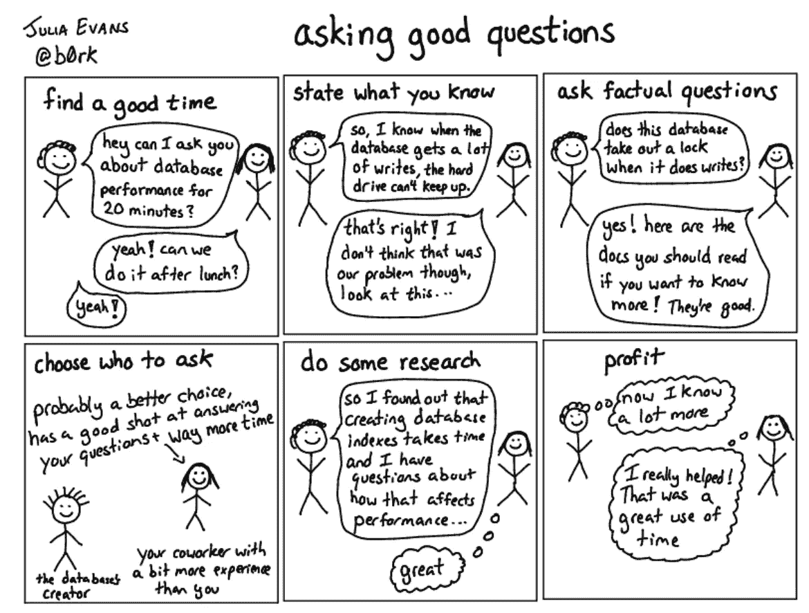

# 值得你花时间的 8 篇关于编程的文章

> 原文：<https://levelup.gitconnected.com/8-essays-on-programming-that-are-worth-your-time-9bdcb83964db>

作为一名有抱负的软件工程师，关于编程的文章已经成为信息和灵感的宝贵来源。

> 他们详细描述了世界上最好的工程师的思维过程。他们提供了关于他们如何阐述和表达问题、与他人交流问题以及着手解决问题的见解。

人类是模式匹配机器。为了解决问题，我们利用以前的经验来确定可能的解决方案。这些文章——详细描述了具体的问题和解决这些问题的方法——允许读者增加他们能够调用的模式的数量。

这并不是说阅读可以取代经验，但它可以提供一个有价值的起点。

这些是我在谈话中不断思考和调用的文章，也是我经常重温的文章。如果你有任何你认为属于这个列表的其他人，请在评论中留下他们，我很乐意阅读他们。

威廉·戴尼奥在 [Unsplash](https://unsplash.com?utm_source=medium&utm_medium=referral) 上拍摄的照片

## [1。关于软件性能的思考](https://blog.nelhage.com/post/reflections-on-performance/)——Nelson El hage

> 如今，哀叹软件速度慢很流行，然而团队对此采取行动的情况也很少见——我们的工具仍然越来越慢。我的经历让我坚信，虽然我们的工具确实让编写快速软件变得越来越困难，但这仍然是可能的，并且仍然是值得的。
> 
> 也许不太明显的是，拥有更快的工具改变了用户使用工具或执行任务的方式。用户几乎总是有多种策略可以用来追求一个目标——包括决定完全做别的事情——他们会越来越频繁地选择使用更快的工具。快速工具不只是让用户更快地完成任务；它们允许用户以全新的方式完成全新类型的任务。

## [2。以产品为中心的工程师](https://blog.pragmaticengineer.com/the-product-minded-engineer/)——Gergely Orosz

作为一个对产品和消费者有着浓厚兴趣的人，这篇文章提供了一些实用的建议，告诉你怎样才能成为一名工程师，在塑造世界级产品的过程中发挥作用。

> 以产品为中心的工程师是对产品本身非常感兴趣的开发人员。他们想了解为什么要做出决策，人们如何使用产品，并喜欢参与产品决策。在制造世界级产品的公司，以产品为中心的工程师将团队带到一个新的影响水平。

## [3。你需要立即开始一个‘惊人’的项目](https://jeffknupp.com/blog/2014/05/30/you-need-to-start-a-whizbang-project-immediately/)——杰夫·克努普

每次读这篇文章，我都想放下手头的工作去工作。这让我对成为一名软件工程师的可能性感到兴奋，并决心尝试和构建伟大的产品。

从这篇文章的每次阅读中获得的灵感并没有随着时间的推移而消退——这就是为什么它是一篇伟大的文章。

> 这提醒我自己要努力解决*真正棘手的*问题。我想制作看起来像魔术一样的软件。让其他开发人员停下来说，“哇。我想知道他是怎么做到的？”大多数软件项目都是为了解决相当普通的问题而创建的，这是可以理解的。当然，编程语言只是工具。大多数画笔没有画西斯廷教堂。大多数打字机没有生产出莫比·迪克。
> 
> 但是至少有一个*做了*，这就是为什么`whizbang`目录存在于我的电脑上(事实上，在我控制的所有机器上)。

## [4。做重要的事情——威尔·拉森](https://lethain.com/work-on-what-matters/)

与上面的一些作品相比，这一篇技术含量较低，但我发现它提供了一个极好的提醒，提醒人们在选择工作内容时要深思熟虑。今天的决定决定你明天的职业生涯。这篇文章告诉你今天如何做出好的决定。

> 如果你在职业生涯中继续前进，那么即使你的工作时间减少，对你的影响的期望也会继续增长。有一段时间，你可以试着少睡一会儿，或者不让自己参加那些让你感觉完整的非工作活动，但你会不可避免地发现，你的工作对你的牺牲保持着冷漠，而不是回报。只有通过让你的职业和生活步调一致，你才能长期支撑自己。

## 5.[年轻血液分布式系统笔记](https://www.somethingsimilar.com/2013/01/14/notes-on-distributed-systems-for-young-bloods/) —杰夫·霍奇斯

> 由于分布式系统需要更多的机器和更多的资金，他们的工程师倾向于与更多的团队和更大的组织合作。社交活动通常是任何软件开发人员工作中最困难的部分，也许，对于分布式系统开发来说尤其如此。
> 
> 我们的背景、教育和经验使我们偏向于技术解决方案，即使社会解决方案会更有效、更令人满意。让我们试着纠正这一点。人没有计算机那么挑剔，即使他们的界面没有那么标准化。

## 6.[选择钻探技术](https://mcfunley.com/choose-boring-technology#f1) —丹·麦金利

几天过去了，我没有听说一个新的程序、库或工具。人们很容易被闪亮的新事物分散注意力。这篇文章表明，新并不总是意味着更好，并及时提醒您作为一名软件工程师，您的使命实际上是什么。

> 假设每家公司都有大约三个创新代币。你可以想怎么花就怎么花，但是供应量在很长一段时间内是固定的。在你达到[一定程度的稳定和成熟](http://rc3.org/2015/03/24/the-pleasure-of-building-big-things/)后，你可能会得到更多的*，但总的趋势是高估你钱包里的东西。显然这个模型是近似的，但我认为它是有帮助的。*
> 
> 如果你选择在 NodeJS 中写你的网站，你只是花费了你的一个创新令牌。如果你选择使用 [MongoDB](https://mcfunley.com/why-mongodb-never-worked-out-at-etsy) ，你刚刚花掉了你的一个创新代币。如果您选择使用已经存在一年或不到一年的[服务发现技术](https://consul.io/)，您就花掉了您的一个创新代币。如果你选择写你自己的数据库，哦上帝，你有麻烦了。
> 
> 我认为偏爱无聊的技术是一件好事，但这不是唯一需要考虑的因素。技术选择不是孤立发生的。它们的范围触及到你的整个团队、组织和从你的选择总和中浮现出来的系统。

## 7.[计算机可以被理解](https://blog.nelhage.com/post/computers-can-be-understood/) —纳尔逊·艾尔哈格

这个很重要。它为设计、构建和调试软件提供了大量有用的模型。

> 我带着一种根深蒂固的信念来研究软件，那就是计算机和软件系统是可以被理解的。对我来说，这种信念不是某种深奥的理论主张，而是一种深切的信念，即基本上我可能关心的任何问题(关于计算机)都有一个可理解的答案，通过坚定的探索和学习可以获得。

## 8.如何问好问题

这些文章的价值在于提供了如何成为一名伟大的软件工程师的建议。其中很大一部分是每天学习如何管理自己。这意味着学习成为一个有效的、持续的学习者，一个可靠的团队成员和一个发展中的领导者。这篇文章采用了与上面不同的形式，但触及了一些重要的话题。

我把这些文章包括在内，因为每次我读它们，我都会学到一些新的东西。这就是它们的价值所在，值得重游。如果有任何文章属于这个列表，但不在这里，请在评论中留下链接！