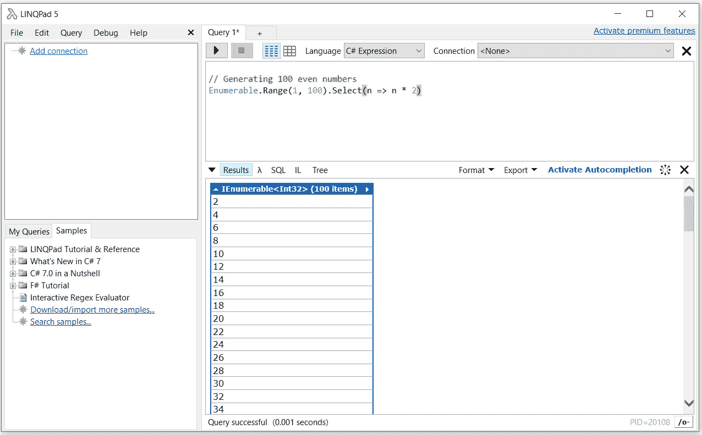

# 8 个必备工具。净发展

> 原文：<https://levelup.gitconnected.com/8-essential-tools-for-net-development-e130f9814ac5>

## 对于任何摇滚明星开发者来说

照片由 [XPS](https://unsplash.com/@xps?utm_source=medium&utm_medium=referral) 在 [Unsplash](https://unsplash.com?utm_source=medium&utm_medium=referral) 上拍摄

在英国工作了一段时间后。NET 平台上的不同项目，在不同的优先级下，我想共享。NET 是我日常使用最多的。

希望这篇文章能对大多数新手有所帮助。net 平台，以及所有那些希望在日常工作流程中使用助手和自动化工具来提高工作效率的人。

[亚历山大·奈特](https://unsplash.com/@agk42?utm_source=medium&utm_medium=referral)在 [Unsplash](https://unsplash.com?utm_source=medium&utm_medium=referral) 上拍照

# 1.首先，Visual Studio

作为一名. NET 开发人员，Visual Studio 是迄今为止我所发现的最完整的 IDE。在我尝试过的所有 ide 中，它是为我提供最高生产力的一个，因为它具有设计良好的特性，如代码完成、代码提示、快速访问对象定义，以及它的调试和分析功能。它还包含一个非常直观的界面，可以与 Git 等不同的源代码控件进行交互，这使得可视化和管理分支变得非常容易。

Microsoft Docs 中的 Visual Studio UI 示例

# 2.邮递员，不是邮政服务

Postman 是一个我已经使用了一段时间的 http 客户端，它基本上为我提供了一个很好的测试环境来测试任何 API 的 http 调用，无论是本地的还是远程的。我不得不说，我倾向于在 Postman 上只使用最基本的东西，比如为每个服务或 API 执行 rest 调用和组织文件夹请求。但是 Postman 提供了更多，包括不同的自动化测试选项、环境变量，甚至命令行界面。所以这绝对是你想花些时间去了解的东西。

Mick Haupt 在 [Unsplash](https://unsplash.com?utm_source=medium&utm_medium=referral) 上拍摄的照片

# 3.VS 代码——轻量级的选择

由 [Avinash Murugappan](https://unsplash.com/@avinash27?utm_source=medium&utm_medium=referral) 在 [Unsplash](https://unsplash.com?utm_source=medium&utm_medium=referral) 拍摄的照片

VS Code(Visual Studio Code)是 Visual Studio 的另一种选择，当我不在. NET 上编写繁重的代码时，我会使用它。NET Core app，或者任何其他平台上的代码(可能是 NodeJS 或者 Python)，VS Code 会是我的首选 IDE。IDE 非常简单明了，为您提供了一个快速编辑器，以及标准 Visual Studio 的大多数优秀功能，如智能感知和自动完成功能、代码重构等。最重要的是，VS 代码填补了 Visual Studio 的空白，不仅可以在 Windows 上运行，还可以在 Mac 和 Linux 上运行。它还有一个非常活跃的开源社区，内置对 JavaScript、Typescript、NodeJS 的支持，以及一个非常丰富的插件生态系统。

# 4.VS 代码休息客户端

通过使用 VS 代码，我也利用了它丰富的扩展，使用了像 VS Code Rest Client 这样的东西。这个扩展基本上允许我快速测试任何 http rest 端点并查看其响应，而无需离开 VS 代码。所以不用再在 IDE 和 Postman 或者 CURL 之间切换了。
Rest 客户端只需要一个包含 Rest 调用的小`.http`文件就可以执行它:

GET 调用的示例:

Rest 客户端上的 GET 请求示例

# 5.git bash:Windows 上的 Linux

Git bash 在任何 windows 机器上模拟 bash 环境。如果您运行的是 windows，并且已经在您的机器上安装了 git for windows，那么它很可能会默认安装在您的机器上。我将它作为我的主要终端接口之一，主要用于 bash 命令和对 CURL 等实用程序的简单访问。

由[凯文·霍尔瓦特](https://unsplash.com/@hidd3n?utm_source=medium&utm_medium=referral)在 [Unsplash](https://unsplash.com?utm_source=medium&utm_medium=referral) 上拍摄的照片

# 6.LINQPad:一个. NET 游乐场

LINQPad 基本上是一个拥有超能力的. NET 游乐场。它允许我快速测试任何 c#、f#或 VB 代码片段。这对于在. NET 环境中快速构思原型非常有用。它还允许我使用 LINQ 语言而不是 SQL 查询 SQL 数据库，并将每个查询或代码片段存储在本地有组织的文件夹中。

LINQPad 上的代码片段示例

# 7.NodeJS:一个 JS 运行时

嗯，是的。即使作为一名. NET 开发人员，NodeJS 也是我使用最多的工具之一。每当需要快速的概念证明或 API 草案时，NodeJS 将是我的*首选*工具。考虑到 NodeJS 和 JavaScript 的灵活性，直接在现场创建它要容易得多。NodeJS 还允许我运行一系列开源工具，这些工具确实加快了我在. NET 上的开发过程。NET 应用程序使用该 API，我可以用一堆原始响应文件和一个运行在 NodeJS 上的 http-server 实例快速设置它。将它与 Visual Studio 代码结合使用是快速原型和想法的完美组合！

[潘卡杰·帕特尔](https://unsplash.com/@pankajpatel?utm_source=medium&utm_medium=referral)在 [Unsplash](https://unsplash.com?utm_source=medium&utm_medium=referral) 上的照片

# 8.Docker:虚拟化就是一切

我已经在本地使用 Docker 和 Docker 容器大约一年左右了(…是的，对聚会来说有点晚了)。让我惊讶的是，我可以轻松地用 docker 容器建立一个本地数据库或整个开发环境，而不需要安装任何额外的应用程序。如今，即使像 MS SQL Server 这样的东西也可以在 docker 容器中顺利运行，在此基础上，Visual Studio 代码有一组很好的扩展，可以与 docker 和 Docker 容器很好地交互，让您可以从 IDE 本身完全控制每个容器和图像。

照片由[阿萨纳西奥斯·帕帕萨恰里亚斯](https://unsplash.com/@thanasis_p?utm_source=medium&utm_medium=referral)在 [Unsplash](https://unsplash.com?utm_source=medium&utm_medium=referral) 上拍摄

# 最后的想法

我相信这里的大多数工具在开发社区的子集中是众所周知的，但是这些年来我很少看到它们在. NET 开发环境中一起使用。不过这种情况正在慢慢改变。NET 开源社区正在成长，并将这些不同的工具带到了桌面上。如果你还没有尝试一起使用它们，我真的鼓励你这样做，也许还可以分享你的想法！

 [## 给新(老)程序员的简单建议

### 一些小习惯可能会增加你成为一名长期程序员的机会

medium.com](https://medium.com/@ygorhsr/simple-advice-for-the-new-and-old-programmers-out-there-e5502ab9ecd3) 

乔治·克罗克在 [Unsplash](https://unsplash.com?utm_source=medium&utm_medium=referral) 上拍摄的照片

# 资源

1.  Visual Studio — [https://visualstudio.microsoft.com/pt-br/vs/community/](https://visualstudio.microsoft.com/pt-br/vs/community/)
2.  Postman — [https://www.postman.com/downloads/](https://www.postman.com/downloads/)
3.  VSCode — [https://code.visualstudio.com/download](https://code.visualstudio.com/download)
4.  VSCode Rest Client — [https://marketplace.visualstudio.com/items?itemName=humao.rest-client](https://marketplace.visualstudio.com/items?itemName=humao.rest-client)
5.  Git bash & Git for windows — [https://gitforwindows.org/](https://gitforwindows.org/)
6.  LINQPad — [https://www.linqpad.net/Download.aspx](https://www.linqpad.net/Download.aspx)
7.  NodeJS — [https://nodejs.org/en/download/](https://nodejs.org/en/download/)
8.  Docker — [https://docs.docker.com/get-docker/](https://docs.docker.com/get-docker/)