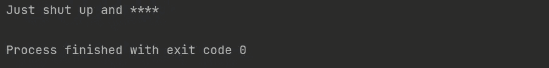
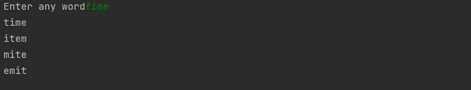
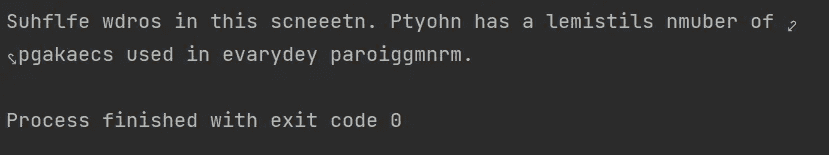
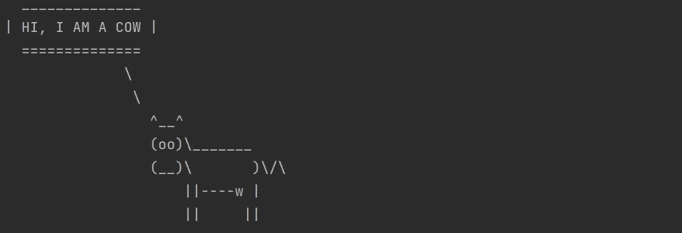
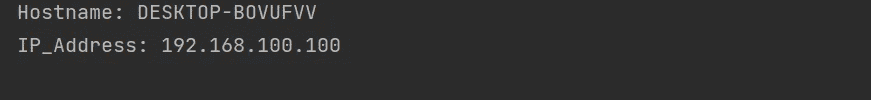

# 8 卓越的 Python 程序

> 原文：<https://levelup.gitconnected.com/8-exceptional-python-program-f3143358e643>

## 有趣的程序尝试用代码解释


照片由[简汀·杜恩博斯](https://unsplash.com/@jantined?utm_source=medium&utm_medium=referral)在 [Unsplash](https://unsplash.com?utm_source=medium&utm_medium=referral) 拍摄

这里列出了你可以尝试的最棒的节目。下面提到的所有代码都帮助我掌握了解决问题的技巧。不言而喻，想学编码和解题，查题头题，自己试着解。

# 1.调整句子中的脏话

***问题:用 Python*** 写一个程序去掉一个句子中的脏话

我们经常会遇到这样的情况，应用程序需要监视 like 评论部分。在你监控一些部分以避免不良词汇的地方，这个包就派上用场了。带有脏话的句子被传递给代码中的亵渎包方法。它返回一个星号(*)来代替脏话。你也可以用这个软件包创建一个自定义的脏话。

```
Installation : pip install better_profanity
```

**输出:**



# 2.随机产生新词

问:写一个 Python 代码，把单词打乱，创造新单词。

为了完成这个任务，我们需要将单词打乱，然后与字典进行比较。如果这个单词存在于字典中，那么我们可以在控制台上打印这个单词。我们使用一个流行的软件包 nltk(自然语言工具包)来比较准确的单词..

**输出**:



# ***3。点击*** 创建 1000 个文件夹

***问题:用 python 程序创建 1000 个文件夹。***

这段代码用 Python 在你的计算机上创建了一千个文件夹。当你执行这个程序时，一个有趣的程序可以创建 1000 个文件夹。这段代码像魔法一样工作，可以很容易地用来对朋友恶作剧。该代码在 Python 文件的源代码中创建文件夹。

# ***4。*打乱句子中的单词顺序**

***问题:写一个 Python 代码把每个单词洗牌，串联成段落。***

这段代码将一个句子作为输入，并输出一个混乱的文本。记住打乱每个单词中的字母顺序，然后把所有的单词连接起来。当附加混排的术语时，产生混排的文本输出。有时，即使字母在单词中被打乱，我们仍然可以阅读，这令人着迷。

## 输出:



# 5.在控制台上画一个图形

***问题:使用*** `***cowsay***` ***包用 Python 程序*** 在控制台上写一个动物图形

```
Installation: pip install cowsay
```

著名的`cowsay`API/控制台脚本现在可用于 Python。这个包`cowsay.char_names` 中还有许多其他角色，比如奶酪、精灵、奶牛、龙等等

## 输出:



# 6.用 Python 打开记事本

***问题:写一个 Python 程序打开你电脑上的记事本***

子流程包由几个有价值的管理资源的模块组成。该软件包包含许多模块，通过创建新的进程来运行程序应用程序。查看此[链接](https://docs.python.org/3/library/subprocess.html)，全面了解子流程。

# 7.找出你电脑的 IP 地址

***问题:写一个 Python 程序找出你 PC 的 IP 地址***

这个程序可以使用`socket` Python 内置包轻松完成。使用套接字包可用的方法找出 IP 地址。使用套接字包，我们在代码中找到一个域名和 IP 地址。

## 输出:



# 8.使用 Python 关闭您的电脑:

***问题:写一个 Python 程序让你的电脑关机***

我们可以使用 Python 使用`os`包来关闭你的计算机。记得在执行这个程序之前关闭并保存你的文件。

**这里有一个订阅链接，可以用 Medium 阅读成千上万篇文章。请考虑订阅，支持众多作家:**

[](https://swathiarun63.medium.com/membership) [## 通过我的推荐链接加入媒体

### 作为一个媒体会员，你的会员费的一部分会给你阅读的作家，你可以完全接触到每一个故事…

swathiarun63.medium.com](https://swathiarun63.medium.com/membership)