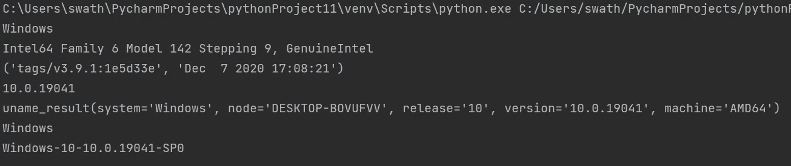
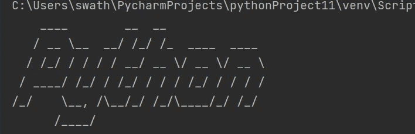

# 8 个精彩的 Python 程序包

> 原文：<https://levelup.gitconnected.com/8-fantastic-python-programs-with-package-dbc79431e48>

## 所有的程序都用代码详细解释

照片由[埃米尔·佩龙](https://unsplash.com/@emilep?utm_source=medium&utm_medium=referral)在 [Unsplash](https://unsplash.com?utm_source=medium&utm_medium=referral) 拍摄

Python 有大量的资源，比如包、库和内置方法。使用现成的代码将有助于您改进编码。在本文中，使用 Python 包展示了八个程序。

# 1.电话号码位置跟踪器:

> **使用手机号码查找位置的 python 程序。**

Phone-numbers 是用于查找电话号码位置和服务提供商的包。您需要使用`pip install phonenumbers`语法在终端上安装这个包。该包接受输入的数字，解析它，并验证它。该软件包的一些基本功能是查找电话号码发行人的国家名称和电话号码和时区的服务提供商。

## 输出:

**注意:**对于给定的数字，输出是精确的。在代码中，最吸引人的特性、电话号码位置、服务提供商和时区都是通过包中的方法来访问的。

# 2.播放音乐:

> **写一个 Python 程序播放一个音频文件。**

要播放音频文件，我们使用 play-sound 包，并在终端上安装这个包，`pip install playsound` 语法。这个独一无二的只包含一个播放音乐文件的功能。该函数有两个参数`playsound(filelocation,asynchronous).`,第一个参数指定文件的位置、本地文件或 URL。尽管第二个参数在默认情况下是可选的，但它是正确的。

**注意:**一个相当简单的两行代码来播放音频。这个包支持 WAVE 和 MP3 文件格式。

# 3.系统信息:

> **创建一个 Python 程序来打印系统信息。**

需要在代码中导入内置的模块平台；您可以使用平台方法访问大量机器信息。查看代码和显示系统信息的输出。

## 输出:

# 4.互联网下载速度:

> **写一个 Python 程序求互联网下载速度。**

我们在代码中使用了一个速度测试包来检查互联网下载速度。要安装速度测试包，使用`pip install speedtest-cli`语法。在这个包中有两种方法可用，下载和上传速度检查。在程序中，我们使用了下载的方法。你可以尝试上传的方法来检查上传速度。

**输出:**

# 5.字体设计:

> **写一个 Python 程序，在终端上用创意字体打印。**

要在终端上用不同的字体打印，我们可以用 Pyfiglet 包。要安装软件包，请使用`pip install pyfiglet`语法。

## 输出:

# 6.热门电影列表:

> **写一个 Python 程序，提取热门电影列表，打印列表中的前五部电影。**

IMDb 是寻找顶级电影和相关信息的最佳来源。要安装用过的包，`pip install imdbpy`语法。有许多方法可以使用这个软件包访问 IMDb 网站上的各种信息。我们访问代码中的前 250 部电影列表，并使用 for 循环打印前五部电影。

**输出:**

# **7。谷歌新闻:**

> **一个 python 程序，为特定主题打印 Google 新闻上的热门话题。**

使用`pip install GoogleNews`语法，可以在终端上安装一个访问谷歌新闻的神奇包。这个包有助于访问谷歌新闻上的不同信息。我们在代码中使用了两个印刷标题及其出版日期。尝试打印网站上对标题的描述。

# 8.嘟嘟声:

> **写个 python 程序发出嘟嘟声。**

内置模块用于在代码中发出嘟嘟声。该代码导入 win-sound 模块并使用 beep 方法，该方法包含频率和持续时间。

这里有一个订阅链接，可以用 Medium 阅读数千篇文章。请考虑订阅并支持许多作者:

 [## 通过我的推荐链接加入媒体

### 作为一个媒体会员，你的会员费的一部分会给你阅读的作家，你可以完全接触到每一个故事…

swathiarun63.medium.com](https://swathiarun63.medium.com/membership)