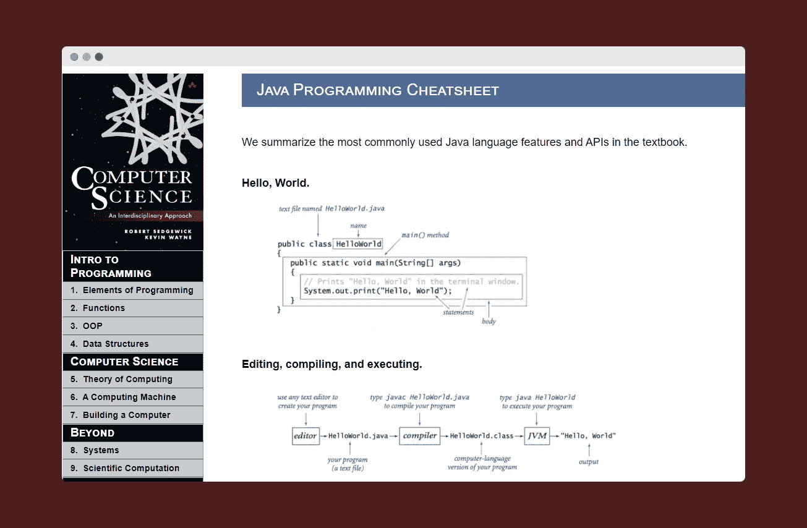

# 每个开发者都应该收藏的 8 个免费备忘单

> 原文：<https://levelup.gitconnected.com/8-free-cheat-sheets-that-every-developer-should-bookmark-1c5c1bf0c75a>

## 这些网站非常有助于快速参考，特别是如果你试图保留考试信息，甚至准备面试。

[Unsplash](https://unsplash.com/s/photos/developer?utm_source=unsplash&utm_medium=referral&utm_content=creditCopyText) 上 [AltumCode](https://unsplash.com/@altumcode?utm_source=unsplash&utm_medium=referral&utm_content=creditCopyText) 拍摄的照片

当我 2011 年在大学开始编写代码时，我经常阅读编程书籍，这需要花费大量时间来掌握概念。阅读一本书，然后通过编程来应用这些经验教训肯定是一项艰巨的任务。

每当我在一本书、一段视频、甚至一篇文章中看到有用的东西时，我都会准备笔记，以便快速参考，这种做法一直持续到今天。只是记笔记的模式已经发生了变化——从在笔记本上记笔记到输入想法。

然而，随着技术的快速发展以及新的编程语言、框架、系统设计原则等的出现。，由世界各地成千上万的开发人员创建，很难跟踪每一件事。如果不经常参考，我甚至会忘记几个月前学过的东西。

值得庆幸的是，我们现在有了备忘单，可以用书签快速查阅。现在有太多的选择，我在这篇文章中挑选了一些。

# cssreference.io

【参考链接:[**https://cssreference.io/**](https://cssreference.io/)

CSS 参考是免费提供的最好的 CSS 参考之一。它以最受欢迎的属性为特色，并用插图和动画示例来解释它们，这绝对很酷，有助于您更好地理解这些属性。

# Java 编程备忘单

*参考链接:*[https://introcs.cs.princeton.edu/java/11cheatsheet/](https://introcs.cs.princeton.edu/java/11cheatsheet/)

毫无疑问，Java 是企业应用程序开发中最流行的编程语言之一。它也是目前发展最快的语言之一。甲骨文发布了两个更新:*一个长期版本*和一个 *n 创新版本。*因此，很难在单个备忘单中跟踪每个变更/更新。然而，普林斯顿大学的这份 cheatsheet 对于快速参考 Java 基础知识是一个很好的参考。

# HTML 备忘单

*参考链接:*[**【https://websitesetup.org/html5-cheat-sheet/】**](https://websitesetup.org/html5-cheat-sheet/)

互联网上有数百个关于 HTML 的备忘单和参考资料。然而，我发现这个网站非常有用，因为它解释了每个标签和代码的本质。我敢肯定你可能有不同的小抄，但这是我的书签。

# Python 备忘单

*参考链接:*

**Python 是最流行的编程语言之一，我非常喜欢学习和使用它。这个网站是我遇到的第一个 Python 参考资料，它一直伴随着我直到今天。事实上，它列出了初学 Python 的开发人员应该知道的一切，这使得这个书签很有价值。**

# **JS 备忘单**

****

***参考链接:*[https://htmlcheatsheet.com/js/](https://htmlcheatsheet.com/js/)**

**JS CheatSheet 是我见过的最简单也是最详细的 JavaScript cheat sheet 之一。每个片段都有一个例子解释，这是我最喜欢的一个，虽然 JS 也有几个很好的参考。**

# **React.js 备忘单**

****

***参考链接:*[【https://devhints.io/react】T21](https://devhints.io/react)**

**React 是用于构建 web 开发应用程序的最流行的 JavaScript 库，这个网站是最简单但最详细的备忘单，可以收藏和参考。**

# **OverAPI**

****

***参考链接:*[**https://overapi.com/**](https://overapi.com/)**

**这是我见过的最好的参考网站之一，因为它有我们广泛用于开发应用程序的大多数编程语言的备忘单。我经常向我的许多同事推荐这一点。**

# **全息照相术**

****

***参考链接:*[**https://cheatography.com/**](https://cheatography.com/)**

**Cheatography 是超过 4000 个小抄的家，它拥有编程、游戏和爱好、商业和营销以及许多其他方面的一切。该网站还提供下载 PDF 格式的备忘单的选项。**

**如果你喜欢读这篇文章，你可能也会发现下面的文章值得你花时间去读。**

** [## 每个开发者都应该收藏的 9 个不可思议的网站

### 这些网站不仅会帮助你的软件开发之旅，还会帮助你的内容…

levelup.gitconnected.com](/9-incredible-websites-that-every-developer-should-bookmark-1534d52f3f7d)  [## 如何一次取消订阅所有 YouTube 频道

### 逐步摆脱你订阅的所有 YouTube 频道的指南。

levelup.gitconnected.com](/how-to-unsubscribe-from-all-youtube-channels-at-once-d516b3669325) 

如果你喜欢阅读有助于你更好地学习、生活和工作的故事，可以考虑 [*成为*](https://viveknaskar.medium.com/subscribe) *的订阅者。成为会员后，你可以无限制地阅读 10000 篇故事、文章和作家。每月只要 5 美元。* [*如果你使用我的链接*](https://viveknaskar.medium.com/membership) *注册，我将获得一点佣金，帮助我写更多的文章。*

# 分级编码

感谢您成为我们社区的一员！升级正在改变技术招聘。 [**在最好的公司找到你的完美工作**](https://jobs.levelup.dev/talent/welcome?referral=true)**。**

** [## 升级—转变技术招聘

### 升级—转变技术招聘🔥使软件工程师能够找到完美的角色…

作业. levelup.dev](https://jobs.levelup.dev/talent/welcome?referral=true)****