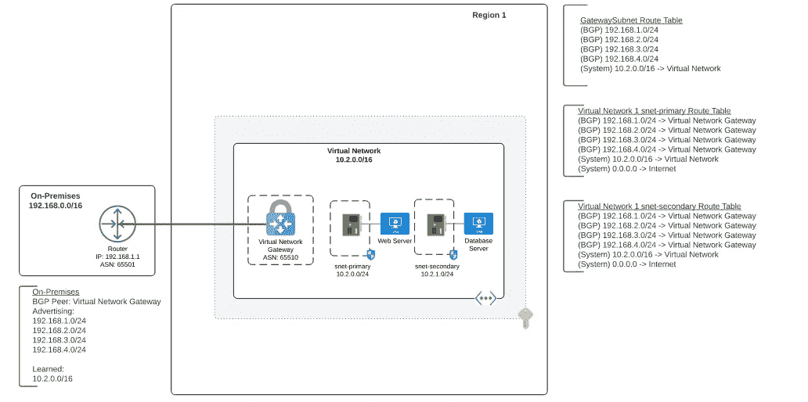
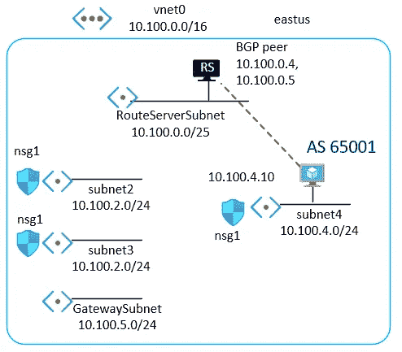

# 8 GitHub Repos Azure 云工程师应该看看

> 原文：<https://levelup.gitconnected.com/8-github-repos-azure-cloud-engineers-should-check-out-ee94f8f169ed>

照片由[马太·亨利](https://burst.shopify.com/@matthew_henry?utm_campaign=photo_credit&utm_content=Browse+Free+HD+Images+of+Woman+Hands+Tech+Developer+Laptop&utm_medium=referral&utm_source=credit)发自[突发](https://burst.shopify.com/presentation?utm_campaign=photo_credit&utm_content=Browse+Free+HD+Images+of+Woman+Hands+Tech+Developer+Laptop&utm_medium=referral&utm_source=credit)

对于程序员来说，GitHub 无疑是一个巨大的宝库。爱分享的人在这里分享知识，来自 Azure 社区的工程师也在 GitHub 上分享牛逼的内容。本文将介绍我探索过的 8 个 Azure 相关的 GitHub 库，涵盖 Azure、Azure 联网、Azure 策略、DevOps 等方面的解决方案。我很高兴在这篇文章中与你分享它们！我们开始吧！

# 排名第一的令人敬畏的 Azure 架构

**GitHub 明星⭐** : 103

一系列精彩的博客、视频、教程、代码、工具和脚本，与微软 Azure 中的**设计和实施解决方案**相关。

此列表包含任何可以帮助您的 Microsoft Azure 架构，并在设计、规划和实施服务时快速启动和运行的内容，这些服务使全球各地的组织能够实现更多目标。

 [## GitHub-lukemurraynz/AWESOME-Azure-建筑:AWESOME-Azure-建筑

### 一系列精彩的博客、视频、教程、代码、工具和脚本，与设计和实现相关…

github.com](https://github.com/lukemurraynz/awesome-azure-architecture) 

# 第二名 Azure AlwaysOn

**GitHub 明星⭐** : 202

**AlwaysOn** 是一个开源项目，它提供了一种规范的架构方法，用于在 Microsoft Azure 上为任务关键型工作负载构建高度可靠的云原生应用。

更具体地说，这个存储库包含理解和实现微软 Azure 上的“ **always on** ”应用程序所需的一切。

 [## GitHub-Azure/关键任务:AlwaysOn 提供了一种设计方法和途径来构建…

### AlwaysOn 是一个开源项目，它提供了一种规范的架构方法来构建高度可靠的…

github.com](https://github.com/Azure/Mission-Critical) 

# # 3 令人敬畏的蓝色政策

**GitHub 明星⭐** : 216

一个精心策划的令人敬畏的博客、视频、教程、代码、工具、脚本列表…任何可以帮助你学习 **Azure Policy** 并快速开始设计、规划和实现对你的资源的治理控制的东西。

 [## GitHub-global Bao/awesome-azure-policy:博客、视频、教程、代码、工具的精选列表…

### 博客、视频、教程、代码、工具、脚本和任何有助于你学习 Azure 策略的东西的精选列表…

github.com](https://github.com/globalbao/awesome-azure-policy) 

# # 4 DevOps-The-Hard-Way-Azure

**GitHub 明星⭐** : 271

这个资源库包含免费的实验室，用于在 Azure 中从真实世界的角度设置整个工作流和 **DevOps** 环境。

 [## GitHub-thomast 1906/devo PS-The-Hard-Way-Azure:这个资源库包含免费的实验，用于设置…

### 该存储库包含免费的实验，用于从现实世界中设置整个工作流和 DevOps 环境…

github.com](https://github.com/thomast1906/DevOps-The-Hard-Way-Azure) 

# # 5 Azure 网络之旅

**GitHub 明星⭐** : 12

Azure Network Journey 存储库包含一组从基础到高级的核心网络模式。

目标是帮助客户选择适合其阶段的正确模式。每个模式都包括总结、优点和注意事项，以及提供模式示例和路由表外观的图表。

 [## GitHub-mattfeltonma/azure-network-journey:这个存储库包含一组核心的…

### 这个存储库包含从基础到高级的核心网络模式的集合。目标是…

github.com](https://github.com/mattfeltonma/azure-network-journey) 

# # 6 az 型

GitHub 明星⭐ : 23

Fabrizio Ferri 创建的 Azure **ARM 模板**和**脚本**的集合。

 [## GitHub-fab ferri/az-pattern:Azure ARM 模板和脚本

### Azure ARM 模板和脚本。在 GitHub 上创建一个帐户，为 fabferri/az-pattern 开发做出贡献。

github.com](https://github.com/fabferri/az-pattern) 

# # 7 令人敬畏的蓝色二头肌💪

GitHub 明星⭐ : 34

一个精心策划的列表，包括令人敬畏的博客、视频、提示和技巧、代码、工具、脚本…精选的提示和技巧，帮助您学习 **Azure Bicep** ，并让您准备好开始将 Azure 资源部署到您喜欢的环境。

 [## GitHub-elyu subov/AWESOME-Azure-Bicep:博客、视频、教程、代码、工具的精选列表…

### 博客、视频、教程、代码、工具、脚本和任何有助于你学习 Azure Bicep 的东西的精选列表…

github.com](https://github.com/ElYusubov/AWESOME-Azure-Bicep) 

# # 8 天蓝色设计

**GitHub 明星⭐** : 780

David-Summers 为 Visio 创建的 Azure 模板集合。功能强大，始终保持最新。

 [## GitHub-David-Summers/Azure-Design:我的 Visio Azure 模具集。高功能和…

### Visio 至今仍是从概念和设计两方面描述 IT 基础架构的行业标准…

github.com](https://github.com/David-Summers/Azure-Design) 

感谢阅读，希望对您有所帮助！

在聊天

 [## 陈家东-高级软件开发人员-X 公司| LinkedIn

### 陈家东是国际上公认的 3000 名微软最有价值职业(MVP)获奖者之一

www.linkedin.com](https://www.linkedin.com/in/chenjd/)