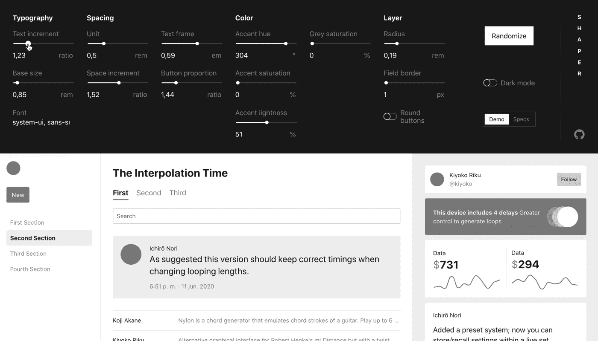
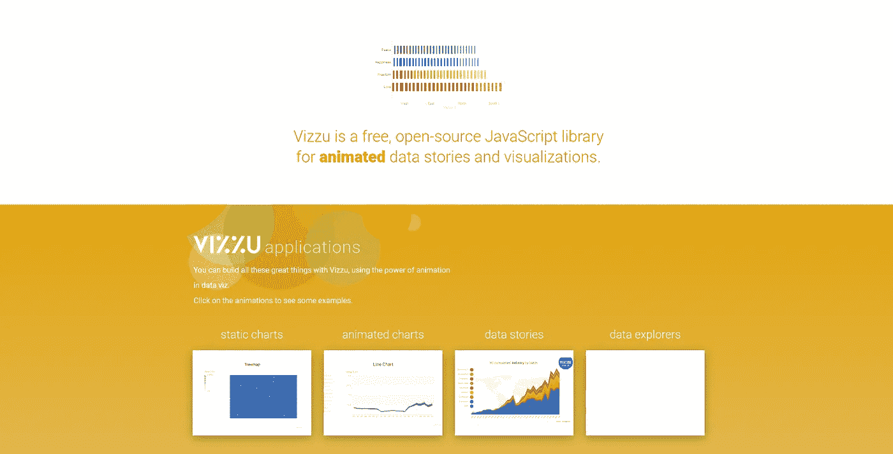
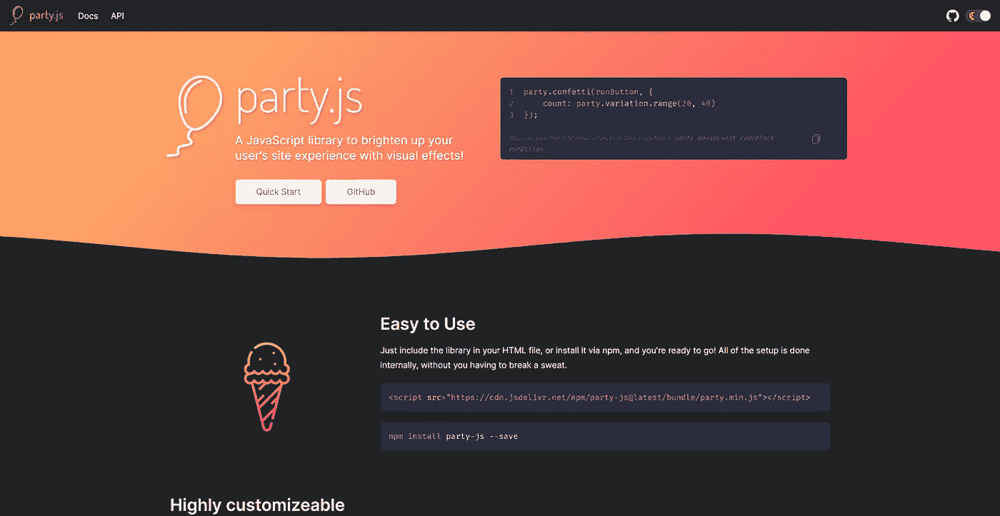
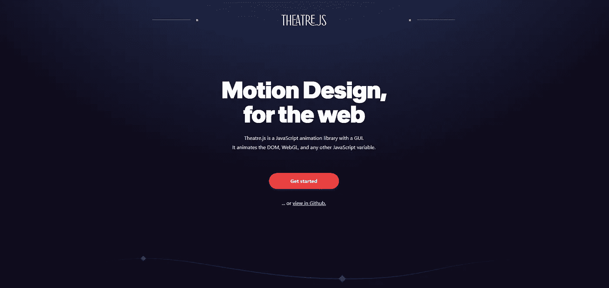
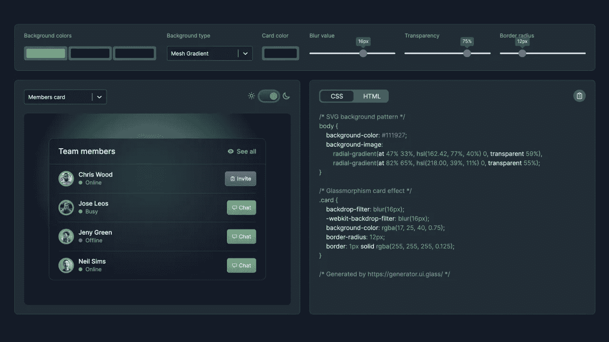
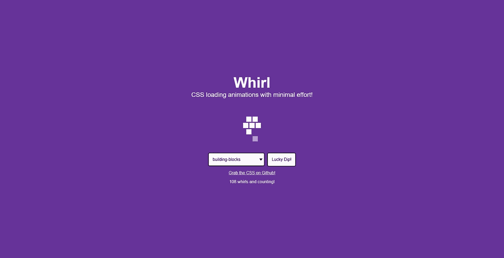
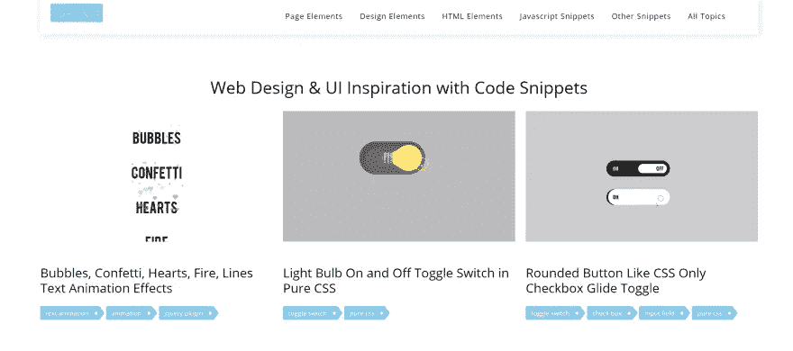

# 前端开发人员的 8 个有用工具🦄

> 原文：<https://levelup.gitconnected.com/8-helpful-tools-for-frontend-developers-2f2589e1a7e2>

前端开发人员的 8 个工具

有各种不同用途的前端开发工具。这里有一个 **8 大前端工具**的列表，你可能会发现对你的下一个项目有用。

那么，我们就不多说了，开始吧！

**1。** [**AnimXYZ**](https://animxyz.com/)

AnimXYZ 帮助您为您的网站创建、定制和创作动画。由 CSS 变量驱动，允许几乎无限数量的独特动画，而无需编写一个关键帧。节省时间并完全控制元素的移动方式。AnimXYZ 专为 Vue、React、SCSS 和 CSS 而构建，将使您的网站栩栩如生！

**2。** [**牛头刨床**](https://hihayk.github.io/shaper/)

这是一个**必须尝试的！！**

这个交互式工具将让你在页面上玩各种各样的用户界面。！！

**3。** [**维祖**](https://vizzuhq.com/)

是时候玩数据故事了！Vizzu 是一个免费的开源 JavaScript 库
，用于动画数据故事和可视化。你可以用 vizzu 做一些疯狂的事情，利用数据动画的力量。

**4。** [**方 JS**](https://party.js.org/)

基本上，这个 JS 库将帮助你用惊人的视觉效果照亮 UX 部分！

**5。** [**剧场 JS**](https://www.theatrejs.com/)

Theatre JS 是一个高保真运动图形的动画库。它旨在帮助您表达详细的动画。它基本上是一个可视化编辑器，你可以在其中制作 DOM 元素的动画🤯

**6。** [**玻璃 UI**](https://ui.glass/generator/)

开始使用这个基于 glassmorphism 设计规范的免费 CSS 生成器来快速设计和定制样式属性。

**7。** [**回旋**](https://whirl.netlify.app/)

这是一个**必须尝试的！**

Whirl 将帮助您轻松创建病态的 CSS 加载动画！用最小的努力加载动画！弧形，基本，反弹，追逐，颜色范围，色轮，不同方向，点，点褪色和更多的史诗动画。

**8。** [**Codemyui**](https://codemyui.com/)

这是一个非常酷的网站，有很多很酷的 CSS、HTML 和 Javascript 代码片段。所有的部分都根据不同的 UI 设计进行了划分，并且包含了所有类型的 web 元素和代码片段。

**结论**

感谢阅读，如果你喜欢这篇文章，请分享🤞💜

查看我的[Twitter](https://twitter.com/souptikdn)&[LinkedIn](https://www.linkedin.com/in/souptikdn/)更多精彩内容。

立即创建您的 [Fueler](https://fueler.io/register) 个人资料！

> 免费 [600+免费设计资源](https://www.learnn.cc/design) ⚡

# 分级编码

感谢您成为我们社区的一员！更多内容见[升级编码出版物](https://levelup.gitconnected.com/)。
跟随:[推特](https://twitter.com/gitconnected)，[领英](https://www.linkedin.com/company/gitconnected)，[通迅](https://newsletter.levelup.dev/)
**升一级正在转型理工大招聘➡️** [**加入我们的人才集体**](https://jobs.levelup.dev/talent/welcome?referral=true)