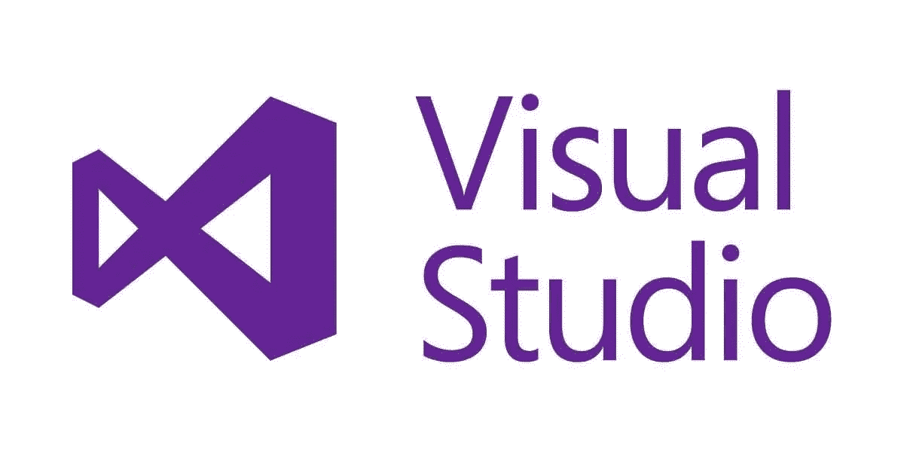
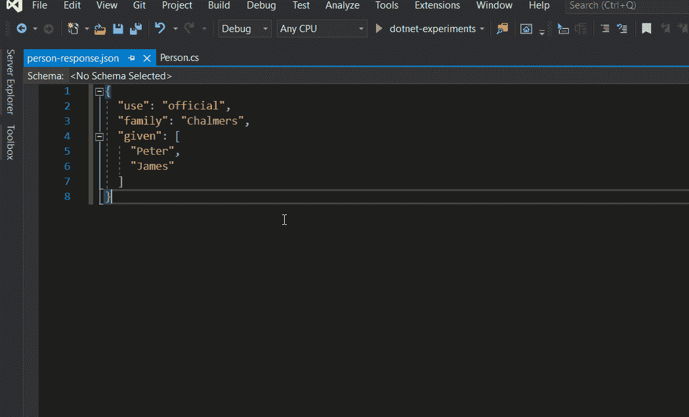
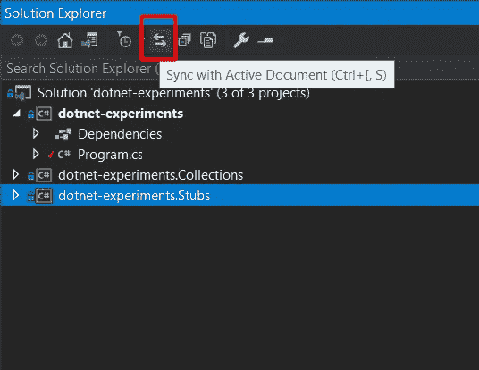
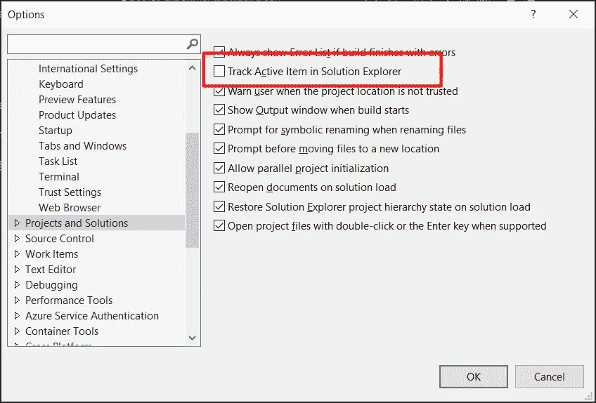
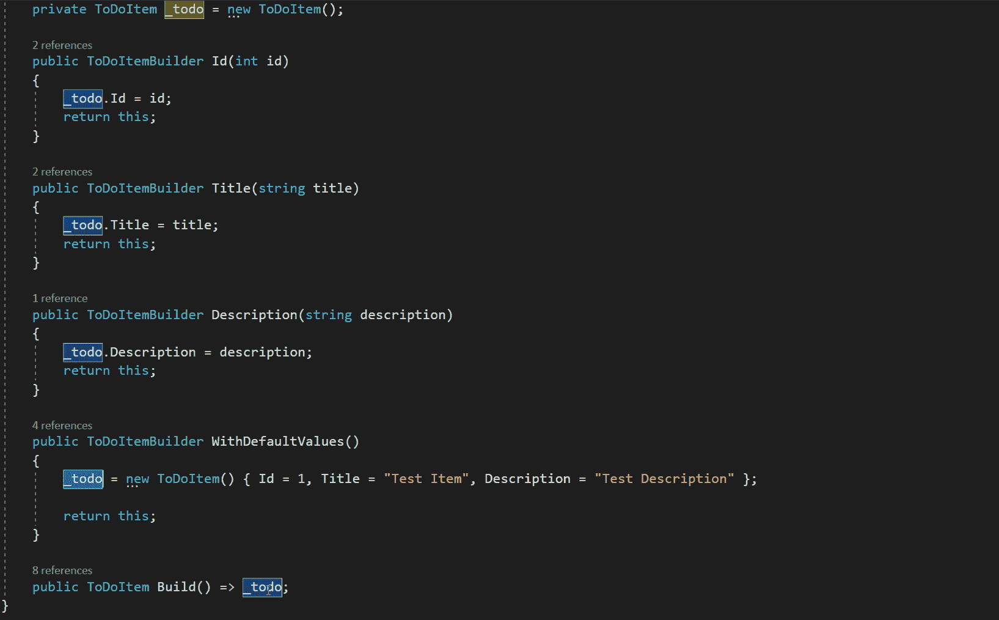
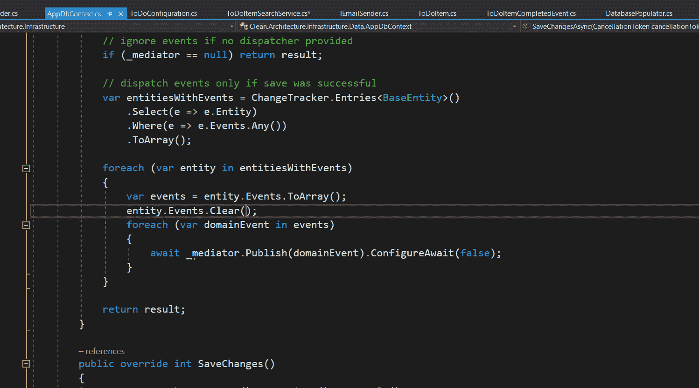
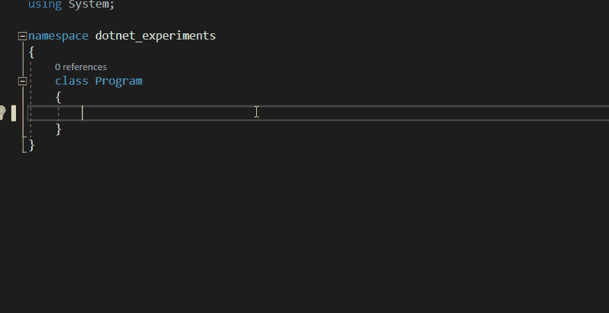
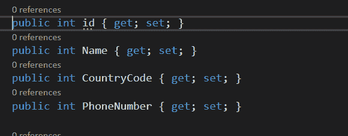
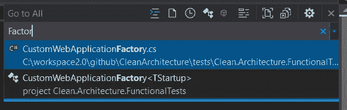
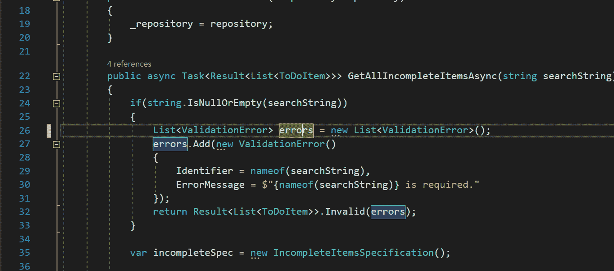

# 8 个隐藏的 Visual Studio 功能

> 原文：<https://levelup.gitconnected.com/8-hidden-visual-studio-features-26723606631b>

## 掌握 Visual Studio 快捷方式和隐藏功能

Visual Studio — [微软](https://visualstudio.microsoft.com/)

编码时享受乐趣的一半——就像你是《黑客帝国》中的 Neo 一样浏览它——是对你最喜欢的编程语言有一个清晰的理解。另一半是关于掌握你最喜欢的编码环境。🚀

因此，为了提高每个人的体验和生产力——包括开发人员——我将在这里分享一些隐藏的、经常被遗忘的我最常用的 Visual Studio 特性。

希望了解这些特性将有助于节省许多小时的痛苦劳动，这样我们就可以更好地利用时间来制作更酷的东西！

新矩阵电影场景

# 1.使用粘贴为 JSON 特性生成类

基于来自 API 的 JSON 响应编写类是大多数开发人员的日常任务。

如果响应样本包含太多属性，那么这是一项乏味而无聊的任务，至少有一件事很有可能出错。

让 Visual Studio 来做繁重的工作并从 JSON 响应生成类怎么样？为此，复制响应并进入菜单**编辑>选择性粘贴>将 JSON 作为类粘贴**选项。

将 JSON 粘贴为类— Gif

# 2.跟踪解决方案中的活动文档

当我们在不同的项目中打开多个文件和/或从一个方法实现跳到另一个方法实现时，我们经常会迷路。

为此，Visual Studio 可以通过单击解决方案资源管理器顶部栏中的**与活动文档同步**选项，自动将解决方案与活动文档同步:

解决方案资源管理器屏幕截图

我们还可以将该特性启用为 Visual Studio 的默认行为，方法是转到**工具>选项，**选择左侧**、**的**项目和解决方案**，然后在解决方案资源管理器中标记选项**跟踪活动项:**

项目和解决方案选项

# 3.在引用之间跳转

通过点击`**ctrl**`+`**shift**`**+**`**Up/Down**`，在变量、方法定义、类型或其他任何东西之间快速跳转:****

********

****在引用之间跳转****

# ****4.打开任何可用的 MSDN 文档。网络类型或方法****

****不知道如何使用框架方法？点击`**f1**`在任何上打开可用的 MSDN 文档。NET 方法、对象或属性。****

********

****MSDN 文档页面—微软****

# ****5.在你的剪贴板上有多个东西****

****用`**ctrl**` + `**c**`复制多个项目，点击`**ctrl**` + `**shift**` + `**v**`。将显示一个小弹出窗口，其中包含所有要粘贴的可用项目:****

********

****Visual Studio 剪贴板循环—动画 Gif****

# ****6.Shift + Alt +箭头键用于垂直选择****

****我最喜欢的一个:垂直选择多行，通过点击`**shift**` + `**alt**` + `**Arrow Keys**`来改变它们:****

********

****垂直选择—动态 Gif****

# ****7.使用“转到所有”弹出菜单快速查找内容****

****键入`**ctrl**` + `**,**`或`**ctrl**` + `**t**`打开 **Go To** search 弹出窗口，并键入您要查找的方法、类名或文件。****

********

****转到所有弹出窗口****

# ****8.显示重构建议****

****`**ctrl**` + `**.**`将打开一个包含重构建议和/或缺失导入的弹出窗口:****

********

****重构建议弹出窗口****

**** [## 8 个必备工具。净发展

### 对于任何摇滚明星开发者来说

levelup.gitconnected.com](/8-essential-tools-for-net-development-e130f9814ac5)**** 

# ****其他有用的快捷方式****

*   ****`**ctrl**` + `**enter**`:在当前行之上新建一行****
*   ****`**ctrl**` + `**c**`(未选择单词时):复制整行****
*   ****`**shift**` + `**del**`:剪切当前行****
*   ****`**ctrl**` + `**k**` + `**c**`:注释当前或选中的行****
*   ****`**ctrl**` + `**k**` + `**u**`:取消当前或所选行的注释****
*   ****`**ctrl**` + `**m**` + `**o**`:折叠定义****
*   ****`**ctrl**` + `**r**` + `**g**`:移除并排序 usings****
*   ****`**ctrl**` + `**g**`:转到行号****
*   ****`**ctrl**` + `**d**`:当前行重复****
*   ****`**ctrl**` + `**w**`:选择光标下的字****
*   ****`**ctrl**` + `**f10**` :运行应用到光标处并中断****
*   ****`**ctrl**` + `**-**`(另一个喜欢的):回到光标最后的位置****