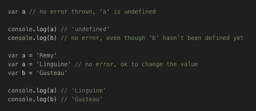
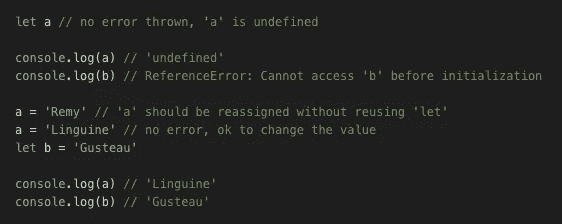
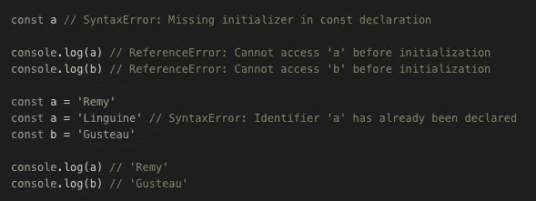
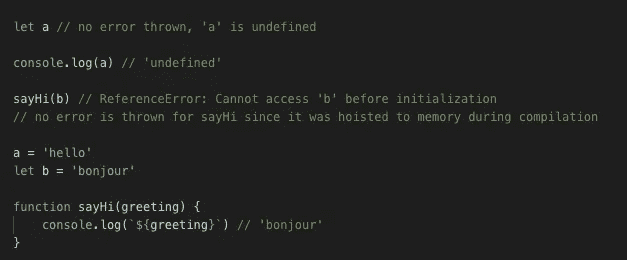
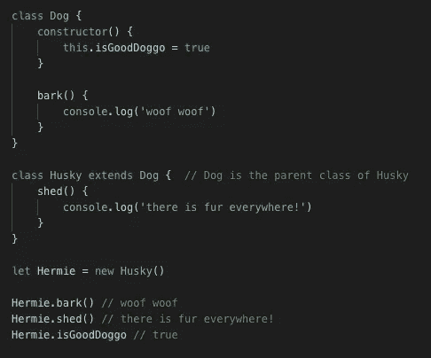
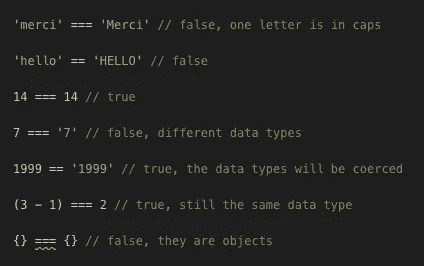
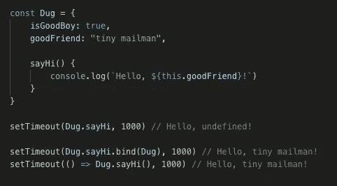
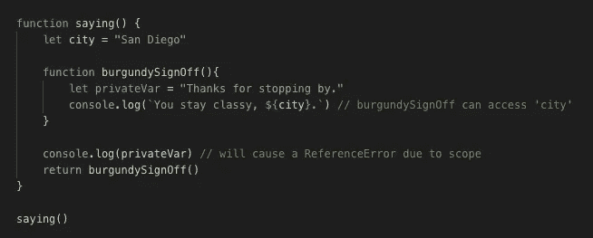
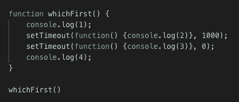

# 科技面试需要学习的 8 个 JavaScript 概念

> 原文：<https://levelup.gitconnected.com/8-javascript-concepts-to-learn-for-tech-interviews-57623edd2b65>

## 学习时参考的备忘单

照片由[凯尔·汉森](https://unsplash.com/@kyledarrenhanson?utm_source=unsplash&utm_medium=referral&utm_content=creditCopyText)在 [Unsplash](https://unsplash.com/s/photos/laptop-dog?utm_source=unsplash&utm_medium=referral&utm_content=creditCopyText) 上拍摄

准备技术面试可能会有压力，尤其是对新开发人员来说(在疫情期间也不例外！).幸运的是，似乎有一些重复的关键概念问题可以研究并记忆，就像我们小时候在学校里用索引卡做的那样。首先，这里有 8 个 JavaScript 技术面试的常见问题，你可以从今天开始学习和练习。

# **`**var**`**`**const**`**`**let**`**有什么区别？********

****`Var`、`const`和`let`是 JavaScript 中的保留字，允许您声明和命名变量。在 ES6 之前，`var`是唯一可以做到这一点的选项，2015 年推出了`const`和`let`。****

****`Var`允许您在任何范围(全局、函数或块)内声明变量，用“未定义”值进行提升(下面将详细解释)和初始化，允许在代码中的任何点访问该变量而不抛出错误。出于这个原因，你也可以声明一个没有任何值的变量，这也是可以的。使用`var`，您还可以重新分配或重新声明该变量的值。****

********

****var 示例****

****`Let`与`var`非常相似，在某种意义上，它也允许您在任何时候重新赋值或重新声明值，并且您可以命名一个没有值的变量。与`var`不同，在`let`中，变量仅在执行时被评估，所以如果变量在被写入代码之前被引用，我们将得到一个错误。你也不能使用`let`来声明一个全局变量。****

********

****带 let 的示例****

****使用`const`，一个变量必须总是用一个值初始化，并且这个值永远不能改变或重新声明。如果您尝试这样做，将会立即抛出一个错误。`Const`可以用来声明任何范围(包括全局)的变量，类似于`var`。****

********

****常数示例****

# ******什么是吊装？******

****提升发生在 JavaScript 的编译阶段。首先，从上到下读取代码，任何全局变量和函数名都被“吊”到内存中。编译后，在执行阶段，如果一个变量或函数在代码中实际写入的地方被引用，引用错误不会被抛出，因为它已经存在于内存中。****

********

****提升****

# ******函数式编程和面向对象编程有什么区别？******

****函数式编程完全由纯函数组成。对于相同的输入，纯函数每次都会给出相同的输出。例如，将 2 + 2 相加的求和函数将始终返回 4。****

****面向对象编程以对象以及它们之间的关系为中心。对象封装了数据和行为(以函数或方法的形式)，通常是参照现实世界中的对象构建的。对象也可以从父对象继承额外的数据和函数。****

# ******经典遗传与原型遗传******

****经典继承描述了一个类的实例如何继承该类和任何其他父类的功能和属性。例如，如果您有一个 Dog 类和一个扩展 Dog 类的 Husky 类，则所有创建的 Husky 实例都可以具有这两个类的功能和属性。****

********

****原型继承是指对象继承可用于该原始或父对象的所有实例的方法。例如，所有新数组都有可用的`Array.prototype`方法，比如`Array.reduce`、`[Array.sort](https://medium.com/swlh/array-sort-explained-c67baca29ff1)`或`Array.filter`。****

# ******`**==**`**和** `**===**` **有什么区别？********

****当您试图使用`===`比较两个不同的值时，您会问这两个值在值和数据类型上是否*完全*相同。数据类型匹配吗？如果有字母，它们是大写还是小写？有没有多余的字符或者空格？请注意，如果您试图比较看起来相同的对象，这仍然会返回 false，因为对象是单独保存在内存中的，因此它们实际上不可能相同。****

********

****如果您试图使用`==`来比较两个值，由于数据类型没有计算在内，所以验证会被更宽松地判断。两端的对象值也可能被强制匹配(例如，将一个字符串转换为一个数字)，这可能会产生意外的结果。****

# ******什么是函数绑定？******

****当使用常规函数(换句话说，不是箭头函数)时，`this`上下文属于调用它的对象。有时，如果函数期望不同的`this`上下文，这可能会导致问题。在下面的例子中，setTimeout 使`this`引用了`Window`，它没有属性`goodFriend`。****

****为了解决这个问题，你可以使用`.bind`将一个对象绑定到一个函数，或者使用 ES6 中引入的箭头函数。****

********

****功能连接****

# ******什么是封闭？******

****闭包是 JavaScript 中与作用域相关的一个特性。嵌套函数可以访问外部函数的变量和范围，但反过来不行。****

********

****这个特性有助于将变量安全地保存在它们应该在的地方，并且不被其他可能导致错误的对象访问。****

# ****【setTimeout 如何工作 console.log 将首先记录哪些数据？****

****以下函数的输出是什么？****

********

****答案应该是:`1, 4, 3, 2`。这是因为当一个函数遇到`setTimeout`(这是一个 web API)时，它会将回调函数放在一边，稍后启动以毫秒为单位的计时器(例如 1000)，同时它继续执行其余的功能。一旦`1`和`4`被控制台记录(因为它们没有执行障碍)，具有最短延迟(`3`)的`setTimeout`回调将被从任务队列推送到调用堆栈，随后是最后一个(`2`)。[这个视频](https://www.youtube.com/watch?v=8aGhZQkoFbQ)更深入地阐述了这个概念，并做了大量的进一步解释。****

****这绝不是可能的 JavaScript 面试问题的详尽列表，但希望这将为您的学习提供一个很好的参考起点。****

****祝你好运，你成功了！👍****

# ****分级编码****

****感谢您成为我们社区的一员！ [**订阅我们的 YouTube 频道**](https://www.youtube.com/channel/UC3v9kBR_ab4UHXXdknz8Fbg?sub_confirmation=1) 或者加入 [**Skilled.dev 编码面试课程**](https://skilled.dev) 。****

**** [## 编写面试问题

### 掌握编码面试的过程

技术开发](https://skilled.dev)****