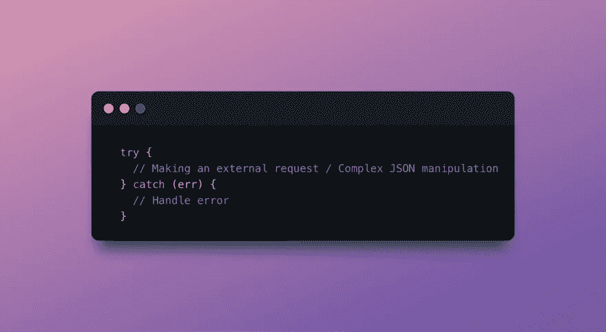
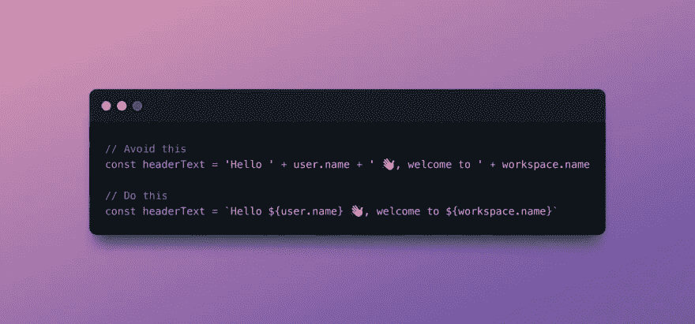
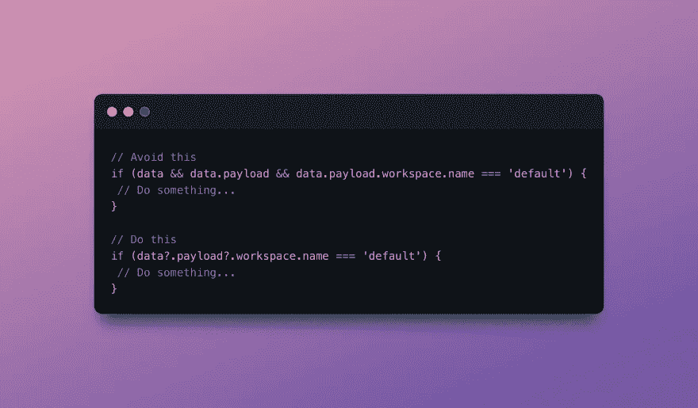

# 编写干净的 JavaScript 代码的 8 个最简单的技巧

> 原文：<https://levelup.gitconnected.com/8-must-know-tips-for-writing-clean-code-with-javascript-a9bac36b4922>

Javascript 是一种非常棒的编程语言。然而，即使对于经验丰富的程序员来说，编写干净的 javascript 代码也是一个挑战。

干净的 javascript 代码是什么样子的？应该是:

1.  易于阅读
2.  易于调试
3.  高效和高性能

下面是一些顶级的工具和技巧，你可以用它们来把你的 Javascript 代码质量提升到一个新的水平:

**1。对所有 api 请求和 JSON 方法使用 try catch**

当发出获取数据的 api 请求时，很多事情都可能出错，所以必须注意这些情况。当处理 JSON 时，不要自动相信给出的内容，通过处理可能的不一致来使代码更加健壮。

**2。使用 linter(**[**ESLint**](https://marketplace.visualstudio.com/items?itemName=dbaeumer.vscode-eslint)**)**
linter 是一个静态代码分析工具，它会根据一组预定义的规则和配置来检查编程和风格错误。简而言之，它将改进您的 Javascript/Typescript，并帮助它保持更加一致。

**3。在编辑器中跟踪 Javascript 问题**

保持 Javascript 代码库整洁的一个主要因素是让跟踪和发现代码本身的问题变得容易。在编辑器中跟踪代码库问题允许工程师:

*   全面了解科技债务等更大的问题
*   查看每个代码库问题的上下文
*   减少上下文切换
*   持续解决技术债务

你可以使用各种工具来跟踪你的技术债务，但最快速和最简单的方法是使用免费的步长扩展，用于集成了吉拉、线性、Asana 和其他项目管理工具的 VSCode 或 JetBrains。

**4。利用模板字符串**
模板字符串将允许你在保留格式的同时向字符串中注入值，并且代码比做字符串运算更易于阅读。

**5。当需要搜索字符串时使用正则表达式**
虽然正则表达式从外面看起来似乎很深奥，但它是一个如此强大的字符串解析工具，允许你构造复杂的模式来解释各种困难的字符串匹配场景。

6。利用可选链接
停止使用长逻辑连接词，用可选链接简化你的代码。

**7。避免嵌套**

嵌套肯定会增加代码的复杂性，使其更难阅读和理解。如果深度超过两层，可以考虑重构，让根层返回条件、更短的块，并将嵌套逻辑抽象为自己的函数。

**8。注释所有非典型代码，但不要让它取代代码可读性**

有些时候，你不得不处理一些不常见的场景，在这些场景中没有约定俗成的约定。对这段代码进行注释，以帮助解释它的作用和所考虑的上下文，这将极大地帮助其他程序员，也是对自己的一个提醒，当你将来回到这段代码时。但是这不应该被用作一开始就不考虑编写可读代码的借口！

> *编码快乐！😃
> 与需要它的人分享吧！💚
> 关注更多⚡*