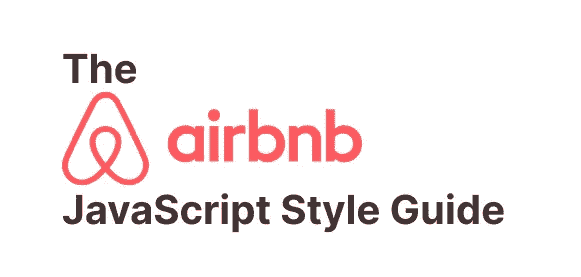

# AirBnb JavaScript 风格指南中值得注意的 8 点

> 原文：<https://levelup.gitconnected.com/8-noteworthy-points-from-airbnbs-javascript-style-guide-94debe23a2a5>



[Airbnb](https://github.com/airbnb/javascript#table-of-contents) 有一个最流行的风格指南，用于编写简洁、干净、可读的 JavaScript 代码。他们的目标是倡导一种风格规则，用于编写一致的代码库，使您的工程组织能够立即理解。

以下每一点都提供了提取规则的简短摘要，以及展示格式化代码的 JavaScript 片段。有争议的问题，如制表符对空格或分号的使用已被完全避免。

## 使用 const and let

通过使用`const`,我们确保不重新分配变量，并且我们所有的声明都是块范围的。当一个变量需要重新赋值时，我们选择`let`而不是`var`。

```
// ❌ bad
var firstName = 'George';// ✅ good
const firstName = 'George';-----------------------------// ❌ bad
var shirtSize = 'large';
shirtSize = 'medium';// ✅ good
let shirtSize = 'large';
shirtSize = 'medium';
```

## 使用文字声明

文字声明允许我们在一个位置声明一个`object`或一个`array`的所有属性。

```
// ❌ bad
const person = new Object();
object.firstName = 'George';// ✅ good
const person = {
  firstName: 'George',
};-----------------------------// ❌ bad
const people = new Array();// ✅ good
const people = [];
```

此外，对于与对象的匹配键同名的变量，使用对象属性赋值还有额外的好处。

```
// ❌ bad
const firstName = 'George';
const person = {
  firstName: firstName
};// ✅ good
const firstName = 'George';
const person = { firstName };
```

## 销毁对象属性

当我们需要在整个代码范围内重复使用属性时，我们会销毁`object`属性。

```
// ❌ bad
const getFullName = (user) => {
  const firstName = user.firstName;
  const lastName = user.lastName;
  // ...
  return `${firstName} ${lastName}`;
};// ✅ good
const getFullName = (user) => {
  const { firstName, lastName } = user;
  // ...
  return `${firstName} ${lastName}`;
};
```

此外，我们可以检索对象的裁剪版本，而不必`delete`或复制属性。下面我们想要除了`shirtSize`之外的所有其他`user`相关属性。

```
const user = { firstName: 'George', shirtSize: 'small' };// ❌ bad - mutate user object
delete user.shirtSize;// ✅ good
const { shirtSize, ...restOfUser } = user;
```

## 对浅复制对象使用扩展(`…)`操作符

spread 运算符是浅层复制对象或属性的首选方式。与`Object.assign`不同，它简洁而不改变原始对象。

```
// ❌❌ very bad
const person = { firstName: 'George' };
// Mutating the person object
const copy = Object.assign(person, { shirtSize: 'small' });// ❌ bad
const person = { firstName: 'George' };
// (*) We are not mutating person here
const copy = Object.assign({}, person, { shirtSize: 'small' });// ✅ good
const person = { firstName: 'George' };
const copy = {
  shirtSize: 'small',
  ...person
};
```

## 将模板文字用于字符串连接

模板字符串为字符串连接提供了简洁易读的语法。它们还提供多行支持，不需要新的行字符`\n`。

```
const firstName = 'George';// ❌ bad
const greeting = ['How are you, ', firstName, '?'];// ❌ bad
const greeting = 'How are you, ' + firstName + '?';// ✅ good
const greeting = `How are you, ${firstName}?`;
```

## 对内联回调使用箭头函数

当使用匿名函数作为另一个函数的参数时，建议使用简洁的箭头函数表示法。但是，如果逻辑操作很复杂，建议将逻辑提取到带有词汇名称的函数中。

请始终用括号将参数括起来。

```
// ❌ bad
[1, 2, 3].map(function(entry) {
  return entry ^ 2;
});// ✅ good
[1, 2, 3].map((entry) => {
  return entry ^ 2;
});
```

## 对函数参数使用默认参数

参数默认值允许我们在参数为`undefined`时分配预定义值。我们不再需要在函数范围内改变传递的参数。

强烈建议最后声明可选参数。

```
// ❌ bad
function(firstName, options) {
  options = options ?? {};
  // ...
}// ✅ good
function(firstName, options = {}) {
  // ...
}
```

## 最后的想法

如果你想坚持 AirBnb 的 JavaScript 风格指南，要考虑的远不止 8 点。当然，您可以随时扩充这些规则，以适应组织内的工程文化和代码样式的预设定义。

你可以使用 [eslint-config-airbnb](https://www.npmjs.com/package/eslint-config-airbnb) `npm`包自动检查代码格式。

## 感谢您的阅读！如果你觉得这篇文章有用，请与他人分享。一些掌声👏🏻下面多多帮忙！

*通过鼓掌，你帮助其他人发现这些内容，并激发更多关于可访问性、设计、反应和 JavaScript 的文章的写作！*

# 分级编码

感谢您成为我们社区的一员！在你离开之前:

*   👏为故事鼓掌，跟着作者走👉
*   📰查看[升级编码](https://levelup.gitconnected.com/)中的更多内容
*   🔔关注我们:[Twitter](https://twitter.com/gitconnected)|[LinkedIn](https://www.linkedin.com/company/gitconnected)
*   🚀👉 [**软件工程师的热门职位**](https://jobs.levelup.dev/)