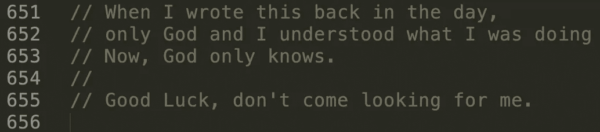
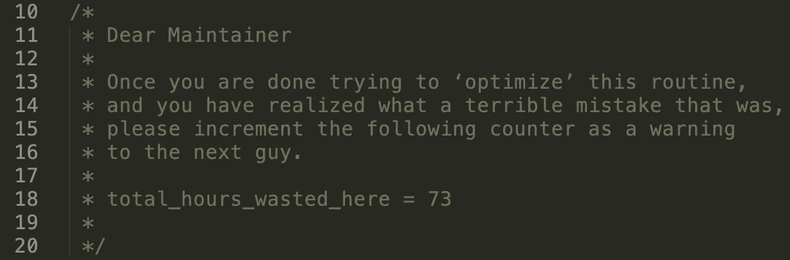

# 证明软件工程师有幽默感的 8 张图

> 原文：<https://levelup.gitconnected.com/8-pictures-that-prove-software-engineers-have-a-sense-of-humor-b4ffad6dfa90>

## 我们有我们的时刻…

软件工程师因很多事情而出名，幽默不在其中。我们擅长穿着帽衫，写下神奇的句子，最终以一种你会喜欢的方式在屏幕上照亮事物。当我们坐在办公桌前打字时，我们擅长喝咖啡、吃披萨，而这些东西是一个从未有过技术背景的普通人几乎无法理解的。

我们喜欢流行文化参考&笑话打破了其他软件开发人员的费用。[张家瑜](https://unsplash.com/@danielkcheung?utm_source=unsplash&utm_medium=referral&utm_content=creditCopyText)在 [Unsplash](https://unsplash.com/s/photos/funny?utm_source=unsplash&utm_medium=referral&utm_content=creditCopyText) 上拍照

我们有一些内部笑话，比如我们浪费了多少时间寻找一个丢失的分号，JavaScript 有多糟糕(但我们也喜欢它，它很复杂)，换一个灯泡需要多少软件工程师？

如果你在寻找答案，零，什么都没有。我们是软件工程师，我们不处理硬件故障！

但是软件工程师有不同的幽默感，我们非常擅长。我不久前听过一句名言，

> 如果你不能自嘲，你还能嘲笑谁呢？

显然是其他软件工程师。

我们喜欢基于我们痛苦的幽默，因为它帮助我们一起欢笑，分担痛苦，我想分享一些软件开发人员真的全力以赴的例子。

这是:

## 如何知道一个网站是否使用 HTML5？

来源:谷歌图片

## 修复问题

任何关于软件开发人员搞笑的故事，如果没有包括 [xkcd](https://xkcd.com/1739/) 都是不完整的。漫画的标语将其描述为“浪漫、讽刺、数学和语言的网络漫画”。

来源: [XKCD](https://xkcd.com/1739/)

# 在代码注释中倾吐心声

接下来的两张图片是软件工程师在他们的代码中写的实际注释。注释只是我们对自己说话的方式，并向将来可能会维护我们代码的可怜的开发人员传递信息。祝你好运，伙计！

普通大众永远看不到这一点，只有负责维护的可怜开发者。

## 献给他们一生的挚爱

## 请原谅我

## 上帝为我作证

## 一个解释

## 温和的警告

## 成功了吗？

# 奖金

递归对我们程序员来说是另一种地狱。对于那些不知道什么是递归的人来说:

> 函数直接或间接调用自身的过程称为递归，相应的函数称为递归函数。

通过阅读上面的句子，你可以想象，它打开了一个不同的蠕虫罐，但谷歌的家伙们已经设法对此开了一点玩笑。如果你在谷歌上搜索递归，会有一个精彩的尝试来解释搜索结果中出现的概念。

看到了吗？开发人员有很好的幽默感，尽管几乎每次都是针对开发人员的略带扭曲和病态的幽默感。

我希望你笑得很开心！

来源: [Giphy](https://media.giphy.com/media/Z9OGuQyrfHAE8/giphy.gif)