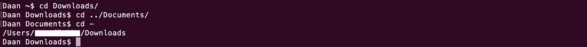
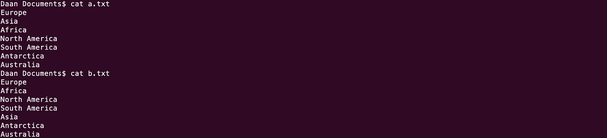
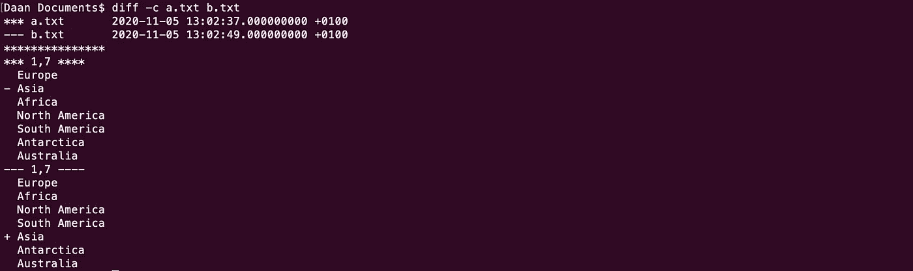
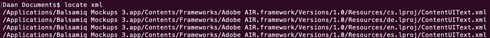
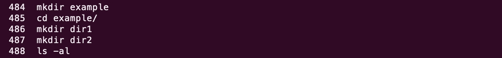

# 每个开发人员都应该知道的 8 个实用命令

> 原文：<https://levelup.gitconnected.com/8-practical-commands-every-developer-should-be-aware-of-7bf528f8d2f>


由[戈兰·艾沃斯](https://unsplash.com/@goran_ivos?utm_source=medium&utm_medium=referral)在 [Unsplash](https://unsplash.com?utm_source=medium&utm_medium=referral) 拍摄的照片

## Linux 命令行的基本但重要的命令

了解你在码头的路线是更快完成工作的一种方法。您可以在命令行上完成完全相同的工作，而不是在 GUI 中使用鼠标点击——但是速度更快。

然而，如果你想在命令行上变得更舒服，有些命令你应该知道。作为一名开发人员，您应该知道的基本但重要的命令。了解这些命令是必要的，以便为使用命令行打下坚实的基础。

如果您想更好地使用 Linux 命令行，那么这篇文章非常适合您。如果您还没有太多使用命令行的经验，那也没关系。如果您已经习惯使用 Linux 命令行，请不要担心。你可能还能学到一两件事。

# 1.尾部-f

你可能听说过 *cat* 命令，它允许你查看一个文件的内容。但是在显示文件内容时，您有更多的选择。cat*命令输出整个文件，这并不总是你想要的。*

有时您只想输出第一行或最后 X 行。为此，您可以使用*尾部*或*头部*命令。默认情况下， *head* 命令输出前 10 行，而 *tail* 命令输出后 10 行。

*tail* 命令通常用于查看日志文件。这是因为*尾*命令有一个 *-f* 选项，代表“跟随”，允许你观看一个文件。该选项将随着文件的增长输出附加的数据。这意味着附加到文件的日志条目将立即显示。

# 2.单细胞蛋白质

Scp 代表*安全复制*，允许你在网络上的主机之间复制文件。使用 scp 的一种方法是将文件从您的机器复制到远程服务器，反之亦然。Scp 与 SSH 一起工作。

这个命令相当简单，就像 *cp* 命令一样。唯一的区别是，您可以使用 scp 将文件复制到其他主机，这是普通的 *cp* 命令所做不到的。

`scp [target] [destination]`

看起来就像你可能已经熟悉的 *cp* 命令，对吗？

要将文件从服务器复制到您的计算机，您必须执行以下操作:

```
scp derk@127.0.0.1:/target/file.txt ~/destination
```

在这个例子中， *derk* 是用户， *127.0.0.1* 是主机。主机地址后跟一个冒号。在冒号之后，指定需要复制的文件的路径。第二个参数是目的地，在本例中是您自己机器上的一个文件夹。这个命令的结果是*文件. txt* 从服务器复制到你本地机器的*~/目的地*文件夹。

例如，当从服务器下载数据库备份时，这可能很有用。如果你想从你的机器上传一些东西到远程主机，你可以切换参数。

```
scp ~/target/file.txt derk@127.0.0.1:/destination
```

该命令将 *file.txt* 从您的机器复制到位于远程主机上的*目的地*文件夹。

# 3.cd -

每个开发人员都知道 *cd* 是 Linux 命令行上最常用的命令之一。这个命令可能不需要任何进一步的解释。然而，许多开发人员不知道 *cd* 命令附带的一个很棒的选项:连字符。

```
cd -
```

在 *cd* 命令后添加一个连字符将使您返回到先前选择的目录。这是它实际运行的样子:



# 4.差速器

如果您曾经使用过版本控制，那么您可能以前使用过 *diff* 命令。例如，在使用 Git 时。此命令允许您查看对某个文件所做的更改。

diff 命令代表差异，允许你逐行比较文件。假设我们有两个文件，都包含一个大陆列表。这些文件之间的唯一区别是大陆的排列顺序。



当我们对这两个文件进行比较时，我们会得到下面的输出。确保添加了 *-c* 选项。该选项以上下文模式输出差异，这使得输出更具可读性。



# 5.确定…的位置，发现…的位置

在你的机器上搜索文件时, *locate* 命令是一个非常强大的工具。与*查找*命令相比，*定位*命令要快得多。

*定位*如此之快是因为它不读取文件系统中搜索到的文件或目录名。相反，它引用数据库来查找用户正在查找的内容，并基于该搜索生成其输出。

locate 命令的语法非常简单:

```
locate [filename]
```

该命令的输出将列出包含指定术语的所有文件，在下面的示例中是“xml”。



您也可以使用正则表达式搜索完全匹配的内容。正则表达式可以用 *-r* 选项指定。

```
locate -r /filename$
```

# 6.lsof

*lsof* 命令列出所有打开的文件。语法很简单，你所要做的就是键入 *lsof* 。在没有任何选项的情况下，该命令将列出属于所有活动进程的所有打开的文件。

```
lsof
```

该命令在几种情况下很有用。其中一种情况是，如果您想要检查某个端口上正在运行哪些进程。为此，您必须指定 *-i* 选项。让我们看一下下面的例子，我们检查哪些进程正在端口 22 上运行——这是 SSH 的端口。

```
lsof -i TCP:22
```

还可以列出一系列端口。以下示例列出了在端口范围 20 - 30 内运行的所有进程。

```
lsof -i TCP:20-30
```

最后，但同样重要的是，命令的 *lsof 的输出可用于终止特定用户的所有进程，在本例中为 *derk* 。*

```
kill -9 `lsof -t -u derk`
```

# 7.历史

*history* 命令保存了从当前终端会话运行的所有其他命令的列表。这是*历史*命令的输出。



您可以将 *history* 命令与 *grep* 命令结合使用，使您的搜索更加具体。

```
history | grep npm
```

不仅可以使用*历史*命令查看所有已经运行的命令。您也可以使用*历史*命令再次快速执行这些先前执行的命令之一。

每当你执行*历史*命令时，你会在每一行前面看到一个数字。您可以使用感叹号后跟行号来再次执行相同的命令。

```
!488
```

如果我们再看一下前面的例子，上面的命令会再次执行`ls -al`命令。

# 8.wget

列表中的最后一个命令是 *wget* 命令。Wget 允许你从网上下载文件。

让我们来看看 *wget* 命令的语法。您需要指定的只是您想要下载的资源。在这种情况下，我们将下载一个随机图像。

```
wget [https://picsum.photos/200](https://picsum.photos/200)
```

以最简单的形式，所以不使用任何选项， *wget* 会将 URL 中指定的资源下载到当前目录。默认情况下，您会发现 *wget* 命令输出了很多关于下载的细节，比如下载速度和进度条。要关闭输出，你可以使用 *-q* 选项——代表安静。

如果您想以不同的名称保存下载的文件，您可以使用 *-0* 选项，后跟文件名。

```
wget -O my-image.jpg [https://picsum.photos/200](https://picsum.photos/200)
```

# 包装东西

现在我们已经浏览了整个列表，我希望您在使用命令行时加深了自己的知识。希望您已经学习了一两个新命令，可以让您作为开发人员的生活变得轻松一些。

如果你在这个列表中遗漏了一个命令，那将是一个很好的补充，请让我知道。

感谢阅读！