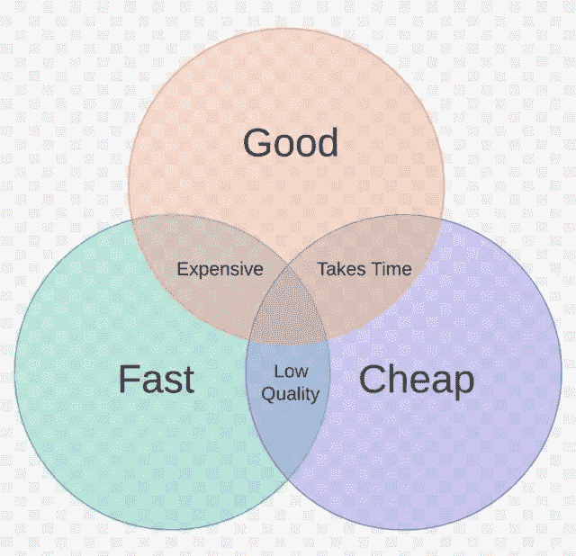
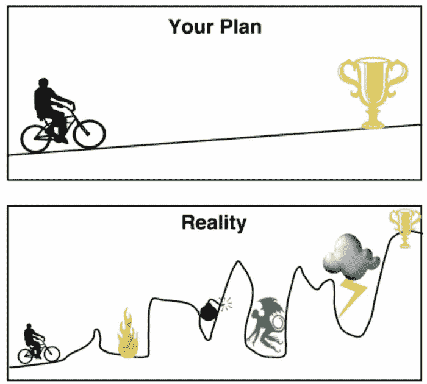
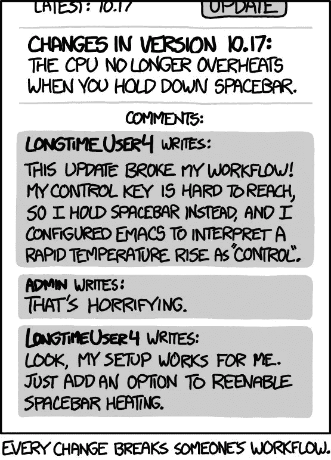

# 每个开发人员都会遇到的 8 条编程法则

> 原文：<https://levelup.gitconnected.com/8-programming-laws-every-developer-will-encounter-a46f0c25f7af>

## 以及如何运用他们的力量

图片来源:[https://the academic insights . com/cyber-laws-and-implementation/](https://theacademicinsights.com/cyber-laws-and-implementation/)

这些年来，我观察到了工程过程中反复出现的模式和陷阱。有趣的是，它们与工程博客中无休止争论的话题无关。例如，我不记得有哪一次由于对坚实的原则理解不足而导致我的团队错过了交付期限。偶尔，我会遇到一条“定律”,它完美地描述了我所经历的一个确切的问题。在播客、有声读物和博客的隐蔽处发现所有这些方便的工程法则是非常令人烦恼的。所以我把它们整理成了我最喜欢的 8 条编程法则的列表，这些法则你肯定会在野外遇到。

# 1)墨菲第二定律

名单上最著名和最容易辨认的是墨菲定律，它通常被表述为:

> “凡是可能出错的，都会出错”

然而，它的更直接的表亲墨菲第二定律的措辞应该击中任何工程师的要害，

> “任何解决方案都会产生自身的问题”

或者说*没有什么事情像看起来那么简单*【2】。墨菲第二定律雄辩地总结了这样一个观察结果:作为工程师，我们接触的任何东西都会给系统增加风险，因此可以通过避免系统变更来减轻这种风险。

## 如何运用它的力量

随着我作为一名工程师的成熟，我花在编码上的时间越来越少。事实上，我已经逐渐将编写新代码视为一种系统性风险；它增加了复杂性、维护费用，还可能增加了 bug。考虑到墨菲，我的建议是:

1.  比起自制的解决方案，更喜欢过程改变和供应商软件。
2.  避免快速解决方案的陷阱，你会回来，并在以后改善。第一次就把它做好。
3.  测试。测试。测试。测试覆盖越好，应用程序的复杂度就越高。

# 2)康威定律

1967 年，梅尔文·康威掉了这枚一角硬币

> “任何设计系统(广义定义)的组织都将产生一个设计，其结构是该组织通信结构的复制”

或者更简洁地说，

> "如果你有四个组在一个编译器上工作，你将得到一个 4 遍编译器"

康威定律受到重创，因为软件工程师经常必须与分散在世界各地的同事一起构建系统。例如，在一家大型托管银行工作期间，我开发了一个有很多服务的交易系统。除了两个以外，它们都通过内部消息总线进行通信。然而，两者之间莫名其妙地通过互联网的一个公共 API 进行通信。

正如大脑功能作为子组件运行一样，任何时空劳动力也是如此。

我接着发现，通过互联网交流的服务是美国团队和印度团队唯一重叠的服务。系统架构基本上是两个半球:左边是美国微服务，右边是印度服务，以及它们之间的最小 API。那个 API 基本上是大西洋。

## 如何运用它的力量

在所有技术中最伟大的语言中，康威定律的标准补救方法是*逆康威策略*。换句话说，发展你的团队和组织结构来促进你想要的架构[4]。亚马逊的*两个披萨团队*大概是最知名的例子。如果你在岩石下，神话故事如下。

*   2001 年，Amazon.com 是一个高耸的、紧密结合的庞然大物，不容易维护。
*   该站点被重建为多个微服务，每个微服务都由一个专门的团队提供支持。因此，团队根据业务(如购物车、推荐、广告)而不是技术(如数据库、质量保证、开发)进行重组。
*   团队规模保持在很小的水平——不超过两个比萨饼的量。公司和网站同时进行了重构。

这很好，但你可能无法完全重组你的公司。不要担心，有几种方法可以让你的组织，或者至少是你的团队放松。

1.  最重要的工作应该在时区重叠期间完成。我不是说西海岸的同事需要在每天早上 6 点到达接触点，但是真正重要的会议和结对发展应该安排在一天中大多数团队成员有空的任何时间。
2.  在招聘和组织中考虑这些限制因素。虽然这可能超出你的控制范围，但你可以尝试与你的经理沟通康威。
3.  拥抱它。如果您的组织是分布式的，那么您的系统也应该是分布式的。避免与组织结构不一致的系统架构。

# 3)德莫斯定律

也被称为墨菲演示定律，它观察到，无论排练得多好，无论你练习多少次，**在你的演示中总会出问题**！我不会去苛责为什么会发生这种情况的细节——查看参考资料[9–11]

如果发生在埃隆和他的世界级工程师身上，也会发生在你身上——来自[https://www . Reddit . com/r/programmer humor/comments/e0b kok/universal _ law _ of _ demos/](https://www.reddit.com/r/ProgrammerHumor/comments/e0bkok/universal_law_of_demos/)

## 如何运用它的力量

通过接受演示往往不尽人意的事实，您可以避免这些情况:

1.  保持演示最少——尽量少展示传达想法/应用程序/功能所需的内容。
2.  演示在现实中比在你脑子里花的时间要长。
3.  至少提前 20 分钟到，开通会议热线，准备好你的幻灯片。没有什么比一屋子工程师争论如何开通会议线路更让人不舒服的了。
4.  进行备份演示。想象一下，你正要展示一个新网站，而在演示前 5 分钟，AWS 出现了故障。你能在你的本地机器上运行几页吗？是否在不同的地区部署了较低的环境等…为最坏的情况做好准备。
5.  [橡皮鸭调试](https://en.wikipedia.org/wiki/Rubber_duck_debugging)
    由于演示从不按计划进行，你实际上可以利用这一点。如果某些东西工作不正常，例如。你的 IDE 出问题了，你不能重现一个错误，等等……使用演示法则，试着展示给朋友看。在讨论问题的时候，你通常会偶然发现解决方案，或者问题会神奇地消失！

# 4)格雷欣定律

格雷欣定律来自 19 世纪的经济学，它简单地指出

> “劣币驱逐良币”[6] *或者更一般的*“劣币驱逐良币”。

本·霍斯金在[7]中很好地描述了格雷欣法则在软件工程中的应用，所以我将它简化为

> 便宜的软件其实很贵[8]。

你想要这三样东西，但应该只关注好的方面—[https://andrewcoppolino.com/blog/fast-good-cheap-pick-two/](https://andrewcoppolino.com/blog/fast-good-cheap-pick-two/)

## 如何运用它的力量

在一个理想的世界里，每一个项目都应该是快速、廉价且做得好的。然而，在现实中，我们只能希望 3 个中的 2 个。所以要明智选择。在某些情况下，事情不得不仓促进行，但根据格雷欣法则，“便宜”是一个谎言。是技术债。你应该永远为善而奋斗。

# 5)规划谬误

在丹尼尔·卡内曼的《思考，快与慢*【13】*一书中，估计谬误是观察到人类在提前计划时表现出相当大的乐观主义偏差，导致对完成一项任务的时间估计不足。你可能经常会遇到这种情况。例如，最近你花了一个小时去做几件快速的差事，结果却让他们花了半天才吃完？事实上，对于任何估计的任务，一般的建议是首先将最初的估计增加一倍甚至三倍，然后你至少可以知道它的实际完成时间。

对规划谬误的精彩描述，来自[https://medium . com/geek culture/how-the-planning-fallacy-trips-you-up-3248 b7e 3978 e](https://medium.com/geekculture/how-the-planning-fallacy-trips-you-up-3248b7e3978e)

这里有一些很好的计划谬误的例子[14]

*   悉尼歌剧院预计于 1963 年完工。十年后，一个缩小版在 1973 年开放。最初的成本估计为 700 万美元，但延迟完工导致成本为 1.02 亿美元。
*   波士顿中央动脉[地下的](https://en.wikipedia.org/wiki/Central_Artery)[大挖掘](https://en.wikipedia.org/wiki/Big_Dig)比计划晚了 7 年完成，花费了 80.8 亿美元，而预算为 28 亿美元(1988 年美元)。
*   加州高速铁路仍在建设中，预计将超支数百亿美元，与主要城市的连接将推迟到农村部分完工后。

## 如何运用它的力量

1.  对任何被认为快速简单的事情都要持怀疑态度。
2.  当任意给出最后期限时，用谨慎的试探性问题来回应。例如“如果 QA 团队第一次遇到 bug，时间线会如何改变”。诸如此类的基本问题揭示了事后看来显而易见的陷阱和死胡同。
3.  当有疑问时，每一个估计都要加倍。当被要求估计时，无论你的第一次猜测是多少，至少要加倍。有时我做三倍，然后让他们说服我两倍:)

# 6)赫鲁姆定律

Hyrum 定律是最近提出的定律之一，它可以追溯到一个谷歌人的博客[12],这里简洁地表述为:

> 有了足够数量的 API 用户，
> 你在合同中承诺什么并不重要:
> 你的系统的所有可观察到的行为
> 将依赖于某人…

最好的例子就是这部令人惊叹的 XKCD 漫画

[https://xkcd.com/1172/](https://xkcd.com/1172/)

## 如何运用它的力量

类似于墨菲定律，你必须注意你的系统将会被用在意想不到的地方，所以你必须保持它的范围最小化。构建一个 API，允许用两种相似的方法做同样的事情？这会让用户感到困惑吗？试着让你的界面显而易见，有主见，足够简单，以至于一个幼儿园小朋友(或者更糟，一个婴儿潮一代)都可以使用。

Hyrum 最近在我设计 API 的时候出现了。为了简单起见，假设它获取了一个用户列表。

`fetchUsers() -> {Allan Apple, Bill Banana, Chris Carrot ...}`

注意到这些已经分类了吗？嗯，排序顺序是隐式的，因为这些是在数据库中排序的，并且在 API 契约中没有排序顺序保证。然而，意识到这个规律，我意识到，最终，有人会依赖于这些被分类。所以我把它作为默认参数`fetchUsers(sort=True).`内置到 API 契约中

# 7)帕累托原则

帕累托法则也被称为收益递减定律(T2)或 80/20 法则，应用非常广泛。例如，据 1989 年的统计，世界上最富有的 20%的人拥有 80%的财富(多么奇怪)。或者考虑一下 20%的工作场所危险造成了 80%的伤害。在软件中，这表现在几个方面，我将直接引用维基百科，因为它说得很好。

> 在[计算机科学](https://en.wikipedia.org/wiki/Computer_science)中，帕累托原理可以应用到[优化](https://en.wikipedia.org/wiki/Optimization_(computer_science))工作中。例如，[微软](https://en.wikipedia.org/wiki/Microsoft)指出，通过修复报告最多的前 20%的错误，给定系统中 80%的相关错误和崩溃将被消除。Lowell Arthur 表示“20%的代码有 80%的错误。找到他们，修理他们！”人们还发现，一般来说，某个软件的 80%可以用总分配时间的 20%来编写。相反，最难的 20%的代码占用了 80%的时间。这个因素通常是软件编码估算的一部分。

## 如何运用它的力量

为了让帕累托定律对你有利，做以下事情；

*   *先解决难的东西*。
    尽早发现最棘手的工程挑战非常重要。80%的工作可能独自潜伏在这里。
*   *忌镀金，即。过度设计*。一个很好的方法是承担更多的责任，这会让你专注于最重要的挑战而不是琐事。

我不是说你应该一心多用，这通常是无效的，而是说，不要在任何一项任务上花费超过一周的时间。当然——不是所有的任务都能在一周内完成，这正是问题所在。给你无限的时间，你会找到工作来填满它，这通常会导致镀金。然而，如果您知道您将把它交给一个队友，那么您将被迫决定什么是最重要的——可能只是建立 REST API 的 CRUD 方法，或者只是建立构建管道。通过快速进出，你将完成许多项目中 80%的工作。当你的大学花了整整一个月的时间 100%地做一件事时，你已经 80%地完成了 4 件事，从某种意义上说，你的工作效率大概是原来的 3 倍。我可以告诉你，当我成为一名高级开发人员，不得不四处奔波时，我对许多项目所做的贡献比以前的工作更有价值，在以前的工作中，我从端到端地构建一个东西；对我来说是深度。

# 8)特斯勒定律

图片来源:【https://unsplash.com/photos/OopPIi_A428 

也就是所谓的[复杂性守恒定律](https://en.wikipedia.org/wiki/Law_of_conservation_of_complexity#:~:text=The%20law%20of%20conservation%20of,development%20or%20in%20user%20interaction.)，其思想是每个系统都有固有的不可简化的复杂性，所以要处理它，要么系统需要更复杂，要么用户需要更复杂。拉里·特斯勒认为，花工程时间去改进系统比指望用户去做要好。这是有意义的——如果你的应用有 100 万用户，即使工程师需要一个月的时间来减少几次点击，这也意味着用户节省了数百万次点击。

在我自己的超级特权生活中，这每天都在发生，当我与我的谷歌主页对话打开我的灯并改变它们的色调时。我必须给它两个独立的命令:

> 嘿，谷歌把灯调到 50%”……(等 5 秒)……嘿，谷歌把灯调到白天。

当然，在 AI 中支持复合命令是非常重要的，因此用户已经吸收了复杂性。

## 如何运用它的力量

*   避免给用户增加负担的解决方案；观察用户如何使用系统，并试图找到缺陷。
*   总是选择花更多的时间用“正确的方式”而不是“快速的方式”——即。格雷欣定律。
*   像用户一样思考——您想使用您正在构建的功能吗？

# 奖金——XY 问题

这本身不是一项法律，但感觉应该包括在内。当一个解决方案(Y)在没有实际问题(X)的背景下被提出时，就会发生这种情况，导致对更好的解决方案(Z)的盲目和浪费努力。考虑这个人为的例子:

老板:“请加大这一页的字体。”**(建议的解决方案，Y)**

工程师:“好的”

老板(nex day):“你能把它改回来吗——用户说它太大了”

工程师:“好吧——我们当初为什么要这么做？”

老板:我们的一个用户在旧版本的 IE 上，字体显示错误(**这是*实际的*问题，X** )

工程师:“他就不能用 Chrome 吗？”(**备选** **方案，Z)**

## 如何运用它的力量

在上面的例子中，如果工程师简单地问了几个澄清性的问题，就可以避免白费力气。老板对一个解决方案(Y)的执着使他看不到一个潜在的更好的解决方案，z。

在野外，XY 问题通常始于一些听起来可疑的事情。像“请把字体变大”这样的请求，不是问题陈述，是解决方案陈述。真正的问题陈述是“这个页面在旧的 IE 浏览器上呈现不正确”。不幸的是，有时提取上下文的任务落到了工程师的肩上，因为需求和标签经常是缺乏的。但好消息是，这通常很容易——只要说“让我们后退——我们试图解决的问题是什么”, 99%的情况下你都会成功。

**你怎么看？**我错过了一个重要的吗？我做错了什么吗？请给我留言，以便我改进这篇文章。

**参考文献**

> 1.[https://en.wikiquote.org/wiki/Murphy%27s_law](https://en.wikiquote.org/wiki/Murphy%27s_law)
> 
> 2.[https://www . angelo . edu/faculty/kboudrea/cheap/cheap 3 _ Murphy . htm #:~:text = Murphy ' s % 20 second % 20 law % 3A % 20 nothing % 20 is，the % 20 one % 20 to % 20 go % 20 error](https://www.angelo.edu/faculty/kboudrea/cheap/cheap3_murphy.htm#:~:text=Murphy's%20Second%20Law%3A%20Nothing%20is,the%20one%20to%20go%20wrong)。
> 
> 3.[https://en.wikipedia.org/wiki/Conway%27s_law](https://en.wikipedia.org/wiki/Conway%27s_law)
> 
> 4.[https://www . thoughtworks . com/en-us/radar/techniques/inverse-Conway-manipulate](https://www.thoughtworks.com/en-us/radar/techniques/inverse-conway-maneuver)
> 
> 5.[https://thenewstack . io/led-亚马逊-微服务-架构/](https://thenewstack.io/led-amazon-microservices-architecture/)
> 
> 6.[https://www.britannica.com/topic/Greshams-law](https://www.britannica.com/topic/Greshams-law)
> 
> 7.[https://it next . io/greshams-law-why-bad-developers-push-out-good-developers-and-developers-create-low-quality-code-9 B6 A8 d 15 bffb](https://itnext.io/greshams-law-why-bad-developers-push-out-good-developer-and-developers-create-low-quality-code-9b6a8d15bffb)
> 
> 8.[https://dev . solita . fi/2020/06/16/cheap-software-is-贵. html](https://dev.solita.fi/2020/06/16/cheap-software-is-expensive.html)
> 
> 9.[https://wiki.c2.com/?DemoMeltdown](https://wiki.c2.com/?DemoMeltdown)
> 
> 10.[https://theappslab.com/2009/07/17/murphys-law-of-demos/](https://theappslab.com/2009/07/17/murphys-law-of-demos/)
> 
> 11.[https://level up . git connected . com/the-4-laws-of-the-software-demo-b 74 b 79 ca 79 e 3？gi=5ec80c8efa29](/the-4-laws-of-the-software-demo-b74b79ca79e3?gi=5ec80c8efa29)
> 
> 12.[https://www.hyrumslaw.com/](https://www.hyrumslaw.com/)
> 
> 13.[https://en.wikipedia.org/wiki/Thinking,_Fast_and_Slow](https://en.wikipedia.org/wiki/Thinking,_Fast_and_Slow)