# 让你更有效率的 8 R 编程技巧

> 原文：<https://levelup.gitconnected.com/8-r-programming-tips-and-tricks-that-will-make-you-more-efficient-d3d6c33134e1>


卢克·切瑟在 [Unsplash](https://unsplash.com?utm_source=medium&utm_medium=referral) 上拍摄的照片

r 编程是统计计算和数据分析的一个强大而流行的工具。数据科学家和研究人员喜欢它，因为它有广泛的软件包和功能，使数据处理和可视化变得快速而简单。

这些提示和技巧将帮助您充分利用这个灵活而强大的工具，无论您是一个尝试开始 R 编程的新手，还是一个希望提高技能的有经验的用户。

# 使用 R 本机管道运算符

这将需要我们大多数人来适应，但有一个比 magrittr `%>%`操作符更好的选项，这是 R native 的管道操作符，带有 base R。您不需要安装任何 tidyverse 包来使用它，只需确保您的 R 更新到最新版本，您可以通过转到**工具>全局选项>代码**来启用它，并勾选下面的选项。

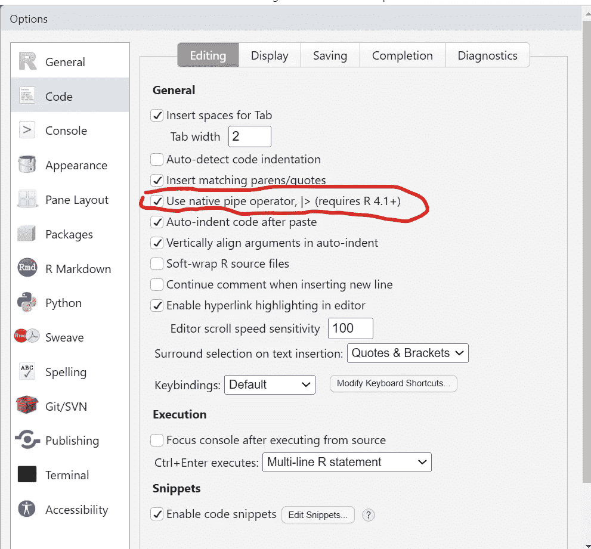

作者图片

# 在新选项卡上查看数据

使用`View()`函数，您可以在一个新的选项卡上查看数据，得到一个类似于您在 Excel 电子表格中看到的视图。

```
View(mtcars)
```

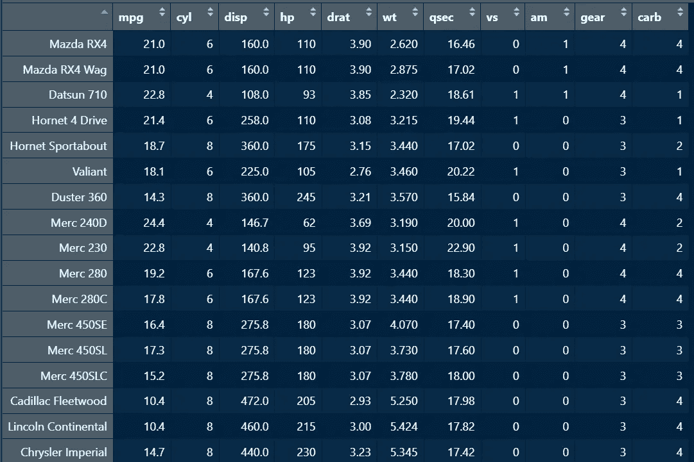

作者图片

这给你一个更宽的数据集视图，比在控制台上查看数据集更好看。您还可以通过单击任何变量的箭头对该视图中的数据进行排序，这将按升序或降序对数据进行排序。这类似于您在 Excel 中对*表格*所做的操作。

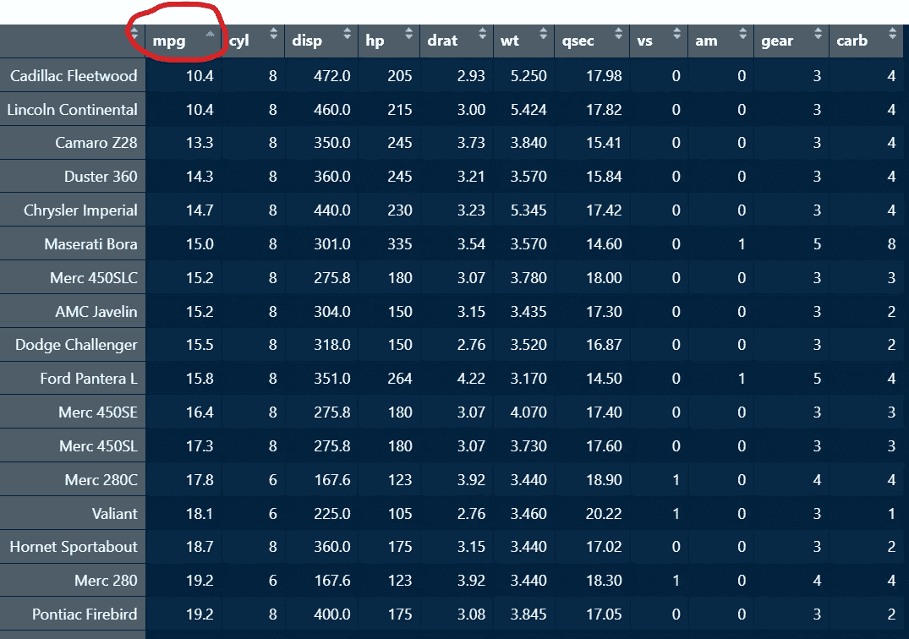

作者图片

你可以看到`mtcars`数据集是按照 mpg 的升序排序的，你也可以使用管道操作符将`View()`函数传递给你的数据，如下所示。

```
library(dplyr)

mtcars |> 
  filter(mpg <= 15) |> 
  View()
```

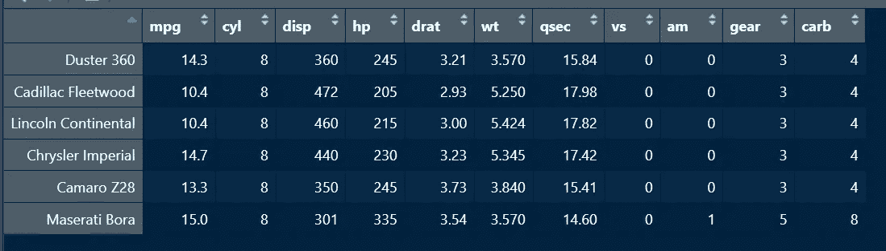

作者图片

# 将情节与拼凑结合起来

有时候太多的情节会使你的工作变得凌乱，你可以通过将两到四个情节合并到一个页面中来使你的工作看起来更有条理。Patchwork 是一个使用数学运算符的包，可以让您轻松完成这项工作。

```
library(ggplot2)
library(patchwork)

a <- diamonds |> 
  ggplot(aes(price)) +
  geom_histogram()

b <- diamonds |> 
  ggplot(aes(cut,price)) +
  geom_col()

a + b
```

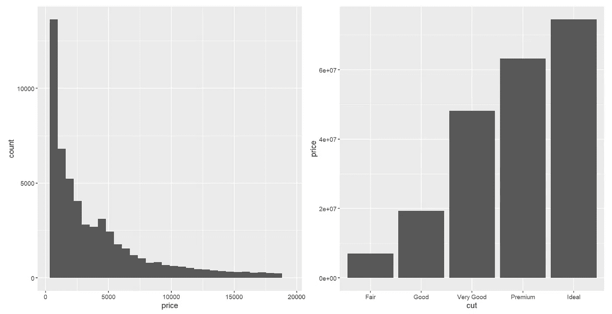

作者图片

在上面的代码中，图`a`和`b`使用`+`符号组合在同一列中。

如果你想了解 R 中多个情节的组合，何不看看这篇文章，你会发现它很有趣。

[](https://medium.com/geekculture/how-to-combine-multiple-plots-in-one-page-f17c21bf930b) [## R 编程中如何在一页中组合多个图

### 我工作的一个客户最近告诉我，他提交文章的一个出版物，只接受 6 个情节，他…

medium.com](https://medium.com/geekculture/how-to-combine-multiple-plots-in-one-page-f17c21bf930b) 

# 打印分配结果

我知道你想知道为什么我总是给一个变量赋值，并且仍然通过名字调用那个变量或者使用`print()`函数来得到结果，为什么我不能在赋值后得到结果？

好吧，希望这能解决你的问题，如果你想看到你的任务的结果，就用一个像这样的圆括号把它盖住，

```
(data <- head(iris))
```

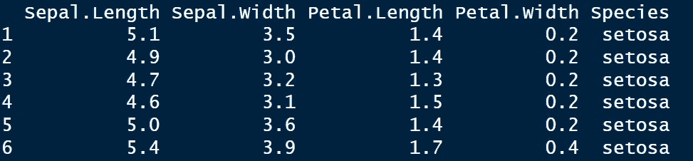

作者图片

上面的代码将`head(iris)`的结果存储在变量`data`中，并立即给出结果。

# 创建自己的二元运算符

就像创建管道运算符一样，您也可以创建自己的二元运算符。Python 中的`+=`操作符允许您向现有变量添加值，从而更新该变量的值。你可以在 r 中复制这种函数。

```
'%+=%' <- function(x,y)
  x + y
```

r 将两个百分号`(%…%)`之间的任何文本解释为二元运算符。

```
>x = 4
>(x <- x %+=% 7)
11 
```

# 在脚本中使用代码部分

许多 R 用户不使用这一点，您可以在脚本中添加代码段，使其易于导航，特别是如果您正在编写很长的代码行。要向脚本添加代码段，以`#`开始注释，以`----`、`####`或`====`结束注释。这将创建一个代码部分，当你点击你的大纲时，你可以看到它。

```
# Section One ----

# Section Two ####

# Section Three ====
```

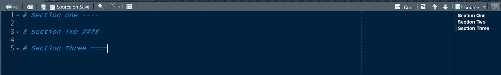

作者图片

# 使用 Skimr 获取数据摘要

与`str()`和`summary()`函数不同，skimr 包中的`skim()`函数更加全面，允许您查看数据集中的数据类型、缺失值等信息，还可以通过每个变量的迷你直方图查看每个连续变量的分布。

```
skimr::skim(mtcars)
```

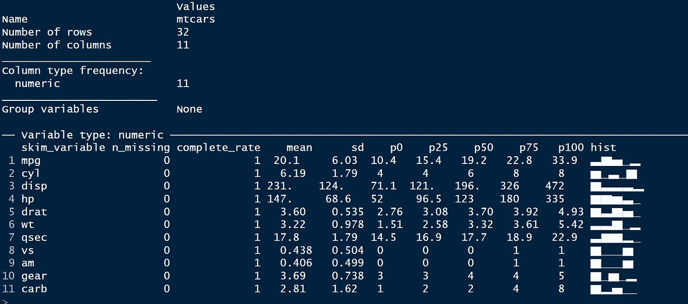

作者图片

# 使用彩虹括号

我知道我不是唯一一个发现嵌套函数令人困惑的人，想象这样一个函数，

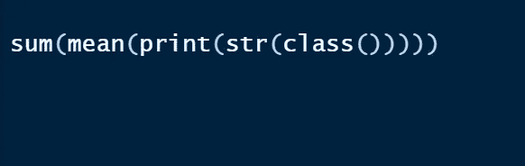

作者图片

有时甚至会更糟，但你可以通过打开彩虹支架来使支架变得丰富多彩。转到**代码>彩虹括号**

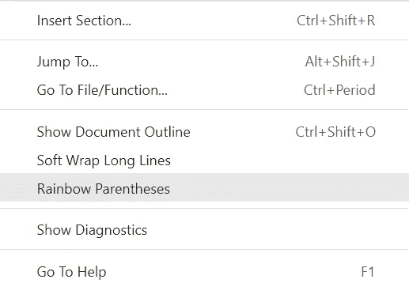

作者图片

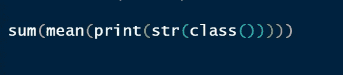

作者图片

看起来比较顺眼。

# 结论

嘿，希望你能找到一些有用的提示，就像有人和我分享了一些提示一样，你为什么不分享给一个 R 用户呢？你不知道，你可能会拯救一条生命！


乔恩·泰森在 [Unsplash](https://unsplash.com?utm_source=medium&utm_medium=referral) 上的照片