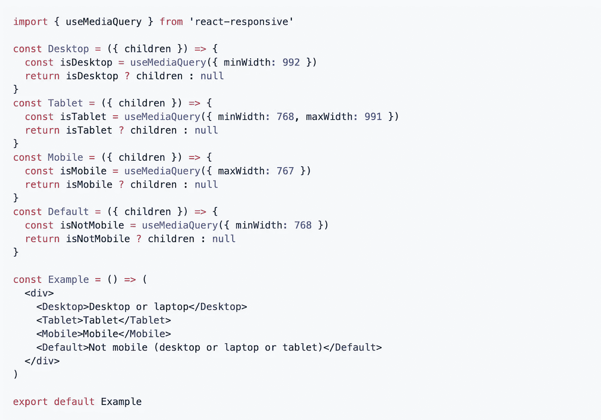
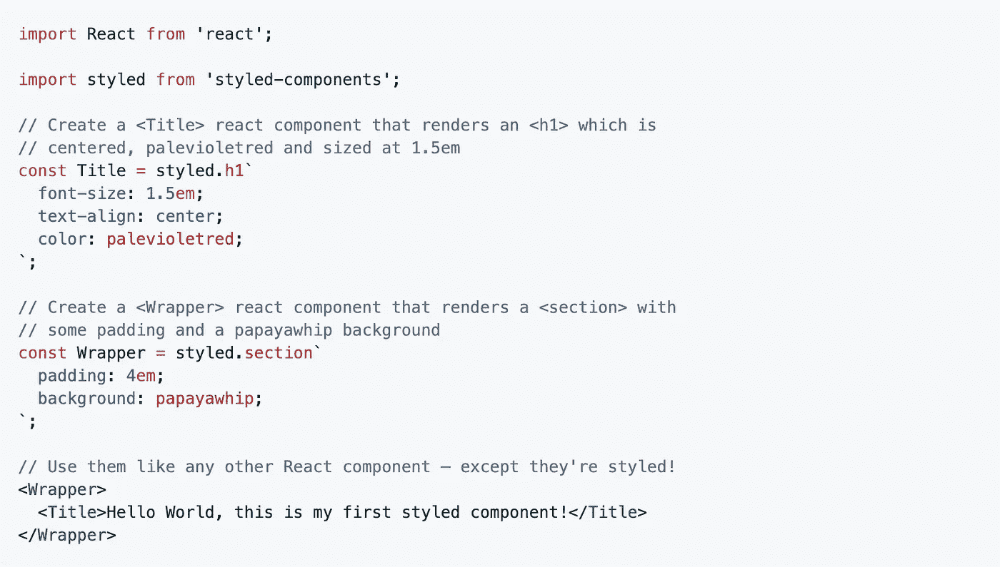
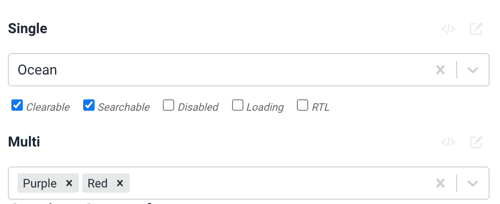
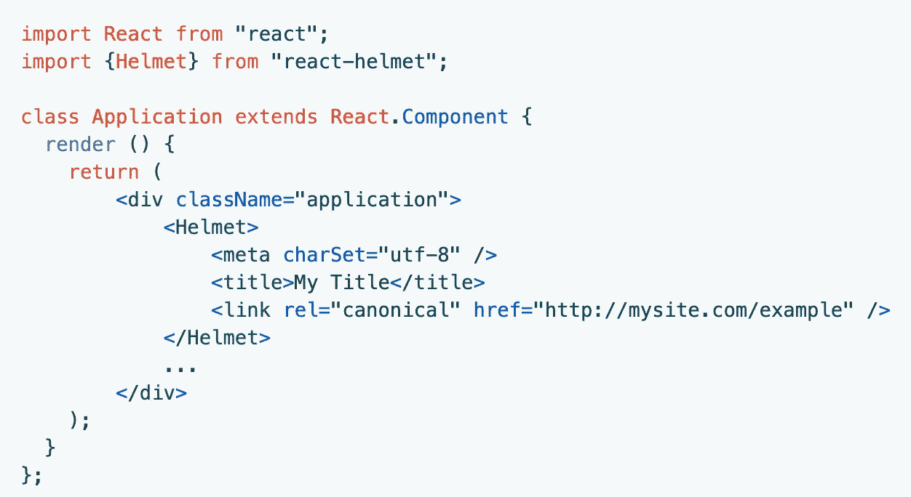
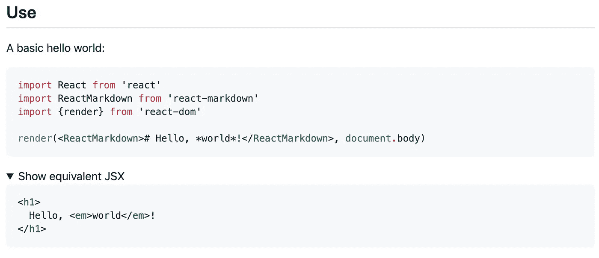

# 我想向您介绍的 8 个 React 库

> 原文：<https://levelup.gitconnected.com/8-react-libraries-that-id-like-to-introduce-to-you-3802770b3952>

在 [Unsplash](https://unsplash.com?utm_source=medium&utm_medium=referral) 上由[斯特凡·斯特凡·契克](https://unsplash.com/@cikstefan?utm_source=medium&utm_medium=referral)拍摄的照片

## 仅仅因为这些图书馆能让你的生活变得更简单

作为一名开发人员，您总是希望让您的生活尽可能简单。知道哪些图书馆可以帮助你是很重要的。不过，这也挺辛苦的。

由于 React 生态系统变化如此之快，很难跟上发生的一切。每天都有新的图书馆出现。你可能会错过一些很棒的图书馆。这正是我想向您介绍这些 React 库的原因。希望这些库可以为您做一些繁重的工作，让您的生活稍微轻松一点！

# 1.反应迟钝

当大多数开发人员想到延迟加载时，他们通常会想到图像。延迟加载可以显著提升应用程序的性能。 [React Lazyload](https://github.com/twobin/react-lazyload) 库不仅在延迟加载图像方面做得很好，而且在任何影响性能的事情上都做得很好——例如，可以是一个组件。

这个库提供了很多选项来改变图像和组件的加载方式。GitHub 上有近 5000 颗星星，这个库是一个非常受欢迎的选择。

# 2.反应灵敏

[React Responsive](https://github.com/contra/react-responsive) 库提供了一种在 React 中包含媒体查询的便捷方式。这个库附带了一个您可以使用的钩子和一个组件——*useMediaQuery*钩子和 *MediaQuery* 组件。

这个库允许您为应用程序创建特定的断点，这些断点可以很容易地重用。请看文档中的以下示例:

开箱即用，这个库可以在大多数现代浏览器中工作。如果需要支持旧版本的浏览器，可以添加聚合填充。React Responsive 在 GitHub 上有超过 5000 颗星，如果您正在寻找将响应式设计添加到 React 应用程序中，您真的应该试试这个库！

# 3.反应美丽的 DnD

[React 美丽的 DnD](https://github.com/atlassian/react-beautiful-dnd) (拖放)库是由 Atlassian(也是吉拉的创造者)创建的。GitHub 上有超过 22K 的 stars，这是这个列表中最受欢迎的库之一。而且理由很充分。

这个库不仅支持垂直和水平的列表移动，还允许你在列表之间拖放项目。这个库的特性列表几乎是无止境的:它包括有条件的拖放，还包括对鼠标、键盘和触摸屏的支持。就拖放而言，这是迄今为止最完整的库。

# 4.样式组件

[样式组件](https://github.com/styled-components/styled-components)库是这个基于 GitHub stars 的列表中最受欢迎的库(超过 32K)。这个库允许您在 React 组件中使用普通的 CSS 样式化组件。

样式组件库的好处之一是它为您的样式生成唯一的类名。这样，您就永远不必担心重复、重叠或拼写错误的类名。最重要的是，创建动态样式非常容易。有了样式组件库，就不再需要在文件之间切换了，因为您可以在组件内部管理样式。

这是一个小例子，展示了创建自己的样式组件是多么容易:

# 5.反应选择

开箱即用，标准的 HTML 选择框在选项上太受限制，而且不太用户友好。 [React Select](https://github.com/JedWatson/react-select) 库解决了标准 HTML select 带来的所有问题。无论你是在寻找单项选择还是多项选择，这个图书馆都能满足你！

我在自己的项目中经常使用这个库。它不仅具有允许您动态搜索选择或添加选项的功能。这个库的另一个优点是它的可定制性。您可以完全改变选择框的样式，但是如果您不喜欢组件开箱即用的方式，您也可以自定义整个组件。

这使得 React 选择库成为 React 中选择框的首选。

[来源](https://react-select.com/home)

# 6.反应头盔

在修改网站的头部元素时，React 头盔库是目前最好的选择。这个库如此神奇的原因之一是它非常容易理解，即使对于经验不足的 React 开发人员也是如此。

这个库支持所有有效的 head 标签——从 title 到 meta 标签。其中一个很棒的特性是，您可以从嵌套组件中覆盖重复的头部更改。最重要的是，React 头盔支持服务器端渲染。

将 React 头盔集成到您的应用程序中是多么容易:

[来源](https://github.com/nfl/react-helmet)

# 7.反应工具提示

如果你在 React 应用程序中需要工具提示，你绝对应该看看 [React 工具提示](https://github.com/wwayne/react-tooltip)库。它包含了许多选项，允许你改变工具提示的行为方式和外观。

React 工具提示允许在工具提示中显示纯文本和原始 HTML。请注意，应该对 HTML 进行清理。这个库有一些钩子，像 *afterShow* 和 *afterHide* 钩子，允许你定制工具提示的行为。

超过 25 个选项，几乎不可能没有符合你要求的工具提示。这个库在 GitHub 上有 2K 多一点的星星。

[来源](https://codesandbox.io/s/heuristic-curran-bddeu?fontsize=14&hidenavigation=1&theme=dark)

# 8.反应降价

我们以 [React Markdown](https://github.com/remarkjs/react-markdown) 库结束 React 库列表。GitHub 上有 6.5K 颗星，这绝对是一个受欢迎的库。这个库与其他 markdown 库的区别之一是，其他库通常依赖于*dangerouslysettinnerhtml*或者在处理 markdown 的方式上有缺陷。

您可以通过添加插件来扩展 React Markdown 的功能。例如，您可以使用一个插件来支持表格、任务列表、删除线和 URL。

React Markdown 库使用起来非常方便:

