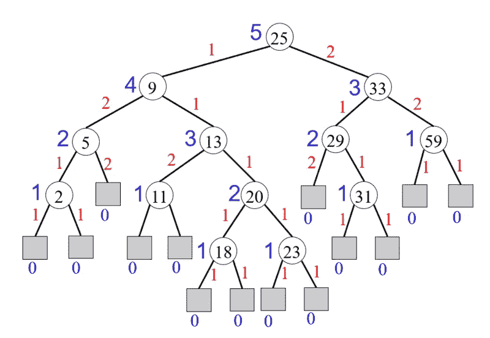
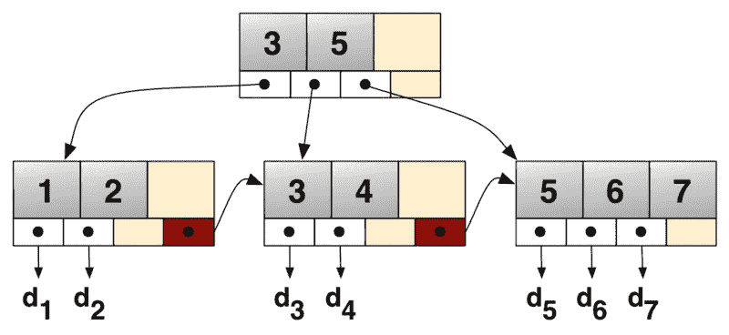
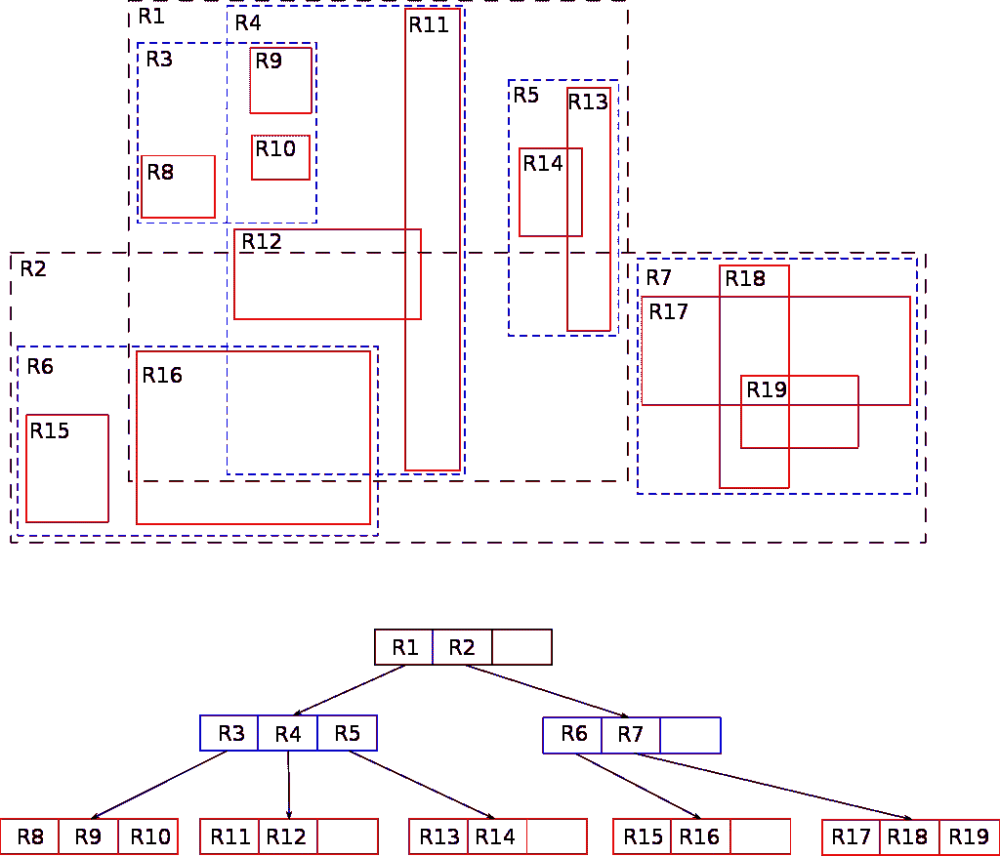
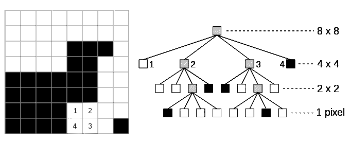
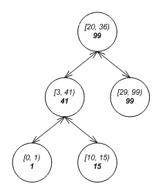
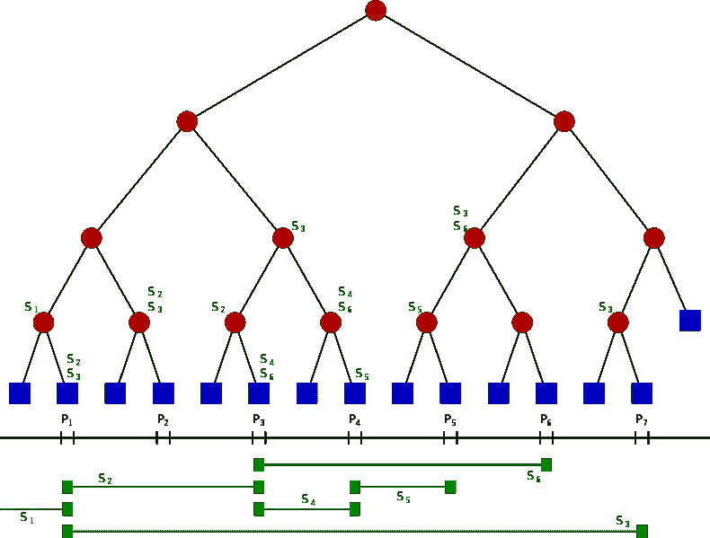
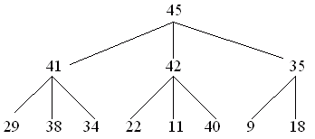

# 为您的工具包提供 8 种现实生活中适用的树数据结构

> 原文：<https://levelup.gitconnected.com/8-real-life-applicable-trees-data-structures-for-your-toolkit-7c0931ebe0c1>

## 现实生活中适用的树以及何时使用它们的简明词汇表

多年来，才华横溢的计算机科学家设计了树状数据结构，推动了现实生活中的应用。那些巧妙的数据结构及其高效的性能使得各种领域的复杂问题有了简单的解决方案；从图像表示和多维数据，通过区间聚合，到数据库和文件系统。

本文是一个简明的术语表，当您偶然发现这些领域中的一个适用问题时，您可以使用它来扩展您的知识。对于每一个树形数据结构，你会发现；它们是如何适用的，允许的操作的复杂性，以及更多信息的教程和链接。

WAVL 树，来源:[维基媒体](https://he.wikipedia.org/wiki/%D7%A7%D7%95%D7%91%D7%A5:Wavl_tree.png)

## WAVL 树

*用法；* [*S* 自平衡二叉查找树](https://en.wikipedia.org/wiki/Self-balancing_binary_search_tree)(等级平衡树)，即基于[节点](https://en.wikipedia.org/wiki/Node_(computer_science))的[二叉查找树](https://en.wikipedia.org/wiki/Binary_search_tree)，面对任意的项目插入和删除，自动保持其高度(根下的最大层数)较小。

*申请；*高效的插入、删除和搜索。

*操作；*

*   插入 *O* (日志 *n*
*   删除 O*(日志 *n**
*   搜索 *O* (日志 *n* )

[维基百科](https://en.wikipedia.org/wiki/WAVL_tree)，[教程](https://www.youtube.com/watch?v=gYvil__LOpM)，[实现](https://github.com/AvivYaniv/Data-Structures/blob/master/1/Code/WAVLTree.java)

B+树，来源:[维基媒体](https://en.wikipedia.org/wiki/File:Bplustree.png)

## B 树和 B+树

*用法；*概括了[二叉查找树](https://en.wikipedia.org/wiki/Binary_search_tree)，允许节点有两个以上的子节点。非常适合读写相对较大数据块的存储系统，如磁盘。

*应用程序；*常用于[数据库](https://en.wikipedia.org/wiki/Database)和[文件系统](https://en.wikipedia.org/wiki/File_system)中，以高效的方式存储和检索数据。

*操作；*

*   搜索 O(登录号)
*   插入 O(日志号)
*   删除 O(日志号)

[维基百科](https://en.wikipedia.org/wiki/B-tree)，[教程](https://www.youtube.com/watch?v=aZjYr87r1b8)

r 树来源:[维基媒体](https://he.wikipedia.org/wiki/%D7%A2%D7%A5_R#/media/%D7%A7%D7%95%D7%91%D7%A5:R-tree.svg)

## r 树

*用法；I* 索引多维信息，如[地理坐标](https://en.wikipedia.org/wiki/Geographic_coordinate_system)、[矩形](https://en.wikipedia.org/wiki/Rectangle)或[多边形](https://en.wikipedia.org/wiki/Polygon)。

*申请；存储空间对象，如餐馆位置或构成典型地图的多边形:街道、建筑物、湖泊轮廓、海岸线等。然后快速找到查询的答案，如“查找我当前位置 2 公里内的所有博物馆”、“检索我当前位置 2 公里内的所有路段”(在[导航系统](https://en.wikipedia.org/wiki/Navigation_system)中显示)或“查找最近的加油站”(尽管不考虑道路)。R-tree 还可以加速各种距离度量的[最近邻居搜索](https://en.wikipedia.org/wiki/Nearest_neighbor_search)，包括[大圆距离](https://en.wikipedia.org/wiki/Great-circle_distance)。*

*操作；*

*   搜索 O(log_M n)平均/ O(n)最坏情况

[维基百科](https://en.wikipedia.org/wiki/R-tree)，[教程](https://www.youtube.com/watch?v=39GuS7c4uZI)

四叉树，来源:[维基媒体](https://en.wikipedia.org/wiki/File:Quad_tree_bitmap.svg)

## 四叉树

*用法；*八叉树的二维模拟，最常用于通过递归细分成四个象限或区域来分割二维空间。

*应用；* [图像处理](https://en.wikipedia.org/wiki/Quadtree#Image_processing_using_quadtrees)、[网格生成](https://en.wikipedia.org/wiki/Quadtree#Mesh_generation_using_quadtrees)、[空间索引](https://en.wikipedia.org/wiki/Spatial_index)、点位置查询和范围查询、高效的二维[碰撞检测](https://en.wikipedia.org/wiki/Collision_detection)、地形数据的[视见平截头体剔除](https://en.wikipedia.org/wiki/Hidden_face_removal#Viewing_frustum_culling)，存储稀疏数据，例如用于[电子表格](https://en.wikipedia.org/wiki/Spreadsheet)或用于某些矩阵计算的格式化信息、多维[场的求解](https://en.wikipedia.org/wiki/Field_(physics)) ( [计算流体力学](https://en.wikipedia.org/wiki/Computational_fluid_dynamics)、[电磁学](https://en.wikipedia.org/wiki/Electromagnetism) [状态估计](https://en.wikipedia.org/wiki/State_estimation) [，](https://en.wikipedia.org/wiki/Quadtree#cite_note-14)四叉树也用于分形图像分析领域，[最大不相交集](https://en.wikipedia.org/wiki/Maximum_disjoint_set#Fat_objects_with_arbitrary_sizes:_PTAS)。

[维基百科](https://en.wikipedia.org/wiki/Quadtree)，[教程](https://www.youtube.com/watch?v=jxbDYxm-pXg)

区间树，来源:[维基媒体](https://en.wikipedia.org/wiki/File:Example_of_augmented_tree_with_low_value_as_the_key_and_maximum_high_as_extra_annotation.png)

## 区间树

*用法；*允许有效地找到与任何给定区间或点重叠的所有区间。

*应用；*可用于窗口查询，例如，在矩形视窗内的计算机化地图上查找所有道路，或在三维场景内查找所有可见元素。

*操作；*

*   创建 O(n 日志 n)
*   查询与任何给定间隔或点 O(log n+m)重叠的所有间隔

[维基百科](https://en.wikipedia.org/wiki/Interval_tree)，[教程](https://www.youtube.com/watch?v=q0QOYtSsTg4)

细分树==统计树，来源:[维基媒体](https://en.wikipedia.org/wiki/File:Segment_tree.svg)

## 细分树==统计树

*用法；*允许查询哪个存储段包含给定点。

*申请；*计算几何[地理信息系统](https://en.wikipedia.org/wiki/Geographic_information_systems)。

*操作；*

*   创建 *O* ( *n* 日志 *n* )
*   在*O*(log*n*+*k*)中查找包含查询点的所有区间， *k* 为检索到的区间或分段的个数。

*属性；*

*   不可变(一旦构建就不能修改)

[维基百科](https://en.wikipedia.org/wiki/Segment_tree)，[教程](https://www.youtube.com/watch?v=Ic7OO3Uw6J0)

D-ary 堆，来源: [Quora](https://www.quora.com/What-is-a-d-heap-data-structure)

## 数据堆

*用法；* [优先级队列](https://en.wikipedia.org/wiki/Priority_queue) [数据结构](https://en.wikipedia.org/wiki/Data_structure)，对[二进制堆](https://en.wikipedia.org/wiki/Binary_heap)的概括，其中节点有 *d* 子节点而不是 2。允许降低优先级操作比二进制堆执行得更快，代价是最小删除操作较慢。这种折衷为 Dijkstra 的算法[带来了更好的运行时间，在 Dijkstra 的算法](https://en.wikipedia.org/wiki/Dijkstra%27s_algorithm)中，降低优先级操作比删除最小操作更常见。此外， *d* 元堆具有比二进制堆更好的[内存缓存](https://en.wikipedia.org/wiki/Memory_cache)行为，这使得它们在实践中运行得更快，尽管理论上最坏情况下运行时间更长。与二进制堆一样，*d*ary 堆是一种[就地数据结构](https://en.wikipedia.org/wiki/In-place_algorithm)，除了需要在堆中存储项目数组之外，它不使用任何额外的存储空间。

*应用程序；*当对具有 *m* 条边和 *n* 个顶点的[图](https://en.wikipedia.org/wiki/Graph_(discrete_mathematics))进行操作时，针对[最短路径](https://en.wikipedia.org/wiki/Shortest_path)的 [Dijkstra 算法](https://en.wikipedia.org/wiki/Dijkstra%27s_algorithm)和针对[最小生成树](https://en.wikipedia.org/wiki/Minimum_spanning_tree)的 [Prim 算法](https://en.wikipedia.org/wiki/Prim%27s_algorithm)都使用一个最小堆，其中有 *n 个*删除-最小操作和多达 *m 个*优先级降低操作。通过使用具有*d*=*m*/*n*的*d*ary 堆，这两种类型的操作的总时间可以相互平衡，导致算法的总时间为 O(*m*log*m*/*n*n，比 O( *m* 有所改进

*操作；*

*   创建 O(n)
*   插入 O(log_k n)
*   移除最大值 O(k log_k n)

[百科](https://en.wikipedia.org/wiki/D-ary_heap)、[教程](https://www.youtube.com/watch?v=jiR8SLAOglw)、[实现](https://github.com/AvivYaniv/Data-Structures/tree/master/2/Code)

展开树，来源:[维基媒体](https://en.wikipedia.org/wiki/Splay_tree#/media/File:Zigzag.gif)

## 八字树

*用法；* [二叉查找树](https://en.wikipedia.org/wiki/Binary_search_tree)具有附加属性，最近访问过的元素可以快速再次访问。

*应用；*实现[缓存](https://en.wikipedia.org/wiki/Cache_(computing))和[垃圾收集](https://en.wikipedia.org/wiki/Garbage_collection_(computer_science))算法。

*操作；*

*   搜索 *O* (日志号)摊销
*   插入 *O* (对数)摊销
*   删除 *O* (日志号)摊销

[维基百科](https://en.wikipedia.org/wiki/Splay_tree)，[教程](https://www.youtube.com/watch?v=IBY4NtxmGg8)

***喜欢这篇文章吗？随意长按👏下面的按钮😀***