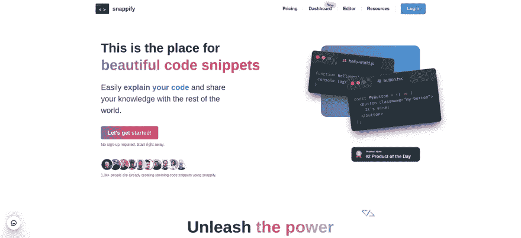

# 我喜欢 Chakra-UI 的 8 个原因

> 原文：<https://levelup.gitconnected.com/8-reasons-why-i-love-chakra-ui-bad36e821282>


在这篇博客中，我将告诉你我热爱 Chakra-UI 的 8 个理由。

# 现在，你为什么想要使用 UI 框架而不是定制的 CSS 样式呢？

原因可能是:

*   你不擅长 CSS 或者你不喜欢它。
*   从头开始的 CSS 工作量太大。
*   你很匆忙。
*   你在设计等等方面很糟糕…

# 视频教程

现在看完博客，想入门 chakra-UI 可以看下面的视频教程。

# 理由

*   **容易上手** : Chakra-UI 容易上手。只需安装软件包并开始编码。下面介绍如何从 nextjs 和 chakra-UI 入手。

```
yarn create next-app <my-app>
cd <my-app>
yarn add @chakra-ui/react @emotion/react@^11 @emotion/styled@^11 framer-motion@^6
```

然后在`_app.js`文件中:

```
import { ChakraProvider } from '@chakra-ui/react'function MyApp({ Component, pageProps }) {
    return (
        <ChakraProvider>
            <Component {...pageProps} />
        </ChakraProvider>
    )
}export default MyApp
```

你可以看到开始使用 Chakra-UI 和 nextjs 非常容易。在 Material-UI 等其他框架中，你必须为 nextjs 做一些额外的设置。

*   **漂亮的设计** : Chakra-UI 有一个非常漂亮的设计。它很简单，没有任何不必要的动画之类的东西。对眼睛有好处。



*   Chakra-UI 有一个美丽而有用的主题。一个
    主题只是一个预定义样式的集合，比如颜色、字体等等。您可以轻松地创建您的主题并使用它。从[这里看主题](https://chakra-ui.com/docs/styled-system/theming/theme)
*   **风格道具**:有了风格道具，几乎可以使用任何 CSS 属性作为道具。还有大量的速记属性会让你工作起来超级简单
*   **非常容易定制** : Chakra-UI 非常容易定制。您可以根据自己的喜好轻松定制。你可以覆盖整个主题。添加可在任何组件中使用的自定义图层样式。
*   **查克拉工厂函数**:它有一个工厂函数，允许你为查克拉组件制作任何 Html 元素。在那个组件中，你可以通过所有有效的 chakra-ui 道具。
*   内置挂钩:Chakra-UI 有一堆有用的挂钩，会让你的工作变得超级简单。例如，`useDiscloure`钩子在你想创建某种像侧边导航的切换模式时非常有用。
*   与其他库的集成:你可以很容易地将 Chakra-UI 与其他库集成，如 framer-motion 和 storybook。

所以，这些就是我热爱 Chakra-UI 的原因。

今天到此为止。保持安全和快乐。