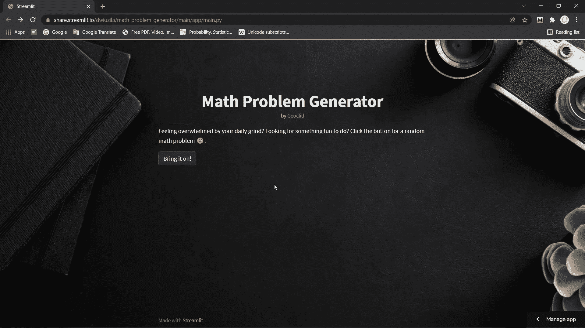
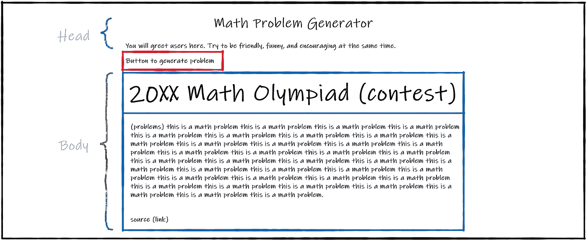
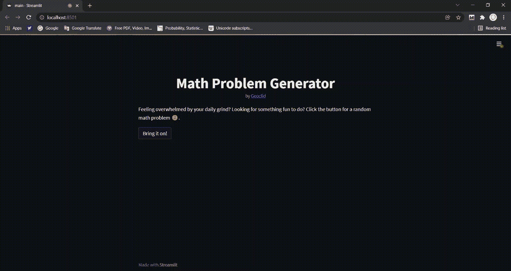
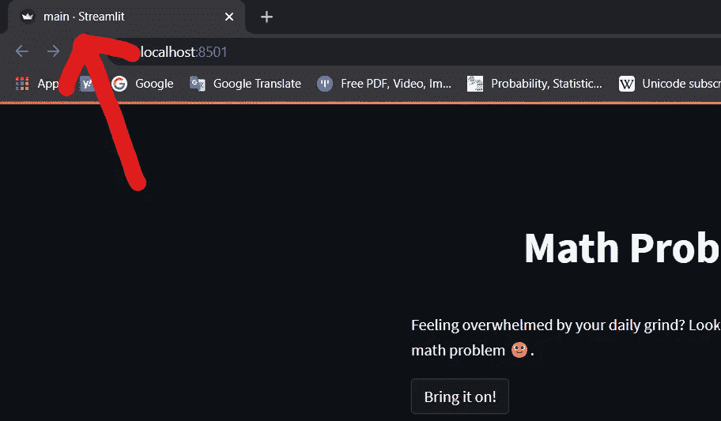
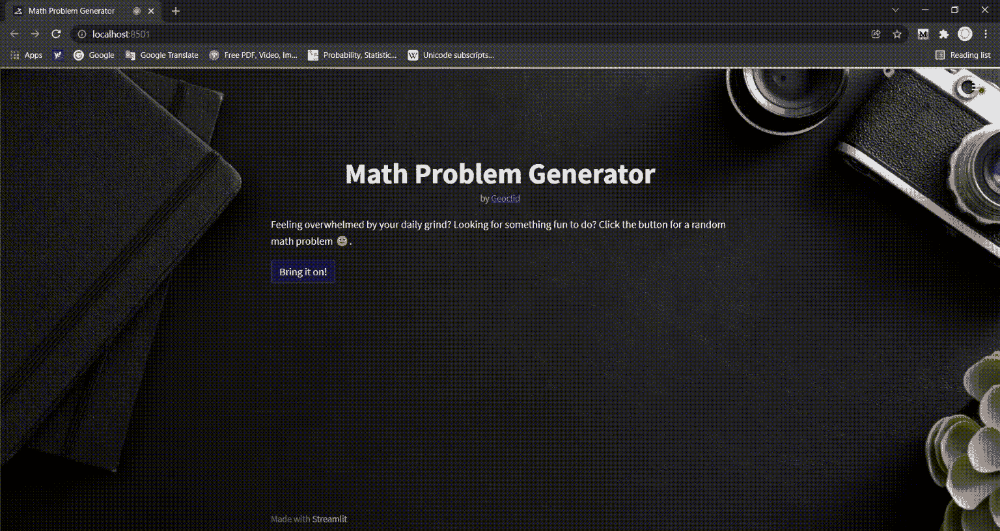
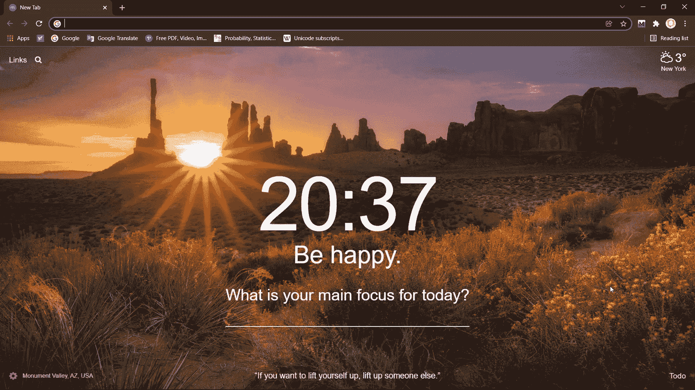
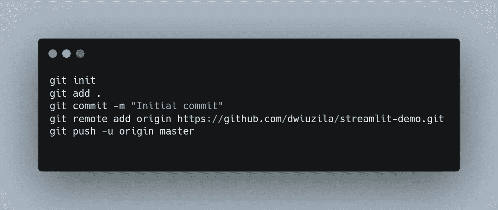
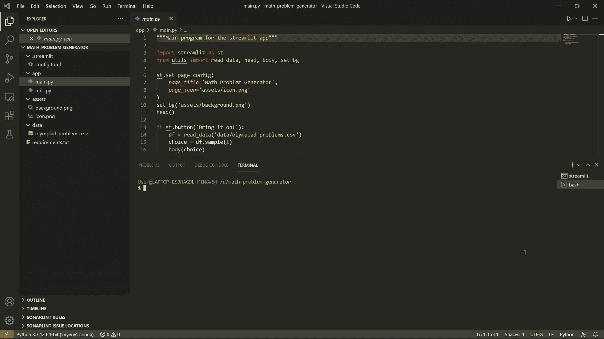
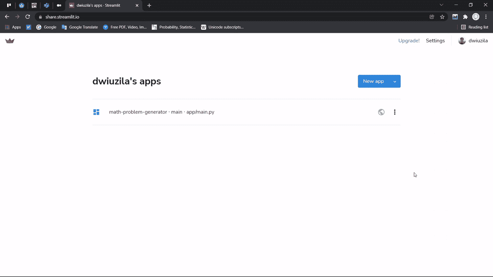

# 构建首个 Streamlit 应用的 8 个简单步骤

> 原文：<https://levelup.gitconnected.com/8-simple-steps-to-build-your-first-streamlit-app-91fe7b3bef9e>

## 实践教程

## 从你的第一行代码，缓存，到部署到野外


图片来自 [Canva](https://www.canva.com/) 由[作者](http://dwiuzila.medium.com/membership)编辑

[**Streamlit**](https://www.streamlit.io/) 是一个开源库，可以轻松创建和共享漂亮的、定制的机器学习和数据科学 web 应用。据说这是最快的方法。

> 只需几分钟，您就可以用 Python 构建和部署强大的数据应用程序，全部免费，不需要任何前端经验。

我喜欢 Streamlit，你也应该喜欢。在这个故事中，我们将一起学习如何通过简单的步骤构建和部署您的第一个 Streamlit 应用程序。而对于刚刚入门的人来说，不用担心，不会涉及到机器学习。

您将创建一个 Streamlit 应用程序，它可以通过单击一个按钮来生成一个随机数学问题(*多棒啊！？*)，通过以下步骤:

```
[**Step 1: Initialize Your Project Structure**](#78c2)[**Step 2: Install Libraries**](#e9ab)[**Step 3: Prepare Dataset**](#eac5)[**Step 4: Sketch Your Web App**](#beb1)[**Step 5: Build Main Functions**](#5a1a)[**Step 6: Add Additional Features**](#f7e3)  ∘ [Add a custom theme](#9ad2)
  ∘ [Add a custom background](#3073)
  ∘ [Add a custom page configuration](#7cde)
[**Step 7: Commit to GitHub**](#ebea)[**Step 8: Deploy Your New App**](#d5a3)
```

在开始之前，你需要有一个 [**GitHub**](http://github.com) 和 [**Streamlit**](http://streamlit.io) 账号(没有的话现在就去创建一个)，还要有 python 的基础知识。

下面是我们在这个故事中试图达到的 [**最终结果**](https://share.streamlit.io/dwiuzila/math-problem-generator/main/app/main.py) 。



在这里免费生成数学题[。插图由](https://share.streamlit.io/dwiuzila/math-problem-generator/main/app/main.py)[作者](http://dwiuzila.medium.com/membership)提供。

# 步骤 1:初始化您的项目结构

这对某些人来说似乎没什么大不了的(尤其是对于小项目)，但是一开始就计划总比以后后悔好。开始时创建项目结构有助于你一次专注于一项任务，并提高你完成项目的效率。这也有助于你的队友或其他人在制作过程中，或者在你将它发布到野外之后，理解你的项目。

项目结构不必是坚固的岩石，不允许在未来的变化或修订。事实上，它几乎肯定会不时更新，以满足您和您的用户的需求。

您的项目结构将像下面这样简单。

```
math-problem-generator
│
├── .streamlit
│   └── config.toml
│
├── app
│   ├── main.py
│   └── utils.py
│
├── assets
│
├── data
│
└── requirements.txt
```

*   目前，`.streamlit`文件夹用于保存包含主题的 Streamlit 配置文件。
*   `app`文件夹包含 python 中的主要代码，这是您的 Streamlit 应用程序的灵魂，它显示什么，以及它如何对用户输入做出反应。
*   `assets`文件夹用于收集对应用程序有用的任何图像或其他媒体。
*   `data`文件夹，顾名思义，将容纳数据，也就是你的 Streamlit 应用的大脑。
*   `requirements.txt`文件包含应用程序依赖的任何包。

目前，所有的文件夹和文件都是空的。您将填写过程中需要的文件和脚本。

# 步骤 2:安装库

你需要的第一个图书馆当然是`streamlit`。既然你用的数据会是 CSV 文件，有`pandas`也不错。通过在`requirements.txt`中编写下面的脚本来存储所有需要的库。为了确保可再现性和避免将来的错误，也要按如下方式编写库版本。

```
pandas==1.2.3
streamlit==1.3.1
```

在您选择的 python 环境中使用`pip`命令安装这些库。您可能希望首先在终端中运行下面的代码，为这个项目创建一个新的虚拟环境。

现在我们可以走了！

# 步骤 3:准备数据集

请记住，您将创建一个可以生成随机数学问题的 Streamlit 应用程序。由于你不希望复杂的机器学习参与自动为你生成数学问题——这种技术还不存在——你将从数据集中提取问题。

幸运的是，我有数据集给你。下面可以直接下载。

您可以使用上面的导出按钮将数据保存到 CSV 文件，将其重命名为`olympiad-problems.csv`，然后将文件移动到`data`文件夹。正如你所看到的，大约有 25000 个问题和 3 个栏目，分别是竞赛名称、链接到源和问题。这些问题是用乳胶写的。

# 第四步:勾画你的网络应用

让我们来构建 web 应用程序的布局。您将把页面分成两部分:

1.  Head:包括标题“数学题生成器”和一两句关于 web app 的话，后面是一个生成数学题的按钮。
2.  Body:包括问题所在的比赛(来自数据集的`contest`列)、问题本身的文本(来自`problems`列)以及 AoPS Online 子页面的源链接(来自`link`列)。

下面是你的草图。简单，但是给你一个用代码做什么的思路，这比边编码边描述要好得多。然而，草图可能会在某些地方有所改变，特别是当一些组件很难编码的时候。



草图作者[作者](http://dwiuzila.medium.com/membership)

# 步骤 5:构建主函数

有趣的部分来了。首先，您将创建一个 python 函数，使用 pandas 从数据集中读取数据。

请注意，`@st.cache` decorator 被用作一种缓存机制，允许您的应用程序保持高性能，即使在从 web 加载数据、操作大型数据集或执行昂贵的计算时也是如此。

接下来，为 web app 的头部构建一个函数(见草图)。

我们使用`st.markdown`作为标题，并允许 HTML 格式强制标题位于页面中间。我们用一个简单的`st.write`来写带有“🙂“表情在最后。另外，请注意，我们使用`st.caption`添加了一个小副标题，上面写着“由[geo lid](http://medium.com/geoclid)”(不在草图中)，你知道，这是对创作者的肯定。

最后，为 web 应用程序的主体创建一个函数(见草图)。

该功能:

1.  接受数据集的一个样本，
2.  将它解析为竞赛名称、来源链接和问题，
3.  然后显示草图中的所有三个。

注意，我们使用`st.info`来突出显示比赛名称。

这三个函数会转到`utils.py`文件。这是该文件的样子(目前):

有了`utils.py`之后，`main.py`文件就很容易了。下面是`main.py`的代码(暂时):

让我解释一下`main.py`。首先，你写下页面的标题，然后点击标题下方的按钮，上面写着“来吧！”这就去。如果按下按钮，将执行以下任务:

1.  从数据集中读取数据，
2.  随机采样 1 个数据，
3.  然后打印页面的正文。

现在，转到终端，键入以下代码，在本地运行 Streamlit 应用程序，看看您已经走了多远。

该应用程序将在您的默认浏览器中启动。如果没有打开，就去 [http://localhost:8501](http://localhost:8501) 手动启动。它看起来会像这样(它可能会在您的设备上以灯光主题显示):



使用主要功能在本地运行应用程序|插图作者[作者](http://dwiuzila.medium.com/membership)

# 步骤 6:添加附加功能

它很棒，但也有一些你可以改进的美学:

*   比纯黑或纯白更有趣的背景
*   自定义主题。因为我们将有一个背景，主题将主要影响按钮的颜色。
*   自定义页面标题和页面图标。目前，它使用标题“主⋅细流”和图标的细流标志。



默认页面标题和图标(红色箭头)|图片由[作者](http://dwiuzila.medium.com/membership)

所以，让我们一个一个来处理:

## 添加自定义主题

在 streamlit 中，主题由五个设置组成:主要颜色、背景颜色、次要背景颜色、文本颜色和字体。所有的颜色都可以用十六进制色码来定义。做起来挺直观的:打开`config.toml`，粘贴以下脚本。

```
[theme]primaryColor="#d33682"
backgroundColor="#002b36"
secondaryBackgroundColor="#586e75"
textColor="#fafafa"
font="sans serif"
```

这种颜色选择是试图模仿著名的[](https://ethanschoonover.com/solarized/)**由[伊森·肖诺夫](https://medium.com/u/6fea1204c123?source=post_page-----91fe7b3bef9e--------------------------------)创作的主题。你可以尝试其他颜色和字体。**

## **添加自定义背景**

**准备一张图片。不要太小，也不要太大，但要适合你的浏览器。尺寸 1920 × 1080 的图像绰绰有余。将图像存储在`assets`文件夹中。在我们的例子中，图像的名称是`background.png`。**

**Streamlit 本身不支持自定义背景(至少对于我们使用的版本是这样)，所以我们需要一个转变。因为我们使用本地图像，所以我们需要一个 python 库`base64`来编码图像并返回编码的字节，然后再次解码。不完全理解也不用担心这部分。你需要知道的是，下面的`get_base64`功能将帮助你添加一个本地图像到你的网络应用程序的背景中。**

**下一个技巧是通过允许 HTML 格式化来使用`st.markdown`。**

**将这两个函数添加到`utils.py`文件中。这是该文件的最终版本:**

**你还没说完。在`main.py`文件中，从`utils`导入`set_bg`函数，用输入参数`assets/background.png`调用。**

## **添加自定义页面配置**

**这很简单。为图标创建一个小图像，假设它的名称是`icon.png`，然后将图像放在`assets`文件夹中。然后，将这段代码添加到`main.py`文件中。**

**包括之前自定义后台设置的代码，我们得到最终版本的`main.py`文件如下。**

**像以前一样在本地运行应用程序，或者如果页面仍然打开，只需刷新页面。你现在可以看到结果，脸上露出笑容。**

****

**使用附加功能在本地运行应用程序|插图由[作者](http://dwiuzila.medium.com/membership)绘制**

# **步骤 7:提交到 GitHub**

**现在让我们来看看你的项目结构。所有的文件和文件夹都达到了我们期望的目的。**

```
math-problem-generator
│
├── .streamlit
│   └── config.toml
│
├── app
│   ├── main.py
│   └── utils.py
│
├── assets
│   ├── background.png
│   └── icon.png
│
├── data
│   └── olympiad-problems.csv
│
└── requirements.txt
```

**作为这一步，为这个项目创建一个新的 GitHub 存储库:**

1.  **转到[**github.com/new**](https://github.com/new)并输入您的存储库名称。我的情况是`streamlit-demo`。**
2.  **单击页面底部的“创建存储库”按钮。**
3.  **复制存储库 URL。**

****

**在 GitHub 上创建一个新的存储库|插图作者[作者](http://dwiuzila.medium.com/membership)**

**之后，到您的终端键入这些脚本。别忘了把网址改成你刚才复制的那个。**

********

**将代码提交到远程存储库|插图作者[作者](http://dwiuzila.medium.com/membership)**

**这些脚本所做的是初始化本地 git 存储库，添加并保存所有文件和文件夹，然后将它们推送到远程存储库(GitHub 上的那个)。**

# **步骤 8:部署你的新应用**

**进入[**share . streamlit . io**](https://share.streamlit.io/)，然后点击“新建 app”按钮。填写存储库、分支和主文件路径。在我的例子中，分别是`dwiuzila/streamlit-demo`、`master`和`app/main.py`。**

****

**将您的应用部署到野外|插图作者[作者](http://dwiuzila.medium.com/membership)**

**等待几分钟，您的第一个应用程序将被部署。你可以在这里看到结果[](https://share.streamlit.io/dwiuzila/streamlit-demo/app/main.py)*。***

***恭喜你！***

# ***包扎***

***这是一个完整的分步教程，介绍如何构建您的第一个 Streamlit 应用程序，从初始化项目结构和安装库、编码，到部署应用程序，以便每个人都可以通过 URL 访问它。您还使用 GitHub 上的公共存储库来存储您的应用程序代码，并学习了 git 命令基础来处理操作。你学到的 8 个步骤也适用于各种各样的 Streamlit 应用程序，尤其是对你未来的项目。祝你好运！***

******

***🔥你好！如果你喜欢这个故事，想支持我这个作家，可以考虑 [***成为会员***](https://dwiuzila.medium.com/membership) *。每月只需 5 美元，你就可以无限制地阅读媒体上的所有报道。如果你注册使用我的链接，我会赚一小笔佣金。****

***🔖*想了解更多关于经典机器学习模型如何工作以及如何优化其参数的信息？或者 MLOps 大型项目的例子？有史以来最优秀的文章呢？继续阅读:****

***

[艾伯斯·乌兹拉](https://dwiuzila.medium.com/?source=post_page-----91fe7b3bef9e--------------------------------)*** 

## ***从零开始的机器学习***

***[View list](https://dwiuzila.medium.com/list/machine-learning-from-scratch-b35db8650093?source=post_page-----91fe7b3bef9e--------------------------------)******8 stories************************

[艾伯斯·乌兹拉](https://dwiuzila.medium.com/?source=post_page-----91fe7b3bef9e--------------------------------)*** 

## ***高级优化方法***

***[View list](https://dwiuzila.medium.com/list/advanced-optimization-methods-26e264a361e4?source=post_page-----91fe7b3bef9e--------------------------------)******7 stories************************

[艾伯斯·乌兹拉](https://dwiuzila.medium.com/?source=post_page-----91fe7b3bef9e--------------------------------)*** 

## ***MLOps 大型项目***

***[View list](https://dwiuzila.medium.com/list/mlops-megaproject-6a3bf86e45e4?source=post_page-----91fe7b3bef9e--------------------------------)******6 stories************************

[艾伯斯·乌兹拉](https://dwiuzila.medium.com/?source=post_page-----91fe7b3bef9e--------------------------------)*** 

## ***我最好的故事***

***[View list](https://dwiuzila.medium.com/list/my-best-stories-d8243ae80aa0?source=post_page-----91fe7b3bef9e--------------------------------)******24 stories************************

艾伯斯·乌兹拉*** 

## ***R 中的数据科学***

***[View list](https://dwiuzila.medium.com/list/data-science-in-r-0a8179814b50?source=post_page-----91fe7b3bef9e--------------------------------)******7 stories************************[](https://dwiuzila.medium.com/membership)***