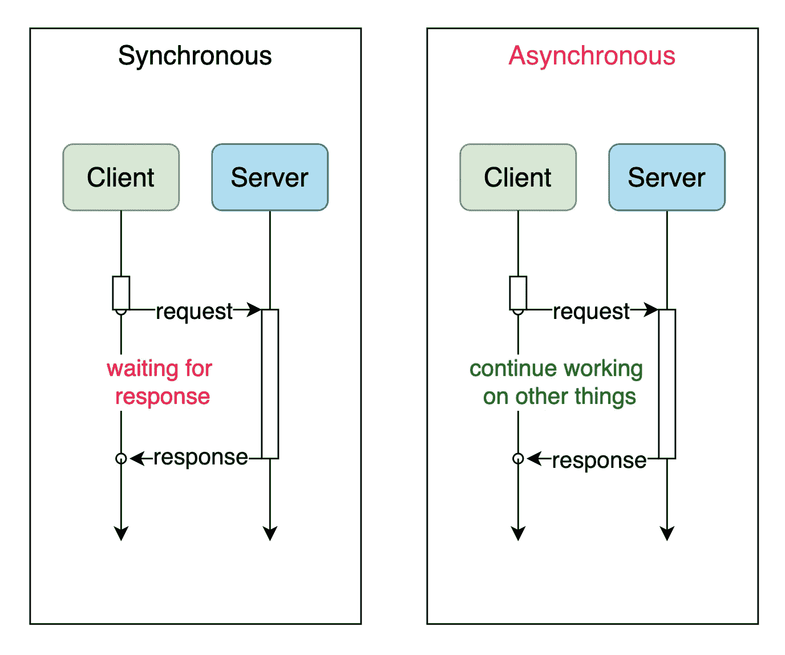

# 当你想很好地使用 Spring @Async 时，你需要知道的 8 件事情

> 原文：<https://levelup.gitconnected.com/8-things-you-need-to-know-when-you-want-to-use-spring-async-really-well-e5af4af259c5>



作为一名优秀的 Java 开发人员或架构师。我们必须掌握并发和异步这两个核心概念，这对我们设计和优化系统有很大的帮助。

在这篇文章中。我就说说如何在异步处理上很好的使用 spring annotation @Async。阅读后，你可以找到一些好的例子。


代码—带走

## 1.我们需要了解什么时候使用它，为什么要使用它。

**场景一。服务之间的交互数据，没有顺序处理的要求**

订单服务传输给供应链服务的订单数据，比如订单 A 和订单 B，它们传输给供应链系统的时机不影响供应链服务处理流程，对最终的业务结果没有影响。

**场景二。邮件/消息分发。**

在消息处理中，一条消息需要分发给多个用户，如果是同步处理，需要一条一条发送，但是因为是消息分发场景，不需要顺序处理，所以我们可以把同步处理一条一条优化成异步并发处理。也就是说，每个用户同时分配一个单独的线程来处理消息传递。

比如我们需要给 20 个用户发消息，给一个用户发消息需要 2s。

同步:逐个处理一条消息需要 40 多秒，

异步并发:只需要 2s+就可以完成流程。

这大大提高了消息处理的效率。

**场景 3。中间件消费。**

在消息中间件的使用中，当你消费一条消息时，往往会有一个消费处理时间限制，如果时间过长会触发中间件将消费者标记为异常，并踢出消费群等情况。因此，我们需要优化和提高每次消息消费的时间和效率。但是，异步不需要等待处理完成，可以立即返回，所以这里可以使用异步处理来提高响应，缩短返回时间。

**场景 4。IO 操作或需要大量计算的耗时操作**

对于网站或交易系统来说，消耗数据或执行延迟来换取用户延迟是值得的，因为用户体验会因此得到改善。活动跟踪、账单支付、报表处理显然应该是后台活动，很多步骤可以作为异步操作部分解决，以后能做的事情以后再做

好的。在我们理解了什么时候以及为什么需要使用它之后。那我们就去怎么用吧。

# 2.怎么用？

只需简单地将@Async 添加到您希望成为异步的方法中。

# 3.怎么用好？

为了更好地利用它，我们需要知道什么条件会导致它失败(仍然以同步方式运行)。异步不起作用)

1.如果使用 SpringBoot 框架必须在启动类中添加 **@EnableAsync** 注释。

2.标记的方法使用静态的私有修改。【它必须只应用于**的*公共*的**方法。]

3.异步方法所在的类不使用@Component 注释(或其他注释),所以 spring 无法扫描异步类

4.被标记的方法不能与要调用的异步方法
在同一个类中(原因是:spring 扫描 bean 时，会扫描该方法是否包含@Async 注释，如果包含，spring 会为 bean 动态生成一个子类(即代理类，proxy)，该子类继承自原始 bean。此时，当调用带注释的方法时，它实际上是由代理类调用的，这给调用增加了异步性。但是，如果被注释的方法被同一个类中的另一个方法调用，那么该方法不是通过代理类调用的，而是直接通过原 bean 调用的，所以没有添加异步效果，我们看到了@Async 注释无效的现象。

***推荐的方式*** 是按照业务将异步方法提取到对应的 bean 中，在外部需要使用时注入 bean，然后在 bean 中调用异步方法。

5.该类需要使用@Autowired 或@Resource 等标注自动注入，不能手动新增对象[Self-invocation —不起作用。]

因为它绕过代理，直接调用底层方法。

6.被标记的方法只能返回 **void 或 Future**

7.在@Async 方法上标记@Transactional 不起作用。

通过将@Transactional 添加到内部调用的方法中，可以将需要事务管理操作的方法放在异步方法中。

举例。使用@Async/@Transactional 进行注释的方法 A 不能产生事务控制目的。

标有@Async 的方法 B 调用 B 中的 C 和 D，C/D 分别标有@Transactional，那么就可以达到事务控制的目的。

8.@Async 注释导致 spring 循环依赖失败

假设 serviceA 和 serviceB 对象相互依赖。在这种情况下，serviceA 和 serviceB 中的一个将总是首先被实例化，如果在 serviceA 或 serviceB 中使用@Async 注释，将导致循环依赖异常:

```
org.springframework.beans.factory BeanCurrentlyInCreationException

In springboot, the above error is caught and the exception thrown is: 'The dependencies of some of the beans in the application context form a cycle'
```

原因:
我们知道，spring 三级缓存通过在之前的三级缓存中加入 ObjectFactory，在一定程度上解决了循环依赖问题

```
populateBean(beanName, mbd, instanceWrapper)
```

它在 A 对象的实例化之后被执行，因此允许在实例化之后从 B 对象分配属性。在赋值过程中，可以从三级缓存中获取 ObjectFactory，并调用 getObject()方法来获取 a 的引用，然后 B 可以成功初始化并添加到 IOC 容器中。此时，在 A 对象完成属性分配后，它将执行

```
initializeBean(beanName, exposedObject, mbd)
```

重点是这里做的@Async 标注的处理，对应的后处理器 AsyncAnnotationBeanPostProcessor，在 postProcessAfterInitialization 方法中会返回代理对象，这个代理对象和 B 中保存的 A 对象引用不同，导致了上面的错误。

## 外卖

*   基本使用案例

```
@Slf4j
@RestController
@RequestMapping(value = "/v1")
public class AsyncController {

    @Autowired
    public AsyncService asyncService;

    @GetMapping("/async/work")
    public HttpStatus work() {

        log.info("in Controller");
        asyncService.step1();
        asyncService.step2();
        asyncService.step3();
        return HttpStatus.OK;
    }
}

@Slf4j
@Service
public class AsyncService {

    @Async
    public void step1(){
        log.info("step 1");
    }

    @Async("asyncExecutor")
    public void step2(){
        log.info("step 2");
    }

    @Async("fixedThreadPool")
    public void step3(){
        log.info("step 3");
    }
}
```

*   在同一个类中调用异步方法

```
@Slf4j
@RestController
@RequestMapping(value = "/v1")
public class AsyncController {

    @Autowired
    public AsyncService asyncService;

    @GetMapping("/async/work/methodsInSameClass")
    public HttpStatus work1() {

        log.info("test async working method in same class");
        asyncService.allInSameClass();
        return HttpStatus.OK;
    }

    @GetMapping("/async/fail/methodsInSameClass")
    public HttpStatus fail1() {

        log.info("test async not working");
        asyncService.all();
        return HttpStatus.OK;
    }
}

@Slf4j
@Service
public class AsyncService {

    @Autowired
    public AnotherAsyncService anotherAsyncService;

    public void all(){
        /**
         * As step1() step2() step3() in same class as all().
         * which will make those 3 steps called by same caller as all() not the proxy caller. then async fail
         */
        step1();
        step2();
        step3();
        /**
         * But as step4() step5() step6() in different class. then 4,5,6 will do async way.
         */
        anotherAsyncService.step4();
        anotherAsyncService.step5();
        anotherAsyncService.step6();
    }

    public void allInSameClass(){
        /**
         *  Methods in the same class need to get the proxy object first, manually get the object
         */
        AsyncService bean = ApplicationContextUtil.getBean(AsyncService.class);
        bean.step1();
        bean.step2();
        bean.step3();
    }
}
```

*   处理未来的返回值

```
@Slf4j
@RestController
@RequestMapping(value = "/v1")
public class AsyncController {

    @Autowired
    public AsyncService asyncService;

    @GetMapping("/async/workWithFutureReturn")
    public HttpStatus workWithFutureReturn() {

        log.info("in workWithFutureReturn");
        Future<String> stringFuture = asyncService.asyncInvokeReturnFuture(5);

        while (true) {
            if (stringFuture.isDone() && !stringFuture.isCancelled()) {
                try {
                    log.info("Get Future Value {}", stringFuture.get());
                } catch (InterruptedException | ExecutionException e) {
                    e.printStackTrace();
                }
                break;
            }
        }
        return HttpStatus.OK;
    }
}

@Slf4j
@Service
public class AsyncService {

    @Async
    public Future<String> asyncInvokeReturnFuture(int i) {
        log.info("asyncInvokeReturnFuture, parementer={}", i);
        Future<String> future;
        try {
            Thread.sleep(1000 * 1);
            future = new AsyncResult<String>("success:" + i);
        } catch (InterruptedException e) {
            future = new AsyncResult<String>("error");
        }
        return future;
    }
}
```

*   自定义线程池，多个异步执行器

```
@Slf4j
@Configuration
public class BaseAsyncConfigurer implements AsyncConfigurer {

    /**
     * replace default Async Executor with Customize One.
     */

    @Override
    public Executor getAsyncExecutor() {
        ThreadPoolTaskExecutor executor = new ThreadPoolTaskExecutor();
        executor.setCorePoolSize(Runtime.getRuntime().availableProcessors());
        executor.setMaxPoolSize(Runtime.getRuntime().availableProcessors()*5);
        executor.setQueueCapacity(Runtime.getRuntime().availableProcessors()*10);
        executor.setThreadNamePrefix("replacedAsync-");
        executor.setRejectedExecutionHandler(new ThreadPoolExecutor.CallerRunsPolicy());
        executor.initialize();
        return executor;
    }

    ...

}
```

```
//two customize asyncExecutors
@Configuration
public class AsyncConfig {

    private static final int MAX_POOL_SIZE = 50;
    public static final int CORE_POOL_SIZE = 20;

    /**
     * customize async Executor threadpool.
     * @return
     */
    @Bean("asyncExecutor")
    public AsyncTaskExecutor asyncTaskExecutor() {
        ThreadPoolTaskExecutor async = new ThreadPoolTaskExecutor();

        async.setMaxPoolSize(MAX_POOL_SIZE);
        async.setCorePoolSize(CORE_POOL_SIZE);
        async.setThreadNamePrefix("async-threads-");
        async.setWaitForTasksToCompleteOnShutdown(false);
        async.setQueueCapacity(100);

        async.setRejectedExecutionHandler(new ThreadPoolExecutor.CallerRunsPolicy());
        return async;
    }

    /**
     * use juc newFixedThreadPool
     * @return
     */
    @Bean("fixedThreadPool")
    public ExecutorService myFixedThreadPool() {
        int processors = Runtime.getRuntime().availableProcessors();
        return Executors.newFixedThreadPool(processors * 5);
    }
}

@Slf4j
@Service
public class AsyncService {

    @Async
    public void step1(){
        log.info("step 1");
    }

    @Async("asyncExecutor")
    public void step2(){
        log.info("step 2");
    }

    @Async("fixedThreadPool")
    public void step3(){
        log.info("step 3");
    }
}
```

*   异常的处理方式

```
@Slf4j
@Configuration
public class BaseAsyncConfigurer implements AsyncConfigurer {

    ...

    /**
     * override the getAsyncUncaughtExceptionHandler() method to return our custom asynchronous exception handler:
     * !!! All the exception happened in @async will been handler here.
     */
    @Override
    public AsyncUncaughtExceptionHandler getAsyncUncaughtExceptionHandler() {
        return (Throwable ex, Method method, Object... params)->{

            try {
                log.error("\n\n[Exception-Async-Handler] Class-Name: {}-{}\nType: {}\nException: {}\n\n",
                        method.getDeclaringClass().getName(),method.getName(),
                        ex.getClass().getName(),
                        ex.getMessage());
            } catch (Throwable nex) {
                log.error("catch Async Exception: {}", nex);
            }
        };
    }

}
```

*   @Async 调用中的事务处理机制

```
@Slf4j
@Service
public class AsyncService {

    @Autowired
    public DataService dataService;

    @Async
    public void dbOperate(){
        log.info("some logic here first");
        dataService.allStep();
        log.info("some logic later");
    }

}

@Slf4j
@Service
public class DataService {

    @Transactional
    public void allStep(){
        saveObj();
        updateObj();
    }

    public void saveObj(){
      log.info("Some data saved");
    }

    public void updateObj(){
        log.info("Some another data updated");
    }
}
```

就是这样。

感谢阅读！如果你喜欢它或觉得它有帮助，请点击鼓掌:)

快乐编码。下次见:)