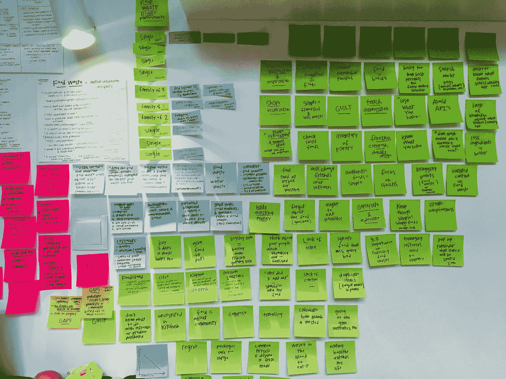

# 让你的软件员工开心和工作的 8 个技巧

> 原文：<https://levelup.gitconnected.com/8-tips-for-keeping-your-software-employees-happy-b03391f105f9>

## *如何 f* 一个 *ce 在软件行业的减员。用这些小贴士来减少摩擦，让人们保持参与、快乐和高效。*

照片由[扬·廷伯格](https://unsplash.com/@craft_ear?utm_source=medium&utm_medium=referral)在 [Unsplash](https://unsplash.com?utm_source=medium&utm_medium=referral) 拍摄

在过去的 15 年里，我一直是一名 IT 经理。我在小、中、大公司都工作过。创业公司和跨国公司。我在特拉维夫、胡志明市和巴塞罗那工作过(也为日本、美国和加拿大的企业工作过)。

总的来说，我对 IT 行业有一个好的总体看法，包括它的问题、缺陷和闪光点。一个反复出现的问题是技术员工的流失。在这篇文章中，我总结了我多年来处理软件行业员工流失的经验。

# #1 高薪

德米特里·德米德科在 [Unsplash](https://unsplash.com?utm_source=medium&utm_medium=referral) 上拍摄的照片

人们想要公平的工资。他们得到了支付账单的工作。没有人在糟糕的一天起床去办公室只是为了履行自己的职责。即使他们喜欢他们正在做的事情。还有，如果是他们的激情。感情工资都是扯淡。成长的需要和自我实现是可悲的第二层。

你可以用镜子和烟雾留住工程师，但最终，他们会离开。不要欺骗自己，给员工发高薪，了解你所在地区行业的平均薪酬，在需要的时候而不是公司政治允许的时候进行薪酬评估。

一个薪水合理的员工会度过艰难时期。当他不得不做一些讨厌的事情时，他不完全同意甚至反对自己的想法，他会接受他为此得到了适当的补偿。高薪工程师在每份工资单上都感受到了公司的赏识。

这一点非常重要，值得写一篇文章。它有几个角箱。没有更多的预算时，你能做什么？或者在加薪后，你的一个关键工程师档案从一个竞争对手那里得到了更高的报价？毫无疑问，那篇文章在我的任务清单上。

> 软件开发人员知道找到一份新工作很容易，如果你不按照市场支付他们，他们就会离开。

 [## 批量使用 RESTful APIs

### 当我们使用 RESTful APIs 时，我们如何处理批量操作

itnext.i](https://itnext.io/bulk-with-restfull-apis-7c5e6be84ed3) 

# #2 拥有超级灵活的工作环境

在 [Unsplash](https://unsplash.com?utm_source=medium&utm_medium=referral) 上由[埃斯特·扬森斯](https://unsplash.com/@esteejanssens?utm_source=medium&utm_medium=referral)拍摄的照片

软件开发人员讨厌被当成 19 世纪的职员。办公室是让他们轻松工作的设施，而不是他们必须一天呆 8 个小时的地牢。开放空间、会议室和放松点都是工具，没有地方把它们锁起来。

我在三个不同的部分讨论了这种灵活性:

*   **允许人们远程工作**

这可能是灵活性的关键组成部分。允许您的工程师在他们觉得更舒适的地方工作。如今，在 IT 行业，没有人需要一天 8 小时都被锁在办公桌前。你真的需要把你的工程师拧到他们的位置上吗？这个决定有什么价值？

如果你想减轻员工的压力，增加他们对项目的参与度，这一点就能起到作用。你的员工将节省通勤时间，将能够更好地组织平衡他们的私人生活，因此，他们将更有效地工作。有可能组织他们的日常日程，能够更好地平衡他们的私人生活，这将推动他们与公司的互动。

根据您组织的需求、产品的复杂性和员工的成熟度，您可以采用完全远程策略或部分远程策略。在第一种情况下，员工从不去办公室，或者一个季度只去一两次。在第二种情况下，他们一周有几天去办公室，主要是参加面对面的会议和思想风暴。

当然，为了充分做到这一点，您应该准备好一套工具和流程。你会发现你已经在使用它们中的大部分了，比如一个有效的远程呼叫系统(例如:Zoom，Google Meet，Skype)或者一个任务管理程序(例如:吉拉，周一，Asana)。

*   不要设定固定的假期。

让工程师随心所欲地休假。团队的责任是确保业务连续性和完成承诺的路线图。你的职责是意识到他们已经做了他们该做的，并且有应急计划。

此外，每个职能部门至少应有一名员工随时待命。这一事实对于那些负责事件(通常是后端和基础设施)的团队来说尤其如此。虽然这是唯一可能会给你带来一些问题的地方，尤其是在圣诞节和夏天，但是任何一个成熟的员工都应该明白这个限制的重要性。

*   **没有严格的出入时间**

不要强迫固定的时间在办公室。也不想结束这一天。人有不同的生物节律。他们中的一些人需要避开交通堵塞。此外，还有一些熟悉的职责需要考虑，比如送孩子上学。

这一点的唯一限制来自他们需要参加的面对面会议。只要有一点点责任感，这个动作就像魔咒一样管用。

# #3 倾听并让人们来决定

雨果·罗查在 [Unsplash](https://unsplash.com?utm_source=medium&utm_medium=referral) 上的照片

您正在与选定的专家合作。如果你做了你的工作，你已经雇佣了知道该做什么的人。如果你幸运，他们比你更了解细节(如果不是，你必须做到这一点！).你关注了他们的持续训练、他们的动机和他们的表现。

当然，作为一名经验丰富的 IT 经理，您也掌握了相当多的知识。此外，您是技术现实和业务规范之间的桥梁，您可以提供更专业的观点。但你不必成为山顶上的智者。你必须与向你汇报的人合作，找到解决任何挑战的最佳方案。

当一个团队需要提供技术解决方案、改进架构或设计新产品时，我会遵循以下规则。我建议您将它们作为指南:

**让团队提供答案。**大多数时候，一个积极上进、训练有素的团队会提供正确的解决方案。您只需要仔细检查所有的技术规格和业务需求是否已经涵盖。

**如果您对解决方案有疑问，**请向您的工程师表达，走到黑板前画出来，要求提供更多细节，在桌子上写下您看不到的原因。然后听听你们团队的回答。需要多少就问多少。如果团队不能给你一个消除你所有担忧的经验性答案，那就要求他们找到答案。通常，在寻找答案的过程中，他们会解决你的不确定性或验证它。

如果你的怀疑只是一个短暂的担忧，你无法用经验数据来证明，那么就把理由告诉你的员工。提醒他们你的担心，并在万一发生什么事情时提供帮助。在这个过程中学习为什么以及如何出现这个特殊的问题。下一次，你将能够衡量它，并用可靠的事实而不仅仅是直觉来帮助你的团队。

**如果你知道他们错了，**他们提出了一个不符合预期的糟糕解决方案，那么你需要向他们展示失败。你一定很喜欢说教。不要傲慢。耐心点，展示你所有的信息。如果他们仍然有疑问，那么请他们做一个简单的概念验证，一个负载测试，或者任何其他可以说明你的观点的实践任务。

关于这个话题，我的最后一个建议是，你应该试着不要屏蔽来自团队的想法。相反，你应该激励，教导，展示，训练。决策必须来自合作，而不是强加。尽管如此，在我的职业生涯中，有时我发现自己处于一个必须采取行动的境地。我是对的。时间证明了这一点。但这是痛苦的胜利。

# #4 锻造团队

照片由[佩里·格罗内](https://unsplash.com/@perrygrone?utm_source=medium&utm_medium=referral)在 [Unsplash](https://unsplash.com?utm_source=medium&utm_medium=referral) 上拍摄

团队是软件开发的动力单元。自从敏捷方法兴起以来，尤其如此。一组高度专注的软件开发人员可以实现比他们的每一个组件更好的目标。

*   **给他们一个目的**

为团队设定一个远大而清晰的目标。达到技术项目的要求将会激励他们。所有人将一起朝着一个共同的目标努力，这将激发团队精神。理想情况下，你必须修正 KPI 和 okr，但这也取决于其他因素，比如公司特质。

*   **给他们自主权**

给他们第一个动力，召开第一次动员会，采用敏捷框架。之后就不要再推什么组织决定了。你可以强烈推荐一些实践，你可以训练他们，但是让他们从零开始建立他们如何组织团队。

关于纯粹的技术决策，我指的是上一点所解释的:倾听并让人们来决定。

*   **给他们资源**

你为你的团队提供的自主性什么都不是，如果你不能确保团队有正确的工具来完成他们的工作，那就是纯粹的空虚。这里我们谈论的是硬件，如好的电脑、显示器等。，还有软件，比如一流 ide 的许可证。此外，您需要确保他们接受了适当的培训(课程、会议、手册等)。).

*   **在逆境中支持他们**

总会有不如意的时候。这些可能来自团队或外部来源的错误。也许是交付更多功能的压力太大了。不管你是在一家成功的大公司工作，还是在一家有前途的小公司工作，这种事情都会发生。你必须保护你的团队，同时要求他们发挥出最佳表现。

*   **如果团队不是作为一个整体工作，要快速反应**

发生此问题有多种原因。大多数时候，团队本身会做出反应，并最终解决任何问题。但是在小组的第一阶段，他们可能需要额外的帮助。通常，这是来自不确定性，因为他们没有明确的目标；他们需要额外的资源；他们需要学习如何运用他们的自主权。在你的手中，与他们合作，克服所有这些逆境。

一个反复出现的问题是一些工程师的团队配合。这个问题是最大的挑战之一，因为它会衍生出群体内部的持续争斗。如果第一次调解没有改善情况，你最好把他们调到另一个接收效果更好的团队。当然，如果你发现了一个有害的特征，或者你无法摆脱冲突人群，不要犹豫，摆脱他们。

*   **测量结果**

任何团队在任何时候都应该对自己的表现负责。建立两周一次的里程碑，与团队一起回顾他们的进展。如果(或当)他们采用敏捷方法时，您可以使用评审。此外，与团队成员一起跟进，以便更好地了解他们的进展。

最后，我推荐

[马科斯·迈尔在](https://medium.com/u/34d45992ae5b#5 诚实</h1><figure class=) [Unsplash](https://unsplash.com?utm_source=medium&utm_medium=referral) 上的照片

有时候，环境是不公平的。也许规范中的一个错误会导致整个项目被关闭。或者达成一份合同对业务的未来至关重要，路线图的改变是强制性的。也许公司发生了变化，或者被收购了，目标完全改变了。

无论发生什么迫使你混合你的标准，改变路线图或者推迟那个闪耀的项目，不要对你的 IT 人员撒谎。这一点相当重要。不要撒谎。不要试图掩盖事实。不要破坏信任。你的工程师很聪明(这也是你当初雇佣他们的原因)。只是揭露事实，相信他们处理不确定性的成熟，并帮助他们适应新的现实。

根据我的经验，你的雇主会发现你的谎言，尤其是当这些谎言成为一种模式的时候。你说他们是笨蛋。在最好的情况下，他们会生你的气，最有可能的是，他们的承诺和表现会受到影响；最坏的情况是，他们会更新自己的 LinkedIn 个人资料。他们将会领先一步。

# #6 了解你的员工

艾米丽·莫特在 [Unsplash](https://unsplash.com?utm_source=medium&utm_medium=referral) 上的照片

跟我重复一遍:你永远不会和你的员工开太多一对一的会议。当然，并不总是可能的。这取决于你所在团队/部门的人数。但至少每周一次，你应该与你的直接报告人进行后续会议。

你必须在向你报告的线索中培养同样的警察。他们应该与团队成员进行一对一的交流。此外，每个月至少找一次时间补上那些你认为重要的资料。与他们保持联系是你的职责。一个*“让你的大门永远敞开”*的方法是必须的，但这还不够。你必须找时间与他们互动:与团队、个人共进午餐，变得平易近人，引发一些闲聊，建立联系。

你需要了解你的员工，既要从技术的角度(他们在哪些项目中工作过，他们对什么编程语言更有信心，他们想学什么，等等)也要从个人的角度(他们有什么问题，他们有什么愿望，他们担心什么)来了解。有了这种观点，你就可以设计一条合适的职业道路，在灰色的日子里激励自己，并有效地吸引员工。

每个人都可能有糟糕的一天，每个人都可能在家里发生激烈的争吵或可怕的头痛。那些日子，表现和态度都会受到影响。你需要准备好以最好的方式应对。你必须了解情况，降低负面影响，并避免任何副作用，如合作伙伴的困扰、愤怒的经理或其他部门的投诉。

# #7 但是派对呢？球池还是足球桌？

阿迪·戈尔茨坦在 [Unsplash](https://unsplash.com?utm_source=medium&utm_medium=referral) 上的照片

如果你看到一份 IT 工作，你似乎是在申请参加夏令营:一切都是娱乐和消遣，有运动队、啤酒星期三、乒乓球比赛、免费按摩、咖啡和水果。当然，他们都用了类似于*、*、*、【快节奏创业】的句子*不幸的是，三分之一的职位描述纯粹是胡言乱语，另外三分之一来自人力资源部，最后三分之一是善意的谎言。

思想开放的地方很棒。在一次艰难的会议或在储藏室吃了新鲜水果后，玩一场快速的撞球比赛是很有趣的。但是，归根结底，所有这些项目都只是设施。它们不是定义公司关系和工作流程的正确策略的核心。

> 不，所有的 IT 公司都是下一个谷歌或推特。保持谦逊，在你的联赛中比赛，否则你会成为一个笑话。

我不否认加强组织文化的必要性。让员工感受到公司的颜色是至关重要的。在这里你必须与人力资源部门合作。他们应该清楚地展示公司的价值观、目标和行动。然后，你可以把它叠加在你已经放好的其他动作中。

还有一件事！你也可以将这种类型的活动扩展到[欢送会](https://snacknation.com/blog/going-away-party/)。员工离职很正常。不过，这也是向团队其他成员展示你真的关心他人的绝佳时机。

# #8 问题、考虑和冲突

照片由 [sebastiaan stam](https://unsplash.com/@chillarea?utm_source=medium&utm_medium=referral) 在 [Unsplash](https://unsplash.com?utm_source=medium&utm_medium=referral) 上拍摄

应用这种新范例有几个问题和特殊性。这并不容易。人类的互动总是复杂的。在这里，我列出了一些您需要注意的注意事项和问题:

**衡量重要的事情。**为每个团队建立明确的截止日期和[okr](https://en.wikipedia.org/wiki/OKR)作为一般规则。您不需要担心您的 IT 员工何时何地开展工作。你需要确定它的性能是正确的。那么，你必须测量什么？交付和代码质量。

如果在推动了所有这些变革之后，有人离开了公司，每个人都会责怪你。此外，对于任何部门或直线经理被迫做出的任何取舍。准备好一些压力，尤其是在开始的时候。坚持住，你会赢的。

**一些首席级经理不会支持这些变化**(姑且称之为 C-blocker)。他们会减缓任何变革的实施。最有可能的是，您只获得了本文中暴露的几个要点。耐心点。任何进步都是受欢迎的，它将对减少减员产生影响。衡量这部分实现的结果。然后再回去，一遍又一遍。每次你都会多抓一点。策略很明确:衡量和展示。最终，你会成功的。

我想强调的是，C-blocker 并不是因为它们是令人毛骨悚然的邪恶生物而阻止你，而是因为它们的担忧和偏见。当你收到十几个反对你建议的人时，你必须记住这一点。如果你出示证据，他们就会让步。没有人会成为刻薄和固执的 C-Level 经理。那只发生在电影里。

**在你所有的努力之后，有些人还是不停地抱怨。也许整个团队都想在圣诞节同时休假。也许有人会问一个会消耗掉你所有预算的课程。事实上，一个或多个开发人员会抱怨让人们远程工作，尤其是在会议和团队仪式期间。第一个合乎逻辑的反应是尖叫，放弃。不要。耐心点。首先，听听抱怨和争论。如果你发现他们是对的，就调整框架来适应它。规则不是一成不变的。它们是有目的的。另一方面，当你意识到这是一个自私的要求时，你必须坚定不移(当然，解释，说教等)。**

**有些人会滥用系统**。在这种情况下，我的规则很简单，警告一次，衡量是否有改善，如果没有，即使听起来很难，这么多年来我只有一个建议:让那个人走。我不能容忍那些寻找不公平机会的人。它们有毒。如果你对此反应不坚决，这种行为将会蔓延，所有的努力都将付之东流。

**会是之前结构**的阻力。即使你得到了所有人的认可，并且拥有经理、同事和高管的善意，一个公司结构也有自己的生命。在第一个实例中，没有任何东西能够正常工作。我确信你将需要进行一些抵抗。但是，嘿！那是你作为管理者的职责！

**在任何情况下，人们都会不断离开:**初级开发人员想在新的地方尝试，高级开发人员决定追随自己的梦想，成为咖啡师、养蜂人或画家，经理们收到了领导网飞核心团队的令人难以置信的邀请……

> 你只能减少自然减员，同时提高员工的绩效，但你不能完全消除自然减员。

基拉·奥德·海德在 [Unsplash](https://unsplash.com?utm_source=medium&utm_medium=referral) 拍摄的照片

## #您的反馈是一份礼物

*   你发现弹性工作环境有哪些问题？
*   你如何创建一个成功的团队？
*   你能在我的列表中添加更多的冲突或痛点吗？
*   你有其他让你的软件员工开心的方法吗？

## #您想了解更多关于此主题的信息吗？

在我准备这篇文章的时候，我在关于这个主题的其他媒体文章中做了一些研究。我挑选了一些我觉得更有趣的故事。请注意，我一点也不同意其中的一些(尤其是最后一个，来自[的迈克尔·维拉迪](https://medium.com/u/2058e8860337?source=post_page-----b03391f105f9--------------------------------))，但是我坚信思想对抗是一种很好的练习:

 [## 有害的工作文化正迫使高绩效员工辞职

### 如果你的高绩效员工看起来不积极或者表现出很少的热情，这是一个危险信号，表明你的组织是有害的。

medium.com](https://medium.com/swlh/a-toxic-work-culture-is-forcing-high-performing-people-to-quit-ebe34daf202b)  [## 如何让你的员工开心

### 从大型组织到小型科技创业公司的学习。

medium.com](https://medium.com/swlh/how-to-keep-your-employees-happy-db93d32893d0)  [## 员工体验:在竞争激烈的就业市场中留住你的顶尖人才

### 在就业市场紧张的情况下，招聘和留住有才华的团队成员可能是一个具有挑战性的命题。如果他们不是…

medium.com](https://medium.com/swlh/employee-experience-keep-your-top-talent-in-a-competitive-job-market-71b844f2d658)  [## 让你的员工快乐工作的三个步骤

### 工作中的快乐有关系吗？这真的重要吗？

medium.com](https://medium.com/swlh/three-steps-to-keep-your-people-happy-at-work-6dd0754732da)  [## 试试这些无与伦比的建议，让你的员工开心

### 快乐与工作效率有关。-华威大学进行的一项研究。

medium.com](https://medium.com/@kashyapsandeep/try-these-unbeatable-tips-to-keep-your-employees-happy-21517d28decd)  [## 通过做这一件事让你的员工开心

medium.com](https://medium.com/@chrisdegenaars/keep-your-employees-happy-by-doing-this-1-thing-552512226ff0)  [## 如何在困难时期让你的员工保持积极性！

### 没有员工的商店什么都不是，就像没有家庭的家什么都不是

medium.com](https://medium.com/@michaelvirardi/how-to-keep-your-employees-motivated-in-difficult-times-a48695e4cce7) 

*感谢* [*Pablo*](https://medium.com/u/34d45992ae5b?source=post_page-----b03391f105f9--------------------------------) *和*[*Marc Forn*](https://medium.com/u/56568842eba4?source=post_page-----b03391f105f9--------------------------------)*在本文早期的观点和评论。*