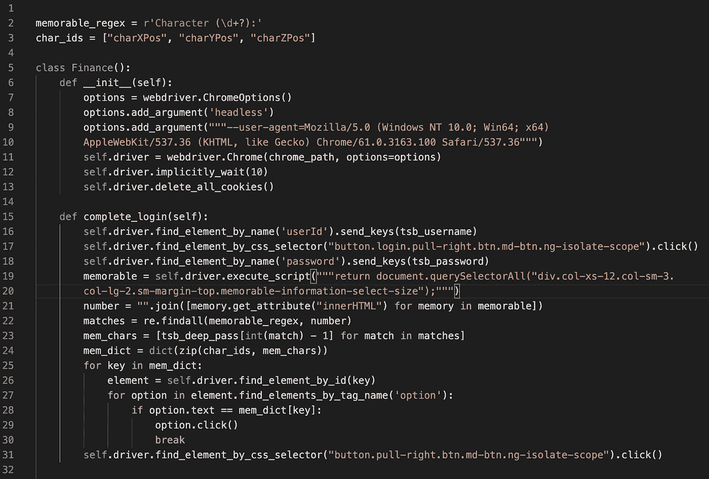

# 使用 Selenium 掌握 Web 控件的 8 个技巧

> 原文：<https://levelup.gitconnected.com/8-tips-to-master-web-control-with-selenium-ab120004753a>

## 根据这些提示，从零到英雄！


[耶鲁安博世](https://unsplash.com/@jeroenbosch?utm_source=medium&utm_medium=referral)在 [Unsplash](https://unsplash.com?utm_source=medium&utm_medium=referral) 上拍照

网页抓取；是善还是恶？嗯，它并不完全属于任何一个阵营。它可用于自动收集随时可用和可访问的数据，或由第三方存储的关于您的数据。另一方面，它可能会被滥用，每小时向服务器发送数千个请求，或者访问付费墙后面的内容。关于网络抓取有一点是肯定的；它确实很有趣！

通常，数据所有者不喜欢它。一些网站有检测算法，寻找自动机器人和阻止相关的 IP 地址。避免检测是 Web 抓取的一部分，但是我在我的提示中并不关注这方面(提示 1 除外！).使用 VPN、使用随机网络驱动程序、使用随机暂停、在屏幕上执行随机点击和使用`action.move_to(element).perform`来隐藏你的 IP 地址，这些都是试图欺骗这些算法的技术。但是我认为如果你需要在你的脚本中使用这些技术，你可能已经越界了。记得让它负责。

# 1.拒绝访问

在遇到一个将页面源代码返回为`<html><head><title>Access Denied</title></head>`的网站之前，我使用 selenium 进行了多个 web 应用项目，没有出现任何问题。我发现我们通常可以通过在最初实例化 web 驱动时添加一个选项来解决这个问题。

用户代理已启用

用户代理选项添加了一个请求头，允许服务器将请求识别为实际用户(而不是机器人)。我现在在我所有的 web 项目中都包含了这个选项。

# 2.杀死饼干

当在一个新项目中测试我的 selenium 命令时，我发现以前的驱动程序实例有时会在系统上徘徊。所以我现在总是在我的超级类建立一个新的驱动时删除所有存储的 cookies。

```
self.driver.delete_all_cookies()
```

# 3.等等…

有很多方法可以让 webdriver 等待页面加载。函数`WebDriverWait().until()`可以传递一些有用的等待命令，如`presence_of_element_located`或`element_to_be_clickable`。然而，我不需要在我的用例中使用这些。相反，我做的是在实例化 webdriver 时插入这行代码:

```
self.driver.implicitly_wait(10)
```

如果 selenium 找不到任何 DOM 搜索，这个`implicitly_wait`函数允许驱动程序在设定的时间内继续尝试搜索。最初我以为这个等待函数会像`time.sleep()`一样被使用，并被插入到驱动程序遇到麻烦的代码中的任何地方，但实际上它只需要声明一次，然后总是被用于每个 DOM 搜索。

# 4.保持整洁

在删除 cookies 之后，我的超类总是包含这个简单的方法:

```
def kill(self):
    self.driver.quit()
```

特别是在测试阶段，很容易同时打开多个 chrome 服务，调用这个方法可以正确关闭它们。

# 5.什么时候。clear()不起作用

在填写输入表单时，我们通常需要去掉文本字段中已经存在的默认值。通常我们会使用`.clear()`函数来清空字段。但是我最近遇到了一个案例，这个方法不起作用。我一直在开发一个网络应用程序，我的家人可以选择他们在未来一周想吃的饭菜，一旦选择了一个 python 脚本，就会将所有的食材添加到我们的在线乐购篮子中，以便送货上门。但是当选择每个项目的数量时，`.clear()`功能并没有去掉默认值。

通过导入`Keys`，我们可以通过 selenium 发送几个非字母数字键输入。这些包括 F 键，控制，转移，删除，空间，退格，返回，退出以及许多其他键。在这个例子中，我必须点击文本字段并发送`BACKSPACE`键。(如果有知情者能给我留言，解释为什么`.clear()`在这种情况下不起作用，我会很高兴。据我所知，没有隐藏的`div`或任何类似的东西，有一些 javascript 比动画输入框自动对焦)

# 6.搜索元素

使用 Selenium 导航 web 的基础是搜索 DOM 来定位页面上的特定元素(比如按钮和文本字段)。为了做到这一点，Selenium 为我们提供了几种方法，我在这里列出了我最喜欢的方法:

1.  `find_element_by_id`:如果您正在寻找的元素有一个 ID，使用这个函数，因为 ID 通常是 DOM 中的一个惟一属性，所以它应该返回您期望的元素。
2.  `find_element_by_class_name`、`find_element_by_name`、`find_element_by_tag_name`、`find_element_by_link_text`都有助于确定你想要互动的元素。所有这些方法都有两种形式；这里列出的都是返回搜索的第一个实例的`find_element_by`，但是所有这些方法都以`find_elements_by`的形式出现，返回匹配搜索的元素列表。这两种形式都是有用的工具时，网页抓取。
3.  `find_element_by_css_selector`:如果元素没有唯一属性，这是一个有用的定位方法。我用它将类名串在一起，以找到正确的元素。例如`button.pull-right.btn.md-btn.ng-isolate-scope`
4.  `find_element_by_xpath` : xpath 经常被过度使用，我看到很多人使用完整路径(我相信这是因为路径可以直接从 chrome 中复制，方法是右键单击 inspect 面板上你想要的元素，然后选择‘复制’>‘复制完整 xPath’)。但是如果页面有任何微小的改变，比如在`div`中添加一个副标题，就会导致 xPath 搜索无效。我们应该使用相对路径来避免这个问题。当元素有唯一属性(不是 ID 或名称)时，我使用这个定位器，例如`find_element_by_xpath(“//a[@data-target=’#modal001']”)`

# 7.执行 Javascript

通过允许 selenium 执行 Javascript 语句，还有另一个执行 DOM 搜索和其他操作的选项。

使用 Javascript 搜索 DOM

这个方法来自我的美食购物 app。它的目的是快速检查我想要添加到购物篮中的商品是否已经存在。在第 2 行我们使用了方法`execute_script`，然后在 javascript 中我们使用了`return`关键字来捕捉搜索的内容。这不是执行搜索的最佳方式，它只是另一条路线的示例。

# 8.从下拉列表中选择选项

有时，您需要能够从下拉菜单中选择正确的值，以便获得一些数据或完成登录。以下是 TSB 银行登录网上银行的方法。这个例子用代码展示了本文中的所有技巧。



*   `__init__()`方法(第 6–13 行)使用用户代理参数、`.implicity_wait()`函数和`.delete_all_cookies()`函数设置我们的 webdriver。
*   在我们的`complete_login()`方法中，我们首先输入用户名并点击“继续”按钮(第 17 和 18 行)
*   下一个屏幕加载在我们的 webdriver 中，但是页面加载时间(和任何重定向)由`implicity_wait`函数处理。我们需要在主密码中随机输入 3 个字符。为了提取所需的 3 个字符，我们通过`execute_script`函数执行 DOM 搜索(第 19 行)。变量`memorable`保存所有`div`的内容，其中包含我们需要的 3 个随机整数。
*   在第 21 行，我们得到对象的 html，并把它们连接成一个大字符串，这样我们只需要执行一次搜索就可以得到整数。在第 22 行，我们执行正则表达式搜索。`matches`变量现在包含了我们需要的整数的字符串表示。
*   在第 23 行，我们将整数转换成登录过程需要的实际字符。在第 24 行，我们创建了一个字典，它有一个*键*作为下拉菜单的字符串 ID，有*值*作为必需值。
*   对于字典中的每个条目，我们找到下拉菜单，遍历选项并单击正确的值(第 25–30 行)。
*   要完成登录，我们单击“提交”按钮(第 31 行)。

我希望你在这些建议中发现了一些价值，如果有，请在评论中告诉我。