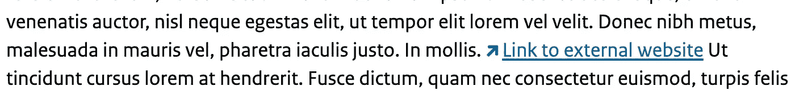
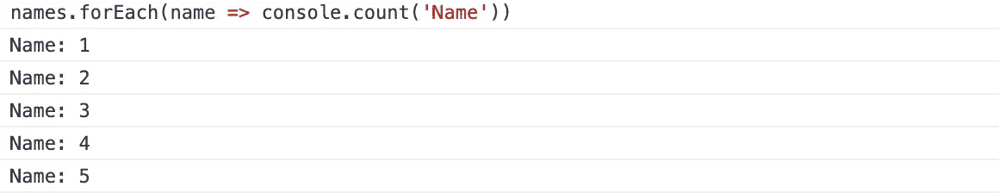
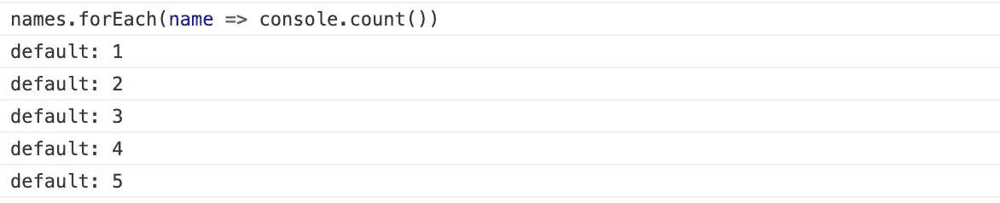
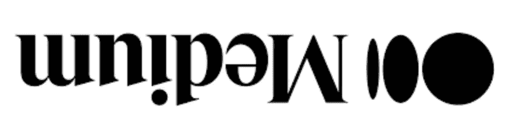
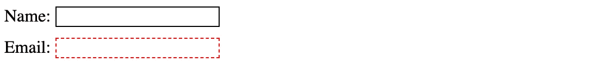

# 给 Web 开发人员的 8 个技巧，你可以立即付诸实践

> 原文：<https://levelup.gitconnected.com/8-tricks-for-web-developers-you-can-put-into-practice-immediately-98079e65fd7d>


照片由 [Cookie 在](https://unsplash.com/@cookiethepom?utm_source=medium&utm_medium=referral) [Unsplash](https://unsplash.com?utm_source=medium&utm_medium=referral) 上的 Pom 拍摄

## 值得了解的 HTML、CSS 和 JS 技巧列表

作为一名 web 开发人员，学习一些让您的生活变得更简单的技巧总是很好的。尤其是，如果你能马上将这些技巧付诸实践。然而，能让你的生活变得更轻松的窍门几乎是无穷无尽的——而且并非所有这些窍门都能经常应用。

因此，我捆绑了一些 HTML、CSS 和 JavaScript 技巧，我认为这对每个 web 开发人员来说都是很好的。我希望你能在这个列表中学会一两个你从未见过的技巧！

# 1.外部链接

可以用几种方法来设计外部链接的样式。一种方法是向所有外部链接添加一个额外的类。这很麻烦，也没有必要，因为只使用 CSS 就可以很容易地做到。

让我们看看下面的选择器。

```
a[href*="//"]:not([href*="yourwebsite.com"]) {
  /* Apply style here */
}
```

这个 CSS 选择器接受所有的`a`标签，这些标签的`href`属性包含两个正斜杠(以过滤掉相对 URL ),并且不包含您的网站的 URL。

很简单，对吧？！

该选择器通常与一个`before`或`after`伪元素结合使用，其中伪元素大部分时间包含一个图标。请参见下面的示例。



在上面的例子中，所有外部链接在前都有一个*伪元素，在链接前添加一个外部链接图标。*

# 2.易于计数

你可能已经使用`console.log`很多次了。对于许多 web 开发人员来说，这是调试的必由之路。但是你知道还有很多更有用的功能吗？

其中一个功能是`count`功能。这个函数记录了这个对`count`函数的特定调用被调用的次数。这让你可以跟踪某个事件发生了多少次，而不必自己建立一个计数器。



在上面的例子中,`count`函数有一个参数，即标签— *名称*。该参数的作用类似于计数器的标识符。如果标签没有通过，将会通过一个“默认”标签。

在上面的例子中,`names`数组包含五个名字。每次循环都会调用`count` 函数，这就是计数器返回 5 的原因。



没有指定标签，因此使用默认标签。

# 3.盎格鲁人

CSS 中经常使用角度来旋转某个元素或创建动画。大多数情况下，我们使用类似于`transform: rotate(180deg)`的东西。但是这里有几个其他可能的单位你可以用。也可以使用 *rad* 、 *grad、*和 *turn* 。

最有趣的是*转*单元。你也可以用`transform: rotate(0.5turn)`来代替写`transform: rotate(180deg)`。或者如果你想旋转一个元素两次，你可以用`transform: rotate(2turn)`代替`transform: rotate(720deg)`。



变换:旋转(0.5 转)；在活动

# 4.标题和字幕

给你网站上的所有音频和视频添加标题或字幕对你的访问者有很大帮助。那大概不需要任何进一步的解释。

您可以使用`track`标签添加标题或副标题。您可以在`audio`或`video`标签中使用这个标签。

这是它看起来的样子。

```
<video controls src="/video.mp4"><track label="English" kind="subtitles" srclang="en" src="captions/video-en.vtt" default><track label="Deutsch" kind="subtitles" srclang="de" src="captions/video-de.vtt"><track label="Español" kind="subtitles" srclang="es" src="captions/video-es.vtt"></video>
```

*标签*属性指定了文本轨道的标题。*种类*属性指定文本轨道的类型，可以有以下值之一:标题、章节、描述、元数据或字幕。 *srclang* 属性指定音轨文本的语言，如果*种类*属性是*字幕，则该属性是必需的。*

# 5.动态性能

有时候，您会发现自己需要向对象添加动态属性。幸运的是，这在 JavaScript 中是可能的。事实上，有几种方法可以做到这一点。

这是第一种方式的样子:

```
const dynamic = 'name'const person = {
    age: 33,
    [dynamic]: 'John'
}
```

很高兴知道如果你使用 ES6，你也可以将动态属性和插值结合起来。

让我们来看看下面的例子，在这个例子中，我们使用内插法给 *person* 对象添加了一个额外的属性。

```
const dynamic = 'name'const person = {
    age: 33,
    [dynamic]: 'John',
    [`interpolated-${dynamic}`]: true
}
```

向对象添加动态属性的最后一种方法是用与向数组添加键值对相同的方式来设置它。

```
const dynamic = 'name'let person = {
    age: 33,
}person[dynamic] = 'John'
```

这个方法的最大优点是，它不仅允许您在声明对象时添加动态属性。这种添加动态属性的方式经常与 if 语句结合使用。

```
let person = {
    age: 33,
}if (someCondition) {
  person[someProperty] = someValue
}
```

# 6.设计可选和必需输入元素的样式

CSS 为*输入*、*选择*和*文本区域*标签提供了一个`:optional`和`:required`伪类。*可选的*伪类表示一个没有设置*必需的*属性的元素。这个:*必需的*伪类表示一个元素，这个元素在**上设置了**必需的属性。

```
input:optional {
  border: 1px solid black;
}input:required {
  border: 1px dashed red;
}
```

看起来是这样的:



# 7.逗号分隔列表

这里有一个巧妙的小技巧，可以让你只用一个 HTML 无序列表和几行 CSS 就创建一个逗号分隔的列表。

```
ul > li:not(:last-child):after { 
  content: “, “; 
}
```

为了让它工作，你需要确保将 *li* 标签的*显示*属性设置为*内嵌块*。

```
<ul>
  <li>First item</li>
  <li>Second item</li>
  <li>Third item</li>
</ul>
```

结果是这样的:


# 8.唯一数组值

这个列表中的最后一个技巧允许你从一个数组中删除重复的值。一种常见的方法是使用*过滤器*功能。通常，有几种方法可以解决这个问题。

我最喜欢的从数组中删除重复值的方法是将集合构造函数和 spread 操作符结合起来——简单又干净！

```
const numbers = [1, 2, 2, 3, 3, 4, 5, 5, 6, 6, 7, 7, 7]
const unique_numbers = [...new Set(numbers)]console.log(unique_numbers); // [1, 2, 3, 4, 5, 6, 7]
```