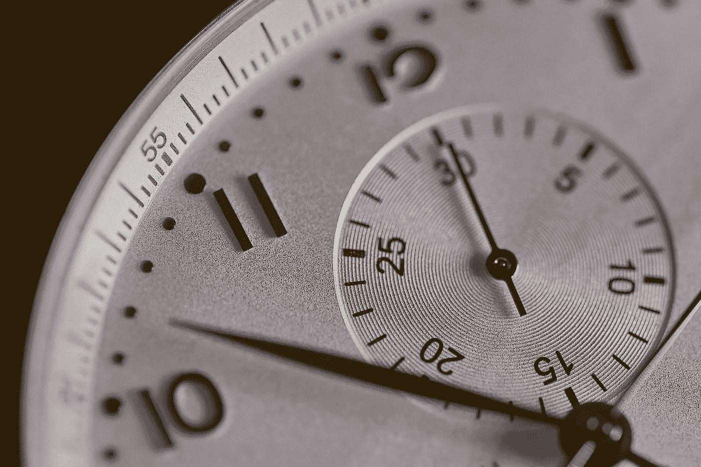

# C/C++中测量执行时间的 8 种方法

> 原文：<https://levelup.gitconnected.com/8-ways-to-measure-execution-time-in-c-c-48634458d0f9>

## 不幸的是，没有放之四海而皆准的解决方案。在这里你会找到一些可用的选项。



在 [Unsplash](https://unsplash.com/?utm_source=unsplash&utm_medium=referral&utm_content=creditCopyText) 上由[阿格巴洛斯](https://unsplash.com/@agebarros?utm_source=unsplash&utm_medium=referral&utm_content=creditCopyText)拍摄的照片。

测量一个 C/C++程序或它的一部分的执行时间有时比它应该的要困难，因为许多方法通常不能移植到其他平台。选择正确的方法很大程度上取决于您的操作系统、编译器版本，以及您所说的“时间”的含义。

本文包括一个全面的列表，列出了当前可用的一些最佳选项，以及每种选项的局限性。希望在这里你能找到一个或多个可以用于你的程序的选项。

## 墙时间与 CPU 时间的关系

首先，定义和区分这两个在测量执行时间时经常使用的术语是很重要的。

1.  *挂钟时间*(也称为*时钟时间*或*挂钟时间)*就是测量过程中经过的总时间。这是你可以用秒表测量的时间，假设你能够在你想要的执行点开始和停止它。
2.  *CPU 时间*则是指 CPU 忙于处理程序指令的时间。等待其他事情完成(如 I/O 操作)所花费的时间不包括在 CPU 时间内。

您应该使用这些定义中的哪一个取决于您为什么首先测量程序的执行时间。在下面的列表中，大多数方法只能计算其中一种时间，而只有少数方法可以同时计算两种时间。同样重要的是，有些对 Linux 和 Windows 用户都可用，但有些只限于特定的操作系统。为了让读者更容易理解，我在每一节的开头明确列出了每种方法测量哪种时间，以及它在哪些系统上可用。

## 代码示例注释

下面包含的代码示例基于计算无限和 1/2⁰ + 1/2 + 1/2 + 1/2 + … = 2 的近似值的程序。虽然循环的 100 次迭代足以得到精确的总和(至少在我的机器上——结果可能在其他平台上有所不同),但这些程序执行 10 亿次迭代以获得大量的时间来测量。

在那些程序中，CPU 几乎 100%的时间都很忙，所以墙时间和 CPU 时间几乎没有什么区别。如果你想在实验过程中让 CPU 空闲一段时间，你可以用函数`sleep()`(在`<unistd.h>`中可用)轻松实现。

现在，让我们开始我们的列表。

# 1.使用“time”Linux 命令

***上的作品:*** *仅限 Linux。(这实际上可以用于任何可以从终端执行的程序。)* ***措施:*** *既墙时间又 CPU 时间。*

好吧，这不是真正的 C/C++代码。但是，因为它可能对许多运行 Linux 的人来说已经足够了，所以我决定在更复杂的选项之前包含这个选项。如果你只是想测量整个程序的 CPU 和/或墙时间，你真的不需要为此修改你的代码。只要在你通常从终端命令行运行你的程序之前写`time`。然后，当你的程序执行完毕，测得的时间会显示在屏幕上。像这样:

```
$ time ./MyProgram
Result: 2.00000000000000000000 

real 0m5.931s 
user 0m5.926s 
sys 0m0.005s
```

在输出中,' real '表示墙时间,' user '表示 CPU 时间，因此您可以在不更改一行代码的情况下获得整个程序的两个测量值。然而，如果你想测量程序的*独立部分*所花费的时间，那么你需要下面的一个选项。

**注:**在写这篇文章之前，我一直以为 Windows 有自己版本的`time`命令作为它的命令提示符，所以当我发现它没有时，我真的很惊讶。如果感兴趣的话，你可以在网上找到一些替代方案，但是我认为将时间测量直接嵌入到你的 C/c++代码中会更容易移植。

# 2.使用

***工作于:****Linux&Windows，* ***但要求 C++11 或更高版本。******措施:*** *墙时间。*

这可能是现今最好也是最便携的测量墙时间的方法，但它只在 C++11 和更高版本上可用。如果您的项目/编译器不支持 C++11，您将需要本文中列出的其他选项之一。

这个库可以访问你机器中的一些不同的时钟，每个时钟都有不同的目的和特性。如果你愿意，你可以在这里获得每种时钟[的更多细节。但是，除非你真的需要一个不同的时钟，我会推荐简单地使用`high_resolution_clock`。这一个使用最高分辨率的时钟，所以对大多数人来说可能是足够的。下面是它的使用方法:](https://en.cppreference.com/w/cpp/chrono)

正如您在第 19 行看到的，我们选择将测量的时间转换为纳秒(尽管后来我们将其转换为秒)。如果您愿意，您可以修改代码来使用您选择的另一个单元，使用`chrono::hours`、`chrono::minutes`、`chrono::seconds`、`chrono::milliseconds`或`chrono::microseconds`。

**注意:**我看到有人提到，与其他 C/C++方法相比，用这个库测量执行时间可能会增加相当大的开销，尤其是在一个循环中多次使用时。老实说，我自己没有测试过或体验过这个，所以我不能说太多。如果你觉得这是一个问题，也许你应该考虑下面的其他选项之一。

# 3.用<sys>和 gettimeofday()</sys>

***工作于:****Linux&Windows。* ***措施:*** *墙时间。*

函数`gettimeofday()`返回自 1970 年 1 月 1 日 00:00:00 UTC 起经过的时间(通常称为*纪元时间*)。棘手的是，该函数在单独的`long int`变量中返回秒数和微秒数，因此要获得包括微秒数在内的总时间，您需要相应地将两者相加。以下是如何做到这一点:

**注 1:** 如果不在乎秒的分数，可以通过计算`end.tv_sec - begin.tv_sec`直接得到经过的时间。
**注 2:T**`gettimeofday()`的第二个参数用于指定当前时区。因为我们正在计算经过的时间，所以时区是不相关的，只要对`begin`和`end`使用相同的值。因此，我们对两个调用都使用了 0。

# 4.用<time.h>和时间()</time.h>

***工作于:****Linux&Windows。* ***措施:*** *壁时间，* ***但仅措施满秒。***

函数`time()`类似于`gettimeofday()`，因为它返回从纪元时间开始经过的时间。但是有两个主要区别:首先，您不能指定时区，所以它总是 UTC。第二，也是最重要的，它只返回*整秒*。因此，只有当测量的时间间隔超过几秒钟时，用这种方法测量时间才有意义。如果毫微微秒或微秒对您的测量很重要，您应该使用其他方法之一。这是如何使用它:

**注:** `time_t`其实和`long int`是一样的，可以直接用`printf()`或者`cout`打印，也可以很容易的将其转换成自己选择的另一种数值类型。

# 5.使用<time.h>和时钟()</time.h>

***工作于:****Linux&Windows。* ***度量:****Linux 上的 CPU 时间和 Windows 上的 wall 时间。*

函数`clock()`返回程序开始执行以来的时钟周期数。如果你用常数`CLOCKS_PER_SEC`除它，你将得到程序已经运行了多长时间，以秒为单位。不过这根据操作系统的不同会有不同的含义:**在 Linux 上你会得到 CPU 时间，而在 Windows 上你会得到 wall 时间。所以你在使用这个的时候必须非常小心。代码如下:**

**注意:** `clock_t`也是一个`long int`，所以需要先将其强制转换为浮点类型，然后再用`CLOCKS_PER_SEC`除，要不然就会得到整数除法。

# 6.用<time.h>和 clock_gettime()</time.h>

***作品上:*** ***只有 Linux。******措施:*** *既墙时间又 CPU 时间。*

这个工具的好处是你可以用它来测量墙时间和 CPU 时间。但是，它仅在 Unix 系统中可用。下面的例子测量了墙壁时间，但是您可以简单地通过用`CLOCK_PROCESS_CPUTIME_ID`替换常量`CLOCK_REALTIME`来修改它以测量 CPU 时间。

**注 1:** 除了`CLOCK_REALTIME`和`CLOCK_PROCESS_CPUTIME_ID`之外，还有其他的时钟可以配合此功能使用。你可以查看本页以获得更完整的列表。
**注 2:** 该函数使用的结构`timespec`与`gettimeofday()`使用的非常相似(上面的方法#3)。但是，它包含纳秒而不是微秒，所以在转换单位时要小心。

# 7.用<sysinfoapi.h>和 GetTickCount64()</sysinfoapi.h>

***作品上:*** ***只有 Windows。******措施:*** *墙时间。*

函数`GetTickCount64()`返回系统启动后的毫秒数。也有 32 位版本(`GetTickCount()`)，但是限定在 49.71 天，所以用 64 位的安全一点。下面是它的使用方法:

# 8.用<processthreadsapi.h>和 GetProcessTimes()</processthreadsapi.h>

***作用于:*** ***只适用于 Windows。******措施:*** *CPU 时间。*

这是目前列表中最复杂的方法，但是它是唯一可以用来测量 Windows 上 CPU 时间的方法。我不会详细说明它是如何工作的，因为它过于复杂，我自己也从未使用过，但是你可以看看[官方文档](https://docs.microsoft.com/en-us/windows/win32/api/processthreadsapi/nf-processthreadsapi-getprocesstimes)了解更多细节。代码如下:

**注:**我改编了一个[栈溢出答案](https://stackoverflow.com/a/17440673)的代码，所以我想把所有的功劳归于在那里发布答案的用户 Alexander Yee。事实上，他在那里介绍了一种很好的便携方法，用`#ifdef`宏计算 Linux 和 Windows 机器上的墙和 CPU 时间，所以你可能也想在那里查看完整的答案。

# 最后的想法

好了，现在你知道了:在 C/C++中有很多方法可以测量执行时间。正如你所看到的，没有一个放之四海而皆准的解决方案:上述所有方法都有局限性，没有一个方法能够同时计算*墙时间和 CPU 时间*和**适用于 Linux 和 Windows。然而，我希望这些方法中至少有一个对你的代码和你的目标有用。感谢您的阅读。**

# ****建议文献****

*   **[c++编程语言](https://www.amazon.com/gp/product/0321563840/ref=as_li_tl?ie=UTF8&tag=chaulio0b-20&camp=1789&creative=9325&linkCode=as2&creativeASIN=0321563840&linkId=47d5056be0a1d80224ce6562c24b6820)，作者比雅尼·斯特劳斯特鲁普。**
*   **[C++高性能:掌握优化 C++代码功能的艺术](https://www.amazon.com/gp/product/1839216549/ref=as_li_tl?ie=UTF8&tag=chaulio0b-20&camp=1789&creative=9325&linkCode=as2&creativeASIN=1839216549&linkId=259341cc8501281fe93f136a6ce0d098)，比约恩·安德里斯特和维克多·瑟尔著。**

# **更多由同一作者**

**[](/what-big-o-really-means-e5f15044c9d2) [## “大 O”的真正含义是什么

### 大多数时候，大 O 符号的用法都有点不正确。

levelup.gitconnected.com](/what-big-o-really-means-e5f15044c9d2) [](https://towardsdatascience.com/the-math-behind-big-o-and-other-asymptotic-notations-64487889f33f) [## “大 O”和其他渐近符号背后的数学

### 像“大 O”、“大ω”和“大θ”这样的符号的正式定义。

towardsdatascience.com](https://towardsdatascience.com/the-math-behind-big-o-and-other-asymptotic-notations-64487889f33f) [](https://towardsdatascience.com/version-control-with-git-get-started-in-less-than-15-minutes-696b4ce7ce92) [## 使用 Git 进行版本控制:不到 15 分钟即可开始

### 完全初学者的循序渐进教程。

towardsdatascience.com](https://towardsdatascience.com/version-control-with-git-get-started-in-less-than-15-minutes-696b4ce7ce92) 

# 资源

如果您需要更多信息，您可以在下面找到本文中列出的每种方法的更详细的文档:

1.  [‘时间’Linux 命令](http://man7.org/linux/man-pages/man1/time.1.html)
2.  [<计时](https://en.cppreference.com/w/cpp/chrono) >
3.  [gettimeofday()](http://man7.org/linux/man-pages/man2/gettimeofday.2.html)
4.  [时间()](http://man7.org/linux/man-pages/man2/time.2.html)
5.  [时钟()](http://man7.org/linux/man-pages/man3/clock.3.html)
6.  [clock_gettime()](https://linux.die.net/man/2/clock_gettime)
7.  [GetTickCount64()](https://docs.microsoft.com/en-us/windows/win32/api/sysinfoapi/nf-sysinfoapi-gettickcount64)
8.  [GetProcessTimes()](https://docs.microsoft.com/en-us/windows/win32/api/processthreadsapi/nf-processthreadsapi-getprocesstimes)

*披露:此帖子包含一个或多个来自亚马逊服务有限责任公司协会计划的链接。作为代销商，我从通过这些链接购买的商品中获得佣金，客户无需支付额外费用。*

# 分级编码

感谢您成为我们社区的一员！升级正在改变技术招聘。 [**在最好的公司找到你的完美工作**](https://jobs.levelup.dev/talent)**。**

**[](https://jobs.levelup.dev/talent) [## 提升——改变招聘流程

### 🔥让软件工程师找到他们热爱的完美角色🧠寻找人才是最痛苦的部分…

作业. levelup.dev](https://jobs.levelup.dev/talent)****