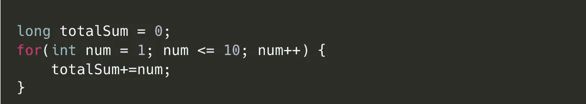
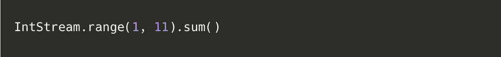

# 8 年 Java Stream API，通过 8 个问题了解 Streams！

> 原文：<https://levelup.gitconnected.com/8-years-of-java-stream-api-understand-streams-through-8-questions-bd9e5d9d8bc>

是的，自从 Java SE 8 发布以来已经有 8 年了，它提供了流 API、函数接口、时间 API 和许多更重要的特性，但是是 *Lambdas 和 Streams* 向 Java 开发人员介绍了函数式编程。

> 让我们来了解流及其用法！

由[马特·保罗·卡塔拉诺](https://unsplash.com/@mattpaul?utm_source=medium&utm_medium=referral)在 [Unsplash](https://unsplash.com?utm_source=medium&utm_medium=referral) 上拍摄

> 一些基础知识:

1.  **函数接口**:只有一个抽象方法的接口。
2.  **Lambda 表达式**:实现函数接口的单一抽象方法。
3.  **流:** Lambda 表达式作为参数传递给流操作，以读取/修改数据。

# 1.什么是溪流？

提供了一种使用函数式编程范式对一系列元素执行一系列操作的方法。如果你不知道函数式编程，看看第 8 个问题。

收集大于 25 的数字的平方。

# 2.什么不是溪流？

1.  Stream 不像 Collections 那样是一种数据结构，Stream 只知道在管道中需要元素时在哪里寻找元素。
2.  集合侧重于有效地组织数据。
3.  Streams 专注于高效地组织计算。

# 3.如何创建流？

流由三部分组成

1.  元素来源
2.  零个或多个中间操作
3.  触发流的单个终端操作。

## **1。来源**

元素的来源可以是集合、数组、生成器函数和 I/O 通道。您可以使用不同的方法在源上创建顺序或并行流。下面列出了其中的一些。

方法来创建流

并行流使用工作线程在元素源上并行执行操作。值得注意的是，并行流并不总是更快，但它确实有自己的开销，即把流分成多个部分并在最后合并结果。必须注意，在这种情况下，Lambdas 必须以无状态的方式实现，因为它们可以由多个线程并行执行。抛开这些不谈，并行流确实有很大的潜力来优化性能。

> 你会知道什么时候需要并行流，所以在那之前保持简单！

## **2。中间操作:**

1.  一个流可以有零个或多个中间操作。
2.  它可以是有状态或无状态的操作。像 *sorted()* 这样的有状态操作依赖于流中的所有元素，而像 *filter()* 和 *map()* 这样的无状态操作可以在流元素上独立执行。通过执行并行执行，可以在内部优化无状态操作。

中间操作

## 3.终端操作:

1.  该操作触发流管道执行操作
2.  操作可以是缩短流长度的短路操作，如 *limit()、findFirst()* ，也可以是非短路操作，如 *collect()、forEach()。*

终端操作

# 5.如何使用流？

流示例

# 6.Stream 内部是如何工作的？

**创建流:**

1.  *Spliteterator* 是 Java SE 8 中引入的另一个迭代器，它通过拆分和迭代流元素来支持并行编程。
2.  Stream 还捕获描述元素特征的不同状态标志，如果源是 TreeSet，则捕获标志排序。

> 像 SIZED、DISTINCT、SORTED 和 ORDER 这样的标志用于捕获流元素的状态。

**中间操作:**

1.  在每个操作中，如果流的状态改变或增加，则利用状态标志进行优化或修改
2.  这些标志用于每个阶段的优化，就像如果流在前一阶段已经排序，那么就不会再排序。

**终端操作:**

1.  它根据无状态操作(如 *filter()、map()和 flatMap()* )和有状态操作(如 *sorted()、limit()和 distinct()* )来决定流
2.  如果流水线是顺序执行的，或者是并行执行的，但是由所有无状态的操作组成，那么它可以在一次通过中被计算。否则，流水线在有状态操作边界处被分成多个部分，并且在多个通道中被计算。
3.  终端操作要么是类似 *limit()、findFirst()* 的短路操作，要么是类似 *reduce()、collect()* 的非短路操作。如果终端操作为非短路，可使用*分割符*的 *forEachRemaining()* 方法批量处理数据。如果是短路，必须使用 *tryAdvance()* 一次处理一个元素

# 7.甲流的优势是什么？

1.  简洁明了的代码。
2.  您可以轻松阅读和理解包含大量复杂操作的代码。
3.  并行处理不需要重写代码。一旦确定，就在源上使用并行流。
4.  通过使用状态标志，将流管道表示为操作序列可以实现几种有用的执行策略。
5.  我们可以从 API 方法返回流，而以前您可能会返回一个数组或集合。这将有助于客户端代码按照要求收集流。

# 8.什么是函数式编程？

让我们快速理解一下，函数式编程是声明式编程的一个子集

*陈述型风格 vs 通常的命令型风格？*

在声明式风格中，你定义*做什么*，而不是*如何做*。看看下面这个简单的例子。

**命令式**:我们定义变量 total sum，迭代 10 个数，加到 total sum 上。基本上，我们正在定义如何将 10 个数字相加。

**陈述式:**做 10 个数的求和。刚声明的。

就这样，谢谢！

请关注以获取更多内容！🤝

看看我关于系统设计的另一个故事

 [## 我是如何与亚马逊和微软进行系统设计面试的？

### 系统设计方法，它帮助我在 Amazon 清除 SDE2，在 Microsoft 清除 L61

levelup.gitconnected.com](/how-to-approach-system-design-interviews-c272996bdfaa) 

# 分级编码

感谢您成为我们社区的一员！在你离开之前:

*   👏为故事鼓掌，跟着作者走👉
*   📰查看[升级编码出版物](https://levelup.gitconnected.com/?utm_source=pub&utm_medium=post)中的更多内容
*   🔔关注我们:[Twitter](https://twitter.com/gitconnected)|[LinkedIn](https://www.linkedin.com/company/gitconnected)|[时事通讯](https://newsletter.levelup.dev)

🚀👉 [**加入人才集体，找到一份令人惊喜的工作**](https://jobs.levelup.dev/talent/welcome?referral=true)