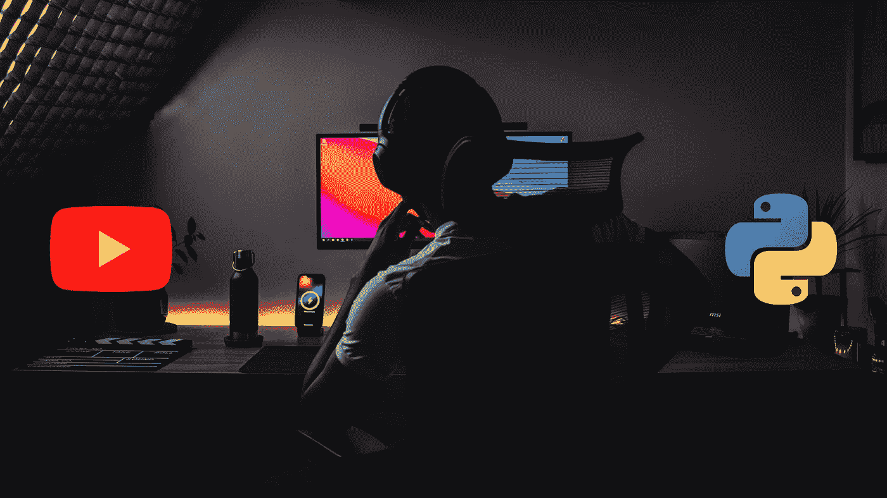

# 作为 Python 开发者应该关注的 8 个 YouTube 频道

> 原文：<https://levelup.gitconnected.com/8-youtube-channels-that-you-should-follow-as-a-python-developer-6c4f725f72ca>

## 如果您想了解 Python 的一切，包括它的框架、库等等，强烈推荐这些渠道。

Nubelson Fernandes 在 [Unsplash](https://unsplash.com/s/photos/developer?utm_source=unsplash&utm_medium=referral&utm_content=creditCopyText) 上拍摄的照片。作者在 Canva 编辑

当我在学生时代开始编程时，当时没有多少【T4 第一】编程语言可供选择。事实上，我们被要求在 C 之后学习和练习 C++或 Java。现在情况不同了。有太多的编程语言可供选择，Python 一直是入门级开发人员的最爱之一。

虽然 Python 是由*吉多·范·罗苏姆* 在 1991 年创造的，但直到 2000 年代中期谷歌将其作为官方服务器端语言时，它才流行起来。从那时起，由于其广泛的使用案例，如人工智能、web 开发、自动化等，它已经成为最受欢迎的编程语言之一。

Python 已经成为首选语言，因为它对初学者来说是用户友好的，并且具有模仿自然语言的简单语法，易于阅读和理解。它还有一个强大而活跃的开发者社区，为该语言的模块和库做出贡献。它也是开源的，这意味着它可以免费使用和分发，这对于即使是小型创业公司也是理想的。

我在工作中的项目中使用过 Python，发现它非常容易学习。另一件很棒的事情是，很多 YouTube 频道都有很棒的 Python 内容，但是有太多的选项可供选择。排名不分先后，以下是我认为每个 Python 开发者都必须订阅的 YouTube 频道。

# 真正的 Python

*频道链接:**[***https://www.youtube.com/c/realpython***](https://www.youtube.com/c/realpython)*订阅者:* ***139K****

*Dan Bader 是一名独立的软件工程师、作家和演说家，他创建这个频道的目的是教授和培训其他 Python 爱好者，或“ *Pythonistas* ”，让他们超越基础知识。*

*从初学者友好课程到每周播客 和 Python 事件的报道，该频道应有尽有。您还将获得一系列主题的有用提示，例如如何创建更清晰、更好的 Python 代码，如何在就业市场上提升自己，如何建立更好的职业生涯，实用的编程建议等等。*

# *旅行媒体*

*【频道链接:*[***https://www.youtube.com/c/TraversyMedia***](https://www.youtube.com/c/TraversyMedia)*订阅者:* ***1.74M*****

**Traversy Media 一直是最有影响力的频道之一，它启发了其他节目频道。2009 年由 Brad Travery 创建的频道已经成为多年来网络发展的事实。然而，让它与众不同的是，它有各种各样的教程和有趣的视频，涉及几种技术，包括 Python。**

**该频道的视频因布拉德的简单和教学风格而受到观众的赞赏。除此之外，他还创建了关于其他不同编程语言、框架、工具和库的全功能速成课程。该频道还包括来自 Brad 和其他著名客座讲师的视频，如“ *Python 数据可视化与散景*”、“*构建 Todo 应用*”、“ *Python Django 速成班*”和“*构建 Python 语音助手应用*”。**

# **sentdex**

***频道链接:**[***https://www.youtube.com/c/sentdex***](https://www.youtube.com/c/sentdex)*订阅者:* ***1.09M******

**我的意思是，我能对哈里森·金斯利说些什么呢，他在 2012 年创建了这个频道。我认为他是为数不多的为入门级创作 Python 内容的开发者，也是在*机器学习、数据分析、*甚至*机器人*等技术领域经验丰富的开发者。他有一种解释主题的独特方式，我相信每个有抱负的程序员都会欣赏这种方式。**

# **自由代码营**

***频道链接:**[***https://www.youtube.com/c/Freecodecamp***](https://www.youtube.com/c/Freecodecamp)*订阅用户:* ***4.85M******

**每当有人问我关于可以有效学习编程课程的平台时，我经常推荐 [*freeCodeCamp*](https://www.freecodecamp.org/) ，这是一个致力于让每个人都可以免费使用 web 开发的非营利组织。他们还有一个频道，播放列表非常棒，包括 Python，你肯定会从他们那里学到很多东西。**

**由于频道是开源的，所以有几个客座老师来频道上免费授课。因为这个频道没有广告，所以我经常称它为“免费的”替代品。这不是我第一次在文章上推荐这个频道。**

# **东京教育技术公司**

***频道链接:**[***https://www.youtube.com/c/TokyoEdTech***](https://www.youtube.com/c/TokyoEdTech)*订阅者:* ***38.2K******

**Python 上被低估的频道之一， *TokyoEdTech，*是由一位高中老师 *Christian Thompson* 在 2011 年创建的。他的视频是初学者友好的，其中他在讲述基础知识后使用 Python 开发应用程序。由于他的教学背景，Christian 知道如何以任何人都能容易理解的方式解释主题。**

**最好的学习方法是开发应用程序，这也是创作者使用的哲学，他们使用 Python 创建不同的二维游戏，并为初学者和有经验的程序员提供单独的播放列表。**

# **用 Mosh 编程**

***频道链接:**[***https://www.youtube.com/c/programmingwithmosh***](https://www.youtube.com/c/programmingwithmosh)*订阅用户:* ***2.23M******

**毫无疑问，这是以绝对全面的方式教授 Python 的最佳渠道之一，同时还能让它变得有趣。Mosh Hamedani，于 2014 年创建了这个频道，目的是"*培训公司喜欢雇佣的专业软件工程师。*”**

**Mosh 有一种教授任何主题的独特方式，他将它分解成最简单的点来解释*在哪里*和*为什么*一个特定的函数或库应该在哪里。这使得他的频道成为增长最快的 YouTube 频道之一。他的视频强烈推荐给初学者和有经验的程序员。**

# **科里·斯查费**

**【频道链接:*[***https://www.youtube.com/c/Coreyms***](https://www.youtube.com/c/Coreyms)*订阅者:* ***875K******

**科里·斯查费是另一位优秀的 Python 导师，涵盖了所有技能水平的主题，无论你是初学者还是有经验的程序员。从一步一步的安装到基本语法，Python 入门所需的一切都包含在该频道中。然后，课程继续将这些实践能力应用到现实世界的实际作业中。作为一名 Python 程序员或开发人员，你一定会喜欢 Corey 的视频。**

# **Python 工程师**

***频道链接:**[***https://www.youtube.com/c/PythonEngineer***](https://www.youtube.com/c/PythonEngineer)*订阅者:* ***84.2K******

**这可能是名单上最年轻的频道，也是我最喜欢的频道。Patrick Loeber 在 2019 年创建了这个频道，在近两年的时间里，该频道的订户迅速增加到了 8 万多人(截至本文撰写之时)，并且每天都在增加，这都要归功于他的视频，在这些视频中，他使用 Python 创建了实际的应用程序，这些应用程序无疑吸引了越来越多有抱负的 Python 爱好者。**

**Patrick 是一名软件开发人员，他喜欢从事机器学习、计算机视觉和数据科学方面的工作。他创作了独特的视频，如“*与 PyTorch 聊天机器人”、“教 AI 玩蛇！”、【Python 蛇游戏搭配 Pygame* ”，并拥有 *Tensorflow 2、高级 Python、*和 *PyTorch* 的完整播放列表。这个频道对于任何有抱负的 Python 程序员来说都是一座金矿。**

# **结束语**

**我们非常幸运，我们生活在一个信息免费且随时可供你使用的世界。你可以利用各种平台学习和分享任何东西，YouTube 就是其中之一。YouTube 作为一个平台是免费的，这一事实给了我们学习任何技术的力量，包括 Python。**

**Python 是目前最流行的编程语言之一。它的需求量很大，因为世界上所有领先的公司都在使用它。学习这种编程语言，没有比使用 YouTube 这样的免费平台更好的时机了。**

**我列出了一些我关注的最佳渠道。还有其他一些令人难以置信的频道值得一提——克里斯·霍克斯 、 [**聪明的程序员**](https://www.youtube.com/c/CleverProgrammer) 、 [**thenewboston**](https://www.youtube.com/user/thenewboston) 、 [**Anaconda，Inc.**](https://www.youtube.com/c/ContinuumIo) 、 [**Tech With Tim**](https://www.youtube.com/c/TechWithTim) ，以及[**neural nine**](https://www.youtube.com/c/NeuralNine)**。我希望这份汇编对你有用，并帮助你在职业发展中成长。****

**注意:YouTube 频道没有任何特定的顺序，当你阅读这篇文章时，订阅人数可能会改变。**

**如果你喜欢读这篇文章，你可能也会发现下面的文章值得你花时间去读。**

** [## 每个 Python 开发人员都必须知道的 5 个很酷的开源 Django 项目

### 关于 Python 最流行的 web 开发框架的一切。

levelup.gitconnected.com](/5-cool-open-source-django-projects-every-python-developer-must-know-about-492d7e9633b2)  [## 每个软件开发人员都必须知道的设计模式

### 这些久经考验的解决方案提高了编程效率。

python .平原英语. io](https://python.plainenglish.io/design-patterns-that-every-software-developer-must-know-ac71f575e68) 

*如果你喜欢阅读有助于你更好地学习、生活和工作的故事，可以考虑* [*成为订阅者*](https://viveknaskar.medium.com/subscribe) *。成为会员后，你可以无限制地阅读 10000 篇故事、文章和作家。每月只要 5 美元。如果你用我的链接* *注册，我会赚一点佣金，帮助我写更多的文章。***