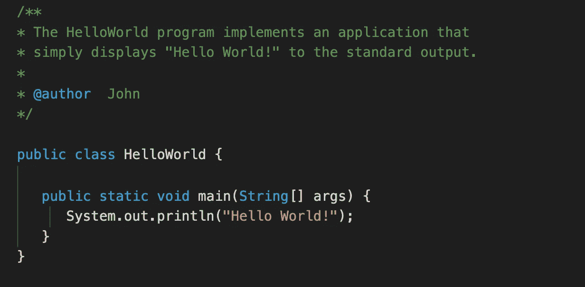
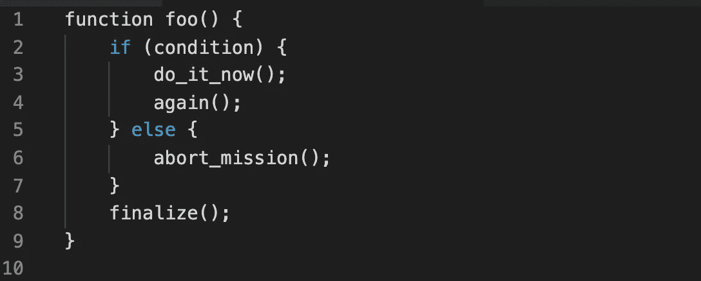
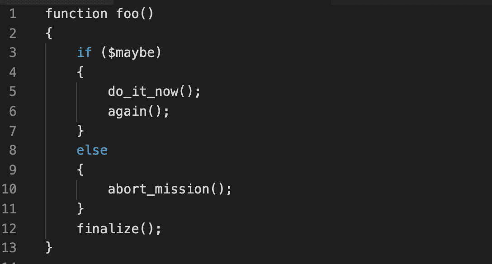
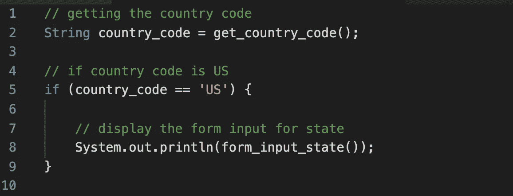
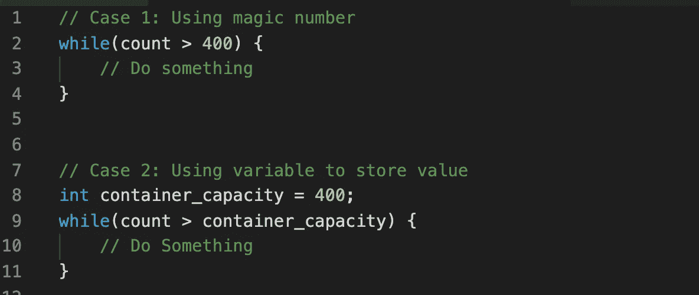
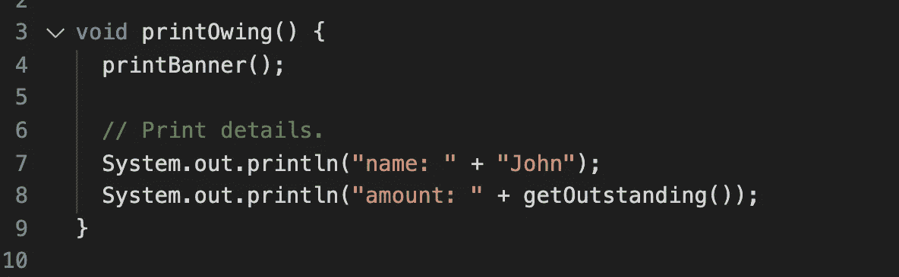
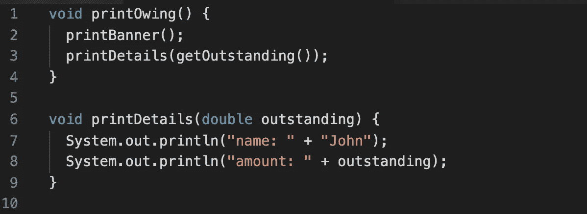

# 编写超级可读代码的 9 个最佳实践

> 原文：<https://levelup.gitconnected.com/9-best-practices-to-write-super-readable-code-592e15aa026f>

## 每个程序员都应该遵循的最佳实践


Solen Feyissa 在 [Unsplash](https://unsplash.com?utm_source=medium&utm_medium=referral) 拍摄的照片

编写可读的代码和编写有用的代码一样重要。以这样一种方式编写代码是软件开发的基础之一，这种方式对于第一次阅读您的代码的每个新程序员来说都是可读和可理解的。

可读的代码不仅使维护代码变得更容易，而且在与团队合作时被证明是有帮助的。可读性强的代码更容易理解代码结构，也更容易找到 bug。

在本文中，我们将介绍一些在编写可读代码时应该遵循的最佳实践。我们开始吧！

# 1.评论和文件

为每一段重要的代码编写注释和文档是很重要的，比如函数和业务逻辑。有时我们发现程序很难理解，然后我们看注释来帮助我们理解它们。

为了使代码易于理解，注释应该简短而精确。适当的注释和文档使我们的代码易于维护，并帮助我们更快地找到错误。

**举例:**



# 2.一致缩进

代码缩进提高了代码的可读性，使其易于理解。保持代码缩进格式风格一致总是更好、更可取的。

缩进代码有不同的方法。例如:

**风格 1:**



**风格二:**



上述两种缩进样式都很好用，只是程序员的喜好问题。

如果您正在处理一个项目，最好总是采用项目中已经遵循的现有缩进样式。

# 3.避免明显的评论

为你的代码写注释是好的，但是过多的注释可能是多余的。当文本如此明显时，写评论是没有实际意义的。

冗余代码注释的示例如下:



在上面的例子中，我们可以看到代码是不言自明的，因此，没有必要在注释中重复相同的文本。

作为一名程序员，我们应该永远记住:

> 糟糕的评论比没有评论更糟糕。

# 4.一致的命名方案

在编写变量名和函数名时，代码中应该有一致的命名约定。例如，有两种流行的观点:

**camelCase:** 在 camelCase 中，每个单词的第一个字母都要大写，除了第一个单词，比如`getUserName()`。

**下划线:**在这种情况下，单词之间应该有下划线，比如`get_user_name()`。

现在你可能会问哪个更好，要用哪个？所以答案是命名约定没有“最佳”风格。这取决于开发商的偏好。但关键是它应该在整个代码中保持一致。

如果您正在处理项目，那么与代码缩进一样，最好使用项目中已经使用的现有命名约定。

# 5.避免使用神奇的数字

在编程中，幻数指的是在代码中使用硬编码的数值，以后可能会改变。这使得代码对其他人来说很难理解。

在编写代码时，使用这样的数字对您来说是有意义的，但是，当其他人将来看到相同的程序或代码时，他们可能很难理解为什么在这里使用这个数字。

示例:



在上面的例子中，在第一种情况下，我们不知道值 400 意味着什么？然而，在第二种情况下，我们清楚地知道容器容量是 400。

避免幻数的另一个好处是，如果我们使用幻数，那么如果我们需要改变它的值，那么我们必须到处寻找它，然后手动改变它。另一方面，如果我们用一个变量来定义它的值，那么我们只需要改变这个变量的值一次。

# 6.大写 SQL 特殊单词

Web 应用程序经常连接到数据库，数据库交互是 web 应用程序的一个重要部分。因此，以可读的方式编写原始 SQL 查询是一个好主意。

我们知道 SQL 查询是不区分大小写的，但是，最好是将 SQL 特殊单词(如 SELECT 和 WHERE)和函数名大写，以区别于表名和列名。

示例:

```
**SELECT** id, username **FROM** user;**SELECT** id, username **FROM** user **WHERE** state = 'NY' **LIMIT** 5;
```

# 7.为函数和变量使用有意义的名字

使代码可读的最佳实践之一是对变量和函数使用有意义的名称。这种做法也可以帮助你节省很多时间。

当你刚刚开始或者正在编写一个简单的程序时，变量和函数的名字可能看起来没什么大不了的。然而，当有数千行代码并且变量名没有意义时，事情变得非常混乱。

# 8.阅读开源代码

开源项目是在众多开发者的贡献下开发出来的。开源社区尽可能地维护和保持这些项目的可读性，以便开发团队可以在同一个项目上高效地合作。

因此，浏览这类开源项目的源代码，观察开发人员在做什么，并遵循他们的最佳实践，对你是有帮助的。

# 9.代码重构

代码重构是在不改变或添加任何新功能的情况下重新构造代码的过程。代码分解的目的是清理您的代码，以提高其可读性和质量。

代码重构不包括任何类型的错误修复或任何新功能的添加。它只是让您的代码对于当前的代码开发人员以及将来可能从事该工作的其他开发人员来说更容易阅读。

示例:

**重构前:**



**重构后:**



在上面的例子中，你可以看到我们通过提取`printDetails()`方法重构了程序，使其可重用且更具可读性。

## 结论

这就是这篇文章的全部内容。在本文中，我们讨论了一些使代码更具可读性的最佳实践。我希望您喜欢这篇文章，并发现这些最佳实践很有用。

感谢阅读！

> *在你走之前……*

如果你喜欢这篇文章，并想继续关注更多精彩文章，请考虑使用我的推荐链接[**https://pralabhsaxena.medium.com/membership**](https://pralabhsaxena.medium.com/membership)成为中级会员。

另外，你可以在这里免费订阅我的时事通讯: [Pralabh 的时事通讯](https://pralabhsaxena.medium.com/subscribe)。