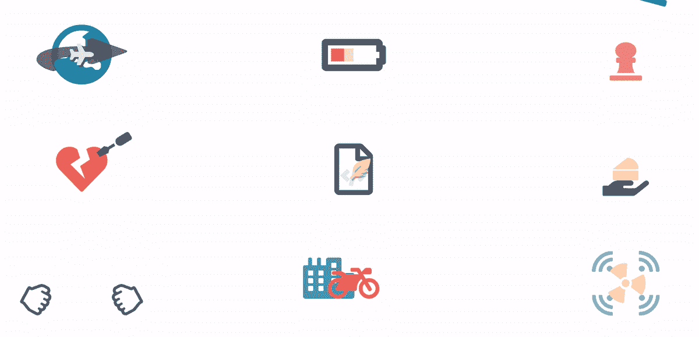

# 9 种不同的 CSS 字体的动画加载器

> 原文：<https://levelup.gitconnected.com/9-different-css-only-animated-loader-with-font-awesome-a479894f7676>

如何使用字体 awesome 创建有趣的动画模式的分步指南

# 内容

1.  介绍
2.  结果演示
3.  先决条件
4.  逐步指南
5.  结论

# 介绍

动画很神奇。一个合适的动画可以帮助你更好地解释你的内容，让你的网站/应用程序更有趣。像许多开发者一样，设计图标不是我的拿手好戏。幸运的是，网上有很多免费资源，提供易于使用、可定制的矢量图标。

今天，我将使用 font-awesome(全是自由层图标)来探索 9 种不同的动画加载指示器(简称 loader！)

> 像这样引用通常是解释，如果你很着急，就忽略它们

# 结果演示

所有的动画都使用字体-真棒和 CSS 而已

代号:[https://codepen.io/josephwong2004/pen/bGVYjdX](https://codepen.io/josephwong2004/pen/bGVYjdX)

# 先决条件

SCSS/萨斯

# 逐步指南

**基本设置:**

在一切之前，让我们设置 html 主干和一些 css 助手。

html:

css:

**第一步:平面装载机**

首先，让我们使用地球仪图标和一个平面创建一个旋转的地球仪:

因为图标本身实际上不会旋转，相反，我们会让它慢慢消失，同时让下一个图标出现。为了使“旋转”地球的错觉更加可信，我们将在地球上添加一个平面，并在地球前面添加一个箭头图标来指示平面的方向。

html:

> 我们有两个平面图标，一个用“阴影”类来模拟平面在地球上的投影。
> ‘第五个’只是为了填补最后一个地球仪开始消失时的空白状态，但是第一个地球仪动画还没有开始

css:

> 解释:
> 
> 对于`showAndHide`关键帧，我们使用了一个`if-else`来确定地球是第一个还是最后一个，因为它们的行为与其他的不同。经过进一步考虑，我可以使用`animation-delay`来达到同样的效果。但是由于在加载器的其余部分已经有很多使用`animation-delay`的例子，我将保持这个不变。如果你真的需要使用`mixin`和 if-else 来创建不同的`animation keyframes`，希望能提供一种选择。

**步骤 2:电池加载器**

这个非常简单，使用了 5 种不同的电池图标:

给它们不同的颜色，然后把它们叠放在一起。较低的电池状态在顶部。我将让代码来说话:

html:

css:

> 因为字体很棒的图标背景默认是透明的，所以我们能够“看穿”顶层图标中的空白(就像空电池)

**第三步:象棋加载器**

这个实际上是我最喜欢的。我使用了国际象棋中的 4 个图标:

并创建一个动画图案，让每一个棋子落下来，“弹跳”一点，然后在 Y 轴缩放到 0，制造一个被落下来的棋子“碾压”的假象。

html:

css:

> 解释:
> 
> 这里，我使用了`animation-delay`属性为每个动画设置超时。由于延迟仅在第一次使用`infinite`动画时起作用，在关键帧内，我们不能使用完整的 100%。我们需要给象棋“消失”提供一些时间。从代码中可以看到，从 45%到 100%，棋是看不见的。在此期间，其他三个国际象棋将继续并完成他们的动画。另外，我在国际象棋的底部中间添加了变形原点，以确保它能被正确地“碾碎”

**第四步:心脏加载器**

对于这一个，我们有一颗破碎心和一些工具集:

动画本身只是旋转。这里的主要焦点是给每个工具一个正确的`transform-origin`，确保它们被正确地使用。当心脏得到“修复”的时候，也要给它一点心跳。

html:

css:

> 解释:
> 
> 同样，因为我们有三个工具，并且每个工具在它动画后消失，我们需要限制`keyframes`到 33%最大值。
> 
> 而对于心脏，我们只需要让动画与每个工具对齐。这可以通过`animation-duration`和`keyframes`轻松完成。

**第五步:编写加载程序**

我们使用了 4 种不同的文件类型和一个羽化图标来创建一个从空白文件写入新文件的错觉:

同样，因为字体很棒的图标有透明的背景，我们可以把它们重叠在另一个上面。羽毛移动动画也很简单。

html:

css:

**第六步:食物装载器**

我开始没主意了。这只是简单地用一种食物交换另一种食物。同样，我将让代码来说话。

html:

css:

**第七步:石头剪刀布装载机**

好吧，这个更有趣。要让石头剪刀布成功，我们需要两个阶段。第一个阶段是“准备”，我们在挥拍时总会有“摇滚”。
第二个阶段是“动作”，实际的手势(石头/布/剪刀)被显示出来，因此，我们需要两个动画，一个用于在石头中挥动手，另一个用于显示手势。

html:

css:

> 解释:
> 
> 好吧，我知道这不完美。想法是，我们将对齐“预摆动”动画和“动作”动画。所以当摇摆前的“石头”消失时，“石头/布/剪刀”的手势就显现出来了。
> 
> 在一个完美的世界中，我们希望手势向下摆动，慢慢转向“石头/纸/剪刀”手势。我试过了，但结果并不令人惊讶。所以我就这么简单

**第八步:摩托车装载机**

让我们制作一个穿越城市的摩托车动画。为了让摩托车“动起来”，相反，我们让其他所有东西以与摩托车相反的位置移动。我在摩托车前面做了一些物体，在后面做了一些物体，创造出摩托车在边界内行驶的假象。最后，我还添加了一个“风”图标来指示摩托车呼出的气体。

html:

css:

**第九步:辐射加载器**

最后但同样重要的是，一个旋转的辐射图标，发射信号。还是那句简单的话。

html:

css:

> 解释:
> 
> 这很简单，但是我想演示 mixin 的一个有趣的用法。因为对于四个信号，它们具有相应的顶部/右侧/左侧/底部属性，但是具有相同的`$offset`值。在 mixin 中，我设置了一个变量`$pos1`和`$pos2`。在动画关键帧内:
> `from { #{$pos1}: — $start + px; #{$pos2}: — $start + px; opacity: 0;}` 允许我们将属性作为变量插入。

# 结论

正如你所看到的，这里使用的所有动画都非常简单，没有任何花哨的东西。这篇文章仅仅提供了一些如何组合图标来创建有趣图案的例子。

我希望你喜欢这篇文章，并随时留下评论。