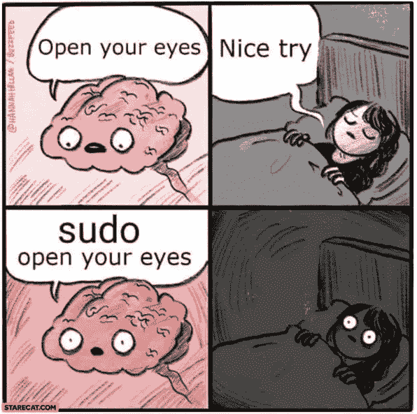
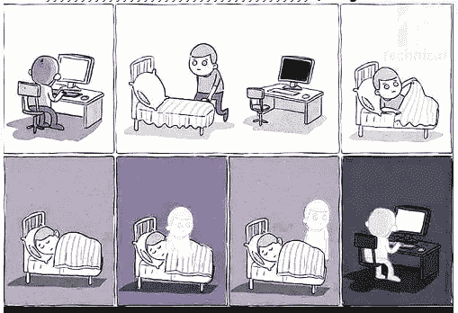

# 你将成为成功程序员的 9 个早期迹象

> 原文：<https://levelup.gitconnected.com/9-early-signs-you-will-be-a-successful-programmer-1a604f04be39>

## 不要放弃

照片由[威灵顿·库尼亚](https://www.pexels.com/@wjretratos?utm_content=attributionCopyText&utm_medium=referral&utm_source=pexels)从[派克斯](https://www.pexels.com/photo/woman-holding-3d-moon-lamp-led-lights-decoration-2479882/?utm_content=attributionCopyText&utm_medium=referral&utm_source=pexels)拍摄

从你开始自学编码到现在时间还很短。你怀疑地盯着控制台上嘲笑你的红色文本——又一个错误！你需要花一个小时的时间来搜索和修补它。

日复一日，你感到沮丧和困惑，你怀疑自己是否有能力坚持到底。“我能编码吗？”你扪心自问。

振作起来，你的痛苦没有白费！你现在可能没有意识到，你会很高兴地知道，有一些明显的迹象表明你正在走向成功。

每一个新的程序员都必须走这条路，每个标志都指向你的命运——成功或失败。这篇文章概述了那些证明你最终会成功的迹象。看看你是否能找出任何预示你成功的征兆。

# 标志 1。你的思维自然会被编码所吸引

我想你已经知道我的意思了。你有一种“计划外的”好奇心。你不能停止思考你的代码，即使你正在做别的事情。

当你开车时，坐在办公桌前工作时，躺在床上时，或者走在路上时，你所能想到的就是如何解决那个编码问题。你迫不及待地回到电脑前，看看你正在考虑的解决方案是否可行。你不能等待谷歌的解决方案来找出为什么你的代码不按它应该的方式运行。也许你的页面很丑，你需要让它看起来更漂亮。不管是什么，你都迫不及待地想再次站在键盘前。

这是一个好兆头！你贪得无厌的好奇心就像一股强大的水流带着你顺流而下，越来越快。当你经历艰难的学习阶段时，没有什么比天生的好奇心更能帮你度过难关。你不需要深入挖掘来激励自己。

接下来，你会用你的好奇心做什么？记住，你一天只有几个小时。

# 标志 2。你把所有的业余时间都花在编码上了

这和标志 1 有关，但仅仅好奇是不够的。你必须优先考虑编码的时间。如果你没有为编码安排足够的时间，你将永远不会有足够的时间来满足你的好奇心。所以，你明智地使用你的时间。

很多人在全职工作的同时学习编程。这使得他们只有有限的空闲时间。如果初学者花时间编码，这是另一个好迹象。这表明你明白只有通过实践你才能变得更好，并且为了牺牲你的时间，编码足够重要。

你更喜欢花时间编码，而不是在周末去参加聚会，因为你知道，除了在聚会上浪费的时间，第二天你会筋疲力尽。

# 标志 3。你在非常时期看教程

当你不在电脑前时，你会在手机上看教程。你不满足于你所知道的，你想知道更多。如果你不能开着音响，你可以读一篇文章。

如果你在免费教程中找不到你需要的东西，你就花钱去上课程。你在医生的候诊室，在公共汽车或火车上，在床上观看或阅读。你用午休时间看教程。你边吃外卖边看文章。

你知道辅导课是学习理论的唯一途径。

# 标志 4。您构建并部署

你明白学习和实践你所学的东西是有区别的，真正的学习来自实践。你知道，教程不会告诉你整个故事，当部署的时候，教程跳过的那些无关紧要的小细节会突然在你的控制台上显示为错误。

你不会被困在教程地狱里。您构建东西，然后部署您构建的东西。在现实世界中，人们不付钱给你做教程，他们希望他们的网站在互联网上，没有 bug。

所以，你找到免费的主机，把你的网站部署到互联网上。你为你的朋友和家人建立网站。你得到他们的反馈，然后建立一个项目组合。

你为现实世界制造东西。

# 标志 5。你有一个路线图，并坚持它(大部分)

你明白编程语言并不存在于真空中。所以，你有了一个路线图，告诉你必须学习什么语言以及学习的顺序。路线图还会告诉您它们的用途以及您可以用它们来构建什么。

如果你不知道如何使用一门语言，或者不知道学了之后是否能找到工作，你就不会去学这门语言。例如，如果你不想建立一个网页，为什么要学习 Javascript 呢？对于你正在学习的东西，你有一个*使用*。你想建造一些东西。

有时你会偏离地图，用编程做一些有趣的事情，比如制作一个小游戏。但总的来说，你的眼睛盯着球，不要偏离你的地图太远或太久。

你明白，享受你所学的东西是件好事，但如果你学习了太多随机的无关联的东西，你将无法构建一个完整的应用程序、网站或游戏体验。通过与地图相关的事物获得乐趣，你学会了平衡乐趣和有用的学习。如果你想找一份开发人员的工作，这一点尤为重要。你知道如果你只能用你的代码做十个随机的不相关的把戏，没有人会雇用你。

如果你不再有乐趣，你就制定一个新的路线图。如果你只对一件事感到厌倦，你会制作许多小地图。

# 标志 6。你用谷歌搜索错误信息

错误消息是你经常出现的私人教练。无论白天黑夜，他都在那里，不允许你走错一步。多好的小伙子啊！你甚至不用付钱给他。他也可以同时出现在任何地方！在您的控制台中，在您的终端中，在您的数据库日志中，一直到云中。他真的很迂腐，什么都瞒不过他。非常长期的痛苦。你可以对他大喊大叫，破口大骂，他不介意。他会永远在你身边。他真好。

但是不要问他在哪里可以找到解决方案。他只是在那里告诉你 ***到底*** 怎么了。他很擅长这个。专为你定制的 500 行红色文字。

如果你厌倦了他的课，那么你必须去谷歌一下他的信息。这是少见他的唯一方法。当你的代码有错误时，你*必须*找到解决方案。没有别的办法了。

这就是你要做的。你试图准确地理解*是什么导致了错误，这样它就不会以另一种形式悄悄回到你的代码中。*

*你在笔记中有一个特殊的“错误”标签。当你在几个小时的搜索和修补后找到解决方案时，你复制错误信息和它的解决方案，并记下来。这让我们看到了下一个迹象。*

# *标志 7。你保存笔记和代码片段*

*没有人能记住所有的事情。当您看到这些代码时，您可以将它们复制粘贴到 OneNote 选项卡中，并为它们贴上标签。在六个月的时间里，你会记得一些问题可以解决，但你不记得如何解决。你只需搜索你的片段，很快，你的一天就完成了。*

*笔记是你未来自我的个性化教程。*

*认真的程序员有一堆标签清晰的笔记，很容易找到。*

# *标志 8。你梦想编码*

*说真的，你梦想编码。每个程序员都有这种奇怪的经历。如果你还没有经历过这些，也许你对编码没有 100%的热情。*

*编码人员梦想着错误信息、解决缓慢的页面加载、正确构建他们的数据库，这样他们就不会支付过多的费用，以及一大堆与编码相关的东西。*

*甚至还有关于它的笑话和迷因，像这样:*

**

*[starecat.com](https://starecat.com/brain-open-your-eyes-nice-try-sudo-open-your-eyes-comic/)*

**

*probytes.net*

*众所周知，程序员会在半夜突然醒来开始编码，因为他们梦见如何解决问题。另一个常见的经历是，在醒来时，或者在关灯后的几分钟内，突然意识到一个解决方案。*

*又一个好兆头！这表明你的注意力完全集中在学习上。*

# *标志 9。你总是回到编码上来*

*我们都是人。有时当事情太困难时，我们会放弃。有时候，生活中的一些事件，比如疾病、个人悲剧或工作变动，会扰乱我们的生活，让我们远离梦想。一天的休息变成一周，一周变成一个月，直到你的编码习惯没有了。*

*然后有一天你独自坐着，有趣的事情发生了。代码开始飘过你的脑海，就像一阵微风诱惑你再次驶向未知的彼岸。你把它从你的脑海中抹去，但是这些想法又回来了。你知道你无法逃脱。你只需要搔搔痒。你打开编辑器，盯着最后几行代码。你想知道如果你不放弃，你会走多远。编码错误又来了。*

*所以每次你放弃，你又会回来。一次又一次。每一次你发誓不放弃，你走得更远。在内心深处，你知道你会坚持到底。*

# *最后的想法*

*如果你正在经历学习编码的痛苦，不要绝望。你最终会从教程的森林中走出来，发现你在一个蓝天下，一切都有意义。*

*当你想到你是如何谷歌所有这些简单的错误，或者晚上躺在床上思考如何解决一些简单的问题时，你会微笑。你会感激有一个[路线图](https://medium.com/technology-hits/the-best-programming-languages-to-learn-first-a-roadmap-for-the-indecisive-beginner-f242e5ffeac5)帮助你到达你要去的地方，因为你不必学习那些让你沮丧和困惑的随机和不必要的东西。*

*有一天当你回首往事时，你会意识到这些迹象是成功的真正标志。如果你能认同上面的迹象，现在就不要放弃，成功就在路上！*

*感谢阅读。如果你喜欢这篇文章，可以考虑在这里[订阅](https://craftedwebpages.medium.com/membership)中级会员，以获得数以千计的其他文章。*

****你可能也会喜欢我的另一篇文章:****

* [## 初学程序员应该克服痛苦的 7 个理由

### 振作起来——更好的日子即将到来

medium.com](https://medium.com/illumination-curated/7-reasons-beginner-programmers-should-push-through-the-pain-58665d914254)  [## 首先学习的最佳编程语言——犹豫不决的初学者的路线图

### 最省时、最具成本效益的学习方式以及免费和付费课程

medium.com](https://medium.com/technology-hits/the-best-programming-languages-to-learn-first-a-roadmap-for-the-indecisive-beginner-f242e5ffeac5)  [## 一系列让你发笑的编程笑话

### this . jokes array . foreach(joke = > medium . log(joke))

levelup.gitconnected.com](/an-array-of-programming-jokes-to-make-you-smile-e5bbb0cb42ed)*