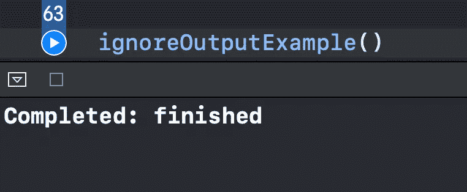

# Swift:你应该知道的 9 个过滤组合运算符

> 原文：<https://levelup.gitconnected.com/9-filtering-combine-operators-you-should-know-9c1ef2911352>

## 用清晰的例子

由 [Oliur](https://unsplash.com/@ultralinx?utm_source=medium&utm_medium=referral) 在 [Unsplash](https://unsplash.com?utm_source=medium&utm_medium=referral) 上拍摄的照片

在本文中，我们将探索和掌握 Xcode 操场上 9 个有用的过滤组合操作符。

源代码可以在文章的底部找到。

# 我们开始吧

## 1)过滤器

如果我们只想接受那些符合特定条件的元素，我们就使用`.filter`操作符:

这里我们只打印那些包含“o”字母的`String`值，忽略其他的:

## 2)删除重复项

`.removeDuplicates`运算符，顾名思义，只允许我们获得唯一的值:

结果，我们打印出了以下整数:

## 3)紧凑地图

如果你曾经在反应式编程中处理过选项，那么你可能会喜欢`.compactMap`操作符。它只允许我们获得非零值:

我们可以看到，“Hello World”到`Int`的转换返回`nil`，所以我们没有看到它打印在控制台中:

## 4)忽略输出

顾名思义，`.ignoreOutput`操作符忽略所有上游事件。但是，它会传递一个完成状态(完成或失败)。当您不关心值，只需要知道发布者是否已经完成时，这是很有用的:

我们可以看到只打印了完成事件:

## 5)首先(其中:)

我们使用`.first(where:)`操作符获取订阅中第一个符合我们标准的值:

我们可以看到“lorem”和“ipsum”都是以小写字母开头的。“Dolor”字符串满足条件，因此它被打印出来，并且发布者完成:

## 6) dropFirst(计数:)

`.dropFirst(count:)`操作符允许我们忽略一些作为参数传递的元素:

因此，我们在控制台中只显示了“Hello World”和“5 ”:

## 7)丢弃(当:)

该运算符忽略元素，直到不满足给定的谓词:

这里我们省略元素，直到我们有一个少于三个字符的`String`。在我们的例子中，它是“Sit ”,因此，打印“Sit”和“amet ”:

## 8) drop(untilOutputFrom:)

当我们希望拥有一个允许源发布者发出值的“触发”发布者时，我们使用这个版本的`.drop`操作符。一旦值被发送到“触发器”发布者，源发布者就被允许执行:

这里我们创建了一个[定时器](https://medium.com/cleansoftware/swift-how-to-create-a-timer-in-combine-43192dab4d3)发布器，一旦`startTrigger`主体接收到信号，它就被允许发出事件。三秒钟后，我们向`startTrigger`主题发送一个`Void`值，因此我们让计时器仅从第四秒开始打印值:

## 9) .前缀(untilOutputFrom:)

这篇文章的最后一个运算符是`.drop(untilOutputFrom:)`的反义词。一旦触发器发布者接收到值，我们就停止从源发布者接收值:

因此，计时器打印三秒钟，一旦我们向`stopTrigger`主题发送一个值，计时器立即停止:

# 资源

源代码可以在[要点](https://gist.github.com/zafarivaev/f9dcc6ab75243661e18a751927950f36)中找到。

# 包扎

想了解更多关于联合收割机的信息吗？查看我的其他相关文章:

 [## Swift Combine 中您应该知道的 7 个顺序运算符

### 第一个、最后一个、计数、包含、全部满足、减少等等

medium.com](https://medium.com/better-programming/7-sequential-operators-you-should-know-from-swift-combine-1775ce3c47c8)  [## 在 Swift 5 中将委托替换为组合

### 摆脱这种冗长的协议一致性

medium.com](https://medium.com/better-programming/replace-delegation-with-combine-in-swift-5-e4c193655e7b)  [## 5 你应该知道的变换组合运算符

### 用清晰的例子

medium.com](https://medium.com/better-programming/5-transforming-combine-operators-you-should-know-4603fe112d74)  [## 如何在 Swift 5 中创建自己的联合收割机订户

### 将逻辑封装在单独的类中

medium.com](https://medium.com/better-programming/how-to-create-your-own-combine-subscriber-in-swift-5-702b3f9c68c4) 

感谢阅读！