# 9 款免费设计工具，让您的应用更上一层楼

> 原文：<https://levelup.gitconnected.com/9-free-design-tools-to-level-up-apps-50ef113958ee>

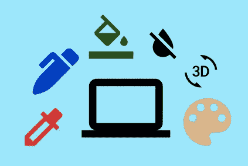

你对设计感兴趣，但又不完全相信要购买设计项目吗？也许你是一个网站开发人员，需要为你的项目设计简洁方便的设计。也许你只是想通过使用不同的设计程序来创建独特的项目来扩展你的技能，或者你需要用简单、丰富多彩的背景来提升你的专业资料图片。幸运的是，在你方便的时候，有很多免费的设计程序、插图和图标可以帮助你完成任务。

## 有哪些免费的设计工具？

以下是你现在可以使用的在 [Producthunt](https://www.producthunt.com/search/posts?q=free%20design) 上找到的 9 个免费设计工具的列表！

*   **Colorie** —调色板生成器
*   **快乐色调** —调色板灵感现场
*   **斑点** —斑点生成器
*   **样条** — 3D 电脑绘图工具
*   **免费配置文件生成器** —配置文件背景生成器
*   **Photopea** —照片编辑工具
*   **图标乌托邦** —免费图标包
*   **打开涂鸦** —免费插画
*   **design.dev** —免费图标包

## 科里:

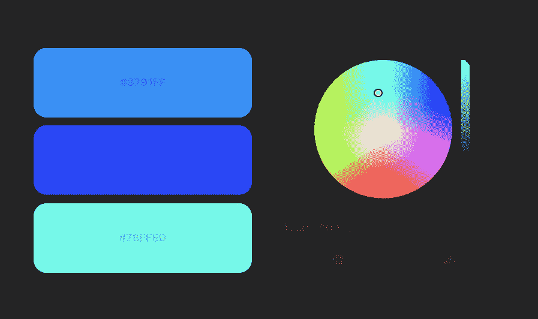

Colorie 是一个简单的色轮工具，允许您选择设计所需的颜色。只需选择协调的颜色，一旦你满意，下载你的调色板想法作为一个 PNG 文件。

## [快乐色调:](https://www.happyhues.co/palettes/10)

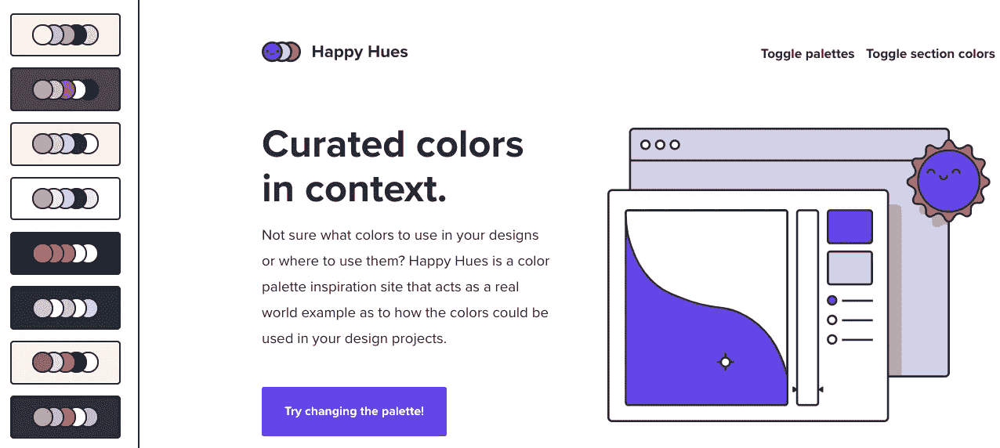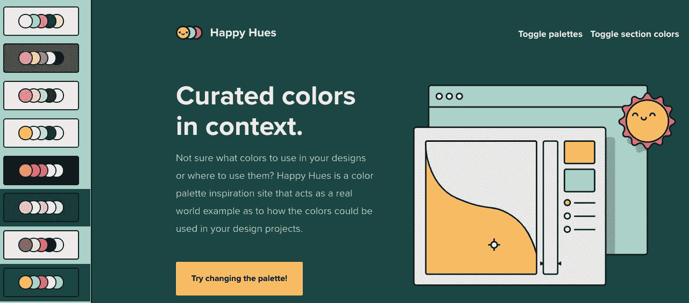

Happy Hues 让您从一系列调色板中进行选择，甚至为您预览颜色！为了您的方便，该网站还包括十六进制颜色。如果你有兴趣了解更多关于哪种颜色对用户更有吸引力取决于你的目标，那么看看这篇[文章](../../../blog/article/website-design-how-to-get-started-common-designs)。

## [斑点:](https://blobs.app/?e=13&gw=6&se=160&o=1&pat=floor)

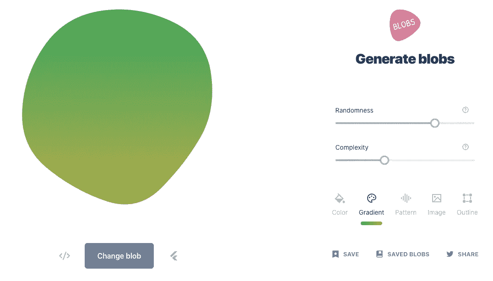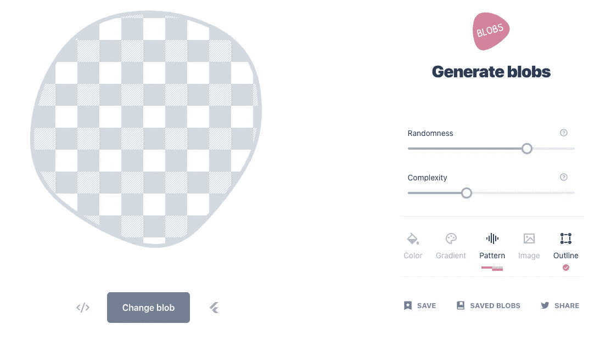

此工具允许您创建简单的斑点，并带有使斑点显示为纯色、渐变或图案的选项。你甚至可以添加一个图像或者给你的斑点留一个轮廓，同时改变你的斑点的复杂性和随机性。Ordinarymedia.com 有一个很棒的网页设计，包含了一个你可以查看的斑点。

## [花键:](https://spline.design/?ref=producthunt)

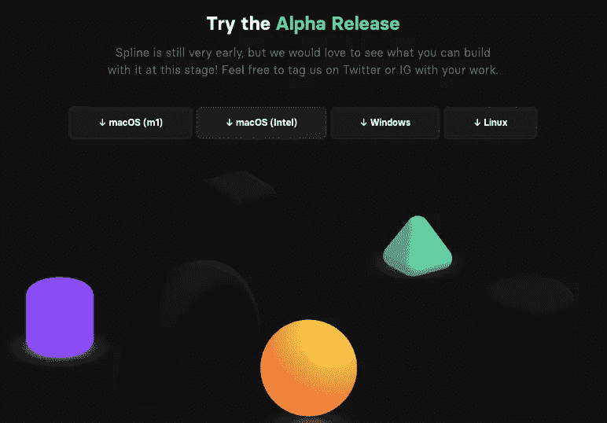

Spline 是一个 3D 设计工具，因此您可以将有趣、大胆的几何对象添加到您的设计中！只要确保你的电脑更新到最新版本，并下载专门针对你的电脑的程序。动画，3D 人物和设计越来越受欢迎，所以不妨试试样条！

## [免费简介制作:](https://pfpmaker.com/)

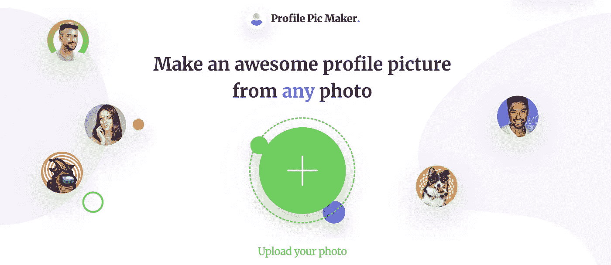

免费的个人资料制作是一种快速简单的方法来添加背景的肖像照片。只需上传您的图片，选择您最喜欢的背景，然后下载您的个人资料图片！您可以在您的社交媒体帐户上使用您的个人资料图片，或者将其添加到您的网站上，以便用户可以熟悉您的身份！

## [光眼:](https://www.photopea.com/)

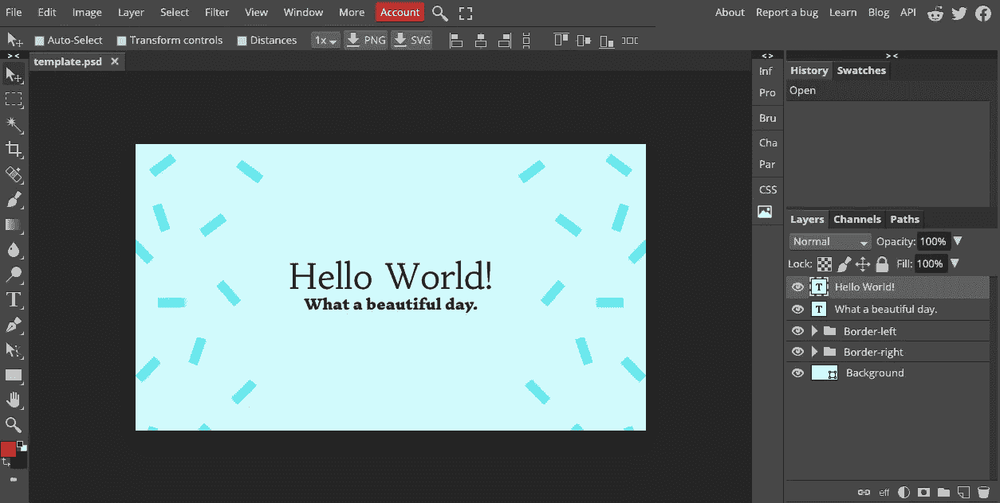

Photopea 是 Adobe Illustrator 的免费替代品，具有类似的功能。如果你以前用过 Adobe Illustrator，使用这个免费工具不会太难。您可以直接从电脑上传项目或开始一个新项目。如果你开始一个新项目，Photopea 提供了一系列背景模板供你选择。

## [图标乌托邦:](https://iconutopia.com/free-icons/)

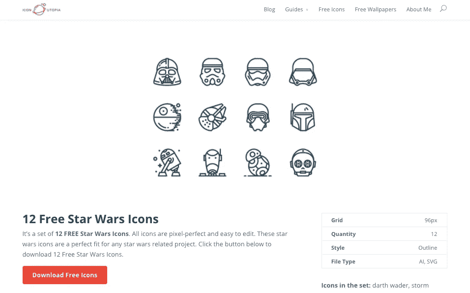

图标乌托邦提供精选图标，你可以免费下载使用。你可以找到*乐高*图标、*星球大战*图标、露营图标等等！如果你有兴趣了解一个图标是如何制作的，你可以阅读这篇[文章](../../../blog/article/how-to-design-icons)。

## [打开涂鸦:](https://opendoodles.com/)

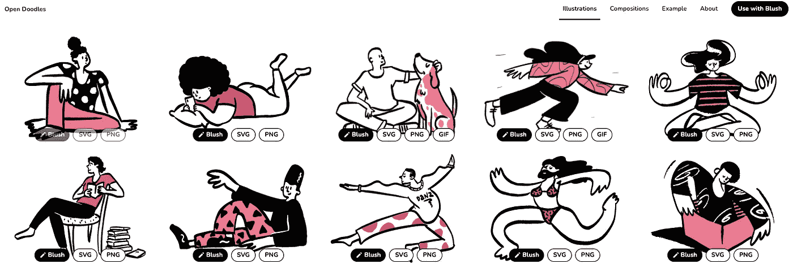

Open Doodles 提供独特的绘图，您可以轻松地将其添加到您的项目中。点击黑色*腮红*按钮，你就可以查看并下载你想要的 PNG 文件。这个网站是常用的 Adobe Undraw 设计的一个很好的替代品。

## [设计开发](https://design.dev/)

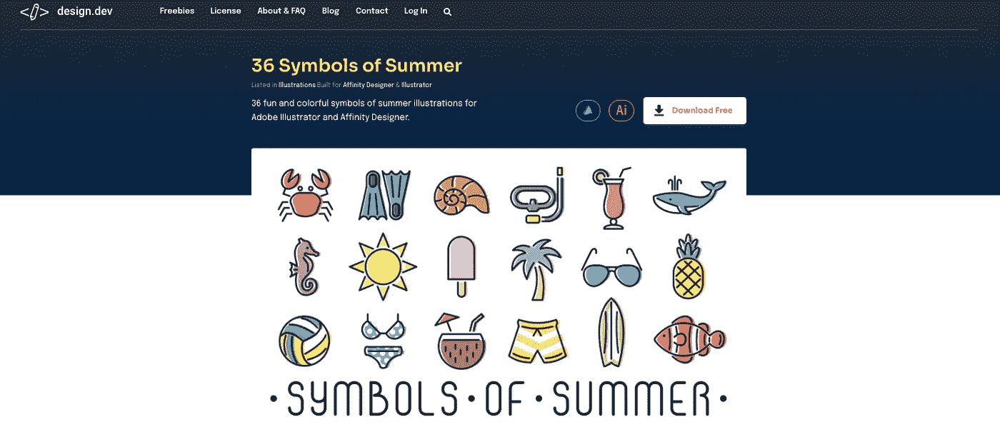

Design.dev 提供了夏天、冬天、秋天、教育等主题符号！这些简单的设计对用户来说很容易识别，这有助于避免混淆符号的设计意图。Design.dev 甚至提供其他潜在有用的设计，如背景插图和横幅广告模板。

## 包扎

希望这些服务能对你有所帮助，但是如果没有，在你方便的时候还有很多其他的免费设计服务。像这样的服务可以节省大量的时间、精力和金钱，所以即使你找不到你想要的，它们也值得一试。有时，这些设计可以帮助激发你为你正在做的任何项目创造理想的外观。

*原载于*[*【https://www.ordinarycoders.com】*](https://www.ordinarycoders.com/blog/article/free-design-tools-producthunt)*。*