# Chrome 开发者工具的 9 个重要特性将使你的日常工作变得更加简单

> 原文：<https://levelup.gitconnected.com/9-important-features-of-chrome-developer-tool-that-will-make-your-daily-work-easier-88af71b367c9>

# 介绍

作为一名前端开发人员，你必须掌握的最重要的技能之一是如何使用谷歌开发人员控制台来简化你的日常工作。作为一家拥有大量开发人员的大型科技公司，谷歌理解开发人员在无法发现程序中的错误时可能面临的压力和挣扎。因此，在开发他们的产品时，谷歌不仅让 Chrome 对用户友好，更重要的是，让它面向开发者。谷歌 Chrome 上有许多很酷的功能，不仅可以帮助你更快地跟踪网站上的问题，而且最重要的是，可以提高网站的性能。在本文中，我们将介绍一些您需要的关键特性。

# 启动控制台

要开始使用 Chrome Developer 工具，如果您使用的是 Windows，请按 F12 如果您使用的是 Mac，请按 Ctrl + Option + J。一旦开发者工具打开，你可以点击右边的三个小点，根据你的个人喜好改变**停靠**模式。就我个人而言，我喜欢将开发者工具作为一个单独的窗口打开，这样我可以有更多的空间来工作，它不会挤压我的浏览器窗口，但这取决于你。

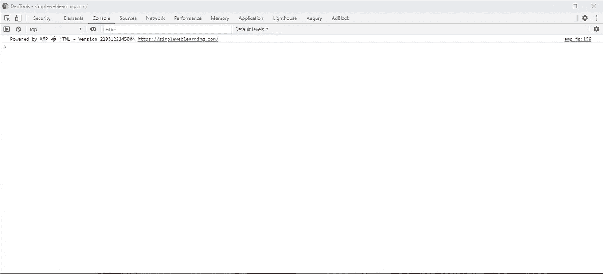

Chrome 开发工具—初始屏幕

# 左上角的箭头

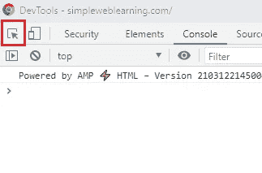

左上角箭头

左上角的箭头允许您快速分配您在浏览器上看到的任何元素的 DOM 元素。当您单击箭头并将鼠标悬停在页面上您想要研究的元素上时，一些基本的 CSS 属性会立即显示出来。此外，如果你点击高亮显示的元素，Chrome Developer Tool 会将你带到**元素**标签，并聚焦于你点击的元素的相应 HTML 代码。

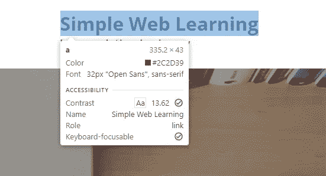

悬停元素

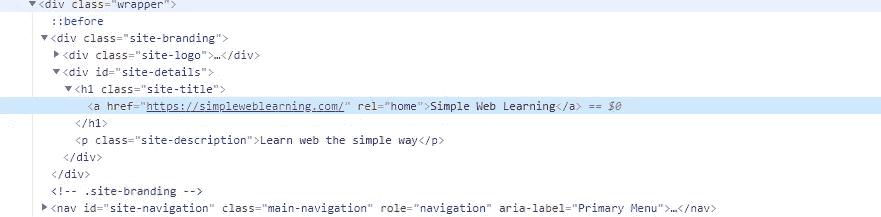

悬停并单击元素

当您在使用页面元素的 z 索引时遇到问题时，此功能尤其有用。当你不能点击网页上的一个元素时，很可能是因为它上面有一些 z-index 更高的不可见元素。在这种情况下，您可以使用这个小箭头来帮助您识别您单击的真正的 DOM 元素。

# 设备工具栏

在箭头旁边，您可以找到一个移动和平板设备的图标。当您点击图标时，您将进入响应模式。

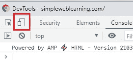

切换设备工具栏

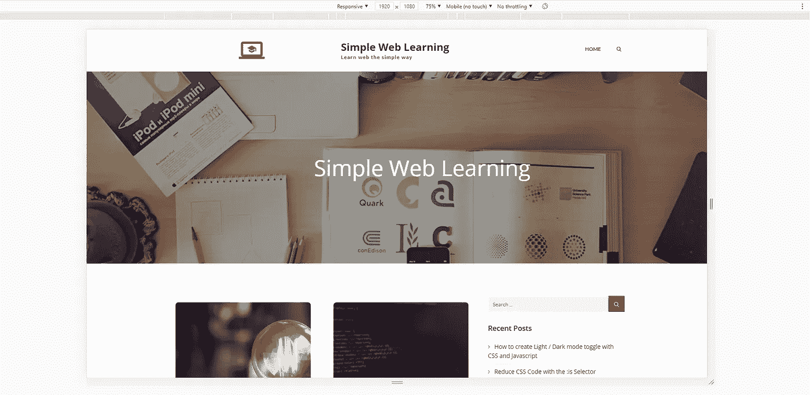

响应模式

在网站的顶部，您会注意到出现了一个附加工具栏，允许您调整窗口的宽度和高度。有三种方法可以更改窗口大小，您可以通过更改前两个输入框中的数字来调整宽度和高度，拖放右下角的箭头，或者选择相应的下拉菜单并直接切换到特定设备的宽度和高度。

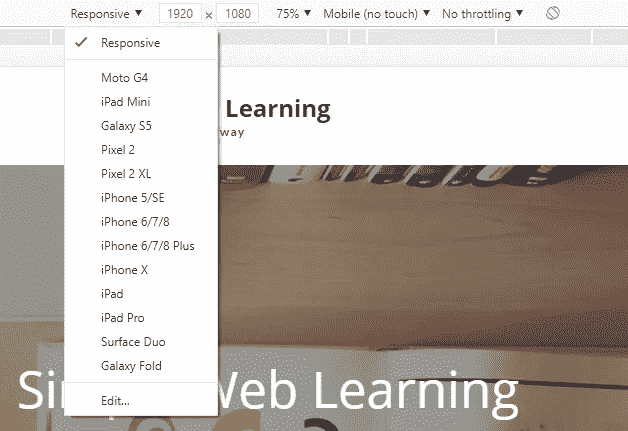

更改设备模式

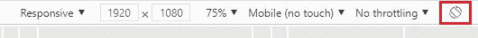

改变方向

在响应式开发期间，您可以使用该工具来模拟您的网站在各种大小的设备上的外观。

从右边的三点菜单，你可以捕捉当前的屏幕截图或拍摄全尺寸的屏幕截图。

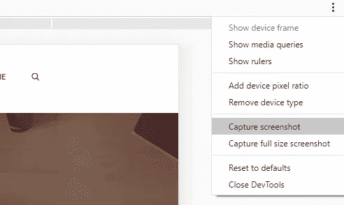

截图

# 元素

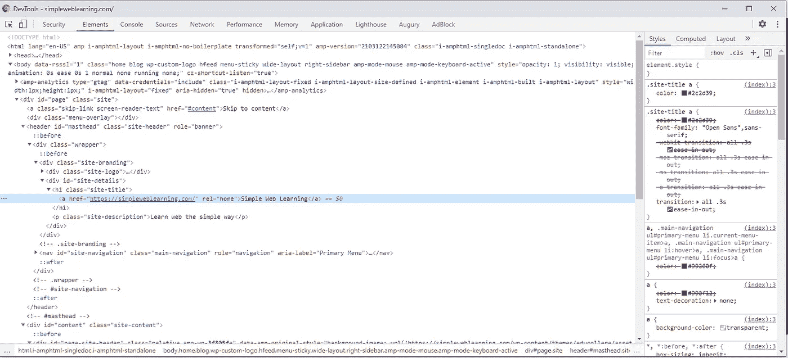

元素选项卡

在 Elements 选项卡上，您可以实时查看 HTML 源代码。如果网站在某个时候显示/隐藏了某些元素，您也会在元素选项卡中看到即时的变化。当您将鼠标悬停在 Elements 选项卡上的 DOM 元素上时，页面上相应的元素也会高亮显示。

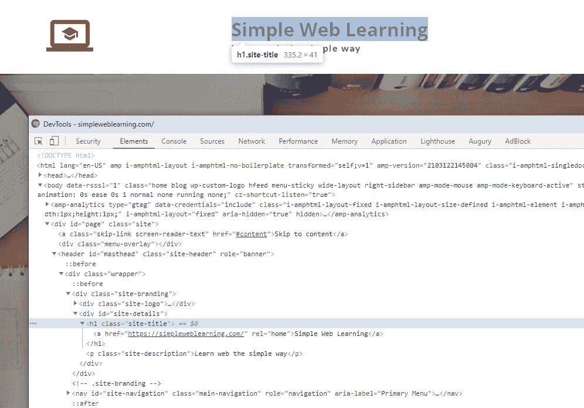

选择一个 DOM 元素

在面板的右侧，您还可以看到应用于您当前选择的 DOM 元素的 CSS 属性。当你发现一些令人惊奇的东西并想知道它是如何实现的时候，这也是一个学习 HTML 和 CSS 的好方法。直接在 HTML 和 CSS 部分，你可以修改你看到的所有属性。如果您想立即在浏览器中测试您的 CSS 或 HTML 代码片段，这很方便。当然，当你刷新或离开页面时，你的修改会丢失，所以当你完成时，一定要把它复制到你的脚本中。

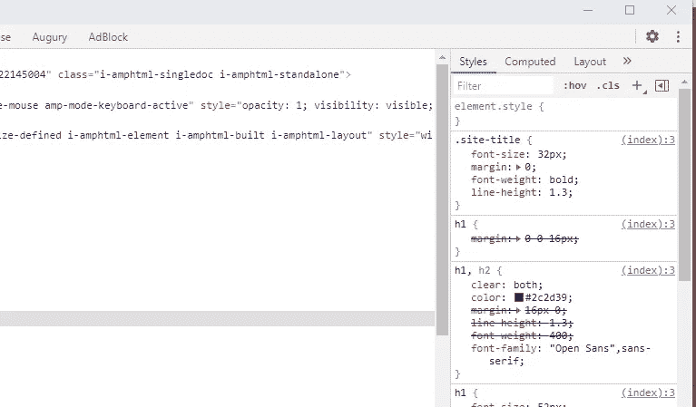

CSS 属性

# 安慰

您可以在这里找到网站的错误或日志消息。

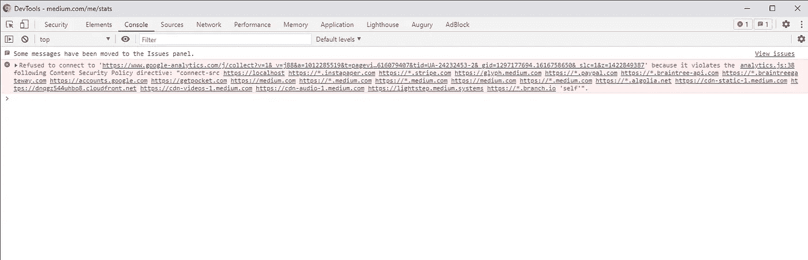

从控制台选项卡跟踪错误

虽然人们主要用它来查找错误和记录消息，但它也是您尝试 Javascript 代码的好地方。您可以直接在控制台上声明变量甚至函数，无需任何代码编辑器的帮助，您可以直接运行您的代码片段。

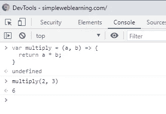

在控制台上测试 Javascript

# 来源

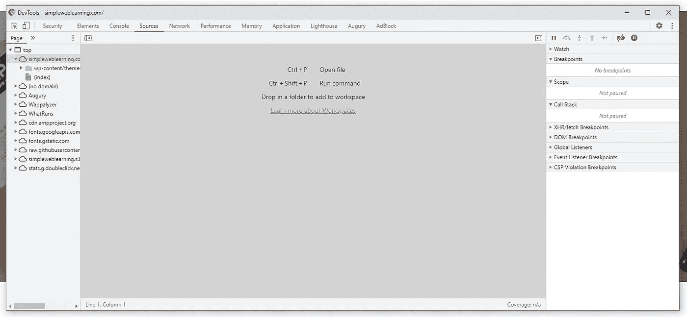

源选项卡

源代码选项卡允许您查看整个网站的源代码。这个特性在开发过程中特别有用。当你访问运行在本地主机上的你自己的网站时，你可以按 Ctrl + P 打开一个提示，搜索你想检查的程序的名字。

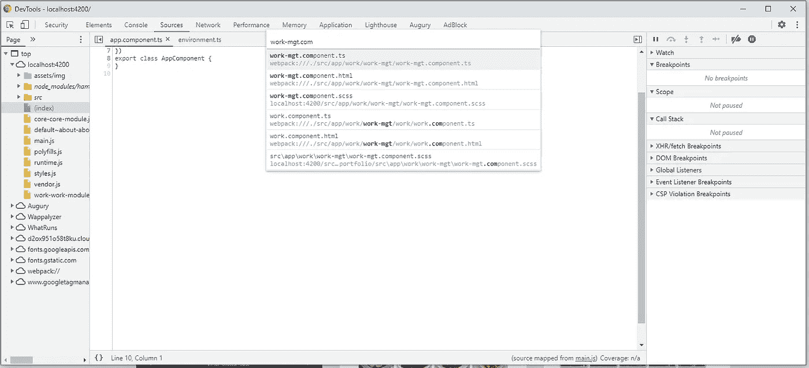

从源选项卡打开文件

进入程序文件后，您可以单击行号来设置断点。当程序到达断点时，它会暂停，允许您查看变量的状态或逐行跟踪问题。

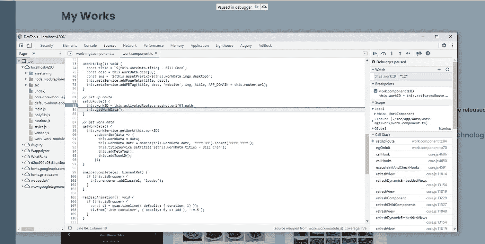

设置断点

# 网络

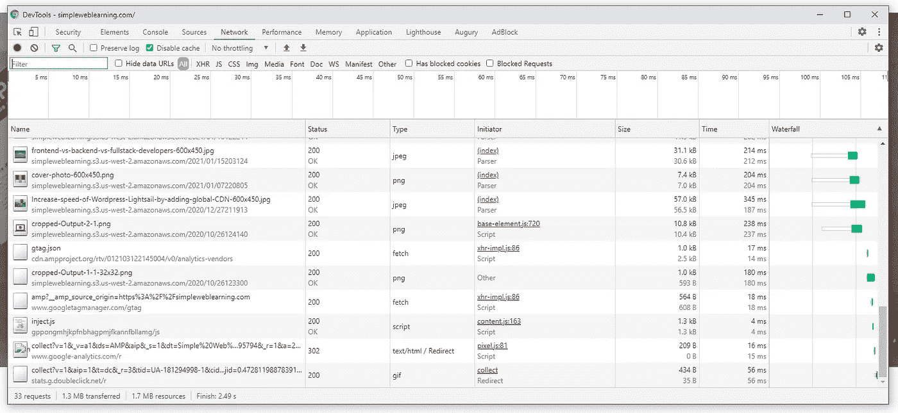

网络选项卡

在 Network 选项卡上，此处将列出在呈现页面时获取的所有资源或调用的 API。它将列出资源的名称(或 API url)、Http 状态、响应类型、请求的大小以及加载所需的时间。如果您单击某个特定的请求，您可能会进一步找到该请求的其他详细信息，如标题或正文。

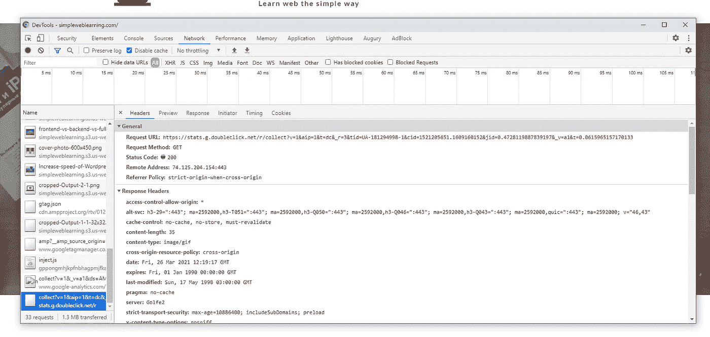

请求详细信息

在顶部标题上，您可以设置网络带宽限制来模拟离线或慢速网络。

# 应用

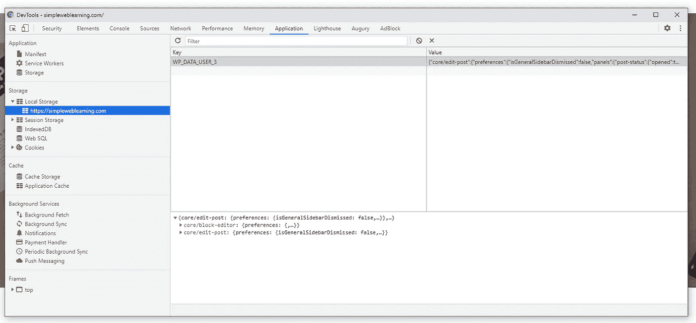

应用程序选项卡

在这里，您可以找到存储在浏览器中的所有信息，如 localStorage、sessionStorage、Cookie 等..如果网站支持 PWA 和离线模式，您也可以在此找到服务人员信息。

# 灯塔

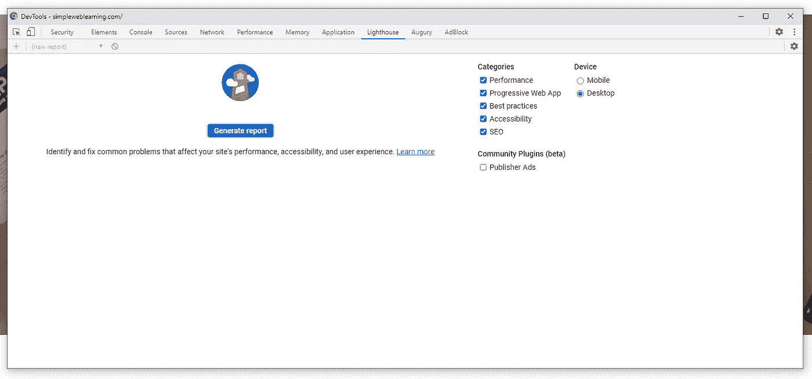

灯塔标签

在 Lighthouse 选项卡上，你可以让 Chrome 在你的网站上运行一个完整的诊断。Lighthouse 将从五个方面分析你的网站，包括性能、可访问性、最佳实践、SEO 和渐进式网络应用。

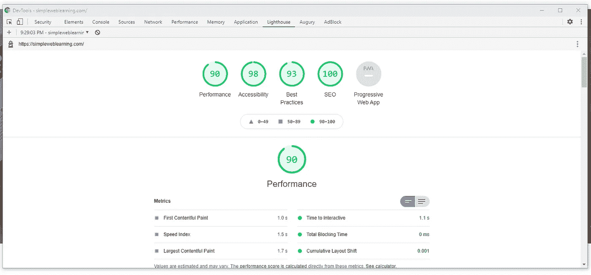

灯塔报告

在每一部分，你可以找到 Chrome 在你的网站上进行的所有测试的细节，并详细解释了每个测试的内容以及如何改进你的网站。遵循灯塔的建议可以帮助你在 SEO 排名中获得更高的分数。

# 结论

在本文中，我们已经介绍了 Chrome 开发者工具的许多特性。它们中的大多数可以为您的日常基础前端任务提供巨大的价值。如果你想了解更多关于 Chrome 开发者工具的细节，请访问谷歌官方文档页面，网址为[https://developer.chrome.com/docs/devtools/overview/](https://developer.chrome.com/docs/devtools/overview/)

原文:
[https://simple web learning . com/9-chrome-developer-tool-the-important-features-that-will-make-your ' s daily-work-easy](https://simpleweblearning.com/9-important-features-of-chrome-developer-tool-that-will-make-your-daily-work-easier)