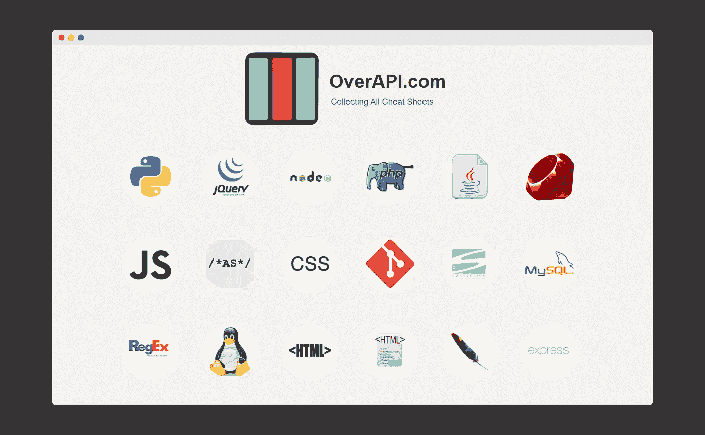
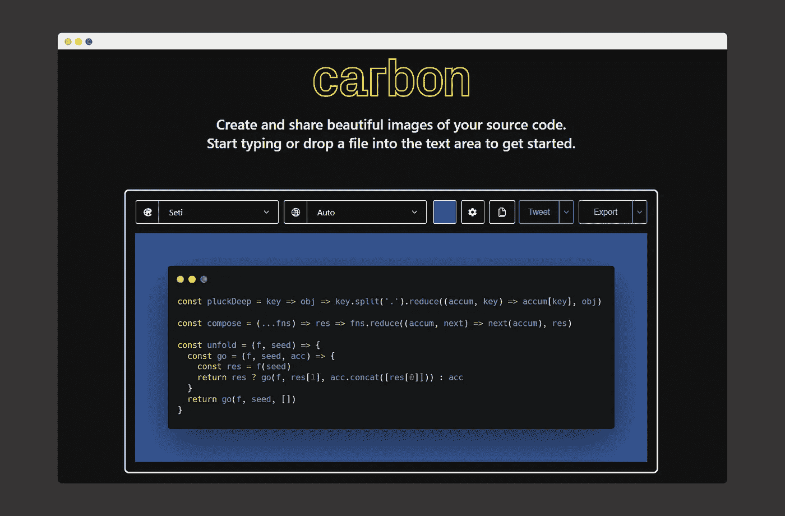
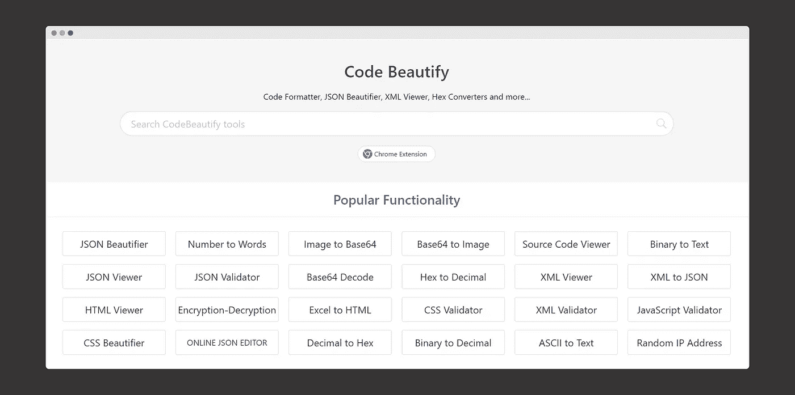
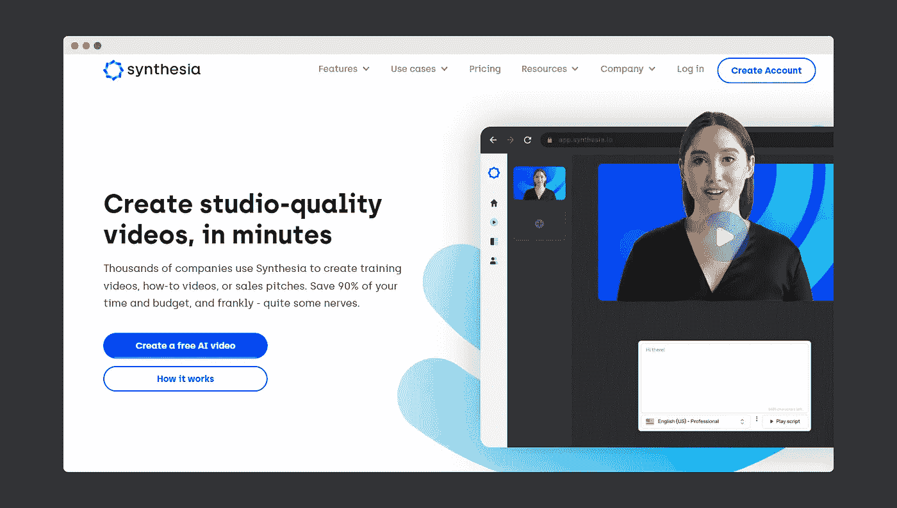
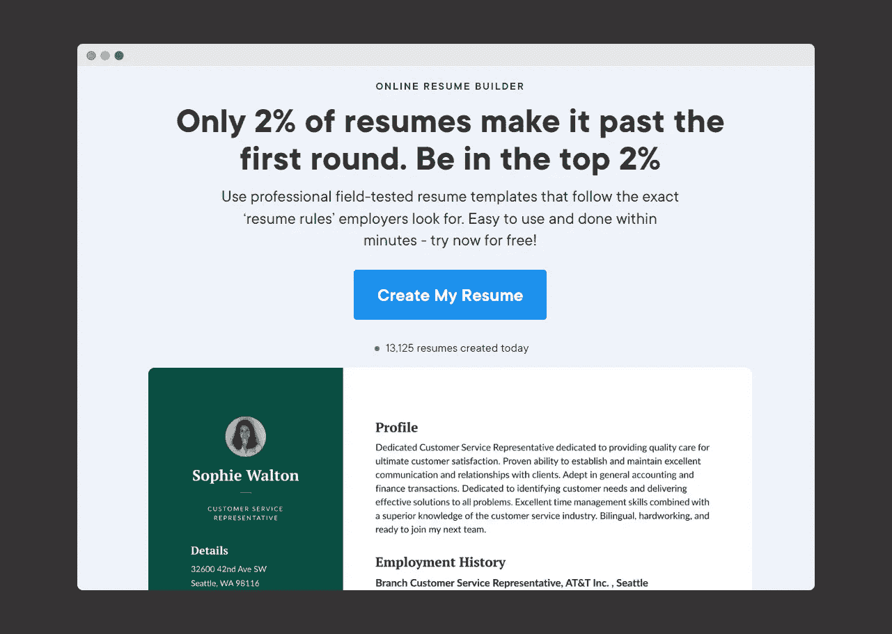
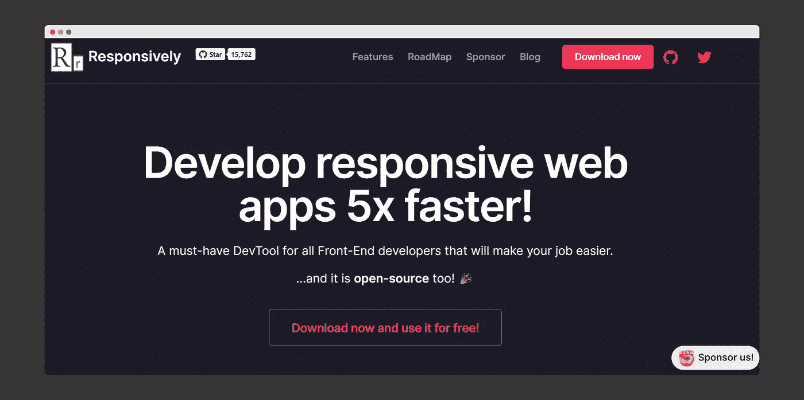
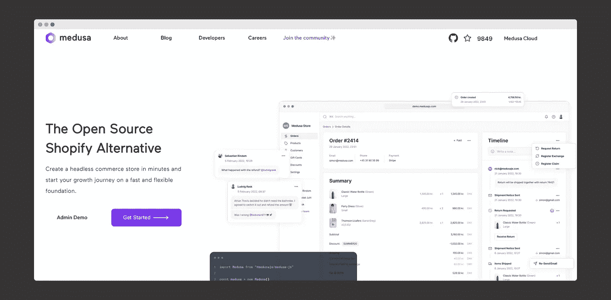
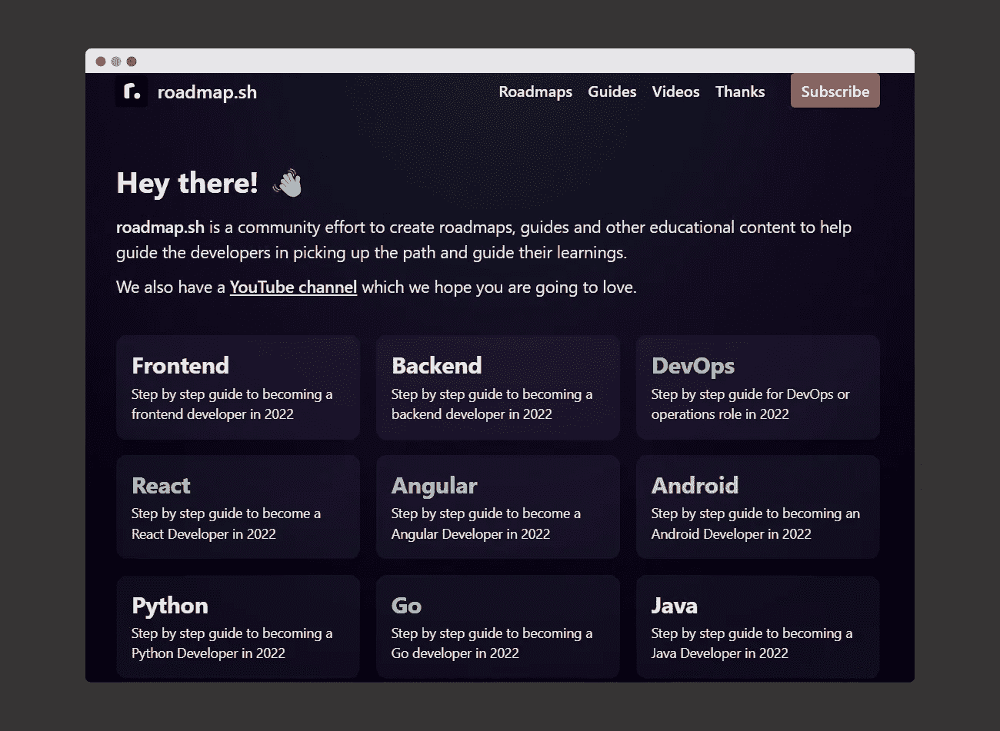
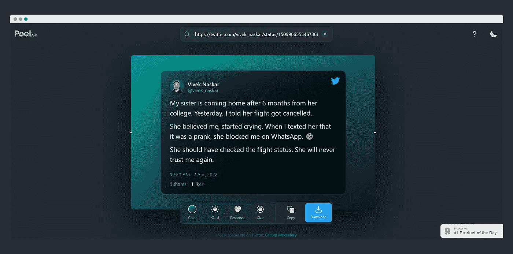

# 每个开发者都应该收藏的 9 个不可思议的网站

> 原文：<https://levelup.gitconnected.com/9-incredible-websites-that-every-developer-should-bookmark-1534d52f3f7d>

## 这些网站不仅会帮助你进行软件开发，还会帮助你进行内容创作。

李·坎贝尔在 [Unsplash](https://unsplash.com/s/photos/websites?utm_source=unsplash&utm_medium=referral&utm_content=creditCopyText) 上的照片

我从事软件开发已经有一段时间了。当我开始时，我总是想提高自己，变得更好，就像我那些有经验的同事一样。他们似乎总是做事情比我们快。我一直觉得如果我想成功，我需要在各方面都有所提高。

我一点也不知道，尽管我的同事们技术娴熟，但他们正在使用一些方便的网站，这些网站将极大地帮助他们完成任务。因此，这些年来，我越来越了解和发现这样的网站，这将使开发人员的生活变得更加容易。

这里有一些我认为每个开发者都应该收藏的顶级网站。这些网站不仅能帮助你的工作，还能帮助开发者在 LinkedIn、Twitter 和 Instagram 等平台上创建内容。

# OverAPI

【https://overapi.com/】网站链接:

**这是我见过的最好的网站之一，因为它有大多数编程语言的备忘单，我们广泛使用这些语言来开发我们的应用程序。**

# **碳**

****

***网站链接:*[**https://carbon.now.sh/**](https://carbon.now.sh/)**

**我创作内容已经有一段时间了，我的主要专长是技术和软件开发。这个网站是我通过开发者在我的 Instagram 个人资料、LinkedIn 甚至 Twitter 上分享代码片段的必去之地。**

# **代码美化**

****

***网站链接:*[**https://codebeautify.org/**](https://codebeautify.org/)**

**我经常称这个网站为网站的“瑞士刀”，因为它为开发者提供了大量的功能。从 *JSON 验证器*到 T *witter 头生成器*，这个网站应有尽有。只要去这个网站就能大吃一惊。他们也有一个 chrome 扩展，我正在使用这个扩展。**

# **合成**

****

***网站链接:*[**https://www.synthesia.io/**](https://www.synthesia.io/)**

**当我第一次通过 Instagram 卷轴接触到这个网站时，我的头脑被炸了。这个网站让你只需上传一个脚本或写下你的演讲，就可以用 50 多种语言制作基于人工智能的视频。**

** [## 你的人工智能视频

### 点击观看用 Synthesia STUDIO 生成的 AI 视频“你的 AI 视频”。

share.synthesia.io](https://share.synthesia.io/cf8ab1bf-a845-4ce0-9cc3-6d3bc92c3592) 

然而，有一个问题。Synthesia 不是免费的。但是你可以试试网站提供的视频功能。我制作了上面的视频给大家看看。

# 简历. io

*网站链接:*[**https://resume.io/**](https://resume.io/)

虽然我通常自己制作和更新我的简历，但这个网站非常方便，我把它分享给了我的朋友、同事和姐姐，她们将在接下来的几个月里申请工作。这个网站有一些你能在网上找到的最好的专业简历模板。

# 响应地

*网站链接:*[【https://responsively.app/】T21](https://responsively.app/)

一个开源网站，让您在一个窗口中并排预览所有目标屏幕。它也缩短了你的开发时间。我的团队经常使用这个网站。

# 水母

*网站链接:*[**https://www.medusajs.com/**](https://www.medusajs.com/)

Medusa 是一个开源的无头商务引擎，它使开发者能够创建令人惊叹的数字商务体验。你可以在他们的[博客文章](https://www.medusajs.com/post/the-story-behind-creating-medusa)中读到他们的故事，在过去的几个月中，这个项目的受欢迎程度迅速上升，仅在 6 个月内就在 [GitHub](https://github.com/medusajs/medusa) 上获得了+9000 次启动。

# roadmap.sh

*网站链接:*[**https://roadmap.sh/**](https://roadmap.sh/)

包含学习编程语言的路线图或帮助初学者选择学习路径的框架的网站。他们还有一个我订阅的 YouTube 频道。

# 诗人。所以

【https://poet.so/】网站链接:

**另一个美化你的推文的实用网站，可以在 Instagram 或 LinkedIn 等多个平台上分享。我经常使用这个网站。**** 

****如果你喜欢读这篇文章，你可能也会发现下面的文章值得你花时间去读。****

**** [## 每个开发人员都必须知道的 12 个 Visual Studio 代码快捷方式

### 这些快捷方式让开发人员的生活变得更加轻松。

levelup.gitconnected.com](/12-visual-studio-code-shortcuts-that-every-developer-must-know-8d6ce5fc3631)  [## 作为 Python 开发者应该关注的 8 个 YouTube 频道

### 如果你想了解 Python 的一切，包括它的框架，强烈推荐这些渠道…

levelup.gitconnected.com](/8-youtube-channels-that-you-should-follow-as-a-python-developer-6c4f725f72ca) 

*如果你喜欢阅读有助于你更好地学习、生活和工作的故事，可以考虑* [*成为订阅者*](https://viveknaskar.medium.com/subscribe) *。成为会员后，你可以无限制地阅读 10000 篇故事、文章和作家。每月只要 5 美元。* [*如果你注册使用我的链接*](https://viveknaskar.medium.com/membership) *，我将赚取一点佣金，帮助我写更多的文章。*

# 分级编码

感谢您成为我们社区的一员！升级正在改变技术招聘。在最好的公司找到你最理想的工作。

 [## 升级—转变技术招聘

### 升级—转变技术招聘🔥使软件工程师能够找到完美的角色…

作业. levelup.dev](https://jobs.levelup.dev/talent/welcome?referral=true)****