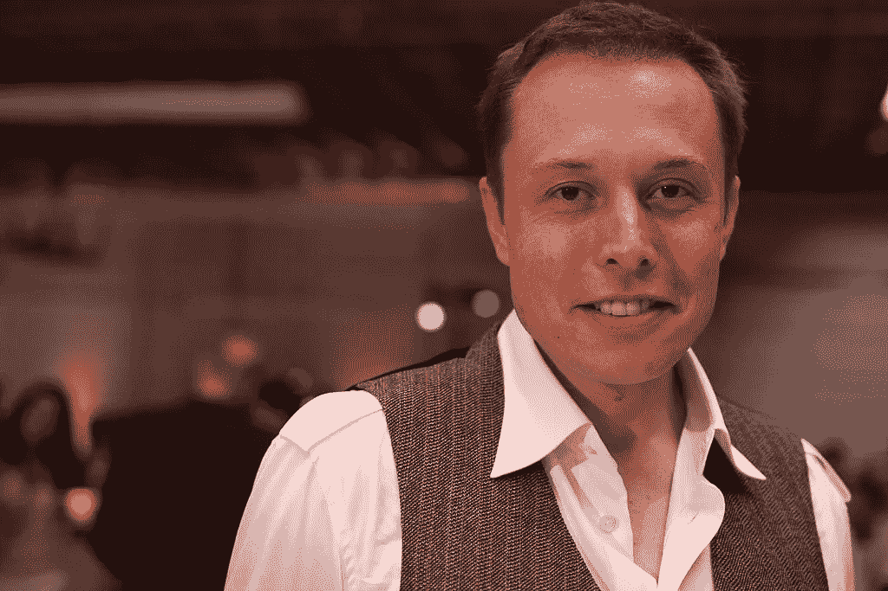

# 埃隆·马斯克的七个孩子遵循的 9 条生活规则

> 原文：<https://levelup.gitconnected.com/9-lifestyle-rules-that-elon-musks-seven-children-follow-f11976e2131>

## 你之前知道埃隆·马斯克有七个孩子吗？

来源:[维基媒体](https://commons.wikimedia.org/wiki/File:Elon_Musk.jpg#/media/File:Elon_Musk.jpg)在创造性通用许可下

SpaceX 和特斯拉的首席执行官也是众所周知的世界首富。作为一个有才华的人，马斯克总是有一种唠叨的心态，要把他的个人天赋融入到他所做的每一件事情中。不管你是恨他还是爱他，你都得承认这个男人在领导他的生活上有独特的特点。

这种独特的特征也适用于他的教育方式。

马斯克与前妻杰斯丁共有双胞胎泽维尔和格里芬，18 岁，三胞胎萨克森、达米安和凯，16 岁。他们还失去了他们的第一个儿子，内华达·亚历山大，仅仅 70 天就死于婴儿猝死综合症。

马斯克和前女友格里姆斯还有一个儿子 X AE A-XII(没错，就是他的名字)，5 月 4 日满两岁，还有一个女儿 Exa Dark sider？l，2021 年 12 月出生。

由于这七个孩子来自世界上最富有的家庭之一，他们应该遵循埃隆·马斯克自己发明的一些明确的规则。

以下是马斯克的孩子们遵守的 9 条严格规则。

## **1。马斯克童 X 有望成为他的门徒。**

马斯克的前女友格里姆斯说，“X 就在那里。我的意思是，我认为 E(埃隆)真的把他看作是一个门徒，因为他把他带到了一切。他的情况就是那样。”

虽然马斯克说他会把孩子抚养到大一点，但格莱姆斯透露，他可能为他们的儿子 x 打破了规则。

我们近年来已经看到了 X 的片段，而马斯克总是让他的大孩子远离聚光灯。

这是什么意思？马斯克的儿子 X 可能会成为他的门徒。

## **2。马斯克的儿子不允许称他的前女友格莱姆斯为“妈妈”。**

马斯克和他的前女友格里姆斯有一个一岁的儿子 X，奇怪的是，X 不叫他的妈妈“妈妈”或这个词的任何其他变体。

相反，X 直呼其母的名字，克莱尔。

Grimes 澄清说，她的儿子这样做是因为他有如此敏感的洞察力，他可以感觉到缺乏被称为“妈妈”的欲望。她还补充说，她喜欢做母亲，但 X 叫她“妈妈”会让她很困扰。她不能认同它。

## **3。埃隆·马斯克(Elon Musk)认为，互联网足以教育他的孩子。**

马斯克的教育方法是非传统的。从去年的一次现场采访中，很明显马斯克认为他的孩子从互联网上学到的东西比其他任何地方都多。

这位科技公司首席执行官说，“我的观察是，我的孩子大多是从 YouTube 和 Reddit 上学习的。”

马斯克批评过去的传统教育。他说，员工在特斯拉工作不需要大学学历。

他还认为大学主要是提供作业和娱乐，而不是学习。

## **4。马斯克的孩子读书比玩电子游戏还多。**

马斯克童年时对视频游戏的热爱帮助他培养了对编程的热情，这也让他在职业生涯中受益匪浅。

他的孩子天生也是狂热的电子游戏玩家。

马斯克支持他的孩子参与他喜欢的事情，但对于玩耍时间有严格的规定。

在为马斯克的传记接受阿什莉·万斯采访时，这位亿万富翁说，孩子们被要求花更多的时间阅读，而不是玩电子游戏。

## **5。埃隆·马斯克希望他的孩子努力工作**

马斯克本人在成年初期也不得不面对挑战。17 岁时，他在没有父母支持的情况下，从他的祖国南非移居加拿大。

15 岁时，他在学校也受到欺负。

马斯克认为那是艰难的时期，是这些帮助他成为今天的他。

马斯克认为他的孩子在生活中也必须面对同样的困难。

他在 2011 年的一次颁奖典礼上说，“我的成长经历很糟糕”。“我在生活中面临很多挑战。我担心我的孩子的一点是，他们不面对困难。”

## **6。马斯克家的孩子非常注重健康。**

似乎马斯克鼓励他的家人健康饮食。

抖音的一段视频显示，当马斯克的三胞胎和朋友在一起时，一名保姆曾经照顾过他们，孩子们非常注重健康。

保姆说他们去全食超市吃饭了。甚至在这么小的时候，这些孩子就非常关心他们的健康。他们说，“不，让我们去全食超市，”当保姆期待像约翰尼火箭一样的东西。

她也对他们的举止印象深刻，形容他们“举止得体”。因此，看起来风度也是马斯克家族的一项重要实践。

## **7。埃隆·马斯克的孩子在他开办的学校上学。**

就像一个不墨守成规的人一样，埃隆·马斯克对传统教育有自己的看法。他创办了一所学校，在那里学生们被教授他认为孩子们应该有的方式。他的孩子也录取了。

马斯克提到，2014 年他已经创办了南加州学校 Ad Astra，在拉丁语中是“通向星星”的意思。

在接受中国电视台采访时，他提供了有关该机构的更多细节，但采访后来被删除。

在一次采访中，他描述说他的学校没有遵循传统的分级结构。学生受到的教育更加强调解决问题和批判性思维。马斯克说他讨厌上学，但孩子们喜欢定期去他创办的学校。

## **8。当孩子们还小的时候，埃隆·马斯克并没有在他们的生活中扮演积极的角色。**

这位亿万富翁在 2020 年透露，当孩子还是婴儿的时候，他在抚养孩子的过程中并没有起到太大的作用。现在，马斯克的大孩子已经十几岁了，他们可以期待比年轻时更多地看到他。

“我现在能做的不多。格里姆斯现在有很多角色要扮演。”马斯克对《纽约时报》说，

“当孩子们长大后，我会扮演更多的角色。我在做我和其他孩子一起做的事情。”

## **9。孩子们必须做好经常旅行的准备。**

在一次采访中，马斯克澄清说，对于他的大儿子们来说，成为他的孩子意味着经常飞行。

“例如，如果我去中国旅行，我会带上我的孩子。我们会去看中国的长城，或者我们会坐动车从北京到西安，去看兵马俑，”马斯克解释道。

请在评论中分享你的想法。*感谢阅读！如果你想支持我，* [***加入我吧！***](https://thefemaleprogrammer.medium.com/membership)