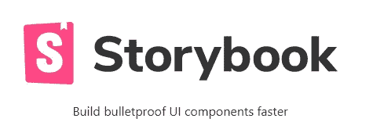
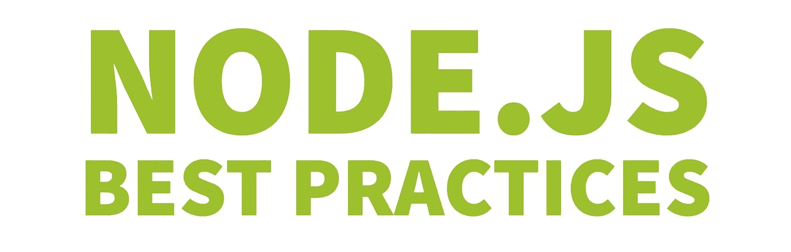
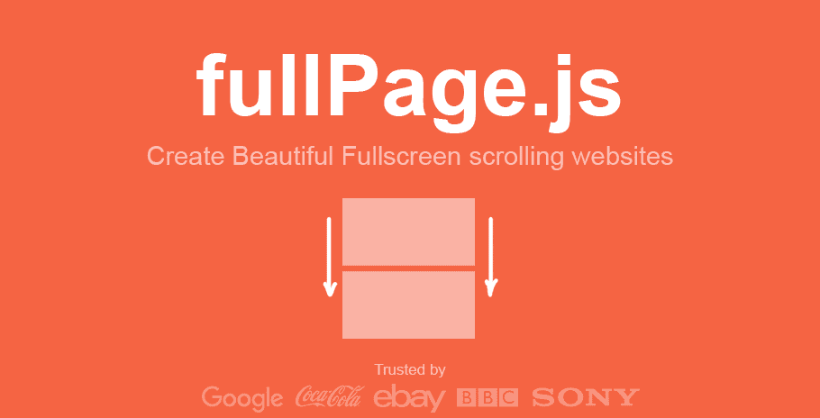

# 每个 Web 开发人员都必须知道的 9 个流行的 GitHub Repos

> 原文：<https://levelup.gitconnected.com/9-popular-github-repos-every-web-developer-must-know-595327ed54d5>

## 你不想错过他们


西蒙·艾布拉姆斯在 [Unsplash](https://unsplash.com?utm_source=medium&utm_medium=referral) 上拍摄的照片

> 如果你想了解更多关于技术的知识，请订阅我全新的 YouTube 频道，在那里我会用一种简洁明了的方式解释复杂的话题，帮助你提高技能！→【https://www.youtube.com/@litwire 

如今，GitHub 是与(web)开发相关的一切的一站式商店。框架、演示、各种收藏——在 GitHub 上你可能找不到任何东西。然而，这大量的东西是问题所在。有些很酷的东西你可能从来没有听说过，仅仅是因为有很多可用的存储库。

所以，我再一次决定给你带来一些你应该知道的最流行的 GitHub 库，每个库至少有~30，000 颗星。

# 真实世界


这个列表中的第一个资源库是 [Realworld](https://github.com/gothinkster/realworld) 。它的创造者称之为“所有演示应用之母”一个大胆的声明，当然，但我不认为这是夸张。

Realworld 是 Medium.com 克隆的典范(是的，就是你现在可能正在浏览的平台！).但不仅如此。存储库允许您在不同的前端和后端实现之间进行选择，您可以愉快地混合这些实现。

Vue.js + Node/Express 还是 React /Redux + Rust？他们拿到了！

Realworld 向您展示了完全相同的博客应用程序是如何在几乎任何流行的语言或框架上构建的。多棒啊。

# 你还不知道 JS


这个[知识库](https://github.com/getify/You-Dont-Know-JS)是凯尔·辛普森的一个受欢迎的系列丛书，他的别名 Getify 广为人知。这些书深入探讨了 JavaScript 的机制，涵盖了以下主题:

*   开始
*   范围和关闭
*   对象和类别
*   类型和语法
*   同步和异步
*   是的。下一步&超越

最好的事？完全免费阅读！这绝对是关于 JavaScript 的最佳系列之一，它真的帮助我理解了 JS 到底是什么。即使你认为你很了解 JavaScript 也要看书！我保证你会大吃一惊的。

# Airbnb JavaScript 风格指南

*一种最合理的 JavaScript 方法。*

Airbnb JavaScript 风格指南[是最流行和最常用的风格指南之一。它帮助你写出更好的 JS 代码，在团队中以及与 ESLint 结合使用时尤其有用。](https://github.com/airbnb/javascript)

以下是文档中关于使用 const 而不是 var 的示例:

```
// bad
var a = 1;
var b = 2;
```

```
// good
const a = 1;
const b = 2;
```

# 故事书



[Storybook](https://github.com/storybookjs/storybook) 是 UI 组件的开发环境。它允许您浏览组件库，查看每个组件的不同状态，并以交互方式开发和测试组件。它支持 React，Vue，Angular，React Native，Ember，Web 组件等等！

故事书在你的应用之外运行。这允许您独立地开发 UI 组件，这可以提高组件的重用性、可测试性和开发速度。您可以快速构建，而不必担心特定于应用程序的依赖性。

你可以在这里找到一些很好的例子。

# [HTML5 样板文件](https://html5boilerplate.com/)

HTML5 样板文件是专业的，也是网络上最流行的前端模板之一。它帮助你建立快速、强大、适应性强的网站或应用程序。像微软、NASA 和耐克这样的公司都使用它。

以下是一些关键特性:

*   HTML5 就绪。
*   设计时考虑到了渐进增强。
*   包括:Normalize.css、jQuery 和 Modernizer
*   提高网站性能和安全性的配置。
*   占位符 CSS 媒体查询。
*   默认打印样式，性能优化。
*   谷歌通用分析片段的优化版本。

# Node.js 最佳实践



这个[库](https://github.com/goldbergyoni/nodebestpractices)是关于 Node.js 开发的各种最佳实践的综合集合。它目前由 80 多个最佳实践、风格指南和架构技巧组成。

您可以找到以下信息:

*   项目结构实践
*   错误处理实践
*   代码风格实践
*   测试和整体质量实践
*   走向生产实践
*   安全实践
*   绩效实践

这绝对是一个伟大的回购和信息来源。如果您对 Node.js 开发感兴趣，可以看看这篇文章！

# 前端清单


在启动 web 应用程序之前，您是否曾问过自己需要具备或测试什么？[前端清单库](https://github.com/thedaviddias/Front-End-Checklist)已经覆盖！

列出的许多项目对于大多数项目来说都是强制性的，组织如下:

*   头
*   超文本标记语言
*   网络字体
*   半铸钢ˌ钢性铸铁(Cast Semi-Steel)
*   形象
*   Java Script 语言
*   安全性
*   表演
*   易接近
*   搜索引擎优化
*   翻译

以下是苹果网络应用元数据的一个例子:

```
<!-- Apple Touch Icon (at least 200x200px) -->
<link rel="apple-touch-icon" href="/custom-icon.png">
```

```
<!-- To run web application in full-screen -->
<meta name="apple-mobile-web-app-capable" content="yes"><!-- Status Bar Style (see Supported Meta Tags below for available values) -->
<!-- Has no effect unless you have the previous meta tag -->
<meta name="apple-mobile-web-app-status-bar-style" content="black">
```

# 西北大学


[NW.js](https://github.com/nwjs/nw.js) 是基于`Chromium`和`node.js`的 app 运行时。使用 NW.js，您可以用 HTML 和 JavaScript 编写本机应用程序。它还允许您直接从 DOM 调用 Node.js 模块，并启用了一种使用所有 Web 技术编写本机应用程序的新方法。

以下是一些关键特性:

*   应用程序是用现代的 HTML5、CSS3、JS 和 WebGL 编写的。
*   完全支持 Node.js APIs 及其所有第三方模块。
*   良好的性能:Node 和 WebKit 运行在同一个线程中。
*   易于打包和分发应用程序。
*   在 Linux、Mac OS X 和 Windows 上可用。

# 全页. js



Alvaro Trigo 的 [fullPage.js](https://github.com/alvarotrigo/fullPage.js) 是一个简单易用的库，可以让你创建 SPA(单页应用)和横向滑块。它可用于 Vue、React 和 Angular，并完全响应移动设备。

你可以在这里找到一些很棒的例子[。](https://alvarotrigo.com/fullPage/#examples)

该库可以在开源项目中免费使用。但是，如果你想在商业环境中使用它，你必须购买许可证。

它看起来真的很酷，所以检查一下！

我希望您可以将其中一些库用于您的项目或其他目的。

# 分级编码

感谢您成为我们社区的一员！在你离开之前:

*   👏为故事鼓掌，跟着作者走👉
*   📰查看[升级编码出版物](https://levelup.gitconnected.com/?utm_source=pub&utm_medium=post)中的更多内容
*   🔔关注我们:[Twitter](https://twitter.com/gitconnected)|[LinkedIn](https://www.linkedin.com/company/gitconnected)|[时事通讯](https://newsletter.levelup.dev)

🚀👉 [**加入升级人才集体，找到一份神奇的工作**](https://jobs.levelup.dev/talent/welcome?referral=true)