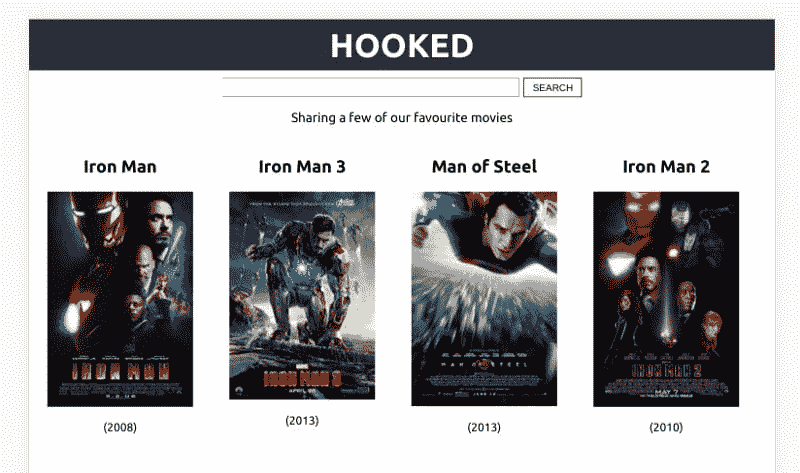
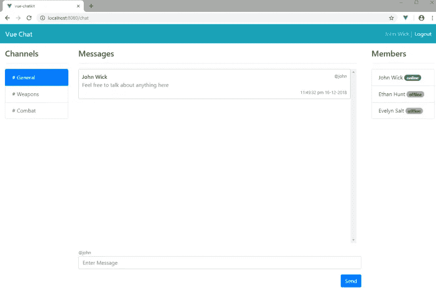
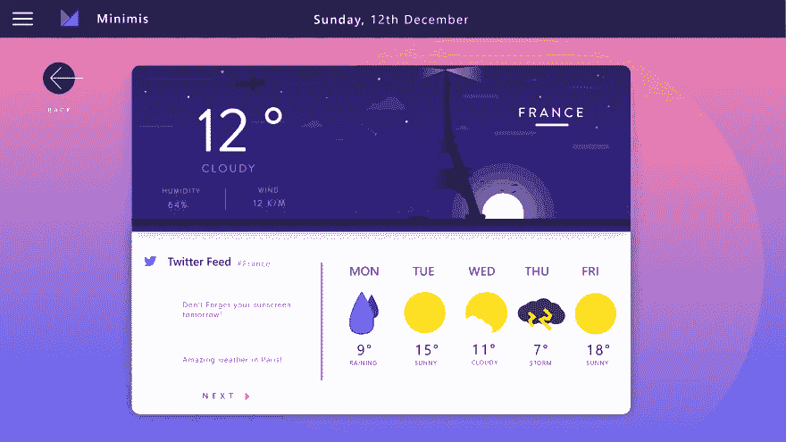
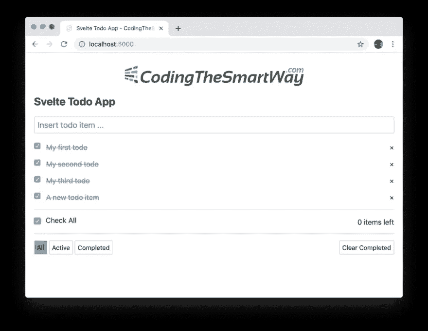
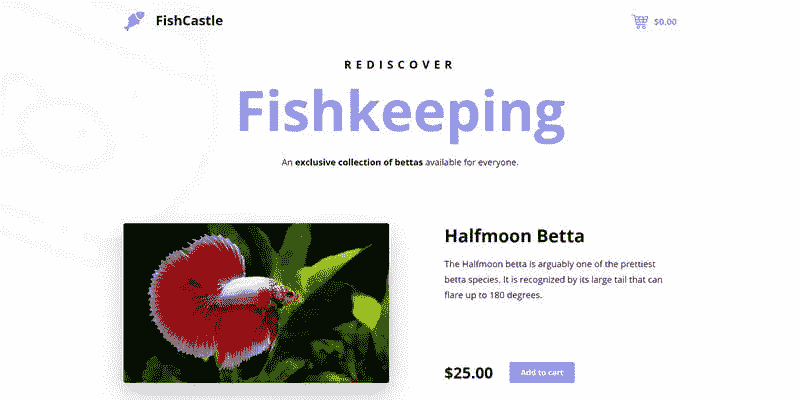
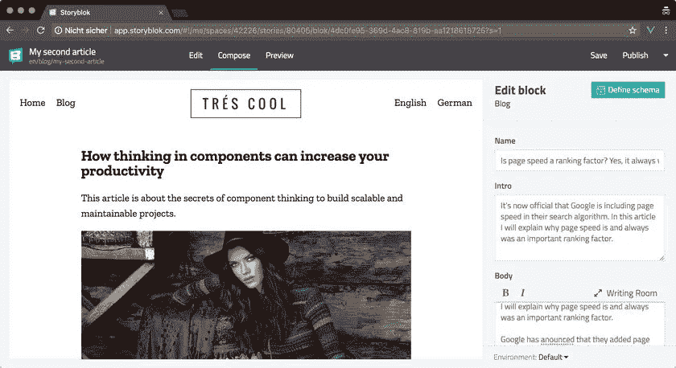
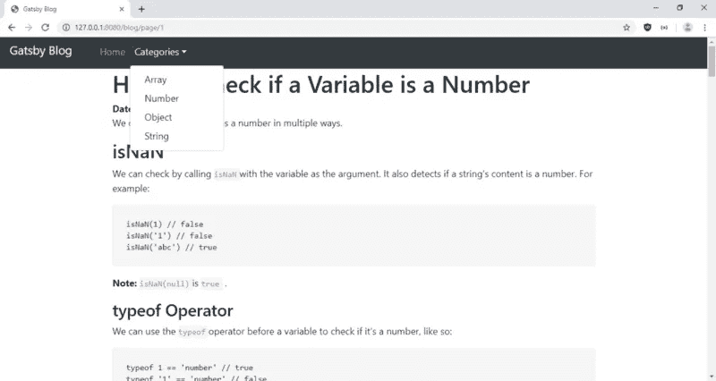
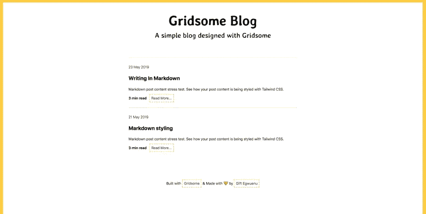
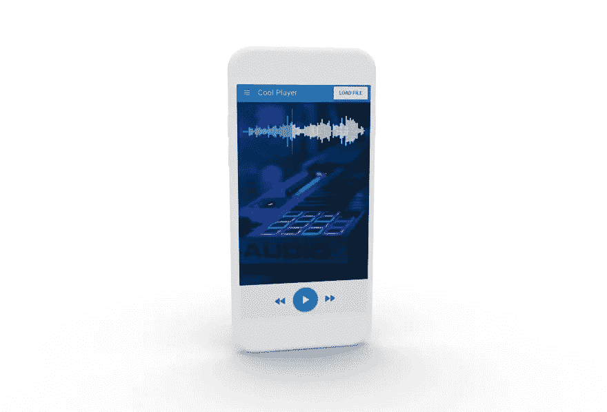

# 2023 年成为前端大师可以做的 9 个项目

> 原文：<https://levelup.gitconnected.com/9-projects-you-can-do-to-become-a-front-end-master-in-2023-a4389153148c>

潘卡杰·帕特尔在 [Unsplash](https://unsplash.com?utm_source=medium&utm_medium=referral) 上的照片

> 如果你想了解更多关于技术的知识，请订阅我全新的 YouTube 频道，在那里我会用一种简洁明了的方式解释复杂的话题，帮助你提高技能！→【https://www.youtube.com/@litwire 

# 介绍

无论你是编程新手还是业内资深开发人员，学习新概念和语言/框架都是跟上快速变化的必要条件。

以 React 为例——仅仅四年前由脸书开源，它已经成为全球 JavaScript 开发者的首选。

当然，Vue 和 Angular 也有其合法的追随者基础。此外，还有像 Next.js 或 Nuxt.js、Gatsby、Gridsome 和 Quasar 这样的简单通用的框架……和、和、和。

如果你想成为一名优秀的 JavaScript 开发人员，你至少应该有一些不同框架和库的经验——除了使用优秀的老 JS 做功课。

为了帮助你成为一名前端大师，我收集了九个项目，每个项目都有一个特定的主题和一个不同的 JavaScript 框架或库，作为一个技术栈，你可以构建并添加到你的投资组合中。记住，没有什么比实际建造东西更能帮助你，所以继续前进，磨砺你的头脑，让这一切发生。

# 使用 React(带挂钩)构建一个电影搜索应用程序

你可以从使用 React 构建一个电影搜索应用开始。下面是最终应用程序的图像:

## 你会学到什么

在构建这个应用程序时，您将使用相对较新的 Hooks API 来提高 React 技能。示例项目使用了 React 组件、许多钩子、一个外部 API，当然，还通过 CSS 进行了一些样式化。

## 技术堆栈和功能

*   用钩子做出反应
*   创建-反应-应用
*   JSX
*   半铸钢ˌ钢性铸铁(Cast Semi-Steel)

在不使用任何类的情况下，这个项目给了你一个进入 functional React 的完美切入点，肯定会在 2020 年帮到你。

您可以在这里找到示例项目。跟随教程，或给它你的味道。

# 使用 Vue 构建聊天应用程序

另一个对你来说很棒的项目是使用我最喜欢的 JavaScript 库:VueJS 构建一个聊天应用程序。

该应用程序将如下所示:

## 你会学到什么

通过本教程，您将了解如何从头开始设置 Vue 应用程序——创建组件、处理状态、创建路线、连接到第三方服务，甚至处理身份验证。

## 技术堆栈和功能

*   某视频剪辑软件
*   Vuex
*   Vue 路由器
*   Vue CLI
*   推进器
*   半铸钢ˌ钢性铸铁(Cast Semi-Steel)

这确实是一个从 Vue 开始的伟大项目——或者提高你现有的技能——以应对 2023 年的发展。

你可以在这里找到正确的教程。

# 用 Angular 8 构建一个漂亮的天气 App

这个例子将帮助你使用 Google 的 Angular 8:

## 你会学到什么

该项目将在从头开始创建应用程序时向您传授宝贵的技能——从设计到开发，一直到生产就绪部署。

## 技术堆栈和功能

*   角度 8
*   重火力点
*   服务器端渲染
*   带有网格布局和 Flexbox 的 CSS
*   移动友好且响应迅速
*   黑暗模式
*   漂亮的用户界面

我非常非常喜欢这个综合项目的一点是，你不会孤立地学习东西。相反，您将了解整个开发过程——从设计到最终部署。

你真的应该做[这个](https://medium.com/@hamedbaatour/build-a-real-world-beautiful-web-app-with-angular-6-a-to-z-ultimate-guide-2018-part-i-e121dd1d55e)。

# 建立一个苗条的待办事项应用程序

苗条的身材是新出现的——至少与反应型、Vue 型和棱角型相比是这样。尽管如此，它是 2023 年的热门之一。

好吧，待办事项应用不一定是最热门的话题，但这真的会帮助你提高苗条的技能。它看起来会像这样:

## 你会学到什么

本教程将从头到尾向您展示如何使用 Svelte 3 制作一个应用程序。它利用了组件、样式和事件处理程序。

## 技术堆栈和功能

*   苗条 3
*   成分
*   通过 CSS 设置样式
*   ES 6 语法

外面没有那么多好的苗条项目，所以[我发现这个](https://medium.com/codingthesmartway-com-blog/building-a-svelte-3-todo-app-from-start-to-deployment-1737f72c23a6)是个不错的开始。

谁知道呢，也许你会是另一个创建更全面的苗条教程的人，这个教程将会出现在下一年的版本中呢？

# 用 Next.js 构建一个电子商务购物车

Next.js 是创建支持服务器端即时呈现的 React 应用程序的最流行的框架。

这个项目将向您展示如何建立一个电子商务购物车，看起来像这样:

## 你会学到什么

在这个项目中，您将学习如何设置 Next.js 开发环境——创建新的页面和组件、获取数据、设计和部署下一个应用程序。

## 技术堆栈和功能

*   Next.js
*   组件和页面
*   数据提取
*   式样
*   部署
*   SSR 和 SPA

有一个真实世界的例子，比如电子商务展示，来学习新的东西总是很棒的。你可以在这里找到教程[。](https://snipcart.com/blog/next-js-ecommerce-tutorial)

# 用 Nuxt.js 构建一个成熟的多语言博客网站

Nuxt.js 是为了 Vue next . js 的反应:一个结合了服务器端渲染和单页面应用程序的强大功能的伟大框架。

您可以创建的最终应用程序将如下所示:

## 你会学到什么

这个示例项目将教你如何使用 Nuxt.js 构建一个成熟的网站——从初始设置到最终部署。

它使用了 Nuxt 提供的许多很酷的特性，比如页面和组件，以及 SCSS 风格。

## 技术堆栈和功能

*   Nuxt.js
*   组件和页面
*   Storyblok 模块
*   混合蛋白
*   用于状态管理的 Vuex
*   SCSS 造型
*   Nuxt 中间件

对你来说，这是一个非常酷的项目,涵盖了 Nuxt.js 的许多优秀特性。我个人喜欢使用 Nuxt，所以你真的应该尝试一下这个项目，因为它也会让你成为一名更好的 Vue 开发人员。

# 和盖茨比一起建博客

Gatsby 是一个很棒的静态站点生成器，它使用了 React 和 GraphQL。这是这个项目的成果:

## 你会学到什么

在本教程中，您将学习如何利用 Gatsby 构建一个出色的博客，用于在使用 React 和 GraphQL 的同时撰写文章。

## 技术堆栈和功能

*   盖茨比（姓）
*   反应
*   GraphQL
*   插件和主题
*   MDX/降价
*   引导 CSS
*   模板

如果你曾经想开一个博客，[这是一个很好的例子](https://blog.bitsrc.io/how-to-build-a-blog-with-gatsby-and-boostrap-d1270212b3dc)，告诉你如何利用 React 和 GraphQL 来做这件事。

我并不是说 WordPress 总是一个不好的选择，但是有了 Gatsby，你可以在使用 React 的同时创建高性能的站点——这是一个很棒的组合。

# 用 Gridsome 创建一个博客

Gridsome 是为了 Vue …好的，我们已经在 Next/Nuxt 中有了。

但格里德索姆和盖茨比也是如此。两者都使用 GraphQL 作为数据层，但是 Gridsome 使用 VueJS。它还是一个很棒的静态站点生成器，可以帮助你创建优秀的博客:

## 你会学到什么

这个项目将教你如何建立一个简单的博客来开始使用 Gridsome、GraphQL 和 Markdown。

它还介绍了如何通过 Netlify 部署应用程序。

## 技术堆栈和功能

*   网格体
*   某视频剪辑软件
*   GraphQL
*   降价
*   网络生活

当然，这不是最全面的教程，但是[它涵盖了 Gridsome 和 Markdown](https://www.telerik.com/blogs/building-a-blog-with-vue-and-markdown-using-gridsome) 的基本概念，可能是一个很好的起点。

# 用 Quasar 构建一个类似 SoundCloud 的音频播放器应用程序

Quasar 是另一个 Vue 框架，也可以用来构建移动应用程序。

在这个项目中，您将创建一个音频播放器应用程序，如下所示:

## 你会学到什么

虽然其他项目主要关注 web 应用程序，但这个项目将向您展示如何通过 Quasar 框架使用 Vue 创建移动应用程序。

你应该已经有一个配置了 Android Studio/Xcode 的 Cordova 设置了。如果没有，教程中有一个到 Quasar 网站的链接，他们会告诉你如何设置。

## 技术堆栈和功能

*   类星体
*   某视频剪辑软件
*   科尔多瓦
*   冲浪运动员
*   UI 组件

一个[小项目](https://www.learningsomethingnew.com/how-to-build-a-sound-cloud-like-audio-player-app-with-vue-js-quasar-and-wave-surfer)展示了 Quasar 构建移动应用的能力。

# 结论

在本文中，我向您展示了您可以构建的九个项目，每个项目侧重于另一个 JavaScript 框架或库。

现在选择权在你手中:你会用一个你以前没用过的框架来尝试新的东西吗？或者你想通过做一个你已经有一些知识的技术的项目来加强你的技能？还是会依赖自己喜欢的框架/库，用它做 2023 年的所有项目？

如果你喜欢我写的东西，想要支持我和我的工作，请在 [Twitter](https://twitter.com/simonholdorf) 上关注我，了解更多关于编程、制作、编写& careers🥰的信息