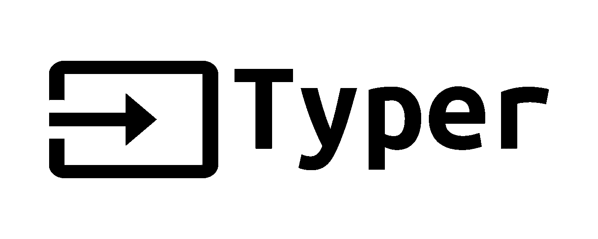

# 你应该(可能)知道的 9 个 Python 包

> 原文：<https://levelup.gitconnected.com/9-python-packages-you-should-probably-know-b7b1284bc894>

## 利用别人已经改进的东西来推进你的项目。


由 [Unsplash](https://unsplash.com/s/photos/package?utm_source=unsplash&utm_medium=referral&utm_content=creditCopyText) 上的[品牌盒子](https://unsplash.com/@brandablebox?utm_source=unsplash&utm_medium=referral&utm_content=creditCopyText)拍摄。

[Python](https://www.python.org/) 是一种令人惊叹的多功能编程语言。你可以构建各种各样的应用，从[web scrubling](https://realpython.com/python-web-scraping-practical-introduction/)到[漂亮的桌面应用](https://kivy.org/#home)。

而且在大多数时候，你只需要[标准库](https://docs.python.org/3/library/)来执行你的任务。但是有时候，使用一个额外的包会非常有用，可以抽象出一个功能并节省你的宝贵时间。

在这篇文章中，我将列出一些你可能会在下一个项目中考虑的包。

这个想法是展示一些你可能(还)不知道的好项目。也许他们能以某种方式激励你去创造一个新的项目。

> **注意**:这些是我在项目中至少使用过一次的包。还有很多其他的好的在这个列表之外。这里可以看到一个不错的列表[。](https://github.com/vinta/awesome-python)

# 前夕


如果你正在使用 [MongoDB](https://www.mongodb.com/) 并且想要为你的数据库创建一个 REST API，你需要检查 [Eve](https://docs.python-eve.org/en/stable/) 框架。基于另一个著名的 web 框架 [Flask](https://flask.palletsprojects.com/en/1.1.x/) ，您可以使用字典或配置文件为您的资源创建各种端点。

您可以[配置特性](https://docs.python-eve.org/en/stable/features.html)，比如分页、过滤、定制端点、认证、版本控制等等。

并且由 Flask 提供支持，你仍然可以使用社区中可用的整个 [flask 扩展](https://pypi.org/search/?c=Framework+%3A%3A+Flask)来扩展你的项目。

# FastAPI


在 web 框架的世界里，还有神奇的 [FastAPI](https://fastapi.tiangolo.com/) 。它建立在 [Starlette](https://www.starlette.io/) 和 [Pydantic](https://pydantic-docs.helpmanual.io/) 包之上，使用现代 Python 特性作为类型提示和 [async / await](https://fastapi.tiangolo.com/async/) 。

正是很多很酷的特性，比如数据验证、[中间件](https://fastapi.tiangolo.com/advanced/middleware/)、[文件上传](https://medium.com/vacatronics/fastapi-is-a-very-cool-open-source-framework-to-construct-api-using-python-eaec1953e8e3)、 [GraphQL](https://fastapi.tiangolo.com/advanced/graphql/) 和 [WebSockets](https://medium.com/vacatronics/how-to-use-websocket-with-fastapi-8460db1c074) ，让你可以轻松配置和使用。

它会自动生成一个 [OpenAPI](https://github.com/OAI/OpenAPI-Specification) 页面，这样你就可以在没有第三方应用的情况下测试你的 API。

如果你需要创建一个 API，这个库绝对值得一试。

# 细流


如果你曾经创建了一个数据科学项目，你可能会为如何分享你的成果而苦恼。或者甚至可能浪费大量时间与 JavaScript 和 CSS 斗争，最终得到一个糟糕的页面。

Streamlit 是一个很棒的 Python 库，它可以帮助你创建漂亮的 web 应用，而不必处理所有的 Javascript。只有 Python。

它已经为您创建了许多组件，因此您只需专注于创建数据的表示。

# 熊猫简介


创建一个新的 web 应用程序来展示您的数据科学项目可能对您来说太难了。你可能想要一份关于你的熊猫数据框架的简单报告，或者只是显示你对它们进行的一些基本计算的结果。

这个包是完美的。它扩展了 pandas 函数`df.describe()`,生成一个交互式 HTML 报告，其中包含如下统计数据:

*   直方图；
*   描述性值，如平均值、众数、标准差等；
*   相关性；
*   缺少值；
*   和许多其他人

预览你的数据框架，看看你能做什么，或者得到一个初步的分析，这也是很好的。

# 马尼姆


如果你想创建动画，不仅仅是为了数学，这绝对是可以使用的库。

它是由格兰特·桑德森为他的 YouTube 频道 [3Blue1Brown](https://www.youtube.com/channel/UCYO_jab_esuFRV4b17AJtAw) 制作的视频动画(如果你还不知道，你应该知道)。它开始只是一个附带项目，但现在有一个[不错的社区](https://github.com/ManimCommunity/manim/)帮助维护它。

你可以用[几行文字](https://docs.manim.community/en/stable/tutorials/quickstart.html)制作动画视频，这肯定会帮助你形象化或说明你遇到的问题。

或者只是为了好玩。

# 打字机



如果你想创建一个[命令行界面](https://en.wikipedia.org/wiki/Command-line_interface)应用，你应该勾选 [Typer](https://typer.tiangolo.com/) 。

由 [FastAPI](https://fastapi.tiangolo.com/) 的同一个创建者开发，它使用了包 [Click](https://click.palletsprojects.com/en/7.x/) (顺便说一下，你也应该检查一下)并扩展了它。

借助于 [python 类型提示](https://docs.python.org/3/library/typing.html)，它直接从函数的参数中创建解析器和参数。

```
import typer

def main(name: str):
    typer.echo(f"Hello {name}")

if __name__ == "__main__":
    typer.run(main)
```

如果你曾经使用过`[argparse](https://docs.python.org/3/library/argparse.html)`或者`[getopt](https://docs.python.org/3/library/getopt.html)`，你会很高兴使用 Typer 是多么的容易。

# ZeroRPC

它是基于 [ZeroMQ](https://zeromq.org/) 和 [MessagePack](https://msgpack.org/index.html) 的 RPC 的灵活实现。这意味着您可以执行远程 Python 函数，就像它在您的包中一样。

不管你的代码是在同一台机器上，在同一个网络的另一台机器上，还是在一个遥远国家的云服务器上。ZeroRPC 可以暴露并执行你的代码，就像它是本地的一样。

您甚至可以使用命令行来公开现有的 Python 代码，而不必修改它。

如果您需要创建一个分布式系统，请考虑检查这个包。

# MkDocs

如果你想让其他人使用它，为你的项目创建一个[伟大的文档](https://betterprogramming.pub/why-programmers-should-write-tutorials-6ecbb83f43e3)是重要的一步。

你可以使用 [MkDocs](https://www.mkdocs.org/) 从 markdown 文件中创建一个漂亮的 HTML 页面。它快速、简单，并且可以用[扩展你自己的主题](https://www.mkdocs.org/user-guide/styling-your-docs/#styling-your-docs)。

所有页面都是使用 markdown 编写的，文档是使用一个简单的 YAML 配置文件生成的。之后，您可以将静态文件作为一个漂亮的网页。

# 休伊


Huey 是一个轻量级的任务队列系统，有一个简单的 API。它支持多种功能，例如:

*   多进程、多线程或 greenlet 任务执行模型。
*   计划任务在给定的时间执行，或在给定的延迟后执行，或重复执行，如 crontab。
*   任务优先级
*   任务锁定
*   任务管道和链

您可以用一个简单装饰器添加一个函数。绝对值得一看。

# 结论

尽管 Python 的标准库中已经包含了大量的库和函数，但有时您可能需要使用外部库。

这不是一个最终的列表，因为还有数百个其他优秀的包(查看这个 [github 页面](https://github.com/vinta/awesome-python)获得一些灵感)。

看看他们。即使您决定不使用或根本不需要它们，您也可能会从它们的代码中获得灵感，创建另一个很酷的包。

如果你知道这里没有列出的好的软件包，请留下评论。