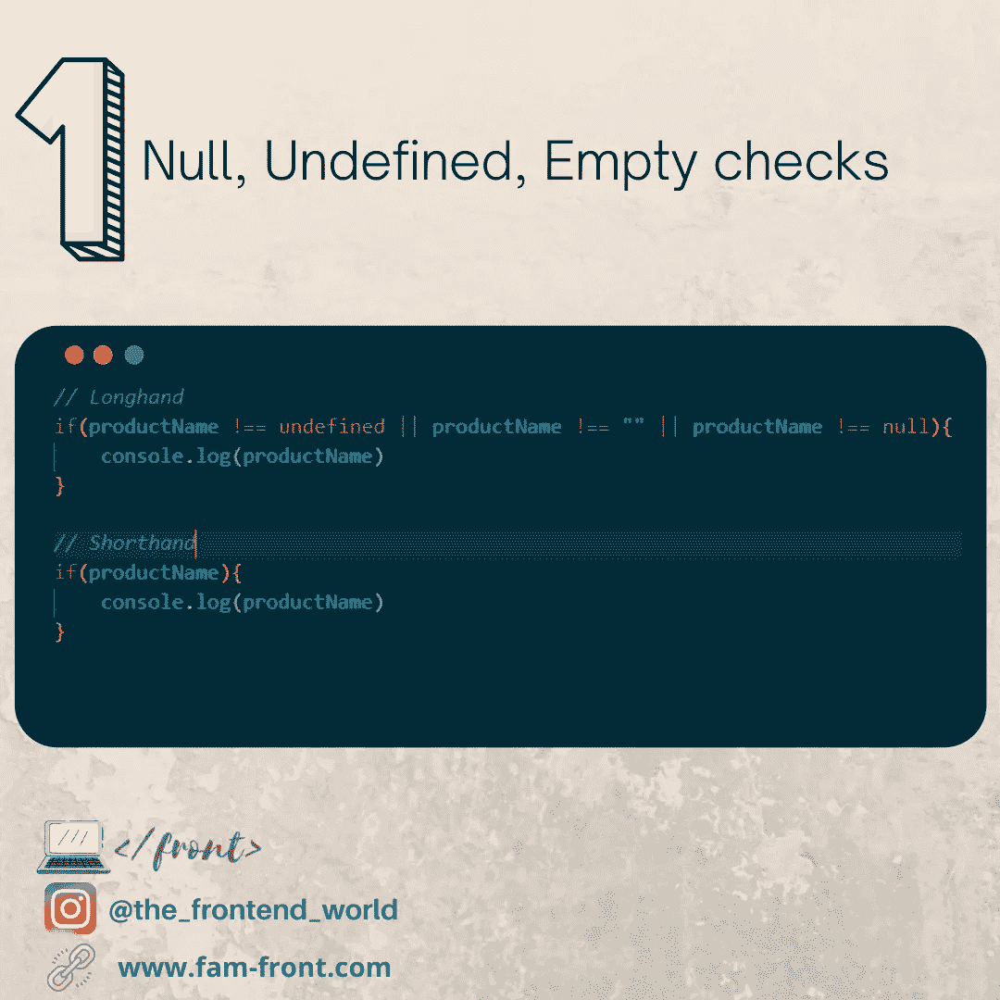

# 编写简短智能 Javascript 代码的 9 个技巧

> 原文：<https://levelup.gitconnected.com/9-tricks-for-writing-short-and-smart-javascript-code-6c832290e0b1>

## 如何聪明地写 JavaScript 代码？


众所周知，代码数量关系到性能。这是一个简单的等式。长代码意味着为浏览器下载更多的字节，这意味着更多的加载时间。对于简单和小型应用程序来说，这并不明显，但对于企业和大型应用程序来说，这肯定会影响性能。

这篇文章是关于用 JavaScript 编码时我们应该拥有的好习惯。而是如何用更少的代码行聪明地编码。这肯定会有所不同。

我们开始吧！

# # 1-空的，未定义的，空白支票

我们总是检查变量是否为 null、未定义或空。没有不查那些案子的 app。这就是为什么我把这个数字排在第一位。

Null、未定义和空白支票手写与速记



由 [FAM](https://www.instagram.com/the_frontend_world)

# # 2-多重条件

我们在编码时经常使用多个条件。我们可以使用一个数组来存储多个值，因为数组对象已经有了一个名为`includes`的内置方法:

多条件手写与速记


由 [FAM](https://www.instagram.com/the_frontend_world)

# # 3-循环

循环也是我们肯定会在任何应用程序中使用的东西。下面我们如何编写一个智能的`foreach`或`for`循环:

循环手写与速记


由 [FAM](https://www.instagram.com/the_frontend_world)

# # 4-隐式返回

当涉及到隐式返回时，箭头函数是不使用 return 语句直接返回的最佳选择。

隐式返回手写与速记


隐式返回手写与速记

# # 5-扩展运算符

当我们操作一个数组时，使用了 spread 操作符。很有效率。你只需要`...`(对，3 个点):

扩展运算符手写与速记


由 [FAM](https://www.instagram.com/the_frontend_world)

# # 6-箭头功能

有了 ES6，传统的 JavaScript 函数可以简化，并用更少的代码行编写:

箭头功能手写与速记


由 [FAM](https://www.instagram.com/the_frontend_world)

# # 7-模板文字

许多开发人员仍然使用`+`字符来连接字符串变量。我以前也是这样。再次感谢 ES6，我们现在可以通过`${}`和```让它变得更轻:

模板文字手写与速记


由 [FAM](https://www.instagram.com/the_frontend_world)

# # 8-多行字符串

你有没有和`Lint`不接受长文吵过架？当我创建一个 mock 来测试我的 UI 时，这种情况发生过几次。多亏了倒勾符号，这个问题有了一个解决方案:

多行字符串手写与速记


由 [FAM](https://www.instagram.com/the_frontend_world)

# #9-Array.find

不再需要 for 循环来查找数组中的元素。数组的`find`功能肯定会让您的开发人员生活更轻松，并帮助您节省大量代码行:

Array.find 手写与速记


由 [FAM](https://www.instagram.com/the_frontend_world)

# 想回顾一下吗？


由 [FAM](https://www.instagram.com/the_frontend_world)

# 亲爱的读者，我希望这是明确和有用的。

我希望你和你的家人无论在哪里都平安无事！坚持住。明天会更好！

**先联系一下** [**中**](https://medium.com/@famzil/)**[**Linkedin**](https://www.linkedin.com/in/fatima-amzil-9031ba95/)**[**脸书**](https://www.facebook.com/The-Front-End-World)**[**insta gram**](https://www.instagram.com/the_frontend_world/)**，或者**[**Twitter**](https://twitter.com/FatimaAMZIL9)**。********

****🔗【www.fam-front.com ****

******FAM******