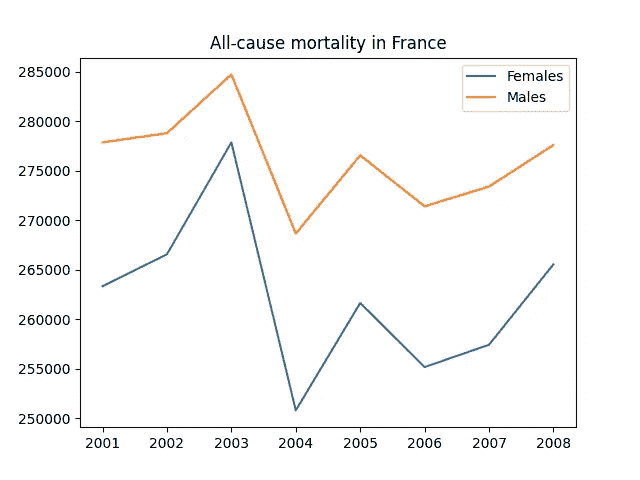

# 你可能不知道的熊猫 9 招

> 原文：<https://levelup.gitconnected.com/9-tricks-with-pandas-that-you-might-not-know-6e2b54513a4f>

## 用熊猫提升你的 Python 能力


熊猫用户经常过着幸福的生活！

 如果你在过去十年左右没有生活在岩石下，你可能听说过熊猫。它基本上是 Excel，但功能强大 100 倍。或者相当于 SQL 的 Pythonic。

Pandas 的酷之处在于，它可以让你探索和操作数据，而不必写太多样板代码，也不会让你的计算机过热。如果你正在用 Python 做数据科学——从你阅读这篇文章的事实来看，你确实是——那么 Pandas 就是你工作流程的起点。

我不会用最基本的东西来烦你；有[大量](https://pandas.pydata.org/docs/user_guide/10min.html) [的](https://www.w3schools.com/python/pandas/default.asp) [优秀](https://www.learndatasci.com/tutorials/python-pandas-tutorial-complete-introduction-for-beginners/) [教程](https://www.kaggle.com/learn/pandas)涵盖，如果你需要复习。

这里有一些你可能还没听说过的技巧。好吧，也许你在阅读这篇文章之前已经听说过一两个，但是希望你能学到一些新的漂亮的技巧，这可能会让你的生活变得更容易一些。

出于演示的目的，我们将使用一个数据集，列出从 2001 年到 2008 年法国的[死亡原因。我知道这有点奇怪和小众。但这是我们训练的一个很好的数据集。](https://perso.telecom-paristech.fr/eagan/class/igr204/datasets)

看起来是这样的:

```
>>> import pandas as pd
>>> df = pd.read_csv("CausesOfDeath_France_2001-2008.csv")
>>> df = df[["TIME", "SEX", "Value", "ICD10"]]
>>> df
      TIME    SEX    Value      ICD10
0     2001    Males  277 858    All causes of death (A00-Y89)
1     2001    Males    5 347    Certain infectious diseases
2     2001    Males      545    Tuberculosis
3     2001    Males       30    Meningococcal infection
4     2001    Males      471    Viral hepatitis
...    ...      ...      ...    ...
1051  2008  Females    2 815    Falls
1052  2008  Females      630    Accidental poisoning
1053  2008  Females    2 768    Intentional self-harm
1054  2008  Females      166    Assault
1055  2008  Females       68    Event of undetermined intent
```

上面我已经过滤了这些数据，只包括感兴趣的列。性别标记不包括非二元和阴阳人，但嘿，数据是旧的。

# 1.分类数据节省时间和空间

我们有一个名为`ICD10`的大而胖的列，其中包含许多字符串。这些占用了相当多的存储空间…

```
>>> df.info()
<class 'pandas.core.frame.DataFrame'>
RangeIndex: 1056 entries, 0 to 1055
Data columns (total 4 columns):
#   Column  Non-Null Count  Dtype
---  ------  --------------  -----
0   TIME    1056 non-null   int64
1   SEX     1056 non-null   object
2   Value   1056 non-null   object
3   ICD10   1056 non-null   objectdtypes: int64(1), object(3)
memory usage: 33.1+ KB>>> df.memory_usage(deep=True)
Index       128
TIME       8448
SEX       66528
Value     64758
ICD10    101840
dtype: int64
```

这个特殊的数据集只有 1056 列，所以整个内存消耗并不可怕。然而，当您有数百万个列时，您不会想要与千兆字节的 RAM 竞争。

我们可以通过使用`factorize()`来做得更好:

```
>>> number, icd10 = pd.factorize(df["ICD10"])
>>> number
array([ 0,  1,  2, ..., 63, 64, 65])
>>> icd10
Index(['All causes of death (A00-Y89) excluding S00-T98',
'Certain infectious and parasitic diseases (A00-B99)', 'Tuberculosis',
'Meningococcal infection', 
'Viral hepatitis', 
...,
'Falls',
'Accidental poisoning by and exposure to noxious substances',
'Intentional self-harm', 
'Assault', 
'Event of undetermined intent'],
dtype='object')
```

我们在这里做的是将`ICD10`的内容编码到一个数字数组中。我们现在可以使用新创建的列`number`，而不是使用原来的字符串列，这样可以节省空间:

```
>>> df['ICD10'] = number
>>> df
      TIME      SEX    Value  ICD10
0     2001    Males  277 858      0
1     2001    Males    5 347      1
2     2001    Males      545      2
3     2001    Males       30      3
4     2001    Males      471      4
...    ...      ...      ...    ...
1051  2008  Females    2 815     61
1052  2008  Females      630     62
1053  2008  Females    2 768     63
1054  2008  Females      166     64
1055  2008  Females       68     65[1056 rows x 4 columns]
```

我们对`ICD10`的内存使用显著下降:

```
>>> df.memory_usage(deep=True)
Index      128
TIME      8448
SEX      66528
Value    64758
ICD10     8448
dtype: int64
```

对于如此小的数据集来说，这似乎不是什么大事；然而，对于较大的，这可以节省大量的资源。

这种方法的一个注意事项是，如果您想在因子分解列中添加一个新类别，您必须更新您已经因子分解的对象(在我们的例子中是`number`和`icd10`)。当您像使用映射一样使用`number`和`icd10`将分解后的列重新转换回字符串时，这很有帮助。

# 2.制作直方图和其他图表

用熊猫做直方图相当容易。我们所需要的只是 Matplotlib 的一点帮助:

```
import matplotlib.pyplot as plt
hist = df['ICD10'].hist(bins=66); plt.show()
```

该直方图不值得显示；本质上是 y=16 的一条直线。这是有意义的，因为所有 66 种死亡原因都是在 8 年内为两种性别列出的。因此，每个死亡原因有 16 个条目。

不过，我们可能想制作一个更有趣的情节。绘制全因死亡率随时间的演变图如何？

在第一步中，我们将全因死亡率编码为`0`。因此，我们将筛选这些数据点:

```
df1 = df[(df['ICD10'] == 0) & (df['SEX'] == 'Females')]
df2 = df[(df['ICD10'] == 0) & (df['SEX'] == 'Males')]
```

我们现在可以显示一段时间内的全因死亡率:

```
>>> plt.plot(df1['TIME'], df1['Value'], label='Females')
>>> plt.plot(df2['TIME'], df2['Value'], label='Males')
>>> plt.legend()
>>> plt.title('All-cause mortality in France')
>>> plt.show()
```



我们的数据的一个美丽的图！

从这个情节得出的结论:女士没有先生死的多！顺便说一下，2003 年的高峰是由于一场大规模的热浪袭击了毫无准备的法国，导致许多老年人中暑和其他死亡。

在 Matplotlib 的一点点帮助下，制作熊猫对象的情节是一种魅力。想象一下，如果使用一些数组而不是熊猫，你将需要多少行代码！

# 3.用成员映射绑定数据

还记得之前我们用数字代码替换的列`ICD10`吗？

有时候我们不想把它转换回原来的字符串，而是把一些数据组合在一起。也许我们特别感兴趣的是传染病导致的死亡原因，或者精神健康状况不佳的后果。一些初步分组可能如下所示:

```
>>> groups = {'Infectious diseases': ('1', '2', '3', '4', '5', '32', '38'), 'Neoplasms': ('6', '7', '8', '9', '10', '11', '12', '13', '14', '15', '16', '17', '18', '19', '20', '21', '22', '23', '24'), 'Endocrine': ('26', '27'), 'Mental & Drugs': ('28', '29', '30', '62', '63'), 'Lungs': ('39', '40', '41'), 'Stomach, Liver, Kidney': ('42', '43', '44', '48'), 'Childbirth': ('50', '51'), 'Congenital stuff': ('52', '53', '54', '56'), 'External': ('58', '59', '60', '61', '62', '64')}
```

不要与数据集中的死亡原因列表过于接近；我不是医学专业人士。我的判断很可能有缺陷。

现在我们可以用这个漂亮的函数将它与我们的专栏文章`ICD10`进行对比，这个函数是我从 Realpython 的某个天才那里偷来的:

```
>>> from typing import Any>>> def membership_map(s: pd.Series, groups: dict,
...                    fillvalue: Any=-1) -> pd.Series:
...     # Reverse & expand the dictionary key-value pairs
...     groups = {x: k for k, v in groups.items() for x in v}
...     return s.map(groups).fillna(fillvalue)>>> df['ICD10'] = df['ICD10'].astype('string')>>> membership_map(df['ICD10'], groups, fillvalue='other')
0                     other
1       Infectious diseases
2       Infectious diseases
3       Infectious diseases
4       Infectious diseases
               ...         
1051               External
1052               External
1053         Mental & Drugs
1054               External
1055                  other
Name: ICD10, Length: 1056, dtype: object
```

请注意，我们将数据类型`ICD10`转换为字符串，使其与字典`groups`中的字符串文字相匹配。仅仅在`groups`的定义中使用整数是行不通的，因为 Python 不能迭代这些整数。

# 4.从剪贴板加载数据

你知道吗，你可以从剪贴板上创建一个熊猫数据帧。例如，当一位同事给了你一个 Excel 电子表格，其中包含你想在 Pandas 中处理的数据时，这是很方便的。

例如，我将使用示例数据集的前 10 行:

```
>>> df[:10]
   TIME    SEX   Value ICD10
0  2001  Males  277858     0
1  2001  Males    5347     1
2  2001  Males     545     2
3  2001  Males      30     3
4  2001  Males     471     4
5  2001  Males     892     5
6  2001  Males   91737     6
7  2001  Males   88481     7
8  2001  Males    3755     8
9  2001  Males    3442     9
```

现在，我需要做的就是将这些数据复制到我的剪贴板上。我从剪贴板中创建了一个新的数据帧，如下所示:

```
df10 = pd.read_clipboard()
```

漂亮吧。

# 5.获取快速统计数据

如果我们想知道数据集的一些关键特征，会怎么样？我们已经在上面使用了`df.info()`和`df.memory_usage()`，但是这些方法是相当技术性的，并没有告诉我们太多关于数据本身的信息。

如果我们想获得更多数据科学见解，请不要看得比`df.describe`更远:

```
>>> df.describe(include='all') 
               TIME    SEX          Value        ICD10
count   1056.000000   1056    1056.000000  1056.000000
unique          NaN      2            NaN          NaN
top             NaN  Males            NaN          NaN
freq            NaN    528            NaN          NaN
mean    2004.500000    NaN   12069.661932    32.500000
std        2.292374    NaN   35896.576873    19.059398
min     2001.000000    NaN       0.000000     0.000000
25%     2002.750000    NaN     479.500000    16.000000
50%     2004.500000    NaN    2606.000000    32.500000
75%     2006.250000    NaN    7729.500000    49.000000
max     2008.000000    NaN  284729.000000    65.000000
```

使用选项`include='all'`可以确保非数字数据类型不会被忽略。注意，非数字数据类型没有从`mean`到`max`的条目——因为一串单词的平均值或最大值是什么？同样，字段`unique`、`top`和`freq`不适用于数值类型。

没有什么比这更容易获得基本的洞察力了。

# 6.查询而不是条件语句

我们可能想找出哪些死因在法国相当罕见。我们将罕见定义为每个性别每年至少发生一次，最多发生 50 次。(这当然不是官方的医学术语；它非常适合这个数据集。)

您不用像`df[0 < df['Value'] < 50]`那样使用条件掩码，而是使用`query()`并使您的命令更短:

```
>>> df.query('0 < Value < 50')
```

这仍然是一个相当长的列表，但我们可以通过只列出其中出现的死亡原因来压缩它:

```
>>> df.query('0 < Value < 50').ICD10.unique()
array([ 3, 30, 50])
```

结果与脑膜炎球菌感染、药物依赖和怀孕相对应。然而，在测量的时间段内，没有男性死于与怀孕相关的问题。是的，我知道从统计学上来说，男人怀孕是不太可能的，尽管不是不可能的🙂

# 7.将您的数据分组

熊猫最强大的功能之一是`groupby()`。我们将用它来找出最常见的死亡原因。

为此，我创建了另一个数据框，其中不包含全因死亡率的数字(这显然是最高的数字)。然后，我将条目按值分组，以查看导致最高和最低死亡率的原因:

```
>>> dfno0 = df.query('ICD10!=0')
>>> dfno0.groupby('Value').first()
       TIME      SEX  ICD10
Value                      
0      2001    Males     18
12     2005    Males      3
14     2006    Males      3
15     2001  Females      3
17     2006  Females      3
...     ...      ...    ...
92631  2003    Males      6
93207  2006    Males      6
93550  2005    Males      6
93773  2007    Males      6
93872  2008    Males      6[930 rows x 3 columns]
```

我们知道原因 6 是最致命的，那就是肿瘤。换句话说，肿瘤，癌症等等。

然而，如果我们想要一个更详细的概述，并且不想滚动过多的数据，就需要没有`groupby()`的东西。

```
>>> dfno0.sort_values(by=['Value'], ascending=False).drop_duplicates('ICD10').head(5)
     TIME      SEX  Value  ICD10
930  2008    Males  93872      6
931  2008    Males  90481      7
363  2003  Females  87738     33
365  2003  Females  27084     35
322  2003    Males  25133     58
```

这将死亡数字从最高到最低排序，并删除出现不止一次`ICD10`代码的行。因此，我们看到了我们所考虑的时间范围内的五大死亡原因。它们对应于肿瘤(癌症相关物质)、恶性肿瘤(也是癌症相关物质)、循环系统疾病、其他心脏疾病和外部死亡原因。

然而，最后一个概述要复杂得多。有了`groupby`，你可以在创纪录的时间内快速浏览一遍。

# 8.让您的数据爆炸🙂

在本节中，我们将使用一个虚拟数据集。你以前见过像这样的数据集吗[？](https://towardsdatascience.com/20-great-pandas-tricks-for-data-science-3a6daed71da0)

```
>>> df2 = pd.DataFrame({'A': [1, 2, 3], 'B':[1, 2, [3, 4, 5]]})
```

这个数据集的作者大概不想让它看起来这么乱:

```
>>> df2
   A          B
0  1          1
1  2          2
2  3  [3, 4, 5]
```

幸运的是，我们可以`explode()`这最后一个丑陋的条目:

```
>>> df2.explode('B')
   A  B
0  1  1
1  2  2
2  3  3
2  3  4
2  3  5
```

恭喜你，你遇到了世界上第一次爆炸让世界变得更整洁，而不是更混乱🙂

# 9.将熊猫对象直接写入压缩文件

当你煞费苦心地弄乱了你的数据，你可能想保存你的熊猫对象，然后拿起啤酒，结束一天的工作。大多数人将他们的系列和数据帧保存为 CSV 文件。他们可能会压缩这些文件以节省磁盘空间。

好吧，如果你想多一点，你可以压缩你的 CSV 文件。

它是这样工作的:

```
>>> df.to_csv('df.csv.gz', compression='gzip')
```

不客气🙂

# 吹牛

Pandas 是一个简单的数据清理和管理工具。当然，你可以用 SQL 或者任何你喜欢的编程语言来做这些，但是 Pandas 在数据科学家中如此受欢迎是有原因的。

我在本文中展示的隐藏宝石只是其中的一部分。

*成为* [*中等会员*](https://arijoury.medium.com/membership) *对我的内容进行完全访问。*

# 分级编码

感谢您成为我们社区的一员！在你离开之前:

*   👏为故事鼓掌，跟着作者走👉
*   📰查看[升级编码出版物](https://levelup.gitconnected.com/?utm_source=pub&utm_medium=post)中的更多内容
*   🔔关注我们:[Twitter](https://twitter.com/gitconnected)|[LinkedIn](https://www.linkedin.com/company/gitconnected)|[时事通讯](https://newsletter.levelup.dev)

🚀👉 [**加入升级达人集体，找到一份惊艳的工作**](https://jobs.levelup.dev/talent/welcome?referral=true)